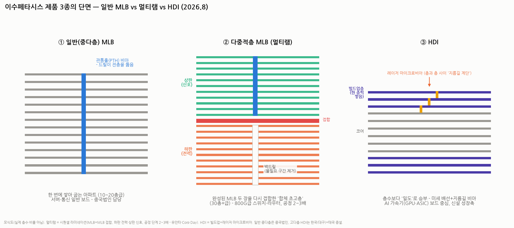

# 이수페타시스 배경지식 — 일반 MLB · 다중적층 MLB(멀티램) · HDI, 세 제품은 뭐가 다른가

> 작성일: 2026-09-02 · 카테고리: IT부품및소재/배경지식 (☞ 자매 리포트: `심텍_심층분석리포트` — 같은 PCB인데 완전히 다른 서식지)
> **검증 메모**: 멀티램 구조(MLB+MLB 접합, 하판 전력·상판 신호, 스위치·라우터용 / HDI는 신호 지름길·가속기 중심)·공정 단계 2~3배·생산 분담(일반 중다층=중국법인, 고다층·HDI=한국)·멀티램 매출 비중 7%(1Q26)→11%(2Q26)·2Q26 매출 3,799억/영업이익 771억(OPM 20.3%, 분기 최대)·판가 평균 +15% 협상(10월 마무리 예정)·쇼티지 지속·추가 증설(대구·태국, Corp Day 2026.7.24)·"엔비디아 주문의 20%만 소화" 보도는 증권사·언론 검증. PCB 공법 설명 자체는 표준 공학 지식. 구체 층수·단가 배수는 통용 근사(표기).

---

## 0. 아주 쉬운 버전 — 아파트 비유 하나로 끝내기

PCB(기판)는 **부품들이 신호를 주고받는 배선 도로를 층층이 쌓은 판**이다. 층이 많을수록 도로가 많아 복잡한 칩을 연결할 수 있다. 이수페타시스의 세 제품은 "건물을 어떻게 짓느냐"의 차이다:

| | 비유 | 한 줄 정의 |
|---|---|---|
| **① 일반 MLB** | **한 번에 올린 아파트** (10~20층급) | 배선층을 쌓고 **한 번에 눌러 굽는** 표준 다층기판 |
| **② 다중적층 MLB (멀티램)** | **두 동을 위아래로 합체한 초고층** (30층+급) | **완성된 MLB 두 장을 다시 접합** — 하판은 전기 공급, 상판은 신호 전송 |
| **③ HDI** | **층수 대신 밀도로 승부하는 스마트빌딩** | 층을 **한 층씩 쌓으며(빌드업)** 레이저로 미세한 '지름길 계단'을 뚫는 고밀도 기판 |

**돈의 관점 한 줄 요약**: ①은 범용(중국 공장, 박리다매) → ②는 800G급 AI 스위치의 심장(공정 2~3배, 고단가 — 지금 실적의 주역) → ③은 AI 가속기(GPU·ASIC) 보드로 가는 신설 성장축. **이수페타시스의 투자 스토리 = ①에서 ②·③으로 믹스가 이동하며 판가·마진이 올라가는 이야기**다(멀티램 비중 7%→11%, 단 두 분기 만에).

---

## 1. ① 일반 MLB — 표준 공법의 다층기판

- **만드는 법**: 배선을 새긴 얇은 판(코어)들과 접착 시트(프리프레그)를 샌드위치처럼 쌓고, **프레스에 넣어 한 번에 눌러 굽는다**(원샷 적층). 그 다음 드릴로 **위에서 아래까지 관통하는 구멍(PTH 비아)**을 뚫고 구리 도금해 층과 층을 전기적으로 연결
- **특징과 한계**: 공정이 검증돼 있고 싸다. 대신 ⓐ 층수를 올릴수록 두꺼워져 한 번에 굽기 어렵고 ⓑ 모든 비아가 전층을 관통하니, 신호가 3층까지만 가면 되는데 20층까지 뚫린 구멍의 남는 구간이 **안테나처럼 노이즈를 만든다**(고속 신호의 적)
- **용도·위치**: 서버·통신장비의 일반 보드. 이수페타시스에선 **중국 법인(후난)이 담당하는 범용 물량** — 마진 기여보다 캐파·고객 관계 유지의 성격

## 2. ② 다중적층 MLB (멀티램, Multi-Lam) — 지금 실적의 주역

- **만드는 법 (시퀀셜 라미네이션)**: 일반 공법으론 30층+를 한 번에 못 굽는다. 그래서 **MLB를 두 장(이상) 따로 완성한 뒤, 그 완성판들을 다시 겹쳐 접합**한다 — 회사·증권가 설명으로는 **"하판은 전력 공급, 상판은 신호 전송"**의 역할 분담 구조. 여기에 **백드릴**(관통 비아의 불필요한 아래 구간을 뒤에서 다시 드릴로 파내 노이즈 원인을 제거)까지 더해진다
- **왜 어렵고, 왜 비싼가**: 적층·드릴·도금·패터닝 등 **모든 공정을 2~3회 반복**하는 셈이라 공정 단계가 2~3배(유안타·Corp Day). 층간 정렬이 머리카락보다 얇은 오차로 맞아야 하고, 한 번의 접합 불량이 완성판 두 장을 통째로 버리게 만든다 — **수율이 곧 진입장벽**. 그만큼 판가·마진이 높다(정확한 단가 배수는 비공시 — 공정 배수에 준하는 프리미엄으로 추정)
- **어디에 쓰이나**: **800G(→1.6T)급 네트워크 스위치·라우터의 메인보드**. AI 데이터센터에서 GPU 수만 개를 잇는 통신 장비는 보드가 크고(대면적) 신호선이 폭증해 초고다층이 필수 — 멀티램이 정확히 이 자리다. "엔비디아 주문의 20%만 소화" 보도의 그 주문이 이 영역
- **숫자로 본 위상**: 매출 비중 7%(1Q26)→**11%(2Q26)** — 이 믹스 전환이 2Q26 분기 최대 실적(매출 3,799억·영업이익 771억·OPM 20.3%)의 핵심 동력이고, 판가 +15% 협상의 배경이다

## 3. ③ HDI — 층수가 아니라 '밀도'의 게임

- **만드는 법 (빌드업 + 마이크로비아)**: 얇은 코어 위에 절연층을 **한 층 쌓고 → 레이저로 머리카락 단면보다 작은 구멍(마이크로비아)을 뚫고 → 도금하고 → 또 한 층** — 이걸 반복한다. 비아가 전층을 관통하지 않고 **필요한 층과 층 사이만 잇는 '지름길 계단'**이라, 배선을 훨씬 촘촘하게 짤 수 있고 신호 경로가 최단이 된다
- **철학의 차이**: MLB가 "도로를 더 많이(층수)"라면 HDI는 "도로를 더 촘촘하고 짧게(밀도)". 원래 스마트폰(좁은 공간에 초고밀도)에서 발달한 기술인데, **AI 가속기 칩의 핀 수가 폭발하면서 서버 쪽으로 넘어온 것** — 칩 바로 아래에서 수천 개 신호를 받아내려면 관통 비아 방식으론 자리가 안 나온다
- **어디에 쓰이나**: **AI 가속기(GPU·커스텀 ASIC) 모듈 보드** 중심 — 검색 검증 문구 그대로 "멀티램은 스위치·라우터, HDI는 신호 지름길 설계에 유리해 가속기 중심". 이수페타시스는 고다층 네트워크와 함께 **HDI를 타깃 시장으로 집중 투자** 중(대구 중심 + 태국 신규 거점 증설) — 아직 매출 기여보다는 차기 성장축
- **주의할 구분**: 스마트폰용 HDI(비에이치·삼성전기 등의 영역)와 서버·가속기용 하이엔드 HDI는 같은 공법 계열이지만 요구 스펙·면적·고객이 다르다 — 이수가 노리는 건 후자

## 4. 세 제품 비교표 — 한 장 정리

| | ① 일반 MLB | ② 멀티램 | ③ HDI |
|---|---|---|---|
| 핵심 공법 | 원샷 적층 + 관통 드릴 | **완성판 재접합(시퀀셜)** + 백드릴 | **빌드업** + 레이저 마이크로비아 |
| 비아(층간 연결) | 전층 관통 | 관통+백드릴로 노이즈 절단 | 필요한 층만 잇는 지름길 |
| 승부처 | 원가 | 층수·대면적 (30층+급) | 밀도·미세배선 |
| 주 용도 | 서버·통신 일반 보드 | **800G급 스위치·라우터** | **AI 가속기(GPU·ASIC) 보드** |
| 공정 난도 | 기준 | 단계 2~3배, 수율 장벽 | 레이저·정렬 정밀도 장벽 |
| 생산지 | 중국 법인 | 한국(대구) | 한국+태국 증설 (신설 축) |
| 실적 위치 | 바닥 물량 | **현재 주역** (비중 7→11%) | 차기 옵션 |

**투자 프레임으로 번역하면**: 같은 '기판 회사'라도 ①만 하면 시황 순환주, ②를 잘하면 AI 인프라 성장주, ③까지 되면 가속기 밸류체인 진입 — 이수페타시스는 지금 ①→② 전환의 이익률 상승(OPM 20.3%)을 숫자로 증명했고, ③이 다음 리레이팅 재료다. 감시 지표: 멀티램 비중, 10월 판가 협상(+15% 논의) 타결률, 태국·대구 증설 일정, HDI 첫 대형 수주 공시.

---

## 참고 출처 (검증)

- [이데일리 — 유안타: "다중적층 전환 효과 본격화" — 멀티램(시퀀셜)=MLB+MLB(하판 전력·상판 신호)·스위치용 vs HDI=지름길·가속기, 공정 단계 2~3배](https://edaily.co.kr/News/Read?mediaCodeNo=257&newsId=02266486645320344)
- [한국경제 컨센서스 — Corp Day(2026.7.24): 쇼티지 지속·추가 증설 전망](https://www.hankyung.com/koreamarket/consensus/pdf/2026-07-4f5003b52717448ae1621eaf1f08e942) · [금융소비자뉴스 — 대구 중심+태국 신규 거점 단계적 캐파 확장](https://www.newsfc.co.kr/news/articleView.html?idxno=79796)
- [아시아경제 — 분기 최대 실적(2Q26 매출 3,799억·영업이익 771억·OPM 20.3%)·멀티램 비중 7%→11%·판가 +15% 협상(10월 마무리 예정) (2026.9.1)](https://view.asiae.co.kr/article/2026090111481592245)
- [중소기업신문 — 엔비디아 주문량의 20%만 소화](https://www.smedaily.co.kr/news/articleView.html?idxno=296431) · [CNews — MLB 초과수요·중국법인(중다층 담당) 구조](https://thecommoditiesnews.com/news/articleView.html?idxno=9446)
- PCB 공법(원샷 적층·시퀀셜 라미네이션·백드릴·빌드업·마이크로비아): 표준 공학 지식

**저장소 연계**: `심텍_심층분석리포트`(메모리 모듈·패키지기판 — 같은 PCB, 다른 서식지 비교) · `반도체/배경지식/HBM 시리즈`(AI 인프라 수요의 상류) · `거시및정책/AI데이터센터_전력병목`(800G 스위치 수요의 배경)

> 유의: 층수(10~20층/30층+)·단가 배수는 통용 근사, 정확 스펙은 회사 IR 확인 권장. 종목 밸류에이션·주가는 본 리포트 범위 밖(배경지식편) — 별도 종목분석 요청 시 작성. 매수 추천 아님.
