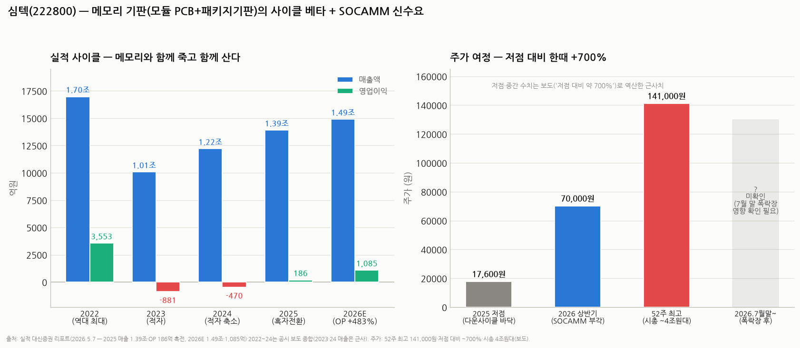

# 심텍(222800) 심층분석 — 메모리와 함께 죽고 함께 사는 기판, 이번엔 SOCAMM이 붙었다

> 작성일: 2026-08-12 · 카테고리: IT부품및소재/종목분석 · '기판 3형제' 시리즈: 이수페타시스(MLB)·기가비스(검사장비)·**심텍(메모리 기판)**
> **검증 메모**: 2025 실적(매출 1.39조·영업익 186억 흑자전환)·2026E(1.49조·1,085억, +483%)·SOCAMM2(2Q26 매출 개시, 2026 ~1,100억, 3사 내 최대 점유 전망)는 대신증권 리포트(2026.5.7)로 검증. 2023~24 적자(-881억·-470억)는 공시 보도 종합. 주가는 보도 기준 52주 최고 141,000원·저점 대비 ~700%·시총 4조원대 — **7월 말 폭락장 이후 현재가는 미확인**, 차트의 저점·중간 수치는 역산 근사치다.

---

## 0. 아주 쉬운 버전 (여기만 읽어도 됨)

**뭐 하는 회사?** 메모리 반도체가 앉는 **'방석'을 만드는 회사**다. 두 종류인데 — ① 디램 여러 개를 줄지어 꽂는 **모듈 기판**(서버에 들어가는 RDIMM의 초록색 긴 판), ② 메모리 칩 하나하나의 바로 아래 깔리는 **패키지 기판**(BoC 등). 고객이 삼성전자·SK하이닉스·마이크론 — **즉 메모리 3사가 전부 고객**이라, 메모리가 잘 팔리면 같이 벌고 메모리가 죽으면 같이 죽는 **순수 메모리 베타** 종목이다.

**실제로 그랬다:** 2022년 역대 최대(매출 1.70조·영업익 3,553억) → 메모리 다운사이클에 **2023~24년 2년 연속 적자**(-881억, -470억) → 이번 슈퍼사이클에 2025년 흑자전환(186억) → **2026년 영업이익 1,085억(+483%) 전망**.

**여기에 신무기가 붙었다 — SOCAMM**: 엔비디아 차세대 서버(베라 CPU)에 들어가는 **새 규격의 메모리 모듈**(☞ HBM 대체위협 리포트에서 다뤘던 그것)인데, 이 모듈의 기판을 심텍이 **삼성·SK·마이크론 3사 모두에 공급하며 최대 점유율**이 예상된다. 2분기부터 매출이 시작됐고 올해 ~1,100억 규모 전망 — 누가 메모리 경쟁에서 이기든 심텍은 이기는 구조.

**주가는?** SOCAMM 테마로 저점 대비 **한때 +700%**(52주 최고 141,000원, 시총 4조원대). 7월 폭락장 이후 현재가는 미확인. **한 줄 평**: 스토리는 진짜(사이클 회복+SOCAMM 독과점적 지위)지만, 이익 회복(1,085억)보다 주가(+700%)가 먼저 달렸다 — 지금부터는 실적이 주가를 따라잡는 속도의 게임이다.

---

## 1. 사업 구조 — '기판 3형제' 속의 위치

| | **이수페타시스** | **심텍** | **기가비스** |
|---|---|---|---|
| 만드는 것 | MLB(네트워크·AI 가속기 보드) | **메모리 모듈 PCB + 패키지 기판** | 기판 검사·수리 **장비** |
| 전방 | 엔비디아·구글(AI 인프라) | **메모리 3사** + OSAT | 기판 제조사들 |
| 사이클 성격 | AI 캐펙스 | **메모리 사이클 (순수 베타)** | 기판사 설비투자 |

심텍의 제품 축:
- **모듈 PCB (~30%대)**: 서버·PC용 디램 모듈 기판. DDR5 서버 전환 + 이번 레거시 슈퍼사이클의 직접 수혜. SOCAMM도 이 축의 진화형
- **패키지 기판 (~60%대)**: BoC(메모리 칩용), FC-CSP(모바일 AP), SiP, eSSD 컨트롤러용 등. **MSAP**(초미세 회로 공법) 전환으로 고부가화 진행
- (비중은 대략적 구분 — 분기별 변동)

**경쟁력의 본질**: 메모리 기판은 대만·일본 경쟁이 있지만, 심텍은 **3사 모두에 오래 공급해온 레퍼런스**가 해자다. 다만 이수페타시스(TTM과 듀오폴리)만큼의 기술 독점은 아니고, **사이클 레버리지가 큰 대신 마진 방어력이 약하다**(2년 적자가 증거).

## 2. 실적 — 사이클 베타의 교과서

| | 2022 | 2023 | 2024 | 2025 | 2026E |
|---|---|---|---|---|---|
| 매출 | 1.70조 | ~1.01조 | ~1.22조 | 1.39조 | 1.49조 |
| 영업이익 | **3,553억** | **-881억** | -470억 | **186억 (흑전)** | **1,085억 (+483%)** |
| OPM | 21% | 적자 | 적자 | 1.3% | 7.3% |

읽는 포인트:
1. **매출보다 이익의 진폭이 압도적** — 매출 -40%에 이익은 흑자 3,553억→적자 881억. 고정비(공장) 장치산업의 영업레버리지가 양방향으로 작동한다. 2026E도 매출 +7%에 이익 +483% — **지금은 레버리지가 위로 작동하는 구간**
2. **2025년 흑전이 '약한' 이유**: 메모리 3사가 사상 최대 이익을 낸 해에 심텍 OPM이 1.3%였다 — 기판 판가 인상이 메모리 가격 인상에 **후행**하기 때문. 2026년 판가 인상분이 반영되며 이익이 뒤따라오는 구조 (1Q26 OP 137억으로 이미 연환산 ~550억 페이스, 하반기 SOCAMM 가세)
3. **OPM 21%(2022 정점) 회귀가 Bull 케이스의 상단** — 1.49조 매출에 15~20%면 2,200~3,000억도 산술적으론 가능. 대신 추정(7.3%)은 아직 보수적인 편

## 3. SOCAMM — 이번 사이클의 알파

- **뭔가**: 엔비디아가 주도하는 서버용 저전력 메모리 모듈 신규격(LPDDR 기반). 베라(Vera) CPU 세대부터 본격 채용 — HBM·GDDR7과 함께 "메모리 계층 분화"의 한 축(☞ `HBM_대체위협_베어케이스점검`)
- **심텍의 자리**: SOCAMM **모듈 기판**을 삼성·SK·마이크론 3사 모두에 공급 — **메모리 3사 내 최대 공급 점유율 전망**(대신). 메모리 서열 경쟁과 무관하게 물량을 먹는 '중립 수혜' 포지션
- **숫자**: 양산·매출 개시 2Q26, 초기 연 900억~1,000억 → **2026년 SOCAMM2 매출 ~1,100억** 추정 = 2026E 매출의 ~7%지만, 신규격 초기 마진과 성장 기울기(2027년 베라 램프)가 핵심
- **리스크도 같은 곳에**: SOCAMM 채용 속도는 전적으로 엔비디아 로드맵에 달렸다. 지연되면 테마로 오른 주가부터 되돌려진다

## 4. 밸류에이션 — 냉정하게

- 시총 **4조원대**(보도 기준, 52주 최고권) vs 2026E 영업이익 1,085억 → **선행 PER ~40~50배** (순익 ~800억 가정 시)
- 정당화하려면: 2027년 SOCAMM 램프 + 판가 인상 풀반영으로 **이익이 2022년(3,553억)을 넘는 그림**이 필요하다 — 그 경우 PER ~12배로 정상화. 즉 현 주가는 **"2027년 사상 최대 이익"을 선반영**한 가격
- 비교: 이수페타시스도 유사한 선반영 패턴(사이클+AI 알파). 메모리 3사(PER 2~3배)와의 극단적 괴리는 "3사는 사이클 정점 이익, 심텍은 회복 초입 이익"이라는 위치 차이로 절반쯤 설명된다
- **7월 말 폭락장 이후 현재가 미확인** — 저점 대비 +700% 종목은 시장 급락 시 낙폭이 지수보다 깊은 게 일반적. 되돌림 폭 확인이 선행돼야 한다

## 5. 리스크

1. **메모리 사이클 반전** — 이 종목의 알파이자 오메가. 2027년 사이클 피크아웃 시 2023년(-881억)의 재연 가능성이 상존. 다만 LTA 시대(☞ LTA 리포트)에 물량 붕괴가 완화되면 과거보다 얕을 수 있음
2. **판가 인상의 후행성** — 메모리사가 이익을 독식하고 기판 판가 인상이 늦어지면 2026E 이익 추정(+483%)이 밀린다
3. **SOCAMM 로드맵 지연** — 엔비디아 의존 테마의 숙명
4. **경쟁** — 대만(난야PCB 등)·일본 기판사의 SOCAMM 진입, 패키지기판 단가 경쟁
5. **+700% 이후의 수급** — 테마 유입 자금은 빠질 때도 빠르다

## 6. 시나리오 (12개월, 가설)

| | 가정 | 함의 |
|---|---|---|
| Bull | 판가 인상 풀반영 + SOCAMM 램프 — 2026 OP 1,500억+, 2027 3,000억 가시화 | 시총 5~6조 재도전 (PER 20배 × 2027E) |
| Base | 컨센 부합(OP ~1,085억), SOCAMM 순항 | 시총 3~4조 박스 — 분기 실적 따라 등락 |
| Bear | 메모리 사이클 조기 피크아웃 신호 + SOCAMM 지연 | 사이클 베타의 급격한 디레이팅 — 시총 2조 이하 (과거 사이클 저점 밸류) |

**개인 의견(가설)**: 심텍은 **"메모리 슈퍼사이클 + SOCAMM"이라는 이중 스토리의 레버리지 버전**이다. 메모리 3사보다 늦게 이익이 오고(판가 후행), 그만큼 2026~27년 이익 모멘텀은 3사보다 가파를 수 있다 — 사이클 후반부에 강한 유형. 반대로 사이클이 꺾이는 신호(계약가 협상 실패, 빅테크 캐펙스 둔화)가 나오면 **가장 먼저 파는 유형의 종목**이기도 하다. 진입한다면 7월 폭락 후 되돌림 폭과 2Q26 실적(8월 중순)의 판가 반영 속도를 확인한 뒤가 합리적.

---

## 참고 출처 (검증)

- [대신증권 — 1Q 호조, 소캠2 매출 시작: 2025 1.39조/186억, 2026E 1.49조/1,085억(+483%), SOCAMM2 2026 ~1,100억·3사 내 최대 점유 (2026.5.7)](https://file.alphasquare.co.kr/media/pdfs/market-report/%EC%8B%AC%ED%85%8D1Q20260507%EB%8C%80%EC%8B%A0%EC%A6%9D%EA%B6%8C.)
- [대신증권 — "아직 끝나지 않았다" (2025.11.26, 심텍 IR 게시)](https://www.simmtech.com/upload/media/file/638997382414911308.pdf)
- [대신증권 — "회복은 메모리에서 시작" (2025.3.24, 심텍 IR 게시)](https://www.simmtech.com/upload/media/file/638786342618483612.pdf)
- 52주 최고 141,000원·저점 대비 ~700%·시총 4조원대·2023~24 적자(-881억/-470억): 보도 종합
- SOCAMM 배경: 저장소 `HBM_대체위협_베어케이스점검`(SOCAMM2·베라 CPU 검증분)

**저장소 연계**: `이수페타시스` 시리즈(기판 산업구조·MLB와의 구분) · `기가비스_심층분석리포트`(기판 검사장비 — 심텍의 캐펙스가 기가비스의 매출) · `메모리_바텀업_레거시디램낸드_이익모델`(전방 사이클) · `메모리_장기공급계약_LTA_현황`(다운사이클 완충 논리) · `테마부활의역사`(사이클 베타의 전형)

> 유의: 7월 말 폭락장 이후 주가·시총 미확인 상태로 작성. 2026E는 단일 증권사(대신) 추정 의존도가 높다. 2023~24 매출은 근사치. 매수 추천이 아니며, 매매 전 현재가·2Q26 공시 확인 필수.
