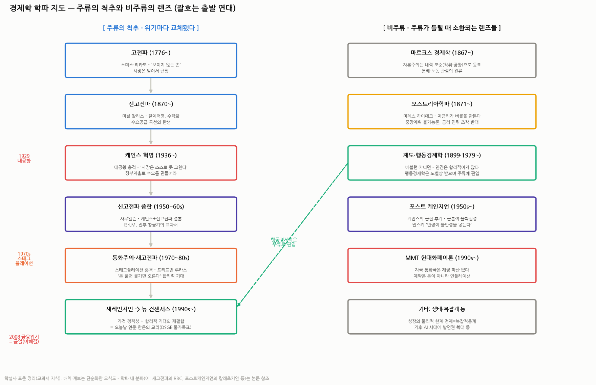

# 경제학 학파 지도 — 주류와 비주류, 그들은 각각 무엇을 주장하는가

> 작성일: 2026-09-03 · 카테고리: 거시및정책/배경지식
> **검증 메모**: 본 리포트는 시사 수치가 아니라 **경제학설사의 표준 정리**(교과서·통용 지식)라 개별 팩트 검색 검증 대신 학계 통설 기준으로 작성했다. 학파 구분·명칭은 단순화한 지도이며, 경계는 실제로 더 흐릿하다. 특정 학파에 대한 '평가' 문단은 필자의 정리(주관 표기).

---

## 0. 아주 쉬운 버전 — 논쟁의 축은 사실상 두 개다

경제학 학파들의 200년 싸움은 복잡해 보여도, 질문 두 개로 압축된다:

1. **"시장은 스스로 균형을 찾는가?"** — 그렇다(고전파·신고전파·새고전파·오스트리아) vs 아니다, 정부가 받쳐야 한다(케인스 계열·포스트케인지언·MMT)
2. **"돈(화폐)을 풀면 실물경제가 좋아지는가?"** — 장기적으론 물가만 오른다(통화주의·새고전파) vs 화폐가 실물을 움직인다(케인스 계열) vs 풀린 돈이 버블과 파국을 만든다(오스트리아·민스키)

그리고 역사의 패턴 하나 — **주류는 '설명 못 하는 위기'가 터질 때마다 교체됐다**: 대공황(1929)이 고전파를 무너뜨려 케인스를 왕좌에 올렸고, 스태그플레이션(1970s)이 케인스를 끌어내려 프리드먼을 올렸고, 금융위기(2008)는 현 주류(뉴 컨센서스)에 금을 냈지만 아직 왕조 교체까진 가지 않았다 — 그래서 지금은 '균열의 시대'다.

---

## 1. 주류의 척추 — 시대순으로 따라가기

### 1.1 고전파 (1776~) — "시장은 알아서 굴러간다"
- **인물**: 애덤 스미스(국부론), 데이비드 리카도(비교우위), 존 스튜어트 밀
- **주장**: 각자 사익을 추구하면 '보이지 않는 손'이 사회 전체의 이익으로 조정한다. 공급이 스스로 수요를 만들고(세이의 법칙), 불황은 일시적 마찰일 뿐 시장이 알아서 회복한다. 정부는 심판만 봐라(자유방임)
- **유산**: 자유무역(리카도의 비교우위 — 오늘날 관세 논쟁 때마다 소환되는 그 이론), 시장 신뢰의 원형

### 1.2 신고전파 (1870~) — 경제학의 수학화
- **인물**: 마셜(수요공급 곡선), 왈라스(일반균형), 제번스·멩거(한계혁명)
- **주장**: 가치는 노동이 아니라 **한계효용**(마지막 한 개가 주는 만족)이 결정한다. 개인은 합리적으로 효용을 극대화하고, 가격이 신호가 되어 시장 전체가 균형에 도달한다
- **유산**: 오늘날 경제학 교과서 1~10장이 전부 이들 것 — 미시경제학의 골격. '합리적 개인+균형'이라는 주류의 DNA가 여기서 만들어졌다

### 1.3 케인스 혁명 (1936~) — 대공황이 만든 반란
- **인물**: 존 메이너드 케인스(일반이론, 1936)
- **주장**: 대공황은 고전파로는 설명 불가였다 — 시장이 알아서 회복한다더니 실업률 25%로 10년을 갔으니까. 케인스의 진단: **수요가 부족하면 경제는 '실업 상태의 균형'에 갇힐 수 있다**. 불황의 원인은 공급이 아니라 **총수요 부족**이고, 민간이 지갑을 닫으면(절약의 역설) 정부가 대신 써야 한다(재정지출). 금리를 내려도 돈이 안 도는 '유동성 함정'도 그가 명명. "장기적으로 우리는 모두 죽는다" — 장기 균형 타령 말고 지금 불황을 고치라는 일갈
- **유산**: 재정정책·경기부양이라는 개념 자체. 2008년·2020년 각국의 대규모 부양책은 전부 케인스의 후손

### 1.4 신고전파 종합 (1950~60s) — 절충의 황금기
- **인물**: 폴 사무엘슨, 존 힉스(IS-LM 모형)
- **주장**: "단기엔 케인스가 옳고(경기 변동은 수요 관리로), 장기엔 신고전파가 옳다(시장 균형)" — 두 이론의 결혼. 필립스곡선(실업↓ ↔ 물가↑의 교환관계)으로 정부가 경기를 '미세조정'할 수 있다고 믿었다
- **유산**: 전후 자본주의 황금기(1950~60s)의 공식 교리 — 그러나 이 자신감이 다음 위기에서 박살난다

### 1.5 통화주의·새고전파 (1970~80s) — 스태그플레이션의 역습
- **인물**: 밀턴 프리드먼(통화주의), 로버트 루카스(합리적 기대), 프레스콧(RBC)
- **배경**: 1970년대 **스태그플레이션**(불황+인플레 동시) — 필립스곡선상 공존 불가능한 조합이 실제로 왔다. 케인지언의 설명 실패
- **프리드먼의 주장**: "인플레이션은 언제나 어디서나 화폐적 현상" — 돈을 풀면 단기엔 경기가 좋아 보여도 **장기엔 물가만 오른다**(자연실업률 가설). 정부의 재량적 개입은 타이밍이 늘 늦어 오히려 해롭다 — 통화량을 준칙대로만 늘려라
- **루카스의 한 발 더**: 사람들이 **합리적 기대**를 하면(정부가 돈 풀 걸 미리 알면 미리 가격을 올림) 예측된 정책은 아예 효과가 없다. 거시정책 무력성 명제 — 케인스주의에 대한 이론적 사형선고 시도
- **유산**: 중앙은행 독립·인플레 파이팅의 사상적 뿌리. 볼커의 금리 인상(1980s), 레이건·대처의 시장주의가 이 흐름의 정치적 표현

### 1.6 새케인지언 → 뉴 컨센서스 (1990s~현재) — 오늘의 주류
- **인물**: 맨큐, 스티글리츠, 버냉키, 우드포드
- **주장**: 루카스의 방법론(합리적 기대·미시 기초)은 받아들이되, **가격과 임금은 현실에서 천천히 움직인다(경직성)**는 걸 증명 — 그래서 단기엔 통화정책이 실물에 효과가 있다. 케인스의 결론을 신고전파의 수학으로 복원한 셈
- **뉴 컨센서스 = 현대 중앙은행의 교리**: 물가목표제(인플레 2%), 금리(테일러 준칙)로 경기 조절, DSGE 모형으로 전망 — **연준·ECB·한국은행이 오늘 실제로 쓰는 프레임**이 바로 이것이다. 시장 뉴스에서 보는 "연준의 생각"은 99% 새케인지언 문법
- **2008년의 균열**: 이 교리는 금융위기를 예측도 설명도 못 했다(모형에 은행·부채가 없었다!). 이후 금융 마찰·양적완화·거시건전성이 급히 이식됐지만, "패치는 했는데 새 왕조는 아직"이 현재 상태

## 2. 비주류 — 주류가 틀릴 때 소환되는 렌즈들

### 2.1 마르크스 경제학 (1867~)
- **주장**: 자본주의는 이윤을 위해 노동을 착취하는 체제이며, 이윤율 저하·과잉생산 때문에 **주기적 공황이 내장**돼 있다 — 위기는 사고가 아니라 시스템의 본성
- **현재적 의미**: 정치적 처방(계획경제)은 역사적으로 실패했지만, **분배 악화·독점화·노동 몫 하락**을 보는 분석 틀로는 여전히 인용된다(피케티의 불평등 연구가 먼 후손 격)

### 2.2 오스트리아학파 (1871~) — 투자자들이 가장 자주 만나는 비주류
- **인물**: 미제스, 하이에크(노벨상), 로스바드
- **주장**: ① 중앙은행이 금리를 인위적으로 낮추면 **잘못된 투자(말인베스트먼트)가 쌓여 버블이 되고, 버블 붕괴가 곧 불황**이다 — 경기순환은 시장 탓이 아니라 화폐 조작 탓 ② 지식은 현장에 분산돼 있어 **중앙계획은 계산 자체가 불가능**하다(하이에크 — 사회주의 계산 논쟁의 승자) ③ 불황은 청산의 과정이니 부양으로 미루지 말라
- **현재적 의미**: 금 투자자·비트코인 진영·"연준이 버블을 만든다"는 논평의 사상적 고향. 학계 주류에선 밀렸지만 **시장 참여자들 사이에선 사실상 제2의 주류**
- **평가(주관)**: 버블의 '생성' 설명은 탁월하나, 붕괴 후 "그냥 청산하라"는 처방은 대공황·2008에서 정치적으로 불가능함이 증명됐다

### 2.3 제도학파·행동경제학 (1899 / 1979~) — 비주류에서 주류로 편입된 성공 사례
- **인물**: 베블런(과시적 소비), 카너먼·트버스키(전망이론), 세일러(넛지), 실러(비이성적 과열)
- **주장**: 인간은 합리적 계산기가 아니다 — 손실을 이익보다 2배 아파하고(손실회피), 무리를 따라가고(군집), 최근 것에 과잉반응한다(가용성 편향). 시장 가격은 이 심리의 총합이라 **거품과 패닉이 정상 상태**
- **현재적 의미**: 노벨상 3회(카너먼·세일러·실러)로 주류에 정식 편입 — 행동재무학은 사실상 투자 실무의 표준 교양. 이 저장소에서 다뤄 온 '테마 부활'·'유행 소멸' 프레임도 이 계열
- **베블런의 유산**: 경제는 수요공급이 아니라 **제도·관습·권력**이 움직인다 — 재벌 지배구조 분석(우리가 비츠로·LX에서 한 것)이 사실상 제도학파적 작업

### 2.4 포스트 케인지언 (1950s~) — 케인스의 급진 후계자
- **인물**: 조앤 로빈슨, 칼레츠키, **하이먼 민스키**
- **주장**: 주류에 흡수된 새케인지언은 케인스를 배신했다고 본다. 진짜 케인스의 핵심은 ① **근본적 불확실성**(미래는 확률로도 계산 불가 — 모형화 자체가 오만) ② **화폐는 은행이 대출로 창조한다**(내생화폐 — 중앙은행이 통화량을 통제한다는 통화주의 전제 부정) ③ **민스키의 금융불안정 가설**: "안정이 불안정을 낳는다" — 호황이 길수록 사람들은 더 위험한 부채를 지고(헤지→투기→폰지 금융), 어느 순간 시스템이 무너진다(**민스키 모멘트**)
- **현재적 의미**: 2008년을 가장 정확히 '설명'한 학파로 재평가 — "민스키 모멘트"는 이제 월가 표준 용어다. 부채 사이클 분석(레이 달리오류)의 이론적 뿌리

### 2.5 MMT 현대화폐이론 (1990s~) — 가장 뜨거운 논쟁아
- **인물**: 워런 모즐러, 스테파니 켈튼(적자의 본질)
- **주장**: 자국 통화를 발행하는 정부(미국·일본·한국)는 **재정적으로 파산할 수 없다** — 돈을 찍는 주체가 돈이 없어 못 갚는 일은 없으니까. 따라서 "재정적자가 얼마냐"는 잘못된 질문이고, 진짜 제약은 **인플레이션**(실물 자원의 한계)뿐이다. 세금은 재원 마련이 아니라 인플레 조절 수단
- **반론(주류)**: 이론의 절반은 회계적 사실이지만, "인플레 오면 그때 조이면 된다"는 정치적으로 순진하다 — 2021~22년 인플레가 MMT 열풍을 식힌 실전 반례로 통용
- **현재적 의미**: 각국 재정적자 논쟁(미국 부채 한도, 일본)의 지하수맥. 채권 시장을 볼 때 "재정 파산 프레임 vs 인플레 제약 프레임" 중 어느 쪽이 가격을 움직이는지 관찰하는 렌즈로 유용

### 2.6 기타 — 생태경제학·복잡계
- **생태경제학**: 경제는 지구 생태계의 부분집합 — 물리적 한계(에너지·기후) 무시한 무한성장은 불가능. 탄소가격·좌초자산(우리 LX인터 석탄 분석의 그 개념) 논의의 뿌리
- **복잡계 경제학**: 경제는 균형계가 아니라 **복잡적응계**(창발·경로의존·멱법칙) — 산타페연구소 계열. 버블·급락의 두꺼운 꼬리(팻테일)를 자연스럽게 설명

## 3. 한눈 비교표 — 같은 질문, 다른 대답

| 질문 | 주류(뉴 컨센서스) | 오스트리아 | 포스트케인지언 | MMT | 행동경제학 |
|---|---|---|---|---|---|
| 불황이 오면? | 금리 인하+필요시 재정 | 청산하게 두라 — 부양이 다음 버블 | 정부가 최후의 고용주로 지출 | 재정 확대(인플레 전까지) | 심리(공포)의 자기실현 관리 |
| 인플레의 원인? | 수요 과열+기대 이탈 | 화폐 남발 그 자체 | 비용·분배 갈등(이윤 인플레) | 실물 자원의 병목 | 기대·내러티브의 전염 |
| 재정적자는? | 장기엔 구축효과 우려 | 악 — 정부 비대화 | 민간 흑자의 거울(회계 항등식) | 문제는 적자가 아니라 인플레 | — |
| 버블은 왜? | 마찰·정보 비대칭(예외 현상) | 저금리가 원인(필연) | 안정이 낳은 부채 축적(필연) | — | 군집·과잉확신(상시) |
| 2008을 예측/설명? | 실패(사후 패치) | "저금리 탓" 사전 경고 | **민스키로 가장 잘 설명** | — | 실러가 주택버블 경고 |

## 4. 투자자를 위한 사용법 — 학파는 '믿음'이 아니라 '렌즈 세트'다 (주관)

1. **연준·한은을 읽을 땐 새케인지언 문법으로**: 물가목표·기대 인플레·중립금리 — 정책 당국은 이 언어로 생각하므로, 금리 전망은 이 프레임 안에서 해야 맞는다(당신이 그 이론에 동의하든 말든)
2. **버블 국면에선 오스트리아+민스키 렌즈를**: "저금리가 만든 말인베스트먼트가 어디에 쌓였나"(오스트리아) + "부채의 질이 헤지→투기→폰지 중 어디까지 왔나"(민스키) — AI 캐펙스 사이클을 볼 때 지금 우리가 던져야 할 질문이 정확히 이것(☞ HBM·전력병목 리포트)
3. **개별 종목·테마의 광기엔 행동경제학**: 테마 부활·유행 소멸(삼양식품의 밈 리스크, 리노공업의 디레이팅)은 전부 군집·내러티브의 문제 — 실러의 '내러티브 경제학'이 실전 교과서
4. **재정·국채 뉴스엔 MMT 논쟁 구도를**: 시장이 '파산 프레임'(금리 급등)으로 반응하는지 '인플레 프레임'으로 반응하는지가 채권·환율의 방향을 가른다
5. **한 학파만 믿는 순간 위험해진다**: 역사가 보여준 건 "모든 학파는 특정 위기의 자식이며, 다음 위기는 늘 다른 얼굴로 온다"는 것 — 주류의 교체사(§1) 자체가 그 증거다. 서비스나우 히스토리에서 본 '왕조는 전환기에 무너진다'의 경제학 버전

---

## 참고 (표준 문헌)

- 학설사 개론: 하일브로너 《세속의 철학자들》, 백종국·홍훈 등 국내 경제사상사 교과서 계열
- 원전: 스미스 《국부론》(1776) · 케인스 《일반이론》(1936) · 프리드먼 《미국 화폐사》 · 하이에크 《노예의 길》 · 민스키 《불안정한 경제의 안정화》 · 카너먼 《생각에 관한 생각》 · 켈튼 《적자의 본질》
- 본 리포트는 특정 시사 수치를 다루지 않아 웹 검증을 생략(학설사 표준 지식) — 학파 경계·평가 문단은 단순화·주관 포함

**저장소 연계**: `시장브리핑/테마부활의역사`(행동경제학의 실전) · `거시및정책/AI데이터센터_전력병목`(오스트리아·민스키 렌즈의 적용 대상) · `종합상사/LX인터`(좌초자산 — 생태경제학 개념) · `해외주식/서비스나우_히스토리`(패러다임 교체의 산업 버전)

> 유의: 학파 지도는 단순화이며 실제 경계는 흐릿하다(예: 스티글리츠는 새케인지언이자 주류 비판자). '평가'·'사용법'은 주관. 투자 조언 아님.
