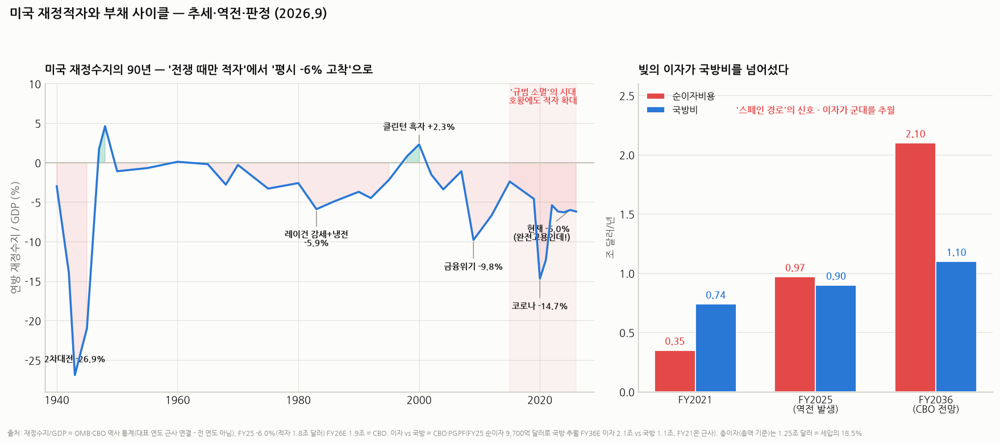

# 미국 재정적자의 90년 — 추세와 이유, 그리고 "이번 부채 사이클은 고꾸라지는가" 판정

> 작성일: 2026-09-15 · 카테고리: 거시및정책/배경지식 (시리즈: `배경지식_통화패권의역사` 후속편 — 전편의 §8 체크리스트를 데이터로 심화)
> **검증 메모**: FY2025 확정 적자 1.8조 달러(GDP의 6.0%, FY24 6.3%)·FY2026 전망 1.9조·부채/GDP 2036년 120%(CBO)·무디스 시나리오 2035년 134%·**순이자 FY25 9,700억 달러로 국방비 최초 추월**·총이자 1.25조 달러 = 세입의 18.5%·2036년 이자 2.1조 vs 국방 1.1조 전망·무디스 Aaa→Aa1 강등(2025.5.16, 1917년 이후 108년 만 — 3대 신평사 AAA 전멸)·해외 보유 비중 23.6%(총부채 기준, 6월 말)·최대 보유국 일본 1.13조>영국>중국 7,600억(감소 추세)·텀프리미엄 2023년 말 플러스 전환·'레짐 체인지' 논의는 CBO·재무부·보도 검증. 과거 연도별 적자/GDP는 OMB·CBO 역사 통계의 통용 수치(대표 연도 근사 — 차트는 전 연도가 아닌 앵커 연결). 판정 절은 주관 표기.

---

## 0. 아주 쉬운 버전 — 세 질문에 대한 요약 답

1. **추세가 어땠나?** 90년을 관통하는 큰 그림은 "**전쟁 때만 적자를 내고 평시엔 갚던 나라가, 이제 평시·완전고용에도 -6%를 내는 나라가 됐다**"이다. 2차대전 -26.9% → 전후 흑자 상환 → 레이건 -5.9% → 클린턴 +2.3% 흑자 → 금융위기 -9.8% → 코로나 -14.7% → 그리고 지금 -6.0%. 숫자 자체보다 무서운 건 **-6%가 '위기 대응'이 아니라 '평상시 기본값'이 됐다는 것** — 역사상 처음이다
2. **이번 부채 사이클은 고꾸라지나?** 결론(주관): **'쾅' 하는 붕괴보다 '서서히 녹이기'(금융억압+인플레) 확률이 훨씬 높다.** 발권국은 명시적 부도가 없고, 긴축은 정치적으로 불가능하며, 미국은 1945~80년에 부채 106%→23%를 정확히 이 방법(실질금리를 인플레 밑으로)으로 녹인 전과가 있다. 급성 위기는 이벤트(국채 입찰 실패·연준 독립성 훼손)가 트리거일 때만 온다 — 그 감시 지표를 §5에 정리했다
3. **달러 패권은 유지되나?** 전편의 결론 유지+강화: **재정은 명백히 '스페인 경로'의 초기 신호(이자>국방)를 켰지만, 파운드도 결정타 후 40년을 갔고 달러는 아직 결정타(패전급 이벤트)를 맞지 않았다.** 유지의 근거는 미국이 잘해서가 아니라 대안이 없어서다 — 그래서 이탈은 '달러 투매'가 아니라 '금 매수+만기 단축'이라는 조용한 형태로 이미 진행 중이다

---

## 1. 추세의 역사 — 다섯 개의 시대 (차트 좌측)

### 시대 ① "전쟁 때만 빌린다" (1940~1970) — 규범이 있던 시절
- 2차대전 **-26.9%(1943)** — 역사상 최대. 그런데 종전 후 **1947~48년 즉시 흑자(+4.6%)** 전환, 이후 1950~60년대는 ±1% 안팎의 사실상 균형
- **이유**: '전쟁 부채는 갚는 것'이라는 규범이 살아 있었고, 고성장(전후 붐)+인플레+금리 통제(금융억압)가 부채/GDP를 106%(1946)→23%(1974)로 녹였다 — **부채는 '갚아서'가 아니라 '분모(명목 GDP)를 키워서' 없앤다**는 교과서적 선례

### 시대 ② 평시 적자의 탄생 (1970~1990) — 규범의 1차 균열
- 베트남전+위대한 사회(복지 확대)로 시작 → **레이건 시대 -5.9%(1983)**: 대규모 감세(세입↓)+냉전 군비(지출↑)의 조합. 브레턴우즈 붕괴(1971)로 금의 족쇄가 사라진 것도 배경 — **평시 대규모 적자는 순수 신용화폐 시대의 발명품**이다
- 이때 등장한 정치 공식이 지금까지 간다: **감세는 선거에서 이기고, 증세·복지 삭감은 진다**

### 시대 ③ 개혁의 막간 (1990~2001) — 흑자는 가능했다
- 1990년대 증세(부시 부·클린턴)+냉전 종식 평화배당(국방비 GDP 6%→3%)+IT 호황 → **2000년 +2.3% 흑자**, "국가부채 전액 상환 시점"을 논하던 유일한 시기
- **교훈**: 적자는 운명이 아니라 선택이다 — 단, 세 가지(증세+지출 절제+호황)가 동시에 맞아야 했고, 그 조합은 이후 다시는 재현되지 않았다

### 시대 ④ 쌍둥이 충격 (2001~2015)
- 부시 감세+아프간·이라크 전쟁+메디케어 확대 → 흑자 소멸 → **금융위기 -9.8%(2009)** → 시퀘스터(강제 삭감)로 2015년 -2.4%까지 복원
- 여기까지는 그래도 '위기 때 확 늘고, 회복기에 줄이는' 패턴이 작동했다

### 시대 ⑤ 규범의 소멸 (2015~현재) — 지금 우리가 있는 곳
- **호황에도 적자가 늘기 시작한다**: 2015 -2.4% → 2019 -4.6%(완전고용에 감세) → 코로나 **-14.7%** → 그리고 회복 후에도 **-6%대 고착**(2023 -6.2, 2024 -6.3, **2025 -6.0**, 2026E ~6%대)
- 이게 역사적으로 왜 이상하냐면 — 실업률이 낮고 전쟁이 없는데 GDP의 6%를 빌리는 건 **90년 데이터에 전례가 없다.** 위기 대응용 재정 여력을 평시에 소진 중이라는 뜻이고, 무디스가 108년 만에 AAA를 박탈한(2025.5.16) 직접 사유다

## 2. 왜 이런 추세가 됐나 — 구조 5요인 (질문의 '이유' 부분)

1. **래칫(한 방향 톱니) 효과**: 위기 때 늘린 지출은 위기가 끝나도 안 줄어든다 — 전쟁·금융위기·팬데믹마다 지출/GDP의 바닥이 한 칸씩 올라왔다
2. **고령화가 예산을 '자동화'했다 (최대 요인)**: 사회보장(연금)+메디케어(노인 의료)+이자는 의회가 매년 심사하지 않는 **의무지출** — 이 셋이 예산의 약 70%다. 의회가 실제로 다투는 재량지출은 30%뿐이라, **설령 정치가 개혁 의지를 내도 깎을 수 있는 파이 자체가 작다.** 베이비부머 은퇴(2010s~)로 이 자동 지출이 구조적으로 늘어나는 국면
3. **세입의 정치적 상한**: 연방 세입은 60년간 GDP의 **~17% 안팎에 고정**(감세→호황→다시 감세의 반복)인데 지출은 23~24% — 격차 6~7%p가 곧 적자다. §시대②의 정치 공식(감세는 이기고 증세는 진다)이 세입 상한을 만든 범인
4. **40년 공짜 점심의 종료**: 1981~2020년 금리가 15%→0%로 내려오는 동안엔 빚을 늘려도 이자가 안 늘었다(r<g의 마법 — MMT류 낙관의 배경). 2022년 금리 정상화로 청구서가 도착: **순이자가 3년 만에 3배**(FY21 ~3,500억→FY25 9,700억 달러), 국방비를 사상 처음 추월했고, 세입의 18.5%가 이자로 나간다. 2036년엔 이자 2.1조 vs 국방 1.1조 전망 — 전편에서 말한 '스페인 경로'(군대보다 이자)의 신호등이 켜졌다
5. **기축통화 특권의 저주**: 적자를 내면 세계가 국채를 사서 융자해 준다 — 프랑스 재무장관이 '엄청난 특권(exorbitant privilege)'이라 불평했던 그것. **시장 규율이 작동하지 않으니 정치 규율도 사라진다** — 영국(트러스, §4)이 44일 만에 당한 징계를 미국은 수십 년째 면제받는 중이고, 그 면제가 바로 문제를 키우는 원인이다

## 3. 현재 좌표 — 위험 대시보드 (전부 검증치)

| 지표 | 수치 | 판독 |
|---|---|---|
| 적자/GDP | **-6.0% (FY25)**, FY26E 1.9조 달러 | 평시 기준 역사상 최악 수준의 '기본값' |
| 부채/GDP (공공보유) | ~100% → **120%(2036 CBO)**, 무디스 시나리오 134%(2035) | 2차대전 피크(106%)를 평시에 추월 |
| **순이자** | **9,700억 달러 — 국방비 최초 추월(FY25)** | 총이자 기준 1.25조 = **세입의 18.5%** |
| 신용등급 | 무디스 Aaa→Aa1(2025.5) — **3대 신평사 AAA 전멸** | 1917년 이후 108년 만 |
| 해외 보유 비중 | 총부채의 **23.6%** (2008년경 ~35%+에서 하락) | 일본 1.13조>영국>중국 0.76조(중국은 계속 축소) — 부족분은 국내(MMF·은행)가 흡수 중 |
| 텀프리미엄 | 2023년 말 플러스 전환 — '레짐 체인지' 논의 | 시장이 재정 리스크에 가격을 매기기 시작 |
| 중앙은행 행동 | 금 매입 연 750~850톤 전망 (전편 검증) | '조용한 이탈'의 실측치 |

## 4. 비교 분석 — 다른 나라들이 알려주는 것

- **일본 (부채 ~250%인데 왜 안 무너지나)**: ① 국채의 90%+가 자국 내 보유(해외 의존 없음) ② 만성 경상흑자·세계 최대 순대외채권국 ③ 자국 통화 발권. **미국과의 결정적 차이: 미국은 경상적자+해외 보유 의존이라는 '쌍둥이'를 안고 있다** — 일본식 '부채 무한 인내'가 미국에 그대로 적용되지 않는 이유. 단, 일본도 2022~24년 엔화 급락으로 '통화 가치'라는 형태로 대가를 치렀다 — 부도가 아니라 **환율로 청구서가 온다**는 표본
- **영국 트러스 사태 (2022.9) — 시장 규율의 실험 증명**: 감세안 발표 → 길트 금리 폭등·파운드 폭락 → 연기금 마진콜 연쇄 → **총리 재임 44일 만에 사임.** 기축통화가 아닌 나라는 재정 일탈 시 **몇 주 안에** 징계당한다는 실증 — 미국이 누리는 면제의 크기를 역으로 보여준 사건
- **유로존 위기 (그리스 2010~12)**: 자국 발권력이 없는 나라의 부채 위기는 진짜 부도로 간다 — MMT의 "발권국은 다르다"가 맞는 지점과 한계를 동시에 보여줌
- **한국 참고**: 국가채무 ~50%대로 표면상 여유이나, 세계 최고 속도의 고령화 = 미국의 '요인 ②'가 가장 빠르게 몰려오는 나라 — 미국 이야기가 남 얘기가 아닌 이유

## 5. 판정 — 이번 부채 사이클은 고꾸라지는가 (주관)

부채가 감당 불능이 될 때 나라가 쓸 수 있는 탈출구는 넷뿐이다:

| 탈출구 | 가능성 | 근거 |
|---|---|---|
| ① 성장으로 벌어서 갚기 | **유일한 상방 옵션 — AI에 달렸다** | 적자 6%를 상쇄하려면 명목성장이 금리+α를 상회해야(r<g 복원). **AI 생산성 붐이 실현되면** 1990년대식 탈출 재현 가능 — 이 저장소의 AI 시리즈가 사실상 이 질문의 각론이다 |
| ② 인플레·금융억압으로 녹이기 | **기본 시나리오 (가장 개연)** | 1945~80년의 전과: 인플레>금리 상태를 오래 유지해 부채 106%→23%. 현대판 도구: 국채 수요 규제(은행·MMF·스테이블코인에 국채 보유 유도), 수익률곡선 관리, 목표 인플레의 사실상 상향 용인 |
| ③ 긴축(증세·삭감) | 정치적으로 사실상 불가 | 예산의 70%가 의무지출(§2-②)+감세 정치(§2-③) — 클린턴식 조합의 재현 조건이 없음 |
| ④ 명시적 디폴트 | 발권국엔 없음 (부채한도 '사고' 제외) | 단, 인플레는 '조용한 디폴트'라는 점에서 ②와 ④는 정도의 차이 |

**종합 판정**: **"고꾸라짐(급성 붕괴)"보다 "서서히 녹이기(만성 금융억압+구조적 인플레 편향)"가 기본 시나리오다.** 이것이 투자에 주는 함의는 명확하다 — 명목 자산(현금·장기채)이 조용히 과세당하고, 실물·주식·금이 상대 수혜를 보는 환경이 길게 이어진다는 것. 중앙은행들의 금 매입은 이 시나리오에 대한 기관들의 베팅으로 읽힌다.

**급성 위기(고꾸라짐)로 넘어가는 트리거 3개 — 이것만 감시하면 된다**:
1. **국채 입찰의 실패 또는 텀프리미엄 급등 지속**(30년물 응찰 부진·5% 안착) — 트러스식 징계의 미국판 개시 신호
2. **연준 독립성의 가시적 훼손**(정치적 금리 인하 강제·인사 장악) — '녹이기'가 질서 있게 되려면 인플레 기대가 묶여 있어야 하는데, 그 닻이 연준 신뢰다. 닻이 풀리면 ②시나리오가 통제 불능 인플레로 변질
3. **부채한도·셧다운의 기술적 사고** — 실수로 이자 지급이 늦어지는 순간, '무위험'이라는 정의 자체가 시험대에 오름

## 6. 달러 패권 판정으로의 연결 (전편 §8 업데이트)

- 재정 데이터는 **전편의 몰락 공식 1단계(감당 못 할 지출→채무 누적)가 진행 중임을 확인**해 준다 — 이자>국방의 역전은 스페인·영국이 밟았던 바로 그 계단이다
- 그러나 2단계(신뢰 장치 훼손)와 3단계(대체재 등장)는 **아직 미충족**: 국채시장은 여전히 세계에서 가장 깊고, 위안은 1.99%, 유로는 통합 국채 부재 — **문제의 크기가 아니라 대안의 부재가 달러의 수명을 정한다**
- 시간 감각: 파운드는 결정타(1914) 후에도 30~40년을 갔다. 달러는 아직 '1914급 이벤트'(패전·제도 붕괴)를 맞지 않았으므로, 합리적 기본 전망은 **"10년+ 시계에서 지위 유지, 단 그 대가를 달러의 구매력(인플레·환율)으로 지불"** — 즉 **패권은 유지되는데 그 패권 통화를 들고 있는 사람이 손해 보는** 역설적 국면이다. 이것이 "달러 패권 유지되나?"라는 질문에 대한 가장 정직한 답이라고 본다: **유지된다, 그러나 유지의 비용을 채권자(현금·채권 보유자)가 낸다**

---

## 참고 출처 (검증)

- [CBO — FY2025 적자 1.8조 달러 요약](https://www.cbo.gov/publication/61307) · [CRFB — FY25 적자 6.0% GDP](https://www.crfb.org/blogs/cbo-estimates-2025-deficit-totaled-18-trillion) · [CBO — 2036년 부채 120%·FY26 적자 1.9조 전망](https://www.cbo.gov/publication/60870) · [CBO — 장기 전망 2025~2055](https://www.cbo.gov/publication/61270)
- [Visual Capitalist — 이자가 국방비 추월](https://www.visualcapitalist.com/america-spends-more-on-interest-than-defense/) · [PGPF — 이자비용 사상 최고 추적](https://www.pgpf.org/programs-and-projects/fiscal-policy/monthly-interest-tracker-national-debt/) · [Defense News — 총이자 1.25조 = 세입 18.5%·2036년 2.1조 전망](https://www.thedefensenews.com/US-Debt-Interest-Costs-Reach-Record-Levels-at-185-of-Revenue-CBO-Projects-21-Trillion-by-2036/)
- [무디스 — 미국 Aaa→Aa1 강등(2025.5.16)·부채 134% 시나리오](https://www.moodys.com/web/en/us/about-us/usrating.html) · [CNN — 마지막 AAA 상실](https://www.cnn.com/2025/05/16/business/moody-us-credit)
- [USAFacts — 해외 보유 비중 23.6%](https://usafacts.org/answers/how-much-us-government-debt-is-owned-by-other-countries/country/united-states/) · [Lambda — 국가별 보유(일본 1.13조·중국 0.76조)](https://www.lambdafin.com/articles/foreign-holdings-us-treasuries-by-country) · [FRED Blog — 해외 보유 구조(2026.6)](https://fredblog.stlouisfed.org/2026/06/who-holds-us-treasury-securities-overseas/)
- [Deluair — 텀프리미엄 복귀와 2026 베어 스티프닝 리스크](https://deluair.com/consultancy/insights/us-term-premium-2026) · [Hartford Funds — 본드 비질란테의 귀환](https://www.hartfordfunds.com/insights/market-perspectives/fixed-income/the-bond-vigilantes-are-back.html)
- 역사 적자/GDP 시계열: OMB·CBO 역사 통계 통용 수치(1943 -26.9%·1983 -5.9%·2000 +2.3%·2009 -9.8%·2020 -14.7% 등) · 1945~80 금융억압에 의한 부채 축소(106%→23%): 학계 표준(라인하트·스브란치아 연구 계열)

**저장소 연계**: `배경지식_통화패권의역사`(전편 — 몰락 공식·수에즈) · `배경지식_경제학학파지도`(MMT·금융억압의 이론 지형) · `AI데이터센터_전력병목`+HBM 시리즈(탈출구 ① 'AI 성장'의 각론) · `방산업_산업분석리포트`(국방비의 상대 위축이라는 역설)

> 유의: 과거 연도별 수치는 통용 근사(회계연도 기준·소스별 소수점 차이 존재), 차트는 대표 연도 연결(전 연도 아님). §5~6 판정은 주관적 시나리오이며 예측이 아님. 특정 자산 매수 추천 아님.
