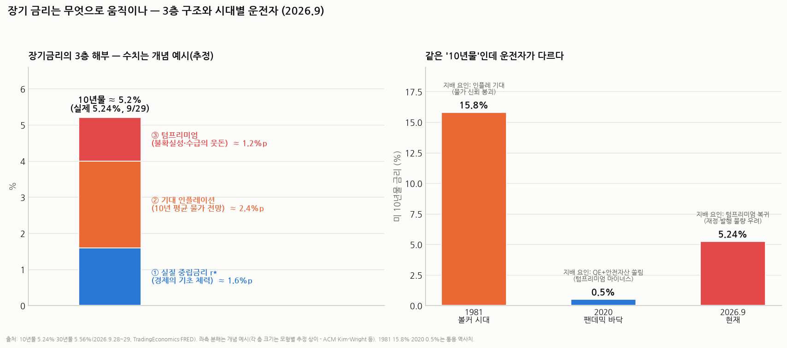

# 채권 배경지식 — 장기 금리는 무엇으로 움직이나 (10년물 해부학)

> 작성일: 2026-09-30 · 카테고리: 거시및정책/배경지식 (시리즈: 경제학파 → 통화패권 → 재정적자 → **금리 해부** — 재정 리포트의 '텀프리미엄'을 여기서 완전 해설)
> **검증 메모**: 미 10년물 5.24%·30년물 5.56%(2026.9.28~29, TradingEconomics·FRED)는 검색 검증. 금리 분해 이론(기대가설+텀프리미엄, 피셔 방정식, ACM·Kim-Wright 모형의 존재)·역사 사례(1981년 ~15.8%, 2020년 ~0.5%, 2004~06 그린스펀 수수께끼, 2022 트러스 사태)는 표준 지식·통용 역사치. **좌측 차트의 층별 크기(1.6+2.4+1.2)는 개념 예시(추정)** — 실제 분해는 모형마다 다르다. 해석·투자 응용은 주관 표기.

---

## 0. 아주 쉬운 버전 — 답부터

**단기 금리는 연준이 '정하는' 가격이고, 장기 금리는 시장이 '투표하는' 가격이다.** 10년물 금리는 딱 세 덩어리의 합으로 움직인다:

> **장기 금리 = ① 앞으로 10년의 단기금리 평균 전망 + ② 앞으로 10년의 인플레이션 전망 + ③ 텀프리미엄(오래 묶어두는 데 대한 위험 웃돈)**

- ①은 "연준이 앞으로 뭘 할까"의 평균 — 그래서 연준이 오늘 금리를 내려도, 시장이 "나중에 다시 올릴걸"이라 믿으면 장기 금리는 안 내려간다
- ②는 돈의 가치가 얼마나 녹을까의 전망 — 채권자의 최대 적
- ③이 요즘의 주인공 — 10년간 무슨 일이 생길지 모르니(인플레 폭주? 국채 홍수?) 받아두는 보험료. **2010년대엔 이게 마이너스**(QE·안전자산 기근)였다가, 지금은 재정 우려로 복귀해 금리를 밀어올리는 중이다

현재 좌표: **10년물 5.24%, 30년물 5.56%** — 재정적자 리포트에서 본 '평시 -6% 적자+발행 홍수'가 ③을 통해 가격에 반영되고 있는 국면이다.

---

## 1. 3층 구조 뜯어보기

### 층 ① 실질 중립금리(r*) — 경제의 기초 체력
- 인플레도 경기부양도 긴축도 없는 '자연 상태'의 실질 금리 — **저축(공급)과 투자(수요)의 균형 가격**이다
- 올리는 힘: 생산성 붐(투자 수요↑ — **AI 캐펙스가 지금 이 층을 밀어올린다는 논쟁 중**), 재정적자(정부가 저축을 흡수)
- 내리는 힘: 고령화(저축 과잉), 저성장, 안전자산 수요
- 2010년대 "구조적 저성장(secular stagnation)" 논쟁이 곧 "r*가 0까지 떨어졌나" 논쟁이었다 — 지금은 반대로 "AI+재정이 r*를 되올렸나"가 논쟁

### 층 ② 기대 인플레이션 — 피셔의 등식
- **명목금리 = 실질금리 + 기대 인플레**(피셔 방정식) — 채권자는 '구매력'으로 돌려받고 싶어 하므로 물가 전망만큼 이자를 더 요구한다
- 실측 도구: **BEI(브레이크이븐)** = 일반 국채 금리 − 물가연동국채(TIPS) 금리 — 시장이 매기는 10년 평균 인플레 전망치. 이 분해 덕에 "금리 상승이 성장 기대 때문인지(실질↑ — 주식에 덜 나쁨) 인플레 때문인지(BEI↑ — 채권·주식 모두에 나쁨)"를 구분할 수 있다
- 1981년 10년물 15.8%의 정체가 이 층이다 — 물가 신뢰가 무너지면 이 층 하나가 금리 전체를 지배한다. 볼커가 한 일 = 이 층을 강제로 꺾은 것

### 층 ③ 텀프리미엄 — 요즘의 주인공
- 정의: 10년 묶어두는 대가로 '기대 경로 합계 위에 얹어 받는' 웃돈. 직접 관측 불가라 모형(ACM, Kim-Wright — FRED에 공개)으로 추정한다
- **무엇이 움직이나**: ⓐ 인플레 '불확실성'(수준이 아니라 분산 — 2%로 안정이면 얇고, 0~6% 널뛰면 두꺼움) ⓑ **수급**: 국채 발행 홍수(재정적자!)는 두껍게, 중앙은행 QE·연기금·규제성 수요는 얇게 ⓒ 주식-채권 상관관계(채권이 주식 헤지가 되면 — 2010년대 — 웃돈을 안 받아도 삼) ⓓ 재정·정치 신뢰(부채한도 사고·연준 독립성)
- **역사**: 1980년대 4~5%p → 2010년대 **마이너스**(QE+글로벌 안전자산 기근 — 웃돈은커녕 웃돈을 내고 삼) → 2023년 말 플러스 전환, 현재 '레짐 체인지' 논의. **재정적자 리포트의 모든 이야기가 채권시장에선 이 층 하나로 번역된다**

## 2. 자주 헷갈리는 것들 — 사례로 정리

1. **"연준이 내리면 장기 금리도 내린다"는 틀릴 수 있다**: ① 2004~06 **그린스펀 수수께끼** — 연준이 4.25%p 올리는 동안 10년물은 제자리(중국·산유국의 국채 매수가 ③을 눌러버림) ② 반대로 최근엔 연준 인하 기대에도 장기물이 오르는 **베어 스티프닝** — ③(재정 우려)이 ①(완화 기대)을 이기는 그림. **장기 금리는 연준의 것이 아니라 시장의 것**이다
2. **수익률곡선 읽기**: 장단기 역전(단기>장기)은 "앞으로 경기 침체→인하"의 시장 전망(층① 하락) — 침체 예고 지표로 유명. 지금 같은 스티프닝(장기가 더 오름)은 ③ 주도일 때 '나쁜 스티프닝'(재정 경계)으로 읽는다
3. **트러스 사태(2022)** = ③의 폭발 실험: 감세안 하나로 영국 30년물이 며칠 새 1%p+ 급등 — 재정 신뢰가 무너질 때 텀프리미엄이 얼마나 빨리 두꺼워질 수 있는지의 실증(재정 리포트 §4 참조)
4. **"금리가 오르면 채권을 사면 안 된다"는 절반만 맞다**: 이미 산 채권의 가격은 떨어지지만(듀레이션 손실 — 10년물은 금리 1%p당 대략 -7~8% 근사), 새로 사는 사람에겐 5%대 수익률이 15년 만의 진입 기회이기도 하다 — 문제는 §1-③이 더 두꺼워질지의 판단

## 3. 지금(2026.9)의 운전자 진단 — 5.24%는 무엇으로 만들어졌나 (주관)

- 연준 경로(층①)나 기대 인플레(층② — BEI는 상대적으로 안정)만으로는 5%대를 설명하기 어렵다 — **증분의 주범은 ③**: 평시 6% 적자의 국채 발행 홍수 + 무디스 강등 + 해외 보유 비중 하락(23.6%) + 연준 독립성 잡음이라는, 재정 리포트 대시보드의 항목들이 그대로 웃돈이 됐다
- 이것이 재정 리포트 §5의 감시 트리거 1번("텀프리미엄 급등 지속·5% 안착")과 연결된다 — **30년물 5.56%는 '경기'의 가격이 아니라 '재정 신뢰'의 가격**이라는 게 현재 국면의 핵심 판독
- 투자 번역: ⓐ 장기금리 5%+는 주식 밸류에이션의 중력(할인율)이자 성장주 멀티플의 적 — 서비스나우 디레이팅의 거시 배경 ⓑ '금리 인하=장기금리 하락=성장주 랠리' 공식이 ③ 레짐에선 작동하지 않을 수 있음 ⓒ 한국 투자자에겐 환율 경로(미 금리↑→달러↑→원화 약세)가 한 겹 더

---

## 참고 출처 (검증)

- [TradingEconomics — 미 10년물 5.24% (2026.9.29)](https://tradingeconomics.com/united-states/government-bond-yield) · [FRED — 30년물 5.56%(9.28)·10년물 시계열](https://fred.stlouisfed.org/series/dgs30) · [FRED — Kim-Wright 텀프리미엄 시리즈](https://fred.stlouisfed.org/series/THREEFYTP10)
- 이론(기대가설·피셔·BEI·ACM 모형)·역사 사례(1981·2004~06 수수께끼·2020·트러스): 표준 채권론·통용 역사치
- 전편 연계 수치(적자 6%·무디스 강등·해외 보유 23.6%): `배경지식_미국재정적자` 검증분

**저장소 연계**: `배경지식_미국재정적자_부채사이클`(③의 공급 측 원인) · `배경지식_통화패권의역사`(재정→통화 신뢰의 대서사) · `배경지식_경제학학파지도`(기대·합리적기대의 이론 배경) · `해외주식/서비스나우`(할인율 중력의 실전 사례) · `반도체/HBM 시리즈`(r*를 밀어올리는 AI 캐펙스)

> 유의: 3층 분해의 층별 크기는 모형 추정(개념 예시)이며 직접 관측치가 아님. §3 진단은 주관. 매수 추천 아님.
