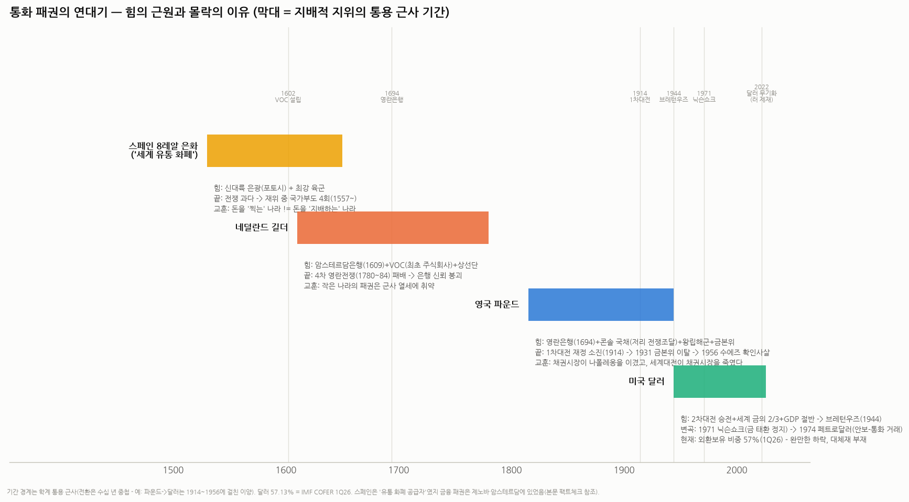

# 통화 패권의 역사 — 기축통화국의 힘은 어디서 왔고, 왜 무너졌나

> 작성일: 2026-09-11 · 카테고리: 거시및정책/배경지식 (자매편: `배경지식_경제학학파지도` — 이번엔 이론이 아니라 역사)
> **검증 메모**: 역사 서술은 학계 표준(아이켄그린 《달러 제국의 몰락》·킨들버거·퍼거슨 《금융의 지배》·달리오 《변화하는 세계 질서》 등 통용 문헌) 기반이며, 논쟁적 대목은 본문 '팩트체크' 절에서 통념과 사실을 구분했다. **현재 수치는 검색 검증**: 달러의 세계 외환보유 비중 57.13%(IMF COFER 1Q26, 유로 20.03%·위안 1.99%), 중앙은행 금 순매입 1Q26 244톤·2026년 연간 750~850톤 전망(JP모간·WGC 등). 연대 경계는 통용 근사(전환은 수십 년 중첩). 해석 절(지정학 vs 경제, 가설 판정)은 필자 정리(주관 표기).

---

## 0. 아주 쉬운 버전 + 질문에 대한 한 줄 답

**당신의 가설("경제보다 군사력이 더 클 것")에 대한 답부터**: 절반은 맞고, 절반은 뒤집힌다. 역사의 패턴은 이렇다 —

> **패권의 '획득'은 군사력이 결정하고, '유지'는 금융(신뢰)이 결정하며, '상실'은 군사력의 과용이 만든 재정 청구서로 온다.**

- 군사력 없는 통화 패권은 없었다(전부 당대 해군 강국) — 여기까진 당신 말이 맞다
- 그런데 **군사력이 최강인데 통화 패권을 못 가진 나라들이 있다**(스페인·소련) — 군사력은 필요조건이지 충분조건이 아니라는 뜻
- 그리고 역대 패권 통화를 죽인 범인은 적국의 군대가 아니라 **자기 군대의 청구서**(전쟁 재정)였다 — 스페인도, 네덜란드도, 영국도
- 결정적 장면 하나: 1956년 수에즈에서 **미국은 총 한 발 안 쏘고 '파운드를 팔겠다'는 위협만으로 영국군을 철수시켰다** — 통화가 군사를 굴복시킨 실증

---

## 1. 전사(前史) — 고대가 남긴 두 가지 교훈

- **로마 데나리우스**: 제국 초기 은 함량 ~95%였던 은화가, 군비·복지 지출을 세금으로 못 메우자 **은 함량을 깎는 방식(디베이스먼트)**으로 3세기엔 5% 이하로 추락 — 물가 폭등과 화폐 신뢰 붕괴가 제국 쇠락과 동행했다. **교훈 ①: 통화 붕괴는 대개 적이 아니라 자국 재정이 죽인다**
- **비잔틴 솔리두스**: 반대로 순도를 **약 700년간** 유지해 지중해 무역의 표준 화폐로 군림 — '중세의 달러'. **교훈 ②: 통화 패권의 본질은 금속이 아니라 "이 돈은 안 변한다"는 신뢰의 지속**

## 2. 스페인 (16세기) — 세계의 돈을 찍었지만, 돈을 지배하진 못했다

- **힘의 근원**: 신대륙 정복 — 포토시(볼리비아) 은광 등에서 쏟아진 은으로 만든 **8레알 은화('스페인 달러')**가 유럽~아시아(명나라 조세까지)에서 통용된 최초의 세계 유통 화폐가 됐다. 육군은 당대 최강(테르시오)
- **그런데 여기 역설이 있다**: 은을 '공급'한 건 스페인인데, 그 은을 굴리는 **금융(신용) 패권은 제노바·안트베르펜의 은행가들**에게 있었다. 스페인 왕실은 전쟁 자금을 이들에게 고금리로 빌렸고 —
- **몰락**: 합스부르크의 끝없는 전쟁(네덜란드 반란 80년, 프랑스·오스만·영국과 동시 전선)으로 **펠리페 2세 재위 중에만 국가부도 4회(1557·1560·1575·1596)**. 무한한 은 유입은 국내 물가만 올렸고(가격혁명 — 최초의 자원의 저주), 산업은 공동화됐다
- **교훈**: **돈을 '찍는' 나라와 돈을 '지배하는' 나라는 다르다.** 통화 패권 = 화폐 공급이 아니라 **신용(빌리고 갚는 시스템)의 장악**이다. 그리고 최강 군대는 재정이 감당 못 하는 순간 패권의 자산이 아니라 부채가 된다

## 3. 네덜란드 (17세기) — 최초의 '금융 설계' 패권

- **힘의 근원**: 군사 대국이 아니라 **제도 혁신**이 만든 패권이다 — ① **암스테르담은행(1609)**: 유럽 최초의 안정된 결제·예금 은행(어느 나라 주화든 정확한 은 함량으로 계좌화 — 환전 사기의 종식) ② **VOC(동인도회사, 1602)**: 세계 최초의 주식회사+주식거래소 ③ 세계 상선의 절반을 가진 무역 네트워크. 길더는 유럽 무역·채권의 표준 통화가 됐다
- **군사와의 관계**: 해군은 강했지만(영란전쟁에서 영국과 대등), 인구 200만의 소국 — 패권은 함대가 아니라 **"암스테르담에 돈을 맡기면 안전하다"는 신뢰**에서 나왔다
- **몰락**: **4차 영란전쟁(1780~84) 패배**가 방아쇠 — 전쟁 비용과 봉쇄로 VOC가 사실상 파산했고, 암스테르담은행이 VOC·시 정부에 몰래 대출해 준 사실이 드러나며 **'100% 준비금 은행'이라는 신뢰가 붕괴**(1790s 뱅크런·폐쇄 수순). 금융 중심은 런던으로 이사갔다
- **교훈**: 소국의 금융 패권은 정교하지만, **군사력이 받쳐주지 못하면 강대국과의 전쟁 한 번에 꺾인다** — 당신 가설이 가장 잘 맞는 사례. 동시에, 최종 붕괴의 형태는 역시 '신뢰의 훼손'(몰래 한 대출)이었다는 것도 기록해 둘 것

## 4. 영국 (1815~1944) — 채권시장이 만든 제국, 세계대전이 부순 제국

- **힘의 근원 — 4종 세트**:
 1. **영란은행(1694)**: 애초에 프랑스와의 전쟁 자금 조달용으로 설립 — 국가 신용의 제도화
 2. **콘솔 국채**: 영국 정부는 만기 없는 국채를 **유럽 최저 금리로 무제한** 팔 수 있었다 — 나폴레옹 전쟁의 진짜 승인(勝因). 프랑스는 세금·약탈로, 영국은 채권으로 싸웠고, 20년 전쟁의 지구력은 채권이 이겼다. **"채권시장이 나폴레옹을 이겼다"**
 3. **금본위**(1717 뉴턴의 사실상 도입 → 1816 법제화): "파운드 = 금"이라는 자동 신뢰 장치
 4. **왕립해군 + 제국 네트워크**: 무역로 보호, 그리고 식민지·전신망·로이드 보험·발틱 해운거래소까지 — 세계 무역의 '배관' 전체가 런던 경유
- **전성기**: 세계 무역의 60%가 파운드로 결제, 런던 시티가 세계의 은행 — 영국 GDP가 미국에 추월당한 뒤(1870s)에도 **파운드 패권은 40년을 더 갔다**(네트워크 효과의 관성)
- **몰락 — 3단계**:
 1. **1914 제1차 세계대전**: 4년 만에 세계 최대 채권국에서 **미국에 빚진 채무국으로 전락** — 결정타는 이것 하나다. 전쟁은 금 태환 정지·인플레·자산 매각을 강제했다
 2. **1925~31**: 처칠이 전쟁 전 환율로 금본위 복귀를 강행(과대평가) → 수출 붕괴·디플레 → **1931년 금본위 영구 이탈** — 신뢰 장치의 자폭
 3. **1956 수에즈(확인사살)**: 이집트 침공에 분노한 미국이 **파운드 매도 위협+IMF 지원 거부**로 압박 → 영국은 군사 작전을 접고 철군. 파운드는 이후 위기 때마다 IMF 구제를 받는 통화로 전락
- **교훈**: 패권 통화의 사인(死因)은 언제나 같다 — **감당 못 할 전쟁 → 채권국에서 채무국으로 → 신뢰의 이양**. 그리고 이양받는 쪽은 항상 '전쟁 자금을 빌려준 나라'였다

## 5. 미국 달러 (1944~) — 승전 + 금 + 산업의 삼위일체, 그리고 두 번의 변신

- **획득 (1944 브레턴우즈)**: 2차대전 종전 시 미국 = 세계 금 보유의 약 2/3 + 세계 제조업의 절반 + 유일하게 본토가 멀쩡한 승전국. 44개국이 "달러만 금에 고정(온스당 35달러), 나머지는 달러에 고정"에 서명 — **군사적 승리가 만든 협상력**으로 제도를 설계한 순간. 당신 가설이 여기서도 유효하다
- **1차 변신 (1971 닉슨쇼크)**: 베트남전+복지 지출로 금이 유출되자 닉슨이 **금 태환을 일방 정지** — 달러는 금의 보증 없는 순수 신용화폐가 됐다. 붕괴 예상이 많았지만…
- **2차 변신 (1974 페트로달러)**: 미국-사우디 합의 — **원유는 달러로만 결제, 그 대가로 미국이 안보를 제공** — 금 대신 석유(와 미군)가 달러의 담보가 된 셈. **군사력과 통화 패권의 거래가 명문화된 가장 노골적인 사례** — 당신 가설의 최고 증거물
- **현재의 힘**: 외환보유의 57.13%(1Q26 — 20년 전 ~70%에서 완만 하락), 무역결제·SWIFT·유로달러 시장·"위기 때 모두가 사는 통화"라는 역설(2008년 미국발 위기에도 달러 강세). 유로 20.0%, **위안은 1.99%** — 도전자들이 아직 체급 미달
- **균열의 신호들**: ① 2022년 러시아 외환보유 동결 — '달러의 무기화'가 각국에 "우리도 당할 수 있다"를 학습시킴 ② 그 직후부터 **중앙은행 금 매입 폭증**(1Q26에만 244톤, 연 750~850톤 전망 — 역사적 이례) ③ 미국 부채·재정적자와 정치 기능부전 ④ 관세·달러 정책의 예측 불가능성. 단, **대체재가 없다는 것**이 현재까지의 결론 — 유로는 국채시장이 쪼개져 있고, 위안은 자본통제(돈을 자유롭게 못 뺌) 탓에 준비통화 자격 미달

## 6. 팩트체크 — 흔한 통념 5개 교정

| 통념 | 팩트체크 |
|---|---|
| "기축통화 수명은 약 100년 주기다" (달리오식 도식) | **과도한 단순화.** 지위 '구간'의 경계 자체가 흐릿하고, 전환은 수십 년 중첩된다 — 미국 GDP는 1870년대에 영국을 추월했지만 달러가 파운드를 확실히 대체한 건 1944(~1956)년. 아이켄그린 연구로는 1920년대 중반에 달러가 준비통화에서 파운드를 일시 추월한 적도 있다(단선적 교체가 아니라 엎치락뒤치락) |
| "무적함대 격파(1588)로 스페인이 몰락했다" | **과장.** 함대는 곧 재건됐고 스페인은 이후로도 반세기+ 강대국이었다 — 몰락은 한 해전이 아니라 수십 년 전쟁 재정의 누적(국가부도 4회)이 원인 |
| "스페인은 통화 패권국이었다" | **절반만.** 8레알은 세계 유통 화폐였지만 신용·금융의 중심은 제노바·암스테르담 — '화폐 공급자'와 '금융 패권자'는 다르다 |
| "닉슨쇼크(1971)로 달러 패권이 끝날 뻔했다" | **결과는 반대.** 단기 혼란(1970년대 인플레) 후 달러는 금의 족쇄를 벗고 페트로달러·변동환율 체제에서 오히려 유연해졌다 — 위기가 아니라 리모델링이었다 |
| "군사력이 세면 기축통화가 된다" | **반례 양쪽 존재.** 소련은 군사 초강대국이었지만 루블은 국제화에 완전 실패(폐쇄 경제·신뢰 부재), 반대로 스위스프랑은 군대 없이도 안전통화다. 군사력은 필요조건에 가깝지 충분조건이 아니다 |

## 7. 판정 — 군사력인가 경제인가 (질문에 대한 정면 답, 주관 정리)

두 렌즈로 같은 역사를 다시 보면:

| 국면 | 지정학(군사) 렌즈 | 경제(금융) 렌즈 | 어느 쪽이 더 설명력 있나 |
|---|---|---|---|
| 패권의 **획득** | 네덜란드→영국(영란전쟁 승리), 영국→미국(양차대전 승전국) — **교체는 언제나 전쟁의 결과였다** | 승자는 늘 '채권시장이 더 깊은 쪽'이었다(영국의 콘솔, 미국의 전시국채) | **군사 우세** — 단, 이길 '지구력'은 금융이 공급 |
| 패권의 **유지** | 해군의 무역로 보호(팍스 브리태니카·아메리카나), 페트로달러의 안보 거래 | 네트워크 효과·유동성·법치(재산권) — GDP 추월당하고도 파운드가 40년 더 간 이유 | **금융 우세** — 관성은 신뢰와 네트워크의 것 |
| 패권의 **상실** | 강대국 전쟁 패배(네덜란드)·소모(영국) | 전쟁 '비용'의 재정화 실패 — 부도(스페인)·채무국 전락(영국)·신뢰 자폭(암스테르담은행) | **동전의 양면** — 방아쇠는 군사, 사인(死因)은 재정 |

**종합 판정**: 당신의 직관(군사력 중시)은 **획득 국면과 페트로달러 같은 명시적 거래에서 정확히 맞다.** 그러나 역사 전체를 관통하는 공식은 이것이다 —

> **군사력은 패권의 골격이고, 신용(갚는다는 믿음)은 혈액이다. 패권국은 대개 골격이 부러져 죽는 게 아니라, 골격을 과도하게 휘두르다 혈액(재정)이 말라 죽는다.** (폴 케네디의 '제국의 과잉확장'과 같은 결론)

수에즈(1956)가 이 명제의 실험 증명이다: 군사 작전은 성공 중이었는데, 통화(파운드 투매 위협)가 그것을 중단시켰다 — **패권의 말기에는 인과가 역전되어, 통화가 군사를 지휘한다.**

## 8. 오늘의 달러에 대입하면 — 투자자용 체크리스트 (주관)

역사의 몰락 공식(감당 못 할 지출 → 채무 누적 → 신뢰 장치 훼손 → 대체재 등장)을 달러에 대입한 감시 지표:

1. **재정**: 미국 이자비용이 국방비를 추월한 상태가 지속되는가 — '스페인 경로'의 초기 신호
2. **신뢰 장치**: 연준 독립성·국채 시장의 안정 — 영국의 '1925 금본위 복귀' 같은 자충수(예: 달러 정책의 정치화)가 나오는가
3. **무기화의 부메랑**: 제재의 남용 빈도 vs 중앙은행 금 매입(연 750~850톤) — 이탈은 '달러 매도'가 아니라 **'금 매수'라는 조용한 형태**로 진행 중이라는 게 현재 데이터의 핵심
4. **대체재의 체급**: 위안 비중(1.99%)이 자본계정 개방 없이 5%를 넘는지 — 넘기 전까지 '달러 종말론'은 시기상조
5. **역사가 주는 시간 감각**: 파운드는 결정타(1914) 후에도 30~40년을 더 갔다 — 패권 통화의 쇠락은 이벤트가 아니라 **수십 년의 과정**이며, 그 사이 최고의 트레이드는 '종말 베팅'이 아니라 이양기의 헤지 자산(당시 금·달러, 지금은 금·실물)이었다. 중앙은행들이 지금 하고 있는 게 정확히 그것이다

---

## 참고 (표준 문헌 + 검증 출처)

- 표준 문헌: 배리 아이켄그린 《Exorbitant Privilege(달러 제국의 몰락)》 · 킨들버거 《경제 강대국 흥망사》 · 니얼 퍼거슨 《금융의 지배(The Ascent of Money)》 · 폴 케네디 《강대국의 흥망》 · 레이 달리오 《변화하는 세계 질서》(대중서 — §6의 주기설 유의점 참조)
- [IMF COFER — 달러 57.13%·유로 20.03%·위안 1.99% (1Q26)](https://data.imf.org/en/news/imf%20data%20brief%20july%201) · [뉴욕연은 Liberty Street — 중앙은행의 달러 이탈 여부 분석 (2026.9)](https://libertystreeteconomics.newyorkfed.org/2026/09/are-central-banks-moving-out-of-dollar-assets/)
- [WGC/보도 — 중앙은행 금 순매입 1Q26 244톤·2026년 750~850톤 전망](https://www.advantagegold.com/blog/central-bank-gold-buying-2026-banks-bought-244-tonnes-in-q1-bar-and-coin-demand-hit-its-second-highest-level-ever-the-price-dipped-they-bought-more/) · [Visual Capitalist — 2026 매입국 순위(폴란드 최대)](https://www.visualcapitalist.com/ranked-central-banks-buying-and-selling-gold-in-2026/)
- 역사 서술(스페인 부도 4회·암스테르담은행 붕괴·콘솔 국채·수에즈 파운드 위기·브레턴우즈·페트로달러): 학계 표준 — 세부 연도는 통용 문헌 기준

**저장소 연계**: `배경지식_경제학학파지도`(이론편 — 본편은 역사편) · `AI데이터센터_전력병목`(과잉확장 렌즈의 현재 적용 대상) · `정유및석유화학/배경지식_폴리실리콘`·`방산/비츠로셀_원재료`(원산지 지정학의 각론) · `해외주식/서비스나우_히스토리`(패권 교체 패턴의 산업 버전)

> 유의: 연대 경계·비중 수치 일부는 통용 근사. §7~8의 판정·체크리스트는 주관적 정리. 특정 자산 매수 추천 아님.
