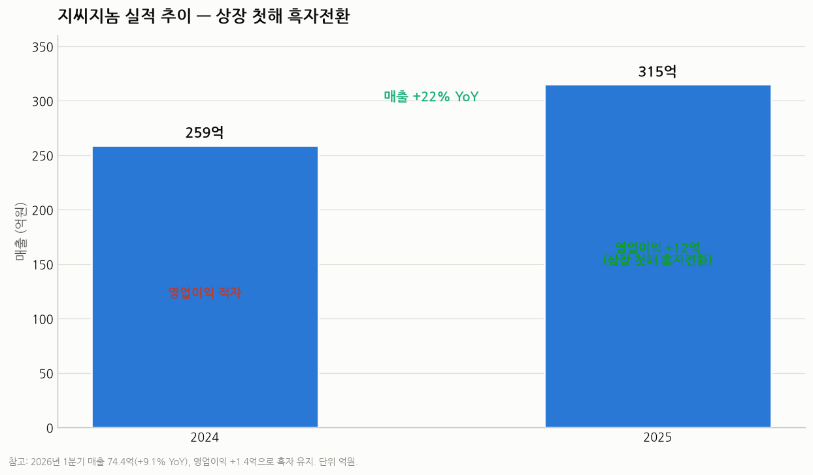

# 지씨지놈(GC Genome, KOSDAQ 340450) 심층 분석 리포트

> 작성일: 2026-07-30 · 카테고리: 바이오 및 제약(진단·액체생검)
> 대상: GC(녹십자) 그룹 계열 임상유전체·액체생검 진단 기업
> 성격: 사업·제품·파이프라인·실적·지배구조·밸류에이션 종합. 수치는 회사·언론·증권사 자료이며 시점에 따라 달라져 출처·시점 병기.

---

## 0. 한 문장 요약

> **지씨지놈은 "비침습 산전검사(G-NIPT) 국내 1위라는 이익 나는 캐시카우 + 혈액 한 통으로 여러 암을 조기 선별하는 다중암 검진(MCED) '아이캔서치'라는 성장 옵션"을 결합한 GC그룹 계열 진단기업**으로, 2025년 6월 코스닥 상장 첫해에 흑자 전환했다. 주가는 공모가의 3배 이상으로 성장 기대를 선반영했고, 보호예수 해제 오버행과 MCED 급여화 불확실성이 핵심 변수다.

---

## 1. 기본 정보

| 항목 | 내용 |
|---|---|
| 종목코드 | KOSDAQ **340450** |
| 설립 | **2013년** (GC녹십자 자회사, 구 'GC녹십자지놈') |
| 상장 | **2025년 6월 11일** (녹십자그룹 계열 7번째 상장사) |
| 공모가 | **10,500원** (희망밴드 9,000~10,500 상단), 공모자금 약 **430억원** |
| 청약 | 수요예측 547:1, 일반청약 484:1 |
| 최대주주 | **GC녹십자 25.57%** (특수관계인 29인 합산 약 45%) |
| 사업 | 임상유전체 분석·액체생검, 유전자검사 **300종+**, 병의원 **900곳+** |
| 주가(2026-04-23) | **34,950원** (키움 목표주가 44,000원) |

---

## 2. 사업 구조 — 생애 전주기 유전자검사 4대 축

수익모델은 **검사 수탁(B2B2C)**: 병의원·검진센터가 검체를 보내면 지씨지놈이 분석·리포팅한다. **검사 건수 × 단가** 구조라 건수 증가가 곧 매출 레버리지다.

1. **산전·신생아 검사** — 핵심 **G-NIPT(지니프트)**. 국내 대학병원 산과 유전자검사 **유통 1위**.
2. **암 정밀 진단** — 핵심 **아이캔서치(MCED)** + 조직·혈액 기반 암 유전자 프로파일링.
3. **건강검진 검사** — 검진센터 채널로 확산.
4. **유전 희귀질환 정밀진단** — WGS/WES 기반.

---

## 3. 양대 핵심 제품

### ① G-NIPT(지니프트) — 캐시카우
- 2015년 국내 첫 출시, AI 기반 비침습 산전검사. 산모 혈액 속 태아 DNA로 다운·에드워드·파타우 증후군 등 염색체 이상 선별.
- **국내 산과 유전자검사 유통 1위.** 싱가포르 등 해외 특허 확보.
- 검사 건수 **2024년 1.8만 → 2025년 2.5만건(+40%)**. 저출산에도 NIPT 침투율 상승(고령 산모·검사 보편화)이 방어.

### ② 아이캔서치(ai-CANCERCH) — 성장 엔진 ⭐
- **혈액 한 통(10mL)으로 여러 암을 동시 조기 선별하는 MCED**(Multi-Cancer Early Detection). 2023년 9월 국내 출시.
- 독자 **AI 알고리즘 + 전장유전체분석(WGS)** 기반(cfDNA 패턴 분석).
- **성능(최신 검증)**: **특이도 95.5%**, 전체 민감도 79.7%(병기 가중 80.2%). 표준 선별검사가 없던 **췌장암·간담도암에서 80%+ 민감도** — 조기진단 사각지대 공략.
- 검출 암종 **6종 → 10종**으로 확장(폐·간·대장·췌담도·식도·난소 등).
- 검사 건수 **2024년 900건 → 2025년 5,100건(약 5.7배)** — 실적 재평가의 핵심 동력.

---

## 4. 파이프라인 · R&D

- **대장암 비침습 혈액검사**: 서울아산병원 변정식 교수팀과 공동연구, **미국소화기내과저널(AJG)** 게재. 대변검사·대장내시경 대비 접근성 강점.
- 동반진단(CDx)·단일암 특화 제품으로 라인업 확장.
- MCED 성능·암종 지속 고도화(국내 최다 임상 검체 확보 주장).

---

## 5. 글로벌 확장

- **미국 Genece Health(지니스 헬스)에 기술수출 완료** → 상업화 추진.
- 로드맵: **단기 단일암 제품 출시 → 장기 FDA 인증 + 미국 보험청(CMS) 가이드라인 등재.**
- 일본 액체생검 학회 등 해외 학회서 아이캔서치 성능 발표(글로벌 레퍼런스 축적).

---

## 6. 실적 — 상장 첫해 흑자전환

| 구분 | 매출 | 영업이익 | 비고 |
|---|---|---|---|
| 2024 | 259억 | 적자 | |
| **2025** | **315억 (+22%)** | **+12억 (흑전)** | 상장 첫해 흑자 |
| 2026 1Q | 74.4억 (+9.1%) | +1.4억 | 흑자 유지 |

바이오 신규 상장사가 상장 첫해에 **매출 성장 + 흑자**를 동시 달성한 건 이례적. "적자 성장 스토리"가 아니라 **이익 나는 진단 실적주**라는 점이 차별점.

---

## 7. 지배구조 · 수급

- 최대주주 **GC녹십자 25.57%**, 특수관계인 합산 약 **45%**.
- **⚠️ 오버행**: 2026년 6월, 상장 시 1년 의무보유했던 최대주주·특수관계인 물량 **약 1,066만주(발행총수 45%)의 보호예수 해제** → 유통가능 물량이 사실상 100%로 확대. 단기 수급 부담.

---

## 8. 주가 · 밸류에이션

| 시점 | 주가 |
|---|---|
| 공모가(2025.6) | 10,500원 |
| 상장 첫날 시초가 | 14,300원 (장중 +36%) |
| 2026-04-23 | **34,950원** (공모가 대비 약 3.3배) |
| 키움 목표주가(2026.4) | **44,000원** (Buy, 상향) |

- 소형 성장주. NH투자증권도 커버리지 개시(목표주가는 미제시)하며 "**아이캔서치 확대 + G-NIPT 지속 성장으로 실적 고성장·기업가치 재평가**" 전망.
- **밸류 성격**: 순이익 규모가 작아(2025 영업이익 12억) 전통 PER로는 고평가로 보이나, 시장은 **아이캔서치 MCED 옵션 가치 + 검사건수 J커브**를 반영하는 **성장주 프레임**으로 본다. → PER보다 **매출 성장률·검사건수·침투율·글로벌 진출**로 판단해야 하는 종목.

---

## 9. 경쟁 구도

- **국내 유전체/진단**: 마크로젠·테라젠바이오·디엔에이링크(NGS 1세대), EDGC·랩지노믹스(액체생검·NGS). 지씨지놈의 차별점 = **GC그룹 병원·검진 채널 + NIPT 1위 캐시카우 + 흑자 체력 + MCED 임상 데이터.**
- **글로벌 MCED 벤치마크**: Grail(Galleri), Guardant Health(Shield), Exact Sciences(Cancerguard). 글로벌 MCED는 거대 시장이나 보험·규제 초기 단계 → 지씨지놈은 "한국판 MCED" 포지션 + 미국 진출 옵션.

---

## 10. 투자포인트 vs 리스크

**투자포인트**
- 아이캔서치 검사건수 J커브(900→5,100건)로 매출 고성장 + 흑자 체력
- MCED = 조기암 진단 패러다임 전환의 핵심 → 대형 옵션가치
- G-NIPT 캐시카우가 하방 방어, GC그룹 채널·신뢰도
- 미국 기술수출(Genece Health) + FDA/CMS 로드맵

**리스크**
- **밸류 부담**: 실이익 대비 주가 3배 급등, 성장 기대 선반영
- **보호예수 해제(45%) 오버행**(2026.6)
- MCED **보험수가·신의료기술평가** 불확실성(급여화 지연 시 확산 제약)
- 소형주 유동성·변동성, 검사단가 인하 압력, 글로벌 경쟁(Grail 등)
- 저출산 구조(G-NIPT 물량 상단 제약)

---

## 11. 종합

지씨지놈은 **"이익 나는 진단 캐시카우(G-NIPT) + 폭발 성장 중인 MCED 옵션(아이캔서치)"** 의 조합이다. 상장 첫해 흑자로 여느 적자 바이오와 차별화되지만, 주가가 공모가의 3배 이상으로 성장 기대를 상당 부분 선반영했고 보호예수 해제 오버행이 있어 **밸류에이션·수급 관리가 관건**이다. 핵심 관전 포인트는 **① 아이캔서치 검사건수·급여화, ② 미국 진출 실질 진전, ③ 신규 암종·대장암 제품 상업화**다.

---

## 12. 트래킹 체크리스트

- [ ] 아이캔서치 분기 검사건수 추이 + 신의료기술평가·급여화 진행
- [ ] G-NIPT 검사건수·NIPT 침투율(저출산 상쇄 여부)
- [ ] 미국 Genece Health 상업화·FDA·CMS 마일스톤
- [ ] 대장암·단일암 신제품 출시·매출 기여
- [ ] 분기 매출 성장률·영업이익률(흑자 지속 여부)
- [ ] 보호예수 해제 물량 소화·수급, 최대주주 지분 변동

---

## 참고 출처

- [GC지놈 액체생검 핵심제품 경쟁력 (바이오스펙테이터)](https://www.biospectator.com/news/view/25200)
- [GC지놈 코스닥 상장·글로벌 톱티어 목표 (바이오타임즈)](https://www.biotimes.co.kr/news/articleView.html?idxno=21610)
- [상장 첫날 장 초반 36% 급등 (한국경제)](https://www.hankyung.com/article/2025061170206)
- [공모가 10,500원 확정 (바이오스펙테이터)](https://www.biospectator.com/news/view/25230)
- [상장 첫해 흑자·매출 22%↑ (데일리팜)](https://www.dailypharm.com/user/news/334931)
- [아이캔서치 성능 검증(특이도 95.5%·민감도 79.7%) (청년일보)](https://www.youthdaily.co.kr/news/article.html?no=212526)
- [대장암 비침습 검사 AJG 게재 (팜뉴스)](https://www.pharmnews.com/news/articleView.html?idxno=264909)
- [미국 진출·조기암 검사 확장 (의약뉴스)](https://www.newsmp.com/news/articleView.html?idxno=252316)
- [NH투자증권 커버리지·재평가 전망 (이투데이)](https://www.etoday.co.kr/news/view/2561038)
- [최대주주 보호예수 45% 해제 (다음/뉴스)](https://v.daum.net/v/20260608100217684)

> 유의: 시가총액·주가·목표주가·지분율·실적 전망은 언론·증권사 추정이며 시점에 따라 달라진다. 현재가는 2026-04-23 기준으로, 최신 시세·분기 실적은 DART 공시·거래소로 교차확인을 권한다.
