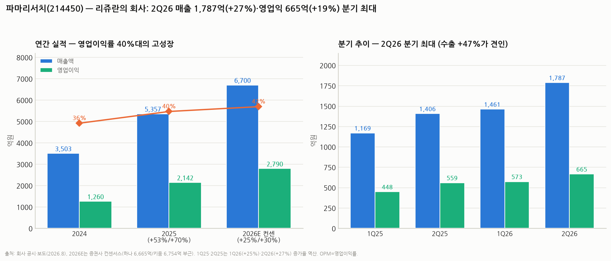

# 파마리서치(214450) 심층분석 — '리쥬란'의 회사, 고성장·고마진·고밸류의 삼중주

> 작성일: 2026-08-11 · 카테고리: 바이오및제약/종목분석 · 자매편: `휴메딕스_심층분석리포트`(같은 날 작성, 에스테틱 비교 포함)
> **검증 메모**: 실적(2025 연간·1Q/2Q26)·주가(8/11 종가 41만원)·인적분할 철회·목표가는 공시·복수 언론으로 교차검증. 시가총액·PER은 발행주식수 기반 **추산**으로 표기. 2026E는 증권사 컨센서스.

---

## 0. 아주 쉬운 버전 (여기만 읽어도 됨)

**뭐 하는 회사?** 연어에서 뽑은 DNA 조각(PDRN·PN)으로 **피부·관절을 재생시키는 물질**을 만드는 회사다. 대표 제품이 피부과에서 맞는 **"리쥬란"(연어주사, 스킨부스터)** — 국내 스킨부스터 시장을 연 제품이고, 무릎에 맞는 **"콘쥬란"**(관절강 주사), 그리고 리쥬란 브랜드 화장품이 있다.

**장사는 잘돼?** 아주 잘된다. 2025년 매출 5,357억(+53%)·영업이익 2,142억(+70%), **영업이익률 40%** — 제조업에서 보기 드문 마진이다. 2026년 상반기도 매출 3,248억(+26%)으로 반기 최대, **수출이 +47%** 늘며 성장축이 국내→해외로 이동 중이다.

**주가는?** 오늘(8/11) **41만원(+8.3%)**, 시가총액 약 4.3조 원(추산). 롤러코스터를 탔다: 2025년 여름 71만 원 → 경쟁 심화 우려로 **-60% 급락** → 올해 1월 46만 → 4월 31만 → 8/7 실적 발표 직후 -14.7% 급락 → **목표가 줄상향(5개 증권사)에 8/11 급반등**. 컨센서스 목표가는 41만~48만 원대.

**한 줄 평**: 실적은 최상급인데, 주가는 "이 성장이 언제까지냐"를 두고 계속 싸우는 종목. 영업이익률 40%는 경쟁자를 부르는 꿀단지이기도 하다.

---

## 1. 사업 구조 — 재생물질 플랫폼

| 축 | 제품 | 성격 |
|---|---|---|
| 의료기기(스킨부스터) | **리쥬란** (PN 성분) | 성장 엔진. 국내 1위 → 유럽·아시아 수출 확대 |
| 의료기기(정형) | **콘쥬란** (관절강 주사) | 안정 캐시카우 — 급여권에서 꾸준한 수요 |
| 화장품 | 리쥬란 코스메틱 | 고성장 2번 엔진 — 미국 수출이 예상보다 빠름 |
| 의약품 등 | 리안 점안 등 | 보조 |

핵심 경쟁력은 **PDRN/PN(폴리뉴클레오티드) 원료의 원천기술과 브랜드**다. "연어주사=리쥬란"이라는 카테고리 대명사 지위가 해자이고, 시술(의료기기)과 화장품이 같은 브랜드로 **선순환**한다(시술 경험 → 화장품 구매 → 브랜드 강화).

## 2. 실적 — 숫자는 흠잡을 데 없다

| | 2024 | 2025 | 2026E(컨센) |
|---|---|---|---|
| 매출액 | 3,503억 | **5,357억 (+53%)** | ~6,700억 (+25%) |
| 영업이익 | 1,260억 | **2,142억 (+70%)** | ~2,790억 (+30%) |
| 영업이익률 | 36% | **40%** | 41~42% |

- **1Q26**: 매출 1,461억(+25%)·영업익 573억(+28%) / **2Q26**: 매출 1,787억(+27%)·영업익 665억(+19%) — **분기 최대**, OPM 37.2%
- **상반기 수출 1,428억(+47%)**: 리쥬란 유럽 수출 + 미국 화장품이 예상 상회 (다올·IBK·키움·신한·삼성 5개사 목표가 상향 근거)
- 2Q에서 눈여겨볼 점: 매출(+27%)보다 이익(+19%)이 덜 늘었다 — 해외 마케팅·인건비 투입으로 **수익성은 소폭 희석**. 증권가도 "하반기 수익성 추이 주목"을 달았다.

## 3. 주가·밸류에이션 — 롤러코스터의 이유

- **8/11 종가 41만 원(+8.32%)** — 2/4 이후 6개월 만의 40만 원대 회복. 시총 **약 4.3조 원(추산)**
- 여정: 52주 최고 71만(2025 여름) → 2025.8 **-60% 급락**(스킨부스터 경쟁 심화 우려) → 2026.1.8 462,500(키움 TP 70만) → 4/16 31만(TP 41만으로 하향) → 8/7 실적 직후 336,500(-14.7%) → 8/11 41만 회복
- 8/7 급락의 이유가 흥미롭다: 공식 컨센서스는 부합했는데 **'스트릿 컨센'(시장 기대치)이 더 높았다**는 해석 — 고밸류 성장주의 숙명적 변동성을 보여준 사례
- **밸류에이션(추산)**: 2026E 순이익 ~2,300억 안팎 가정 시 **선행 PER ~18~19배**. 국내 에스테틱 피어(휴젤·클래시스 등)와 유사하거나 소폭 프리미엄, OPM 40%·성장 25%를 감안하면 부담스러운 수준은 아니나 싸지도 않다
- 컨센 목표가: 하나 48만(5/11) · 키움 41만(4/17) → 8월 실적 후 5개사 상향(구체 수치는 리포트별 상이)

## 4. 지배구조 이슈 — 인적분할 소동 (정리)

- 2025.6 **인적분할(지주사 전환) 결의**: 파마리서치홀딩스(존속) + 사업회사 신설, 분할비율 0.743 : 0.257. "대주주 지배력 강화 + 2세 승계용 중복상장"이라는 소액주주 반발 확산
- **2025.7 철회** — 주주 반발에 밀려 계획 철회. 당장의 리스크는 소멸
- **남는 것**: 시도 자체가 보여준 지배주주의 의도. 재추진 가능성은 상존하며, 재추진 시 디스카운트 요인. 밸류업 시대에 다시 시도하기는 부담이 크다는 점이 방어 논리

## 5. 투자 포인트 vs 리스크

**포인트**
1. **수출 변곡**: 성장축이 국내 시술 시장(포화 논란)에서 유럽·아시아·미국(화장품)으로 이동 — 상반기 수출 +47%가 증거. 리쥬란의 글로벌 침투는 아직 초기
2. **OPM 40%의 현금창출력**: 원료(자체)·브랜드(자체)·시술+화장품 선순환의 구조적 마진
3. **콘쥬란**: 에스테틱 경기와 무관한 캐시카우가 바닥을 깔아줌
4. **분할 철회로 오버행성 리스크 일단 제거**

**리스크**
1. **경쟁 심화** — 2025.8 -60% 급락의 원인이 사라진 게 아니다. PN 스킨부스터 후발주자(국내 다수)·엑소좀 등 대체 시술의 가격 경쟁 → 국내 성장 둔화는 이미 진행형(1Q 리쥬란 수출이 "살짝 약했다"는 하나증권 코멘트)
2. **미국 본게임 불확실**: 시술용 리쥬란의 미국 진출은 규제(FDA) 경로가 길다 — 당장은 화장품만. "미국 스토리"가 밸류에 선반영되면 위험
3. **스트릿 컨센 리스크**: 기대치가 실적보다 빨리 뛰는 고밸류 종목 특유의 변동성 (8/7 -14.7%가 실례)
4. **지배구조 재시도 가능성**
5. **섹터 동조화**: 에스테틱 전반의 디레이팅(중국 소비 둔화·경쟁) 시 함께 눌림

## 6. 시나리오 (12개월, 가설)

| | 가정 | 함의 |
|---|---|---|
| Bull | 수출 +50%대 지속, 유럽 리쥬란 안착, OPM 40% 유지 | 컨센 상향 사이클 지속 — 목표가 상단(48만+) 재도전 |
| Base | 2026 매출 +25%·OPM 41% (컨센 부합) | 40만 원대 안착, PER 18배 유지 |
| Bear | 국내 경쟁 심화 가속 + 수출 둔화 확인 | 2025.8 학습효과로 급격한 디레이팅(-30%~) — 31만 이하 재방문 |

**개인 의견(가설)**: 이 종목의 본질은 "실적 미스"가 아니라 **"기대치 관리" 게임**이다. 분기마다 최대 실적을 내고도 급락할 수 있는 구조이므로, 진입은 기대치가 꺾인 직후(4월 31만, 8/7 33만처럼)가 유리했고, 목표가 줄상향으로 기대치가 다시 높아진 지금은 추격보다 눌림 대기가 합리적.

---

## 참고 출처 (검증)

- [인사이트 — 상반기 매출 3,248억·영업익 1,238억, 수출 +47% (2026.8)](https://www.insight.co.kr/news/567024)
- [뉴스웨이 — 2Q 최대 매출, 하반기 수익성 주목 (2026.8.10)](https://newsway.co.kr/news/view?ud=2026081008240610335)
- [한국경제 — 연어주사 수출 호조, 목표가 줄상향, 8/11 종가 41만 (2026.8.11)](https://www.hankyung.com/article/2026081047396)
- [스마트투데이 — 2분기 부합에도 '스트릿 컨센' 여파 급락 (2026.8)](https://www.smarttoday.co.kr/ko-kr/articles/110233)
- [약사공론 — 2025년 연매출 5,357억·영업익 2,142억 (2026.2)](https://www.kpanews.co.kr/news/articleView.html?idxno=528846)
- [하나증권 — 1Q26 리뷰, TP 48만 (2026.5.11)](https://www.newspim.com/news/view/20260511000134)
- [키움증권 — TP 70만·주가 462,500 (2026.1.9) → TP 41만·주가 31만 (2026.4.17)](https://bbn.kiwoom.com/rfCR11799)
- [팜이데일리 — 인적분할 구조와 주주 영향](https://pharm.edaily.co.kr/news/read?newsId=01790886642202376) · [뉴스스페이스 — 분할 반발·철회 경과](https://www.newsspace.kr/mobile/article.html?no=7522)

**저장소 연계**: `휴메딕스_심층분석리포트`(비교) · `지씨지놈_심층분석리포트`(바이오 검증 방법론) · `국내주식_손익비_스크리닝_2026-07`(밸류 프레임)

> 유의: 시총·PER은 추산이며, 2026E는 컨센서스(빗나갈 수 있음). 이 리포트는 매수 추천이 아니다. 8/7처럼 실적 부합에도 두 자릿수 변동이 나오는 종목임을 감안할 것.
