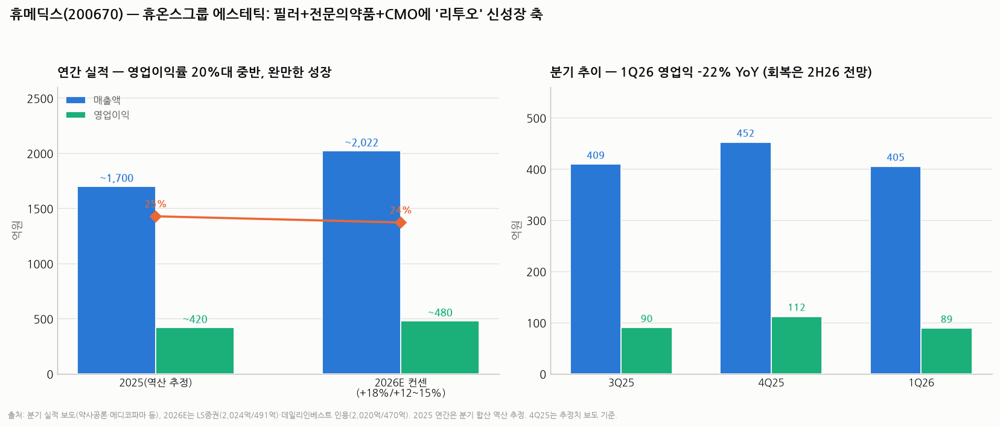

# 휴메딕스(200670) 심층분석 — 휴온스그룹의 에스테틱 병기, 싼 대신 느린 이유

> 작성일: 2026-08-11 · 카테고리: 바이오및제약/종목분석 · 자매편: `파마리서치_심층분석리포트`(같은 날 작성, 비교 섹션 공유)
> **검증 메모**: 분기 실적(3Q25~1Q26)·2026E 컨센(LS증권 2,024억/491억)·목표가(LS 6만, 상상인 5만 하향)·주가(7월 중순 42,200원)는 보도로 교차검증. 2025 연간은 분기 합산 **역산 추정** 표기. 최근(8월) 종가는 검증 가능한 보도가 없어 **미확인** — 7월 중순 수치를 기준으로 썼다.

---

## 0. 아주 쉬운 버전 (여기만 읽어도 됨)

**뭐 하는 회사?** 휴온스그룹 계열의 **히알루론산(HA) 전문 회사**다. HA는 피부·관절에 원래 있는 보습 물질인데, 이걸로 ① **필러**(엘라비에·리볼라인 — 주름 채우는 시술 제품), ② **관절염 주사**(전문의약품), ③ **다른 회사 제품 위탁생산(CMO)**을 한다. 최근엔 ④ 스킨부스터 **'리투오'**를 새 성장축으로 밀고 있다.

**장사는?** 무난하지만 파마리서치 같은 폭발력은 없다. 2025년 매출 약 1,700억·영업이익 약 420억(이익률 25% 안팎, 추정), **2026년 1분기는 영업이익이 -22%로 오히려 후퇴**했다(비용 증가). 증권가는 "회복은 2026년 하반기부터"로 본다. 리투오는 2025년 98억 → 2026년 240~300억으로 크는 중.

**주가는?** 7월 중순 기준 **42,200원**, 시가총액 약 4,400억(추산). 목표가는 LS증권 6만, 상상인 5만(7.3만에서 하향). 대략 **PER 10배 안팎(추산)** — 파마리서치(~18배)의 절반 수준이다.

**한 줄 평**: "싸고 안정적이지만 성장 증명이 필요한" 종목. 리투오와 필러 수출(남미·중동)이 하반기에 숫자로 찍히느냐가 관건.

---

## 1. 사업 구조 — HA 수직계열화 + 그룹 시너지

| 축 | 내용 | 성격 |
|---|---|---|
| 에스테틱 | HA필러 **엘라비에·리볼라인**, 스킨부스터 **리투오**, 리들부스터·에스테필·아르케 등 | 성장축. 수출은 중국 중심 → 남미·중동 확대 중 |
| 전문의약품 | 관절염 주사(하이알 계열) 등 | 캐시카우 — 경기 무관 |
| CMO/CDMO | 점안제·주사제 위탁생산 | 안정 매출 |
| 원료 | HA 원료 자체 생산 | 수직계열화 — 마진 방어 |

특징은 **포트폴리오의 방어력**이다. 에스테틱(경기민감)과 전문의약품·CMO(경기둔감)가 반반이라 파마리서치 같은 급등락 실적이 잘 안 나온다 — 대신 폭발도 없다.

**리투오의 정체(중요)**: ECM(세포외기질) 기반 스킨부스터로, 분기 매출 50억대에 진입한 신성장 동력. 다만 **자체 개발이 아닌 공급받는 상품**(공급사 캐파 확대가 변수로 언급됨)이라 ⓐ 마진이 자체 제품보다 낮고 ⓑ 공급망 협상력 리스크가 있다 — 이 점이 파마리서치(원천기술 보유)와의 근본 차이다.

## 2. 실적 — 정체 후 하반기 회복 스토리

| | 2025(역산 추정) | 2026E(컨센) |
|---|---|---|
| 매출액 | ~1,700억 | 2,020~2,024억 (+18~19%) |
| 영업이익 | ~420억 | 470~491억 (+12~15%) |
| 영업이익률 | ~25% | ~24% |

- 분기: 3Q25 409억/90억 → 4Q25 452억/112억(추정 보도) → **1Q26 405억/89억 — 매출 +1%, 영업익 -22%**
- 1Q 부진 원인: 매출 정체 속 비용(마케팅·인건비) 증가. 순이익(130억)은 금융수익 등으로 오히려 견조
- 회복 논리: ① 리투오 분기 50억대 진입, 2026 연 240~300억 전망 ② 공급사 캐파 확대(상·하반기) 후 영업레버리지 ③ 필러 수출국 확대(남미·중동) — **증거는 2Q~3Q 실적으로 확인해야 하는 단계**

## 3. 주가·밸류에이션

- 주가: 최근 3.9만원대까지 하락 후 **42,200원**(7월 중순 종가 보도 기준. 이후 8월 종가는 미확인)
- 시총 **약 4,400억(추산)** — 2026E 순이익 ~420억 안팎(1Q 순익 130억 페이스 감안) 가정 시 **PER ~10배 안팎(추산)**
- 목표가: LS증권 60,000원(스킨부스터 성장+수익성 개선 논리) · 상상인 50,000원(73,000에서 하향 — "회복은 점진적")
- 해석: 목표가 하향(상상인)과 상향 논리(LS)가 공존 = **시장이 회복 시점을 못 정한 상태**. 밸류가 싸서 하방은 제한적이나, 상방 트리거(실적 반등)가 아직 숫자로 안 나옴

## 4. 파마리서치와 나란히 놓고 보기 (에스테틱 듀오 비교)

| | **파마리서치** | **휴메딕스** |
|---|---|---|
| 핵심 자산 | PDRN/PN 원천기술 + '리쥬란' 브랜드 | HA 수직계열화 + 그룹(휴온스) 인프라 |
| 성장률(2026E 매출) | +25% | +18% |
| 영업이익률 | **40~42%** | ~24% |
| 스킨부스터 지위 | 카테고리 창시자(자체 제품) | 후발 유통·확장(리투오는 공급받는 상품) |
| 수출 | 유럽·아시아+미국 화장품, +47% | 중국 중심 → 남미·중동 확대 시도 |
| 밸류(선행 PER, 추산) | ~18배 | ~10배 |
| 주가 성격 | 기대치 게임(변동성 큼) | 저밸류 방어(트리거 부재) |
| 핵심 리스크 | 경쟁 심화·기대치 하향 | 성장 증명 실패·마진 압박 |

**프레임**: 파마리서치는 "성장의 지속성"에, 휴메딕스는 "회복의 증명"에 베팅하는 종목이다. 손익비 관점(☞ 손익비 스크리닝 리포트)에서는 — 파마리서치는 위·아래 다 크고, 휴메딕스는 하방이 제한적인 대신 상방도 목표가(5~6만, +20~40%) 수준으로 제한적.

## 5. 투자 포인트 vs 리스크

**포인트**
1. 리투오 성장 가시화(분기 50억대) + 캐파 확대 후 영업레버리지
2. 필러 수출 다변화(중국 편중 완화 — 남미·중동)
3. 전문의약품·CMO의 방어력 + HA 원료 수직계열화
4. 낮은 밸류에이션(PER ~10배 추산) — 하방 쿠션

**리스크**
1. **1Q26 영업익 -22%가 보여준 마진 압박** — 회복이 2H26로 밀리거나 무산되면 저밸류가 정당화됨(밸류 트랩)
2. **리투오의 상품 구조** — 공급사 의존(캐파·마진·계약)
3. 국내 필러 경쟁(가격 하락)·중국 수요 둔화
4. 에스테틱 섹터 동반 디레이팅
5. 최근 종가 미확인 상태로 작성 — 매매 전 현재가·최신 공시 확인 필수

## 6. 시나리오 (12개월, 가설)

| | 가정 | 함의 |
|---|---|---|
| Bull | 2Q~3Q 영업익 반등 확인 + 리투오 연 300억 | 목표가 상단 6만(+40%대) 재평가 |
| Base | 2026E 컨센 부합(OP 470~490억) | 4만 중반~5만 — 완만한 리레이팅 |
| Bear | 마진 압박 지속(OP 400억 초반 정체) | 3만원대 회귀 — 밸류 트랩 확정 |

**개인 의견(가설)**: 이 종목의 승부처는 8월 중순 발표될 **2Q26 실적**이다. "회복은 2H26"라는 컨센이 깔려 있어 2Q가 웬만큼 나빠도 하방은 제한적이고, 영업익 반등이 확인되면 저밸류+트리거의 조합이 된다. 파마리서치보다 화끈하진 않지만 손익비는 나쁘지 않은 구간.

---

## 참고 출처 (검증)

- [메디코파마 — 리투오 분기 50억대·2026년 240억 전망](https://www.medicopharma.co.kr/news/articleView.html?idxno=66752)
- [상상인증권 — 목표가 73,000→50,000 하향, "점진적 회복" (2026.6.15)](https://www.newspim.com/news/view/20260615000105)
- [데일리인베스트 — 1Q26 매출 405억·영업익 89억(-22%), 주가 42,200원(7월 중순), LS증권 TP 6만·2026E 2,024억/491억](http://www.dailyinvest.kr/news/articleView.html?idxno=70184)
- [데일리인베스트 — 남미·중동 필러 수출 확대](http://www.dailyinvest.kr/news/articleView.html?idxno=69837)
- [약사공론 — 3Q25 매출 409억·영업익 90억](https://www.kpanews.co.kr/article/show.asp?category=D&idx=265148)
- [이투데이 — 스킨부스터 성장 본격화·수익성 개선 기대](https://www.etoday.co.kr/news/view/2557705)
- [LS증권 리포트 (휴메딕스 IR 게시)](https://humedix.com/web/home.php?field=&go=Emenu_04&go_pds=pds_text_list&mode=&num=2799&pds_num=81&s_memo_2=&s_que=&start=0)

**저장소 연계**: `파마리서치_심층분석리포트`(비교 프레임) · `국내주식_손익비_스크리닝_2026-07`(손익비 방법론)

> 유의: 2025 연간은 분기 합산 역산 추정이며, 시총·PER은 추산. 8월 최신 종가는 미확인 상태로 작성됐으므로 매매 전 현재가·2Q26 공시(8월 중순 예정)를 반드시 확인할 것. 매수 추천이 아니다.
