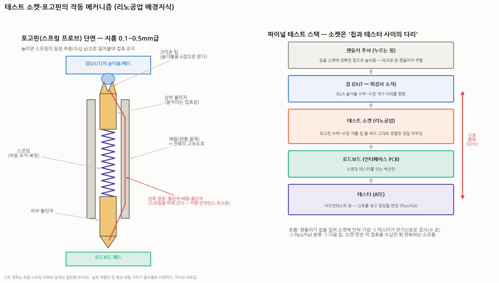

# 테스트 소켓·포고핀의 작동 원리와 종류 — 접촉의 물리학 (리노공업 배경지식편)

> 작성일: 2026-08-18 · 카테고리: 반도체/배경지식 · 시리즈: `리노공업_심층분석리포트`(개요) → `리노공업_심화분석`(해자·밸류) → **본편(작동 메커니즘)**
> 질문: "핀과 소켓이 작동하는 원리, 핀과 소켓의 종류, 그 작업의 메커니즘"
> **검증 메모**: 본편은 표준 전자공학·스프링 프로브 설계의 일반 지식 기반이다(특정 수치는 대표값/일반치 표기). 리노공업 제품 개별 스펙은 비공개가 많아 '업계 일반형' 기준으로 설명하고, 회사 고유 내용은 심화편을 참조.

---

## 0. 아주 쉬운 버전 (여기만 읽어도 됨)

칩 검사의 근본 문제는 이것이다: **"납땜하지 않고, 수천 개의 접점을, 1초 만에, 수십만 번 반복해서, 완벽하게 연결했다 떼는 방법"**.

- 납땜하면 확실하지만 떼어낼 수 없다(검사 후 출하해야 하는데!)
- 그냥 갖다 대면 접촉이 불안정하다(산화막·먼지·높이 오차)

**포고핀이 그 답이다** — 볼펜 심처럼 스프링이 든 초소형 금속 침. 칩을 위에서 누르면 핀이 살짝 눌리면서 스프링이 **일정한 힘(수십 그램)으로 계속 밀어붙여** 확실한 접촉을 만들고, 칩을 들어올리면 원위치로 복원돼 다음 칩을 기다린다. **소켓**은 이런 핀 수백~수천 개를 칩의 단자 배치와 똑같이 정렬해 꽂아둔 '정밀 침대'다.

검사 작업의 흐름: **핸들러(로봇)가 칩을 집어 소켓에 눌러 안착 → 테스터(ATE)가 소켓의 핀들을 통해 전기신호를 넣고 응답 확인(수 초) → 합격/불합격 분류 → 다음 칩** — 이 사이클이 하루 종일 돌고, 핀은 수십만 번 접촉 후 마모되어 교체된다(소모품 매출의 정체).

---

## 1. 포고핀의 해부 — 4개 부품의 물리학

| 부품 | 역할 | 설계 포인트 |
|---|---|---|
| **상부 플런저** | 칩의 솔더볼/패드에 닿는 침 | 팁 형상이 성능의 절반 (아래 §2.1) |
| **스프링** | 눌렸을 때 일정 하중(수십 g/핀)으로 밀어붙임 + 복원 | 하중이 약하면 접촉 불량, 세면 솔더볼 손상 — 수십만 회 후에도 하중이 유지돼야(피로 설계) |
| **배럴(원통 몸체)** | 부품을 담는 케이스이자 **전류의 주 경로** | 정밀 튜브 가공+도금 — 리노가 내재화한 그 공정 |
| **하부 플런저** | 로드보드 패드에 접촉 | 상부와 비대칭 설계 가능 |

**전기적 핵심 — 전류는 스프링으로 흐르지 않는다**: 스프링은 가늘고 길어 저항·인덕턴스가 크다(코일=인덕터). 그래서 잘 만든 포고핀은 플런저가 배럴 내벽에 살짝 기울어 붙으며 **플런저→배럴→플런저의 짧은 경로**로 전류를 보낸다(바이어스 설계). 이 경로 제어가 잘못되면 신호가 스프링으로 새서 고주파 특성이 무너진다 — **포고핀 설계의 제1 노하우**.

**전기 성능 3대 지표** (칩이 고성능일수록 빡빡해짐):
1. **접촉저항** (수십 mΩ 이하 유지) — 커지거나 흔들리면 멀쩡한 칩이 불량 판정(수율 손실)
2. **인덕턴스/대역폭** — 핀이 짧을수록 유리. GHz대 신호가 핀에서 왜곡되면 측정 불가. AI 칩일수록 '짧고 굵은' 핀 요구
3. **허용 전류** — AI 칩은 테스트 중 수백 A급 전력이 흐름 — 전원용 핀은 병렬 배치+대전류 설계

**기계적 3대 지표**: 스트로크(눌리는 깊이 — 칩·볼 높이 편차 흡수), 접촉 하중, 수명(수십만 사이클).

## 2. 종류 — 핀의 종류, 소켓의 종류

### 2.1 팁(끝단) 형상 — 무엇을 찌르느냐가 모양을 정한다

| 팁 | 모양 | 용도 |
|---|---|---|
| **크라운(왕관)** | 끝이 3~4갈래 뾰족 | **BGA 솔더볼용 표준** — 볼의 산화막을 여러 점으로 뚫고 물어 미끄러짐 방지 |
| 스피어(구형)·플랫 | 둥글거나 평평 | 금도금 패드·LGA용 — 패드에 흠집을 내면 안 될 때 |
| 샤프(첨두) | 바늘형 | 미세 패드·특수 |
| 세레이티드 등 | 톱니 | QFN 리드 등 |

### 2.2 핀의 종류 — 용도별 분화

| 핀 종류 | 구조 특징 | 쓰는 곳 |
|---|---|---|
| **표준 신호 핀** | 위 해부도 그대로 | 대부분의 I/O |
| **동축(코액시얼) 핀** | 핀 둘레를 접지 튜브로 감싸 임피던스 정합(50Ω) | RF·mmWave(5G)·초고속 SerDes — 신호 핀 자체가 '초소형 동축케이블' |
| **켈빈(Kelvin) 핀** | 한 단자에 전류용+전압용 **2개 접점** (4-wire 측정) | 접촉저항 자체를 소거하고 정밀 측정 — 전력반도체·정밀 아날로그 |
| **대전류 핀** | 굵은 배럴·다중 접점 | 전원(VDD) 공급 — AI 칩 테스트의 병목 |
| **초미세피치 핀** | 외경 0.1mm대 | 0.35mm 이하 피치 — 가공 난도의 정점, 리노의 '3nm 대응' 영역 |
| (참고) MEMS 핀 | 반도체 공정으로 '깎지 않고 찍어' 만든 마이크로 스프링 | 초미세 영역의 차세대 — 프로브카드에서 먼저 확산 |

### 2.3 소켓의 종류 — 접촉 방식과 용도로 나눈다

**접촉 방식 기준 (시장 구도의 그 구분):**

| | **포고 타입 (리노 주력, 시장 60~70%)** | **러버 타입 (ISC 주력, 15~20%)** |
|---|---|---|
| 원리 | 스프링 핀의 기계적 접촉 | 실리콘 시트에 수직으로 심긴 **금속 입자 기둥**이 눌리며 도통 |
| 신호 경로 | 핀 길이(수 mm) | **0.5mm 이하로 극단적으로 짧음** — 고주파 유리 |
| 수명 | 수십만 회 (핀 개별 교체 가능) | 수만 회 (시트째 교체) |
| 강점 | 내구성·대전류·커스텀 자유도·수리 용이 | 저비용·고주파·솔더볼 손상 적음 |
| 서식지 | **비메모리 R&D·고성능 양산** | **메모리 대량 양산** (같은 칩을 수억 개 테스트) |

**용도 기준:**
- **R&D/엔지니어링 소켓**: 손으로 여닫는 클램셸(조개껍질) 구조 — 칩을 수동으로 넣고 잠금. 소량·긴급·고가. 리노의 본진
- **양산(파이널 테스트) 소켓**: 핸들러가 자동으로 칩을 넣고 누르는 오픈탑 구조 — 내구성·유지보수성이 생명
- **번인(Burn-in) 소켓**: 고온(125°C+) 챔버에서 장시간 스트레스 테스트용 — 열 견딤이 우선, 단가 낮고 수량 많음(마이크로컨텍솔 등의 영역)
- **SLT(시스템 레벨 테스트) 소켓**: 실사용 환경 모사 테스트용 — AI 칩에서 확대 중

## 3. 작업 메커니즘 — 한 개의 칩이 검사되는 60초

1. **셋업**: 신규 칩의 볼맵(단자 배치도)을 받아 소켓 설계 → 핀 종류 선정(신호/전원/RF) → 하우징 가공·핀 삽입 → 로드보드에 장착 (리노의 일: 여기까지)
2. **투입**: 핸들러(☞ 테크윙)가 트레이에서 칩을 진공 픽업 → 소켓 위 정렬(비전 카메라) → **정확한 힘으로 가압** (수천 핀 × 수십 g = 수십 kg의 총하중을 균일하게)
3. **접촉 성립**: 각 핀이 눌리며 스프링 하중으로 솔더볼을 뭄 — 수천 개 접점이 수 mΩ 편차 안에서 동시에 도통
4. **검사**: 테스터(ATE, 어드반테스트 등)가 로드보드→소켓→칩으로 패턴 신호를 넣고 응답 판정 — 로직·메모리·전원·고속 I/O 항목별 수 초
5. **분류**: Pass는 출하 트레이, Fail은 등급별 분류(빈닝) → 다음 칩 투입 — **사이클 타임 수 초, 소켓은 하루 수만 회 접촉**
6. **마모·교체**: 팁 마모·이물 축적으로 접촉저항이 기준을 넘으면 핀 교체(포고의 장점: 낱개 교체) — **여기서 소모품 반복 매출 발생**

**온도 변수**: 차량용·서버용은 -40~150°C 극한 온도 테스트를 병행 — 소켓·핀은 열팽창까지 설계에 반영해야 한다(핸들러의 극저온·고온 챔버와 세트 — 테크윙 리포트 참조).

## 4. 이 메커니즘이 투자 논리로 이어지는 지점 (복습)

1. **칩이 어려워질수록 핀이 어려워진다**: 미세피치(가공)·고주파(동축화)·대전류(전원 핀) — AI 칩은 세 난제를 동시에 요구 → **쓸 수 있는 공급사가 줄고 P(단가)가 오른다** (심화편 §3의 P 상승 논리의 물리적 근거)
2. **신규 칩 1종 = 신규 소켓 설계 1건**: 볼맵이 다르면 소켓을 새로 만들 수밖에 없다 — 커스텀 ASIC 시대에 주문 '건수'가 늘어나는 구조적 이유
3. **소모품 사이클**: 접촉 수십만 회 → 교체 — 반도체 생산량과 동행하는 반복 매출. 장비주와 다른 밸류에이션(퀄리티 컴파운더)을 받는 이유
4. **포고 vs 러버의 서식지**: 대량·단일품종(메모리)은 러버(ISC), 다품종·고성능(비메모리)은 포고(리노) — AI 칩의 고전류·내구성 요구는 포고에 유리한 기울기

---

## 참고

- 본편의 구조·원리는 스프링 프로브/테스트 소켓 업계의 표준 설계 지식(모식도 포함)이며, 수치(하중·수명·저항)는 대표값이다. 리노공업 개별 제품 스펙은 회사 카탈로그 기준으로 상이할 수 있다.
- 시장 구도(포고 60~70% vs 러버 15~20%)·경쟁사 검증: `리노공업_심화분석` 참고 출처(KIPOST·디일렉 등)

**저장소 연계**: `리노공업_심층분석리포트`(개요) · `리노공업_심화분석_기술해자_매출구조_PQ_밸류히스토리`(해자·밸류) · `HBM_주요공정_원리효과_회사별세대별`(KGD/KGSD 테스트의 위치) · `테크윙`(장비소재지도 ⑤ — 핸들러) · `한미반도체_심층분석리포트`(프로브카드 — 웨이퍼 레벨과의 구분)

> 유의: 교육용 배경지식 리포트로 투자 판단 자료가 아니다. 실제 제품 설계는 업체·용도별로 본 모식도와 다를 수 있다.
