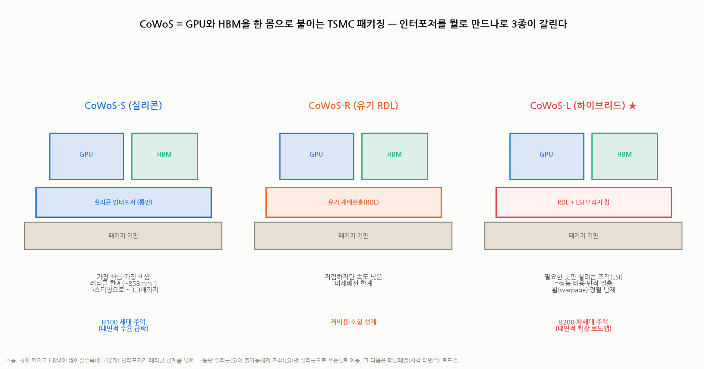
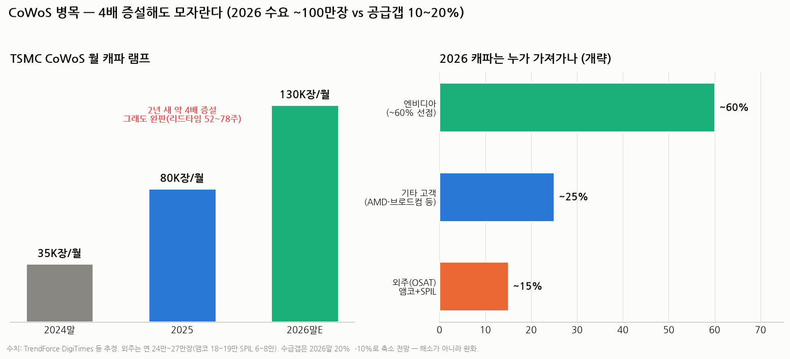

# CoWoS·첨단 패키징 병목 완전 해부 — "HBM을 만들어도 붙일 자리가 없다" (HBM 심화 ④)

> 작성일: 2026-07-30 · 카테고리: 반도체/산업·테마분석 · HBM 시리즈(완전정복→커스텀→대체위협)의 4편
> 질문: AI 가속기 공급량을 실질적으로 결정하는 병목이 GPU도 HBM도 아닌 **패키징(CoWoS)**이라는데, 그게 정확히 뭐고 왜 병목이며 언제 풀리나.
> **검증 메모**: 캐파(35K→130K wpm)·완판·리드타임(52~78주)·엔비디아 60% 선점·외주(앰코·SPIL) 수치를 TrendForce·DigiTimes 등으로 교차검증. 배분 비율은 개략 추정 표기.

---

## 0. 한 문장 요약

> **CoWoS = GPU와 HBM을 한 몸으로 붙이는 TSMC의 첨단 패키징 공정.** 칩과 메모리를 아무리 만들어도 이 '붙이는 공정'을 못 거치면 AI 가속기가 안 나온다. TSMC가 **2년 새 캐파를 4배(월 3.5만→13만 장)** 늘렸는데도 **완판(리드타임 52~78주)**이고 엔비디아가 60%를 선점했다. 수급갭은 2026년 말 20%→10%로 **완화되지만 해소는 아니며**, 다음 무대는 CoWoS-L 대면적·패널레벨이다.

---

## 1. CoWoS가 뭔가 — '붙이는 공정'이 왜 존재하나

### 1.1 문제의 출발: GPU와 HBM은 따로 만들어진다
GPU 다이(TSMC 로직 팹)와 HBM 스택(SK하이닉스·삼성·마이크론)은 **서로 다른 공장에서** 나온다. 이 둘을 **초고밀도 배선으로 한 몸처럼** 이어야 HBM의 1,024~2,048개 배선이 의미를 가진다(☞ HBM 완전정복 3장). 일반 기판(PCB)엔 그 밀도의 배선을 새길 수 없다.

### 1.2 해법: 인터포저 위에서 결혼시킨다
**CoWoS(Chip-on-Wafer-on-Substrate)** = ① 칩들을 **인터포저(초미세 배선 깔판)** 위에 올리고(Chip on Wafer) ② 그 전체를 패키지 기판에 얹는(on Substrate) TSMC 공정. 결과물이 우리가 아는 'H100/B200 한 개'다.

- 비유: GPU와 HBM은 각자 완성된 **신랑·신부**, CoWoS는 둘을 한 집에 살게 만드는 **결혼식장**. 식장이 꽉 차면 아무리 커플이 많아도 결혼(=가속기 출하)을 못 한다.

### 1.3 CoWoS 3종 — 인터포저를 뭘로 만드나

| 종류 | 인터포저 | 특성 | 쓰임 |
|---|---|---|---|
| **CoWoS-S** | **실리콘 통판** | 가장 빠름·가장 비쌈. **레티클 한계(~858mm²)** → 스티칭으로 ~3.3배(~2,700mm²)까지 확장하나 수율 급락 | H100 세대 주력 |
| **CoWoS-R** | 유기 재배선층(RDL) | 저렴하나 배선 밀도·속도 낮음 | 저비용 설계 |
| **CoWoS-L** ★ | **RDL + LSI 브리지**(필요한 곳만 실리콘 조각) | 성능·비용·면적의 절충. **휨(warpage)·정렬이 난제** | **B200·차세대 주력** |

**왜 S→L로 넘어가나 (핵심 논리)**: 칩이 커지고 HBM 개수가 8→12개로 늘면 인터포저 면적이 **노광 1회 면적(레티클)의 몇 배**로 커진다. 통판 실리콘(S)은 이 크기에서 수율·비용이 무너진다 → **배선이 꼭 필요한 자리에만 실리콘 조각(LSI 브리지)을 심고 나머지는 싼 RDL로** 채우는 L이 답. 그 다음 로드맵이 **패널레벨 패키징**(둥근 웨이퍼 대신 큰 사각 패널에서 작업 — 면적 제약 완화·장당 생산량↑)이다.

---

## 2. 왜 병목인가 — 숫자로 보는 수급

- **캐파**: 2024년 말 월 **3.5만 장** → 2025 ~8만 → **2026년 말 12만~14만 장**(약 4배 증설).
- **그래도 완판**: CoWoS-S·L 모두 풀부킹, **리드타임 52~78주**(주문하고 1~1.5년 대기).
- **수요**: 2026년 총수요 **약 100만 장** 추정 — 공급이 다 차도 **갭 20%(2026 초) → 10%(2026 말)**. **완화지만 해소가 아니다.**
- **엔비디아가 약 60%(~59.5만 장) 선점**, 2026~27 증설분의 절반 이상도 선예약 — 후발 주자(AMD·브로드컴 ASIC 고객)는 남는 캐파를 다툰다.
- **외주 개방**: TSMC가 연 **24만~27만 장을 OSAT(외주 패키징 업체)로** — **앰코(Amkor) 18~19만 장, SPIL 6~8만 장**. 패키징 밸류가 TSMC 담장 밖으로 흐르기 시작했다는 중요 신호.

**왜 빨리 못 늘리나 (변압기와 같은 구조)**: ① 전용 팹·장비(본더·몰딩·검사)의 리드타임, ② CoWoS-L의 휨·정렬 등 공정 난도(램프에 시간), ③ 인터포저·기판 등 자재 동반 병목, ④ TSMC 입장에선 선단 로직(2nm)과 자본 배분 경쟁.

---

## 3. 병목의 함의 — 누가 목줄을 쥐나

1. **AI 가속기 출하의 실질 상한 = CoWoS 캐파.** GPU 다이·HBM이 남아도 패키징 슬롯이 없으면 출하가 안 된다. 2026년 엔비디아 공급 능력을 읽으려면 웨이퍼보다 **CoWoS 배분표**를 봐야 한다.
2. **TSMC의 이중 지배**: 선단 로직(칩)과 패키징(조립)을 모두 쥐며 AI 하드웨어의 **양쪽 관문**을 통제. 커스텀 HBM 시대(베이스다이 TSMC)까지 오면 삼중 지배.
3. **삼성의 기회이자 숙제**: 삼성은 파운드리+메모리+패키징 턴키(☞ 커스텀HBM편)로 "CoWoS 줄 안 서도 된다"를 세일즈 포인트로 삼는다. TSMC 병목이 심할수록 삼성 턴키의 상대 매력이 오른다.
4. **OSAT 낙수**: 앰코·SPIL로의 외주 개방은 패키징 후공정 생태계 전반(장비·소재 포함)에 물량이 퍼지는 신호. 앰코는 한국에 주요 생산기지를 두고 있어 국내 후공정 체인과도 연결된다.
5. **해소 시그널 추적**: ① 리드타임 52~78주의 단축 여부, ② 수급갭 10% 이하 진입, ③ CoWoS-L 수율 안정 소식, ④ 패널레벨 양산 시점. — 이 병목이 풀리는 순간이 역설적으로 **"AI 가속기 공급과잉 논쟁"의 시작점**일 수 있다(변압기 ASP 피크아웃 논리와 동일).

---

## 4. HBM 시리즈와의 연결 (한 장 정리)

| 병목 | 무엇 | 상태 | 시리즈 |
|---|---|---|---|
| HBM 자체 | D램 적층·수율 | 3사 증설 중, LTA 매진 | 완전정복·커스텀 |
| **CoWoS(본편)** | GPU+HBM 접합 캐파 | **4배 증설에도 완판, 갭 10~20%** | 심화④ |
| MLB(보드) | 칩이 얹힐 큰 판 | TTM·이수 듀오폴리 풀캐파 | 이수페타시스 시리즈 |
| 전력 | 데이터센터 전기 | 변압기·발전 3~15년 | 전력병목 시리즈 |

> AI 인프라는 **"칩 → 접합(CoWoS) → 보드(MLB) → 전력"** 네 관문이 직렬로 연결된 사슬이고, 각 관문마다 과점 공급자가 목줄을 쥔다. 이 저장소의 병목 시리즈가 이제 네 관문을 모두 커버한다.

---

## 참고 출처 (검증)

- [CoWoS 수급갭 20%→10% 축소 전망 (TrendForce)](https://www.trendforce.com/news/2026/06/15/news-tsmc-cowos-supply-demand-gap-reportedly-seen-narrowing-from-20-to-10-by-end-2026-as-capacity-expands/)
- [엔비디아 2026-27 증설분 절반 이상 선점 (DigiTimes)](https://www.digitimes.com/news/a20251210PD218/tsmc-cowos-capacity-nvidia-equipment.html)
- [캐파 35K→130K wpm·외주 앰코/SPIL (GlobalSemiResearch 등)](https://globalsemiresearch.substack.com/p/tsmcs-cowos-capacity-scaling-up-outsourcing)
- [2026 수요 ~100만장·완판·리드타임 (Silicon Analysts)](https://siliconanalysts.com/analysis/foundry-allocation-status-q1-2026)
- [CoWoS-S/R/L 구조 차이·레티클 3.3배 (SemiHub/aminext)](https://semihub.io/blog/cowos-guide-2.html)
- [B200의 CoWoS-L 채택·칩렛 (KIPOST)](https://www.kipost.net/news/articleView.html?idxno=317419)

**저장소 연계**: `HBM_완전정복`(인터포저 개념) · `커스텀HBM`(삼성 턴키 논리) · `이수페타시스 시리즈`(다음 관문 MLB) · `전력병목 시리즈`(최종 관문)

> 유의: 캐파·배분·수요 수치는 기관 추정이며 발표마다 편차가 있다(120~140K 등). 배분 비율 차트는 개략치. 확정치는 TSMC 실적 발표·공식 자료로 재확인 권장.
