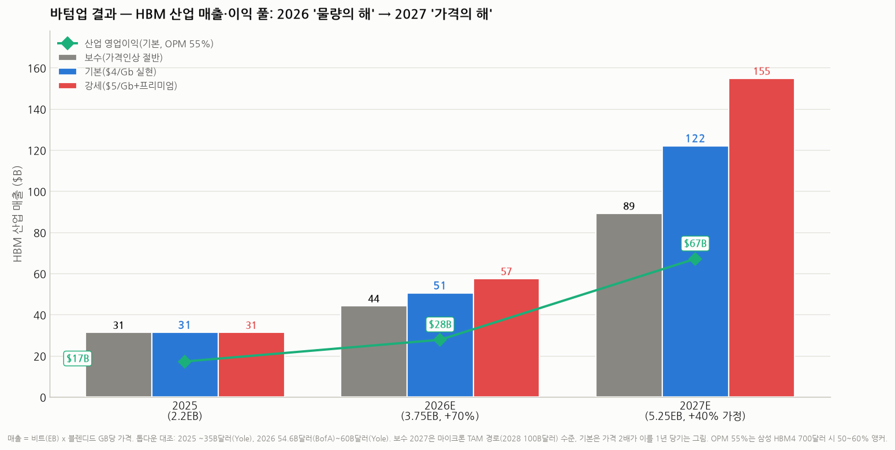

# HBM 바텀업 모델 — 버전별 가격은 얼마고, 매출·이익은 얼마가 되나 (HBM 심화 ⑦)

> 작성일: 2026-08-05 · 카테고리: 반도체/산업·테마분석 · HBM 시리즈 7편(완전정복→커스텀→대체위협→CoWoS→장비소재지도→적층공정→본편)
> 질문: "바텀업 관점에서 HBM이 버전별로 가격이 얼마나 될 것 같고, 이를 통해 얼마의 매출과 이익을 기대할 수 있을까?"
> **검증 메모**: 가격·물량 앵커는 전부 출처를 병기했고(§2), 모델의 **가정(믹스 비중, 2027 물량 +40%, 영업이익률 55%)은 가정이라고 명시**했다. 바텀업 계산 결과를 톱다운 기관 전망(Yole·BofA·마이크론 TAM)과 **양방향 대조**해 크게 어긋나지 않음을 확인했다(§5). 초안에서 2026년 중반 스팟가($300/스택)를 연평균 계약가처럼 쓰는 오류를 발견해 **계약가 기준으로 재보정**했다.

---

## 0. 아주 쉬운 버전 (여기만 읽어도 됨)

**HBM 가격을 아파트 월세에 비유하면**: HBM3E(지금 주력)는 "구축 아파트"라 월세가 내려가는 중이고, HBM4(올해 새로 나온 것)는 "신축 역세권"이라 월세가 구축의 **약 2배**다. 그리고 2027년엔 신축 월세를 **또 2배로 올리겠다**는 얘기(공급사 협상)가 나오는 상황이다.

숫자로 요약하면:

| | 지금 얼마? | 내년(2027) 얼마? |
|---|---|---|
| **HBM3E 한 개(36GB 스택)** | 스팟(즉시구매) 기준 약 **$300** (2025년 계약가는 ~$500이었음 — 내려가는 중) | 더 하락 (구세대가 되므로) |
| **HBM4 한 개(36GB 스택)** | 약 **$500~700** (삼성이 $700을 요구 중) | **$1,150~1,450**? (Gb당 $4~5 보도 기준 — 협상 중, 확정 아님) |

이걸로 산업 전체 매출을 계산하면(판매량 × 개당 가격):

- **2025년: 약 $31~35B(310~350억 달러)** — 실제 기관 추정과 비슷
- **2026년: 약 $44~57B** — 물량이 +70% 늘어나는 "**물량의 해**"
- **2027년: 약 $89~155B** — 가격 인상이 얼마나 실현되느냐에 따라 갈리는 "**가격의 해**". 인상이 절반만 되면 $89B, 보도대로 2배가 되면 $122B+

이익은? HBM은 마진(이익률)이 매우 높다. 영업이익률 55%로 잡으면 **2027년 산업 전체 영업이익이 약 $67B(기본 시나리오)** — 2025년($17B)의 **4배**가 된다. 3사(SK하이닉스·삼성·마이크론)가 나눠 갖는 파이가 이만큼 커진다는 뜻이다.

**단, 조심할 것 한 가지**: "물량 +40~50%"와 "가격 2배"가 **동시에 다 실현되기는 어렵다**(사는 쪽인 엔비디아·구글도 협상을 하니까). 그래서 강세 시나리오($155B)는 참고만 하고, 현실적 범위는 **$90~120B**로 보는 게 안전하다.

---

## 1. 왜 바텀업인가 — 계산 구조

**바텀업(bottom-up)** = 아래(개당 가격 × 판매량)에서 위(산업 매출)로 쌓아 올리는 방식. 애널리스트가 "시장이 $60B가 될 것"이라고 말하는 톱다운과 반대다. 바텀업의 장점은 **어떤 가정이 숫자를 움직이는지**가 투명하게 보인다는 것.

```
산업 매출 = 총 판매 용량(EB, 엑사바이트) × 평균 판매가격($/GB)
  - 총 판매 용량 = GPU 판매량 × GPU당 HBM 탑재량 (의 총합)
  - 평균 가격 = 세대별 가격을 세대 믹스(HBM3E 몇 %, HBM4 몇 %)로 가중평균
산업 영업이익 = 매출 × 영업이익률(OPM)
```

단위 정리(혼동 주의): **1 GB = 8 Gb**(바이트 vs 비트), **1 EB(엑사바이트) = 10억 GB**. 업계 보도는 $/Gb(비트당)와 $/GB(바이트당)를 섞어 쓰는데, 이 리포트는 **$/GB로 통일**한다. 36GB 스택 = 288Gb이므로 "Gb당 $4" = "GB당 $32" = "스택당 $1,150"이다.

---

## 2. 검증된 앵커 — 버전별 가격 (출처 병기)


| 항목 | 수치 | 출처·비고 |
|---|---|---|
| HBM3E 12단 36GB, 2025 계약가 | 스택당 ~$500 (8단 24GB는 ~$360) | 2024~25 업계 보도 종합. GB당 ~$14~15 |
| HBM3E 12단 36GB, 2026.7 스팟 | 스택당 **~$300** (GB당 $8.3) | Silicon Analysts (2026.7) — 구세대화로 하락 중 |
| HBM4 12단 36GB, 2026 시장가 | 스택당 **~$500** (GB당 $13.9) | 시장 보도 종합 — HBM3E보다 ~60~70% 비쌈 |
| HBM4, 삼성 요구가 | 스택당 **~$700** (GB당 $19.4) | Bloomberg/AOL — 이 가격이면 영업이익률 50~60% 함의 |
| HBM4 2027 계약 협상 | **Gb당 $4~5** (GB당 $32~40, 스택당 $1,150~1,450) | 서울경제 "HBM4 Prices to Double"(2H26 $2/Gb → 2027 $4~5/Gb), TrendForce "2027 계약가 수 배 상승" — **협상 중, 확정 아님** |
| 엔비디아향 HBM4 프리미엄 | 최대 +100% 인상 논의 | 언론 보도 — 대형 고객일수록 협상력으로 일부 상쇄 예상 |

**한 줄 해석**: 반도체는 원래 "신제품 나오면 구제품 가격 폭락"인데, HBM은 **신세대가 나올 때마다 신세대 가격이 더 크게 뛰어** 평균 가격이 계속 오르는 특이한 시장이다(제품이 아니라 '세대'가 프리미엄을 만든다 — ☞ 커스텀HBM 리포트의 'ASIC화' 논리와 연결).

### 물량 앵커

| 항목 | 수치 | 출처·비고 |
|---|---|---|
| HBM 수요 성장률 | 2025 **+130%** → 2026 **+70%** YoY | TrendForce |
| 2026 출하량 | **30B Gb 이상 = 약 3.75EB** | TrendForce (2026 전망) |
| 2025 출하량 | 약 2.2EB | 위 수치에서 +70% 역산 (추정) |
| 2027 출하량 | 약 5.25EB (**+40% — 가정**) | 성장 둔화 추세(130→70→40%) 연장. 검증된 전망치 아님 |
| GPU당 탑재량 | B200 192GB → Rubin 288GB → Rubin Ultra 384GB(2027) | 엔비디아 로드맵 (기존 리포트에서 검증) |
| 세대 믹스 | 2H26에 HBM4가 HBM3E 역전 | TrendForce. 연간 비중은 모델 가정(아래) |

---

## 3. 모델 — 가정 전부 공개

| 가정 | 2025 | 2026E | 2027E | 성격 |
|---|---|---|---|---|
| 물량(EB) | 2.2 | 3.75 | 5.25 | 25~26은 앵커 기반, **27은 가정** |
| 믹스: HBM3(구형) | 15% | — | — | 추정 |
| 믹스: HBM3E | 85% | 55% | 25% | **가정** (2H26 역전 앵커에 정합) |
| 믹스: HBM4 | 0% | 45% | 75% | **가정** |
| 영업이익률(OPM) | 55% | 55% | 55% | 삼성 HBM4 $700 시 50~60% 앵커의 중간값. **가정** |

가격 시나리오($/GB — 세대별 연평균 계약가 기준):

| 시나리오 | 2026 HBM3E / HBM4 | 2027 HBM3E / HBM4 | 의미 |
|---|---|---|---|
| **보수** | $10 / $14 | $8 / **$20** | 2027 인상이 절반만 실현 (마이크론 TAM 경로 수준) |
| **기본** | $11 / $16.5 | $9 / **$28** | 인상 ~70% 실현 (Gb당 $3.5 부근) |
| **강세** | $12 / $19.4(삼성 $700) | $10 / **$36** | Gb당 $4.5~5 + 삼성 요구가 관철 |

---

## 4. 결과 — 매출과 이익



**산업 매출($B):**

| | 2025 | 2026E | 2027E |
|---|---|---|---|
| 보수 | 31 | 44 | **89** |
| **기본** | 31 | **51** | **122** |
| 강세 | 31 | 57 | 155 |

**산업 영업이익($B, OPM 55% 가정):**

| | 2025 | 2026E | 2027E |
|---|---|---|---|
| 보수 | 17 | 24 | 49 |
| **기본** | 17 | **28** | **67** |
| 강세 | 17 | 32 | 85 |

**읽는 법**:
- **2026은 '물량의 해'** — 시나리오 간 격차가 작다($44~57B). 가격보다 +70% 물량이 매출을 끌고 간다. 이 해의 관전 포인트는 가격 협상보다 **캐파 증설과 수율**.
- **2027은 '가격의 해'** — 격차가 확 벌어진다($89~155B). **HBM4 계약가 협상 하나가 산업 매출 $30~60B를 좌우**한다. 2026년 말~2027년 초에 나올 계약가 뉴스가 3사 주가의 최대 변수라는 뜻.
- 기본 시나리오 기준 **영업이익 풀이 2년 만에 $17B → $67B로 4배**. 이 파이를 SK하이닉스(점유 1위)·삼성·마이크론이 나눈다. 점유율을 대략 5:2.5:2.5로 두면 SK 몫만 **연 $30B(약 40조 원대)** 규모의 영업이익이 HBM 한 품목에서 나온다는 계산 — 다만 **점유율 배분은 별도 검증이 필요한 추정**이므로 참고만.

---

## 5. 크로스체크 — 이 숫자가 말이 되나 (양방향 검증)

바텀업 숫자는 반드시 독립적인 톱다운 숫자와 맞춰봐야 한다. 세 가지로 대조했다:

1. **기관 전망과 대조**: 2025 모델값 $31B vs **Yole ~$35B** (오차 -10% — 모델이 약간 보수적). 2026 기본 $51B vs **BofA $54.6B, Yole ~$60B** (기본~강세 사이). ✅ 정합
2. **마이크론 TAM 경로와 대조**: 마이크론은 TAM(전체 시장)을 **2025 $35B → 2028 $100B**로 제시했다. 모델의 보수 2027($89B)은 이 경로 위에 있고, 기본($122B)은 "**가격 2배가 TAM $100B 도달을 1년 앞당긴다**"는 그림이다. 강세($155B)는 경로를 크게 이탈 — 그래서 참고용. ✅ 구조 이해에 부합
3. **GPU 한 대 기준 상향 검산**: Rubin 288GB = 36GB 스택 × 8개. HBM4 $500~700/스택이면 **GPU 한 대에 HBM만 $4,000~5,600**. 2027 강세 가격($1,150+)이면 스택 8개 = **$9,000+/GPU** — GPU 판가(3~5만 달러 추정)의 20~30%까지 올라간다. 이러면 엔비디아가 탑재량을 줄이거나(HBF·GDDR7 계층화 — ☞ 대체위협 리포트) 협상으로 깎을 유인이 커진다. **강세 시나리오가 자기모순을 갖는 이유**가 바텀업으로 보인다. ✅

**핵심 통찰(바텀업이 가르쳐주는 것)**: "물량 +40%"와 "가격 2배"는 **곱해지는 항이라 동시 실현이 어렵다**. 가격이 2배가 되면 수요(탑재량·주문량)가 깎이고, 물량이 다 나가려면 가격을 양보해야 한다. 그래서 현실적 착지점은 보수~기본 사이(**2027 매출 $90~120B, 영업이익 $50~67B**)로 보는 게 합리적이다.

---

## 6. 리스크 — 이 모델이 틀리는 경우

| 리스크 | 어느 가정이 깨지나 | 결과 |
|---|---|---|
| 2027 가격 협상 무산 (빅테크 반발·수요 둔화) | 기본→보수 이하 | 매출 $89B 밑으로. 다만 이 경우도 2025의 3배 |
| AI 캐펙스 사이클 꺾임 | 물량 +40% 가정 붕괴 | 물량·가격 동시 하락 — 최악 조합 (☞ 메모리 급락 리포트의 베어 논리) |
| 삼성 캐파 공격 증설 → 공급과잉 | 가격 시나리오 전체 하향 | HBM도 '커머디티화' — PBR 밸류에이션으로 회귀 |
| HBF·GDDR7 계층 분화 가속 | GPU당 HBM 탑재량 성장 둔화 | 물량 성장 하향 (☞ 대체위협 리포트) |
| 환율·OPM 가정 | OPM 55%는 HBM4 프리미엄 실현 전제 | 가격 하락 시 OPM 40%대로 — 이익 즉시 -25% |

---

## 참고 출처 (검증)

- [TrendForce — HBM 수요 2025 +130% → 2026 +70%, 2026 출하 30B Gb+, 2H26 HBM4 역전](https://www.trendforce.com/presscenter/news/20251113-12780.html)
- Yole Group — HBM 매출 2025 ~$35B → 2026 ~$60B (+70%)
- 뱅크오브아메리카(BofA) — 2026 HBM 시장 $54.6B (+58%) (테크월드 등 보도)
- Silicon Analysts (2026.7) — HBM3E 36GB 스팟 ~$300
- Bloomberg/AOL — 삼성 HBM4 ~$700 요구, 영업이익률 50~60% 함의
- [서울경제 — "HBM4 Prices to Double": 2H26 $2/Gb → 2027 $4~5/Gb](https://www.sedaily.com/)
- 마이크론 — HBM TAM 2025 $35B → 2028 $100B (실적 콜)
- 엔비디아 로드맵 — Rubin 288GB(HBM4 8스택)·Rubin Ultra 384GB (기존 리포트 검증치)

**저장소 연계**: `HBM_완전정복`(세대 스펙) · `커스텀HBM_메모리의ASIC화`(가격 결정 구조 변화) · `HBM_대체위협`(탑재량 리스크) · `CoWoS_첨단패키징병목`(물량 제약) · `메모리수요_구조적인가_사이클인가`(PER vs PBR)

> 유의: 이 모델은 산업 '파이 크기' 추정이지 특정 종목의 실적 전망이 아니다. 3사 점유율·개별 원가는 비공개라 종목별 환산에는 추가 가정이 필요하다. 2027 가격은 협상 중인 수치로, 확정 계약가 뉴스가 나오면 이 리포트를 갱신해야 한다.
