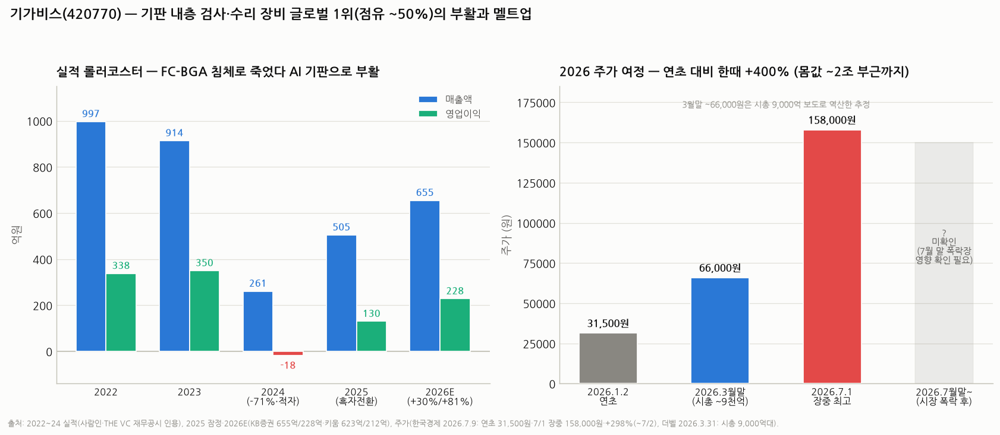

# 기가비스(420770) 심층분석 — 기판을 '검사하고 고치는' 글로벌 1위, 부활과 멜트업 사이

> 작성일: 2026-08-12 · 카테고리: 반도체/종목분석
> **검증 메모**: 연간 실적(2022 997억/338억 → 2024 261억/적자 18억)은 재무공시 인용 자료로, 2025(505억/130억 잠정)·2026E(KB 655억/228억·키움 623억/212억)는 증권사 추정으로 검증. 주가는 한국경제(2026.7.9) 보도 기준 — 연초 31,500원·7/1 장중 158,000원. **7월 말 시장 폭락(코스피 -33%) 이후 현재가는 검증 가능한 보도가 없어 미확인** — 매매 전 필히 확인. 3월 말 주가 ~66,000원은 시총 9,000억 보도(더벨)로 역산한 추정치다.

---

## 0. 아주 쉬운 버전 (여기만 읽어도 됨)

**뭐 하는 회사?** 반도체 기판(칩 아래 깔리는 초정밀 회로판, ☞ 이수페타시스 시리즈의 'substrate')을 만들 때, **회로에 불량이 없는지 카메라로 검사(AOI)하고, 불량이 있으면 레이저로 고치는(AOR) 장비**를 만든다. 검사기는 여러 회사가 만들지만 **"고치는 장비"까지 같이 파는 회사는 사실상 기가비스뿐** — 기판사 입장에선 불량 기판을 버리는 대신 살려내니 수율이 곧 돈이다. 글로벌 점유율 **~50%**(FC-BGA 내층 검사 기준).

**최근 스토리가 드라마다:**
- 2022~23년: 매출 900억~1,000억, 영업이익률 35%+의 알짜 (2023.5 상장)
- **2024년: 매출 -71%(261억), 적자 전환** — 전방(FC-BGA 기판)이 재고 침체로 발주를 끊음. 장비주의 숙명
- 2025년: 흑자 전환(~505억/130억) — AI 서버용 기판 투자 재개
- **2026년: 주가가 연초 31,500원 → 7월 초 장중 158,000원 (+400%)** — 실적 회복에 유리기판·PLP 테마가 붙으며 몸값이 한때 2조 부근까지

**한 줄 평**: 사업은 진짜다(독점적 지위+전방 투자 사이클 회복). 다만 **매출 655억(전망) 회사가 시총 1.5~2조를 받으면 그건 실적이 아니라 '유리기판 테마'의 가격**이다. 7월 폭락장 이후 현재가부터 확인하고 접근할 종목.

---

## 1. 사업 — 왜 독점적인가 (AOI + AOR)

| 장비 | 하는 일 | 원리 | 경쟁 강도 |
|---|---|---|---|
| **AOI** (자동광학검사) | 기판 **내층 회로**의 단선·쇼트·이물 검출 | 고해상 광학계+이미지 처리로 설계 데이터와 비교 | 경쟁 존재 (글로벌 수 개사) |
| **AOR** (자동광학수리) | 검출된 불량을 **레이저로 절삭·복원** | 초정밀 레이저 가공 | **사실상 단독** — 기가비스의 해자 |
| In-Line FA | 검사→수리를 한 라인에 묶은 자동화 설비 | AOI+AOR 통합 | 판가·마진이 단품보다 높음 (화성 2공장 축) |

**왜 수리가 해자인가**: FC-BGA 고층 기판은 내층 하나 불량이면 완성 후 폐기다(적층 후엔 못 고침). 층이 늘수록(AI 서버용 20층+) 폐기 비용이 커져 **"검사만"보다 "검사+수리"의 경제성이 압도적**이 된다 — AI 기판 고층화가 곧 기가비스 장비의 ROI를 올리는 구조. 고객은 국내외 대형 기판사(삼성전기·일본·대만·중국계 등 — 개별 고객명 비중은 비공개).

## 2. 실적 — 롤러코스터의 해부

| | 2022 | 2023 | 2024 | 2025(잠정) | 2026E |
|---|---|---|---|---|---|
| 매출 | 997억 | 914억 | **261억 (-71%)** | ~505억 | 623~655억 |
| 영업이익 | 338억 | 350억 | **-18억 (적자)** | ~130억 | 212~228억 |
| OPM | 34% | 38% | 적자 | ~26% | ~34% |

- **2024년 붕괴의 원인**: 장비 매출은 전방 캐파 투자의 함수다. FC-BGA 기판 업계가 2022년 과잉 증설 → 2023~24년 재고 침체로 발주 동결 → 장비사 매출이 소멸. **회사 문제가 아니라 사이클 문제**였다는 게 중요하다(제품 경쟁력·점유율은 유지)
- **2025~26 회복의 동력**: ① AI 서버용 FC-BGA 투자 재개(수주·출하 일정이 당초 계획보다 앞당겨짐) ② 판가 높은 In-Line FA 비중 확대 ③ **화성 2공장 2026 상반기 준공**(캐파 병목 해소)
- **수주 증거(공시)**: 2026년 7월에만 한국 기판사 100억(전년 매출의 19%) + 중국 기판사 151억(28.9%) — **한 달 수주가 작년 매출의 절반**. 장비주에서 수주 공시는 실적의 선행지표다

## 3. 성장 스토리 — 실적 위에 얹힌 두 개의 테마

1. **유리기판(TGV)**: 회사는 "유리기판용 장비 공급 준비 완료"라고 밝힌 상태. 유리기판은 유리를 관통하는 비아(TGV) 등 신공정이라 **검사 장비도 새로 깔아야 한다** — 상용화되면 신규 시장. 단, 유리기판 자체가 아직 파일럿 단계(양산 시점 불확실)라 **매출 0인 옵션값**이다.
2. **PLP(패널 레벨 패키징)**: 거래업체 개발 프로젝트에 **단독 참여** 중이라고 밝힘(연내 결정 전망). 웨이퍼 대신 대면적 패널로 패키징하는 차세대 흐름(☞ CoWoS 리포트의 대면적화 논리)에서 검사 수요가 커진다.

이 둘이 2026년 멜트업(+400%)의 실질적 연료였다 — **실적(655억)만으로는 설명 안 되는 상승분은 전부 이 옵션의 가격**이다.

## 4. 밸류에이션 — 냉정하게

- 시총 궤적: 3월 말 **~9,000억**(더벨) → 7/1 장중 최고가 기준 **~2조 부근**(추산) → 7월 말 폭락장 이후 **미확인**
- 2026E 기준: 영업이익 ~228억, 순이익 ~200억+@(순현금 이자수익 — IPO·이익 누적으로 현금성 자산이 두꺼운 회사로 알려짐, 규모는 공시 확인 필요)
- **시총 9,000억이면 선행 PER ~40배대, 1.5~2조면 70~100배** — 장비 섹터(한미반도체 등 고성장 장비주)와 비교해도 최상단. PSR로는 15~30배
- 정당화 논리: "2027년 유리기판·PLP가 개화하면 매출 레벨이 다시 1,000억+로 점프한다"는 선반영. 반박 논리: 그 개화 시점은 회사가 아니라 **전방(삼성전기·인텔 등)의 의사결정**에 달려 있다

## 5. 리스크

1. **밸류에이션 되돌림** — 테마(유리기판) 일정이 밀리면 실적(655억)만 남는다. +400% 오른 주식의 되돌림은 깊다 (7월 말 폭락장에서 이미 시작됐을 가능성 — 현재가 미확인)
2. **장비주 매출 변동성** — 2024년(-71%)이 보여준 본질. 수주 공백 분기가 언제든 나올 수 있다
3. **고객·지역 집중** — 중국 매출 비중 확대(7월 수주 151억)는 성장이자 지정학 리스크
4. **경쟁 진입** — AOR 단독 지위가 영원하다는 보장 없음(검사 대형사들의 확장 가능성)
5. **유리기판의 근본 불확실성** — 유리기판 자체가 "부활 대기 중 테마"다. 상용화가 2028+로 밀리면 옵션값 소멸

## 6. 시나리오 (12개월, 가설)

| | 가정 | 함의 |
|---|---|---|
| Bull | PLP 단독 프로젝트 수주 확정 + 유리기판 파일럿 장비 매출 개시 | 매출 가이던스 상향 — 멜트업 재개 |
| Base | 2026E 컨센 부합(655억/228억), 테마는 대기 | 시총 8,000억~1.2조 박스 — 수주 공시 따라 등락 |
| Bear | FC-BGA 발주 재둔화 + 유리기판 지연 확인 | 2024년 학습효과로 급락 — 실적 기반 밸류(PER 25배 = 시총 ~5,000억)까지 열림 |

**개인 의견(가설)**: 이 회사의 **사업 자체는 기판 사이클의 필수 인프라**라 길게 보면 우상향 논리가 선다(AI 기판 고층화 = 검사·수리 ROI 상승). 문제는 가격이다 — 연초처럼 실적 회복이 덜 반영된 구간은 손익비가 좋았지만, +400% 멜트업 이후는 "테마가 실적으로 바뀌는 속도"가 주가를 결정한다. **7월 폭락으로 되돌림이 나왔다면 오히려 다시 볼 기회**일 수 있으니, 현재가·최근 수주 공시부터 확인할 것. 관전 포인트는 ① 분기 수주 공시 빈도 ② PLP 프로젝트 결정(연내) ③ 유리기판 고객사 파일럿 뉴스 세 가지다.

---

## 참고 출처 (검증)

- [한국경제 — "실적 대박에 주가 380% 뛰었다": 연초 31,500원 → 7/1 장중 158,000원 (2026.7.9)](https://www.hankyung.com/article/2026070962811)
- [더벨 — 상장 4년차 기가비스, 실적 회복에 몸값 급등·시총 9,000억대 (2026.3.31)](https://www.thebell.co.kr/front/newsview.asp?key=202603311529168080109427)
- [더벨 — M&A 실탄 투입 관건 (2026.4.1)](https://www.thebell.co.kr/front/newsview.asp?key=202604011531098960101533)
- [KB증권 — 2026E 655억/228억, 화성 2공장·In-Line FA (2026.2.5)](https://kbthink.com/securities-view.html?docId=20260126173555143K)
- [키움증권 — 2026E 623억/212억](https://bbn.kiwoom.com/rfCR11874)
- [EBN — 수주·재무·투자 3박자, 7월 수주 100억(韓)+151억(中), 유리기판 공급 준비 완료·PLP 단독 참여](https://kr.investing.com/news/stock-market-news/article-1971775)
- [사람인·THE VC — 2022~2024 재무: 997/338 → 914/350 → 261/-18](https://thevc.kr/gigavis)

**저장소 연계**: `이수페타시스_기판산업구조`(MLB vs substrate — 기가비스는 substrate 쪽 장비) · `CoWoS_첨단패키징병목`(PLP·대면적화 배경) · `테마부활의역사`(2024→25 부활이 사이클형의 전형) · `한미반도체_심층분석리포트`(장비주 밸류 비교)

> 유의: 7월 말 폭락장 이후 주가·시총은 미확인 상태로 작성됐다. 2025 실적은 잠정(공시 확인 권장), 2026E는 컨센서스다. 시총·PER 계산은 역산 추정 포함. 매수 추천이 아니다.
