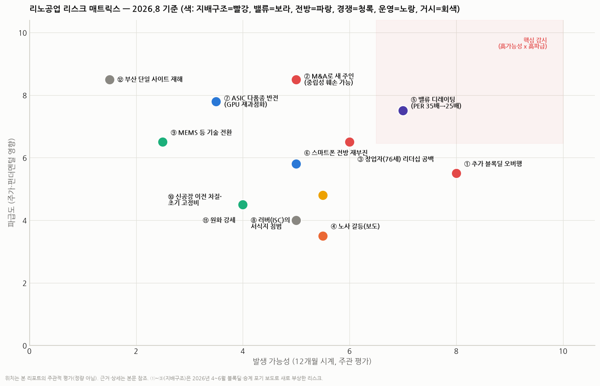

# 리노공업 리스크맵 — 무엇이 이 '교과서 우량주'를 흔들 수 있나 (시리즈 ④)

> 작성일: 2026-08-19 · 카테고리: 반도체/종목분석 · 시리즈: ①개요 ②심화(해자·PQ·밸류) ③배경지식(포고핀 원리) → **④리스크 전담편**
> **검증 메모(중요 신규 팩트)**: 이번 조사에서 기존 리포트에 없던 대형 이벤트를 확인했다 — **이채윤 회장의 지분 9.18%(700만 주) 블록딜 처분(2026.6.12 완료, 주당 9만 원, 약 6,300억 원)**, 자녀 승계 의사 없음 보도(더벨 "2세 승계 포기 수순"), M&A설, 노사 갈등 보도. 모두 2026년 4~6월 복수 언론으로 검증. 그 외 리스크는 시리즈 ①~③의 검증 팩트 기반이며, 발생 가능성 평가는 주관적 판단(표기).

---

## 0. 한 장 요약

> 리노공업의 리스크는 재무(무차입·순현금)나 경쟁(30년 해자)이 아니라 **세 곳에 몰려 있다**: ① **지배구조 — 창업자의 엑시트가 시작됐다**(9.18% 블록딜 완료 + 추가 매각·M&A 가능성 = 오버행과 '새 주인' 불확실성), ② **밸류에이션 — 사상 최고 멀티플(PER ~35배)에서의 성장률 실망**, ③ **전방 구조 — 'AI 다품종 시대'가 전제인 성장 스토리의 반전 가능성**. 나머지는 관리 가능한 수준이다.

---

## 1. 지배구조·오너십 리스크 — 2026년에 새로 열린 최대 변수 🔴

### 1.1 창업자 엑시트의 시작 (검증된 사실)
- 이채윤 회장(1950년생, 창업자·최대주주)이 **2026년 6월 12일 시간외 대량매매로 700만 주(지분 9.18%)를 주당 9만 원, 약 6,300억 원에 처분** (6/15 공시)
- 배경 보도: **자녀들이 지분을 보유하지 않고 승계 의사도 없음** — 더벨은 "높아진 밸류에 분할 처분, **2세 승계 포기 수순**"으로 해석. 당초 "매각 부인"하다 결국 처분(디일렉 "8,600억 규모" 보도)
- 과정의 잡음: 블록딜 진행 중 주가 하락으로 재검토·연기 보도(6/9) → 무산 시 내부자거래 사전공시 제도상 과징금(15~19억 추정) 리스크까지 거론 → 결국 기한 내 완료(이 리스크는 소멸)

### 1.2 이것이 만드는 리스크 3층
1. **오버행(수급)**: "분할 처분 수순"이라는 해석대로면 **잔여 지분의 추가 블록딜이 예정된 미래**다(더벨 "추가 딜 가능성 주목"). 블록딜은 통상 시가 대비 할인 발행이라, 매번 주가에 단기 하방 압력 — 발생 가능성 높음/파급 중간
2. **M&A — '새 주인' 리스크(파급도 최대)**: 승계 포기 + 분할 매각 = 시장은 경영권 매각(M&A)의 전 단계로 읽는다(한경 "M&A설", 리드경제 "M&A 시계 빨라진다"). 문제는 **소켓 회사의 핵심 자산이 '중립성'**이라는 것 — 고객 1,000곳(서로 경쟁하는 팹리스들)이 설계 정보를 맡기는 회사다. ⓐ 사모펀드 인수 시: 레버리지·단기 이익 극대화가 R&D 침투·납기 문화(해자의 원천)를 훼손할 수 있고 ⓑ 전략적 인수자(특정 반도체·부품 대기업) 시: 경쟁 관계의 고객들이 이탈할 수 있다. 인수 프리미엄으로 주가엔 단기 호재일 수 있으나 **장기 해자에는 중립~부정** — 방향이 확정될 때까지 밸류에 불확실성 디스카운트 요인
3. **키맨 리스크**: 76세 창업자의 1인 리더십 30년 — 원가·납기 문화가 시스템화되어 있다지만, 창업자 부재/매각 후에도 유지되는지는 **검증된 적 없는 가설**이다. 리노 같은 '장인형 기업'에서 가장 검증 불가능한 리스크

### 1.3 노사 갈등 (신규 보도)
- 부산일보(6/15): "블록딜 완료… **노사 갈등 리스크는 여전**" — 세부는 추가 확인 필요하나, 창업자 엑시트 국면에서 노사 이슈가 부상한 것 자체가 조직 동요의 신호일 수 있다. 감시 항목

## 2. 밸류에이션·수급 리스크 🟣

4. **사상 최고 멀티플에서의 디레이팅**: PER ~35배(6월, 분할 전 환산 사상 최고가권)는 역사 공식(20%대 성장=30배) 대비 15~20% 프리미엄(☞ 심화편 §4). 성장률이 컨센(+20%)을 하회하는 순간 25~28배 회귀 = **실적이 늘어도 주가 -20~30%**가 가능한 구간. 2022~23년에 실제로 벌어진 일(마진 상승에도 멀티플 -40%)
5. **액면분할 + 블록딜 물량의 수급 변동성**: 2월 액면분할(유통주식 5배)로 개인 회전율이 높아진 상태에서 블록딜 인수자(기관 추정)의 단기 차익 물량이 겹치면 변동성 확대. 700만 주(9.18%)의 보호예수 여부 미확인 — 공시 확인 필요
6. **7월 폭락장 이후 현재가 미확인** — 본 시리즈 공통 주의

## 3. 전방·사이클 리스크 🔵

7. **'AI 다품종 시대'의 반전 (파급도 큼)**: 현 성장 스토리의 전제는 커스텀 ASIC 붐(칩 종류 폭발). 만약 ⓐ 빅테크 자체칩 프로젝트가 비용 문제로 축소되거나 ⓑ 엔비디아 GPU가 다시 시장을 재과점하면, "신규 소켓 주문 건수" 성장이 꺾인다 — 5G 이후 2023년의 공백기 재연. 가능성은 낮게 보나(ASIC 백로그 견고) 파급은 크다
8. **스마트폰 전방의 재부진**: 여전히 기반 수요의 큰 축 — 2023년(-21%)의 교훈(☞ 심화편 §6). 온디바이스 AI가 교체 사이클을 못 만들면 기반 매출 정체
9. **팹리스 R&D 예산 사이클**: 금리·유동성에 민감한 중소 팹리스의 개발 위축 — 다품종 주문의 롱테일이 얇아지는 경로

## 4. 경쟁·기술 리스크 🟢

10. **러버(ISC)의 서식지 침범**: ISC·후발주자의 포고 확장, AI 칩용 하이브리드 소켓 개발 — 현재는 서식지 분리로 제한적이나, AI 칩 소켓이 커지는 만큼 모두가 몰려드는 시장이 됨
11. **기술 전환(MEMS 핀 등)**: 반도체 공정으로 찍어내는 마이크로 스프링이 초미세 영역에서 기계가공 핀을 대체할 가능성 — 프로브카드에서 먼저 진행 중인 흐름. 시계는 길지만(5년+) 리노의 '기계가공 내재화' 해자를 정면으로 우회하는 기술이라 구조적 감시 대상
12. **해자의 성격상 인력 유출 리스크**: 특허가 아니라 노하우·라이브러리 기반이라, 핵심 설계 인력의 경쟁사 이동이 곧 해자 누수 — M&A 국면과 결합되면(조직 동요) 확률이 올라간다
13. **고객 내재화·이원화**: 대형 고객의 소켓 벤더 이원화 압박(단가) — 다품종 구조상 전면 교체는 어려우나 마진 압박 경로

## 5. 운영·거시 리스크 🟡

14. **신공장 이전(2026 하반기)**: 생산 이설 중 납기 차질 리스크(리노의 해자가 '납기'라는 점에서 민감) + 가동 초기 감가상각·이중 비용으로 OPM 일시 하락 가능 — 2027년 분기 실적에서 나타날 수 있는 '착시 악재'를 미리 알아둘 것
15. **환율**: 수출 76.9% — 원화 강세 10%면 이익 한 자릿수 중반 % 타격 추정(자연 헤지 제한적)
16. **관세·무역**: 미국의 반도체 관세 논의 — 소켓·핀은 소모품 부품이라 직접 관세 영향은 제한적으로 보이나, **전방(고객 팹리스) 위축의 간접 경로**는 존재. 구체 영향은 미확인(추정)
17. **부산 단일 사이트 집중**: 생산 전부가 부산 — 재해·사고 시 대체 생산 불가(발생 가능성 최저, 파급 최대의 테일 리스크). 신공장도 부산이라 지리 집중은 유지

## 6. 리스크 상호작용 — 최악의 조합 시나리오

개별 리스크보다 무서운 건 결합이다:
- **시나리오 A (지배구조 연쇄)**: 추가 블록딜 → M&A 구체화 → 핵심 인력 동요·노사 갈등 심화 → 납기 경쟁력 훼손 → 고객 이원화 가속. 확률 낮지만 해자가 직접 깎이는 유일한 경로
- **시나리오 B (밸류 압착)**: ASIC 프로젝트 축소 뉴스 + 신공장 초기 비용으로 분기 OPM 하락 → "성장 둔화+마진 정점 통과" 프레임 → 35배→25배 디레이팅. **12개월 내 가장 개연성 높은 하락 경로**
- 반대로 리스크가 아닌 것: 재무(무차입·순현금), 단일 고객 의존(1,000곳 분산), 단기 경쟁 침투(30년 레퍼런스) — 이 종목에서 걱정할 필요가 가장 적은 항목들

**감시 체크리스트(우선순위순)**: ① 이 회장 잔여 지분 추가 매각·경영권 매각 공시 ② 분기 성장률 컨센 대비(+20% 유지 여부) ③ 신공장 이전 일정·초기 마진 ④ 노사 관련 후속 보도 ⑤ ASIC 프로젝트 뉴스플로우(구글·메타·OpenAI 칩 로드맵)

---

## 참고 출처 (검증)

- [디일렉 — "매각 부인하던 리노공업, 결국 지분 판다… 8,600억 규모"](https://www.thelec.kr/news/articleView.html?idxno=55652)
- [더벨 — "높아진 밸류에 분할 처분, 2세 승계 포기 수순" (2026.4.27)](https://www.thebell.co.kr/front/newsview.asp?key=202604271053344920108788) · [— 대주주 지분 매각, 추가 딜 가능성 (2026.6.15)](https://www.thebell.co.kr/front/newsview.asp?key=202606151039289200109146)
- [한국경제 — 대주주 블록딜에 다시 퍼지는 M&A설 (2026.5.25)](https://www.hankyung.com/article/2026052573651)
- [녹색경제 — 블록딜 무산 가능성과 과징금(내부자거래 사전공시) 리스크](https://www.greened.kr/news/articleView.html?idxno=342214)
- [부산일보 — 블록딜 완료(700만 주·주당 9만 원), 노사 갈등 리스크 여전 (2026.6.15)](https://www.busan.com/view/busan/view.php?code=2026061518152912915)
- [리드경제 — "이채윤 회장 손 떠난 700만 주, M&A 시계 빨라진다"](https://www.leadeconomy.co.kr/news/articleView.html?idxno=8097)
- 밸류·전방·경쟁·운영 리스크의 근거 수치: 시리즈 ①~③ 검증분 참조

**저장소 연계**: `리노공업_심층분석리포트`(①) · `리노공업_심화분석`(② — 밸류 공식·사이클 해부) · `테스트소켓_포고핀_작동원리`(③) · `독점기업_경쟁자등장`(해자 침식 패턴) · `테마부활의역사`(전방 사이클 프레임)

> 유의: 리스크맵의 가능성·파급도 좌표는 주관 평가다. M&A·추가 매각은 보도 기반 관측으로 확정 사실이 아니며, 블록딜 인수자·보호예수는 공시 확인 필요. 매수·매도 추천이 아니다.
