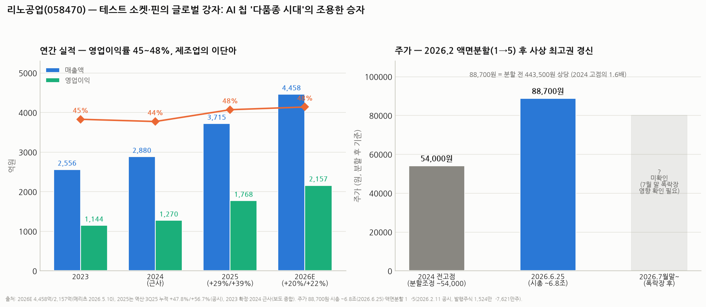

# 리노공업(058470) 심층분석 — 영업이익률 45%의 제조업 이단아, AI '다품종 칩 시대'의 조용한 승자

> 작성일: 2026-08-17 · 카테고리: 반도체/종목분석
> **검증 메모**: 2026E(매출 4,458억 +20%/영업익 2,157억 +22%)는 메리츠(2026.5.10), 2025(≈3,715억/1,768억)는 그 역산 + 3Q25 누적 실적(+47.8%/+56.7%, 공시)과 정합. 2023은 확정, 2024는 근사(보도 종합). 주가 88,700원·시총 ~6.8조(2026.6.25)와 **액면분할(1→5주, 2026.2.11 공시·3월 주총 가결, 발행주식 1,524만→7,621만주)**은 공시·보도 검증. **7월 말 폭락장 이후 현재가 미확인.**

---

## 0. 아주 쉬운 버전 (여기만 읽어도 됨)

**뭐 하는 회사?** 반도체 칩을 출하하기 전 **"불량인지 검사할 때 칩과 검사장비를 연결해주는 소모품"**을 만든다. ① **리노핀** — 머리카락보다 가는 스프링 내장 탐침(프로브 핀). 칩의 단자를 살짝 눌러 접촉한다. ② **IC 테스트 소켓** — 그 핀 수백~수천 개를 심어 칩을 꽂는 정밀 틀. 칩 종류마다 단자 배치가 달라 **전부 맞춤 제작**이고, 쓰다 보면 닳아서 **주기적으로 재구매**하는 소모품이다.

**왜 대단한가 — 숫자 하나로**: **영업이익률 45~48%.** 제조업에서 이 마진은 비정상인데 20년 넘게 유지 중이다. 비결은 ⓐ 다품종 소량 맞춤(고객 1,000곳+, 대량 양산 경쟁이 성립 안 함) ⓑ 소모품 반복 매출 ⓒ 초정밀 가공 내재화 ⓑ 무차입 경영. 코스닥의 '교과서 우량주'로 불리는 이유다.

**지금 왜 좋은가**: AI가 칩 종류를 폭발시키고 있다 — 엔비디아 GPU뿐 아니라 구글·아마존·메타가 저마다 커스텀 ASIC을 만드는 시대(☞ 커스텀HBM·ASIC화 리포트). **칩 종류가 늘수록 맞춤 소켓 주문이 늘고, 고성능 칩일수록 소켓 단가가 비싸진다.** 그 결과 2025년 매출 +29%·영업익 +39%(3분기 누적은 +48%/+57%), 2026년에도 +20%/+22% 전망.

**주가는?** 2026년 2월 **액면분할(1→5)** 후 6월 88,700원 — **분할 전 환산 443,500원, 2024년 고점(27만 원)의 1.6배로 사상 최고권**. 시총 ~6.8조, 선행 PER ~35배 안팎(추산)으로 역사 밴드(20~30배) 상단을 넘어섰다. 7월 폭락장 이후는 미확인.

**한 줄 평**: 사업의 질은 국내 반도체 소부장 전체에서 최상급. 다만 시장도 그걸 알아서, 지금 가격은 "AI 다품종 시대가 수년 간다"를 이미 반영한 수준이다.

---

## 1. 사업 — 왜 이익률 45%가 가능한가

| 요소 | 내용 | 마진 기여 |
|---|---|---|
| **다품종 소량 맞춤** | 칩마다 단자 배치·피치가 달라 소켓은 설계부터 맞춤. 주문 수십~수백 개 단위 | 대량 생산 경쟁(중국식 치킨게임)이 구조적으로 불가능 |
| **소모품 반복 매출** | 핀·소켓은 접촉 수십만 회 후 마모 → 교체 | 경기와 무관한 재구매 수요 층 |
| **수직 내재화** | 초정밀 가공(미크론급)·도금·조립을 부산 공장에서 일괄 | 외주 마진 유출 없음 + 납기 속도(경쟁사 대비 빠른 턴어라운드가 핵심 해자) |
| **R&D 단계 침투** | 칩 개발 단계에 시제품 소켓으로 들어가면 양산 테스트까지 이어짐 (design-in) | 전환 비용 발생 — 비츠로셀·이수페타시스에서 본 그 패턴 |
| 고객 분산 | 글로벌 팹리스·IDM 1,000곳+ (특정 고객 편중 낮음) | 협상력 유지 + 특정 전방 침체에 둔감 |

- 제품: 리노핀(스프링 프로브)·IC 테스트 소켓(비메모리 중심) + **의료기기 부품**(초음파 프로브 등 — 정밀가공 기술의 횡전개, 매출 소수 지분)
- 비교 관점: 같은 '테스트' 체인이라도 테크윙(핸들러 장비)·ISC(러버 소켓, 메모리 강세)와 달리 리노는 **비메모리 R&D~양산의 핀·소켓 전문** — 장비주가 아니라 **소모품주**라는 게 밸류에이션 성격을 가른다(사이클 진폭 작음)

## 2. 실적 — AI가 만든 두 번째 성장기

| | 2023 | 2024(근사) | 2025(역산) | 2026E(메리츠) |
|---|---|---|---|---|
| 매출 | 2,556억 | ~2,880억 | ~3,715억 (+29%) | **4,458억 (+20%)** |
| 영업이익 | 1,144억 | ~1,270억 | ~1,768억 (+39%) | **2,157억 (+22%)** |
| OPM | 45% | 44% | 48% | 48% |

- 3Q25 누적이 **매출 +47.8%·영업익 +56.7%** — 모바일 침체기(2023~24)를 지나 AI 칩 테스트 수요가 성장률을 한 단계 올렸다
- **성장의 질**: 물량(칩 종류 증가)과 단가(고성능 칩일수록 핀 수·난도·단가 상승)가 동시에 오르는 구조. 특히 커스텀 ASIC 시대는 "신규 칩 1종 = 신규 소켓 설계 1건"이라 리노의 주문 건수 자체를 늘린다
- 모바일(AP 테스트)이 여전히 기반 수요 — AI는 그 위에 얹힌 증분이라, AI가 둔화해도 2023년 수준으로 회귀하는 하방

## 3. 밸류에이션 — 좋은 회사의 비싼 가격

- 6/25 기준: 주가 88,700원(분할 후) × 76.2M주 = 시총 **~6.8조**
- 2026E 순이익 ~1,950억 안팎(영업익 2,157억 + 이자수익, 추산) → **선행 PER ~35배** — 역사 밴드(20~30배) 상단 돌파. 컨센 목표가 평균 117,500원(+32%)
- 프리미엄의 근거: OPM 48%·ROE 높음·무차입·배당(DPS 800원, 수익률 ~1.3%)·소모품형 실적 안정성 + AI 성장률 리레이팅
- 반론: +20% 성장에 PER 35배는 **성장 지속을 5년치 선반영**한 가격. 2023~24처럼 전방(모바일)이 꺾이며 성장이 한 자릿수로 내려오면 PER 25배 회귀(-30%)가 역사적 패턴
- 액면분할(2월)은 펀더멘털 무관하나 유통주식 확대로 개인 수급 유입 — 신고가 랠리의 수급적 배경 중 하나

## 4. 리스크

1. **밸류에이션** — 최대 리스크. 실적이 아니라 멀티플(35배)이 흔들릴 때 낙폭이 크다. 7월 폭락장에서 고멀티플주는 지수보다 깊게 빠지는 게 일반적 — 현재가 확인 필수
2. **전방 다변화의 역설** — 고객 1,000곳 분산은 방어막이지만, 반도체 업황 전체가 꺾이면(팹리스 R&D 예산 축소) 소량 주문부터 사라진다
3. **경쟁 — 기술보다 단가**: 일본(요코오 등)·대만·ISC 등이 존재. 리노의 해자는 납기·품질이지 특허 독점이 아니라, 고객사 원가 절감 압박 시 이원화 리스크 상존
4. **창업자 리스크**: 이채윤 창업회장 체제의 1인 경영 색채 — 승계·지배구조 이벤트가 장기 변수
5. 환율(수출 비중 높음 — 원화 강세에 민감)

## 5. 시나리오 (12개월, 가설)

| | 가정 | 함의 |
|---|---|---|
| Bull | 커스텀 ASIC 붐 가속 — 2026 +25%↑ 성장, 컨센 상향 | PER 35배 유지 × EPS 상향 — 목표가 상단(16만) 재평가 |
| Base | 컨센 부합(+20%/+22%) | 8만~11만 박스 — 멀티플 유지 여부 싸움 |
| Bear | AI 캐펙스 둔화 + 모바일 부진 재현 | 성장 한 자릿수 → PER 25배 회귀 — 6만 이하 |

**개인 의견(가설)**: 리노공업은 최근 다룬 반도체 종목들과 종류가 다르다 — 사이클 베타(심텍·테스)도, 테마 옵션(기가비스)도 아닌 **'퀄리티 컴파운더'**다. 이런 종목은 타이밍보다 가격이 문제다: OPM 48%짜리 사업을 PER 25배 이하에서 살 기회는 시장 급락 때만 온다. 7월 폭락으로 그 가격대가 왔다면 장기 관점에서 가장 마음 편한 반도체 종목이고, 35배를 유지하고 있다면 서두를 이유가 없다. 관전 포인트: ① 분기 매출의 AI/ASIC향 비중 코멘트 ② 커스텀 ASIC 프로젝트 수(구글·메타·아마존·OpenAI 칩 로드맵 — 곧 소켓 주문 건수) ③ 폭락 후 멀티플 레벨.

---

## 참고 출처 (검증)

- [메리츠증권 — Company Brief: 2026E 4,458억/2,157억 (2026.5.10)](https://home.imeritz.com/include/resource/research/WorkFlow/20260510181334170K_02.pdf)
- [하나증권 — "업황과 무관하게 견조할 실적 흐름" (2025.6.9)](https://www.hanaw.com/download/research/FileServer/WEB/industry/enterprise/2025/06/08/leeno_250609.pdf)
- 3Q25 누적 매출 +47.8%·영업익 +56.7%: 공시 보도
- 액면분할 1→5(2026.2.11 공시, 1,524만→7,621만주, 3월 주총 가결): 공시 보도
- [Investing — 주가 88,700원·컨센 목표가 평균 117,500원·DPS 800원 (2026.6.25)](https://www.investing.com/equities/leeno-industrial-inc)
- 2023 확정(2,556억/1,144억)·2024 근사: 보도 종합

**저장소 연계**: `커스텀HBM_메모리의ASIC화`(다품종 칩 시대 = 소켓 주문 증가의 논리) · `HPSP_심층분석리포트`(고마진 소부장 비교) · `테스`·`GST`(장비주와의 성격 차이) · `이수페타시스` 시리즈(design-in 해자 패턴)

> 유의: 2024·2025 수치는 근사·역산 포함(확정치는 사업보고서 확인). 7월 말 폭락장 이후 주가 미확인. PER·순이익은 추산. 매수 추천 아님.
