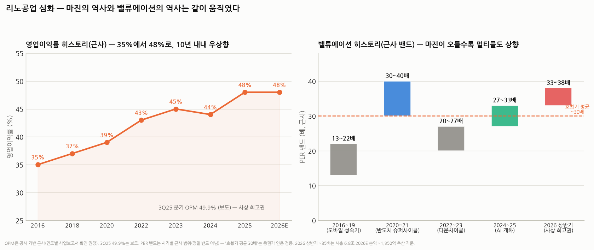

# 리노공업 심화분석 — 기술 해자의 실체, 매출 구조, P·Q의 물리학, 밸류에이션의 역사

> 작성일: 2026-08-18 (v2 — §6 2021~24 사이클 해부 추가) · 카테고리: 반도체/종목분석 · `리노공업_심층분석리포트`(개요편)의 심화편
> 질문 5개 정면 대응: ① 기술 해자·제품 상세·공정 내 위치·경쟁사 비교 ② 매출 비중과 내수/수출 ③ P는 오르는데 Q는 숙련공 제약으로 못 늘지 않나? ④ 밸류에이션 히스토리와 당시 마진, 현재가 적정성 ⑤ 기타
> **검증 메모**: 매출 비중(2023.6: 소켓 57.3%/핀 33.6%/의료 8.2%, 2025 상반기: 핀·소켓 89.1%/의료 10.9%)·수출 76.9%/내수 23.1%·3Q25 OPM 49.9%·의료 88억(지멘스향)은 공시·보도 검증. 시장 구조(포고 타입 60~70% vs 러버 15~20%, ISC 러버 강자, TSE 겸업)는 업계 보도 검증. 신공장(부산 에코델타시티, 2026 하반기 완공, **캐파 2배**)·호황기 평균 PER 30배는 보도 검증. 연도별 OPM·PER 밴드는 **근사**(정밀 밴드 아님).

---

## 0. 한 장 요약

> 리노공업의 해자는 특정 특허가 아니라 **"머리카락 반 굵기 스프링 부품을, 수만 가지 설계로, 남보다 빨리, 전 공정 내재화로 만들어내는 축적된 제조 시스템"**이다. 시장의 주류인 포고(스프링 핀) 타입에서 글로벌 최상위이고, 경쟁자들은 각자 다른 우물(ISC=러버·메모리 양산, TSE=번인·러버, 스미스·요코오=글로벌 대형 고객)에서 강하다. 매출은 핀+소켓이 89%(수출 77%)로 사실상 단일 사업이며, P(단가)는 칩 고도화가 자동으로 올려주고 Q(수량)는 — 질문의 가설과 달리 — 숙련공보다 **정밀가공 장비·공간이 병목**이라 신공장(캐파 2배, 2026 하반기)으로 풀리는 구조다. 밸류에이션은 마진(35→48%)과 함께 계단식으로 올라 현재 ~35배(사상 최고권) — **역사상 '호황기 평균 30배' 위에 서 있는 가격**이다.

---

## 1. 기술 해자의 실체 — 제품·공정 위치·경쟁 비교 (질문 ①)

### 1.1 제품이 정확히 무엇인가 — 포고핀의 해부

**리노핀(스프링 프로브/포고핀)** = 지름 수백 μm(가는 것은 0.1mm대)의 금속 원통(배럴) 안에 **초소형 스프링과 상하 플런저(접촉침)**를 넣은 부품이다. 구조는 볼펜과 같다 — 눌리면 스프링이 받치고, 떼면 복원. 이 단순한 구조가 어려운 이유:
- **미세화**: 칩 단자 간격(피치)이 0.35mm 이하로 좁아져, 그 안에 배럴+스프링+플런저+도금을 다 넣어야 함 — 시계 부품급 정밀가공
- **수명**: 접촉 수십만 회를 견디며 접촉저항이 일정해야 함(테스트 오판 = 양품 폐기)
- **전기 특성**: AI 칩은 신호가 GHz대라 핀이 안테나처럼 작동하면 안 됨 — 길이·재질·도금 설계가 고주파 특성을 결정
- **전류·발열**: 고성능 칩은 테스트 중 수백 W를 흘림 — 핀이 그 전류를 견뎌야 함

**IC 테스트 소켓** = 이 핀 수백~수천 개를 칩 단자 배치 그대로 심은 정밀 틀. **칩이 새로 나올 때마다 새로 설계**된다(다품종의 근원).

### 1.2 반도체 공정의 어디에 쓰이나 — 두 개의 자리

| 자리 | 시점 | 특징 | 리노의 강도 |
|---|---|---|---|
| **R&D 테스트** | 팹리스가 신규 칩을 개발·검증할 때 (테이프아웃 전후) | 소량·초긴급(설계 변경마다 새 소켓)·가격 둔감 | **최강 — 리노의 본진.** "3일 만에 맞춤 소켓"류의 납기가 해자 |
| **양산 파이널 테스트** | 패키징 후 출하 전 전수검사 (후공정 맨 끝, ☞ HBM 공정 리포트의 KGSD 테스트와 같은 단계의 비메모리판) | 대량·소모품 반복 구매·단가 협상 존재 | 확대 중 — "양산용 점유 확대" 보도. AI 칩 LTA 바람(소켓도 장기공급계약화, 시사저널e) |

- 전공정(팹)과는 무관하고, **후공정의 맨 끝 + 팹리스 R&D 랩**이 무대다. 그래서 캐펙스 사이클(장비주)이 아니라 **칩 '종류 수'와 생산량(소모품)**의 함수 — 실적 변동성이 작은 이유
- 참고: 웨이퍼 상태에서 찌르는 프로브카드(한미반도체·마이크로프랜드 영역)와는 **다른 제품**이다 — 프로브카드는 웨이퍼 레벨(EDS), 리노 소켓은 패키지 레벨(파이널). 혼동 주의

### 1.3 기술력 '알파'는 무엇인가 — 4가지로 분해

1. **풀 내재화 제조 시스템**: 초정밀 선반 가공→도금→스프링→조립→검사를 부산 한 곳에서 일괄. 경쟁사 다수는 핀을 사다 소켓을 조립하는데, 리노는 **핀부터 만든다** — 원가(마진 유출 없음)와 납기(외주 대기 없음)의 이중 우위. OPM 48%의 절반은 여기서 나온다
2. **속도**: 다품종 맞춤에서 승부는 성능보다 **턴어라운드 타임** — 팹리스의 칩 개발 일정은 소켓 며칠에 좌우된다. 20년 축적된 설계 라이브러리(유사 설계 재활용)가 속도의 원천
3. **미세피치·고주파 대응**: 3nm 이하 파운드리 칩(단자 밀도↑·주파수↑) 대응 기술력이 업계에서 부각(보도) — 칩이 어려워질수록 쓸 수 있는 공급사가 줄어드는 구조
4. **신뢰의 복리**: 30년 무결점 레퍼런스 — 테스트 소모품은 "싼 것"보다 "틀리지 않는 것"이 먼저다(오판 1건의 비용이 소켓값의 수백 배). 비츠로셀·이수페타시스에서 본 'design-in 신뢰 자산'과 동일 패턴

### 1.4 경쟁 지도 — 누가 어디서 강한가

시장 구조부터: 테스트 소켓 방식은 **포고(스프링 핀) 타입이 시장의 60~70%**, **러버(실리콘 시트에 금속 입자를 심은 것) 타입이 15~20%**다.

| 회사 | 주력 | 강한 곳 | 리노와의 관계 |
|---|---|---|---|
| **리노공업** | **포고 핀+소켓 (핀 내재화)** | 비메모리 R&D~양산, 글로벌 팹리스 1,000곳 | — |
| **ISC** (SKC 계열) | **러버 소켓** | **메모리 양산 테스트**(삼성향 강세) — 러버는 신호 경로가 짧아 저비용 대량 테스트에 유리, 국내 러버 시장 장악 | 방식이 달라 정면충돌은 제한적 — 단 ISC가 포고로, 리노가 양산으로 서로 확장 중이라 접점 확대 |
| **티에스이(TSE)** | 러버+포고 겸업, 번인보드·인터페이스보드 | 글로벌 SoC 고객 확보 이력, MEMS 러버 기술 | 소켓 매출 비중 ~18%라 전사 체급은 다름 |
| **마이크로컨텍솔** | 포고 소켓 | 메모리 모듈·번인 | 저가 영역 |
| **스미스 인터커넥트(英)·요코오(日)·엔플라스(日)·코후(美)** | 포고·소켓 글로벌 | 각국 대형 IDM 인하우스 관계 | 해외 프리미엄 시장의 상대 |
| 두온·오킨스 등 후발 | 포고·러버 | 가격 | ISC 특허 우회 러버 양산 시도 등 — 저가 침투 |

**차별화의 요약**: 러버(ISC)는 "짧은 신호 경로·저비용·대량"이지만 수명이 짧고 미세 커스텀에 약하다. 포고(리노)는 "내구성·수리 용이·커스텀 자유도"가 강점이고 고주파 한계는 설계로 극복 중. **메모리 양산=러버(ISC), 비메모리 R&D·고성능=포고(리노)**로 서식지가 갈려 있었는데, AI 칩(고전류·고발열·대형 패키지)은 내구성 요구 때문에 포고에 유리하게 기울고 있다는 게 최근 구도다.

---

## 2. 매출 구조 — 비중과 내수/수출 (질문 ②)

| 축 | 비중 | 내용 |
|---|---|---|
| IC 테스트 소켓 | ~57% (2023.6 기준) | 맞춤 소켓 (핀 포함 세트) |
| 리노핀 | ~34% | 핀 단품 판매 (타사 소켓·지그에 들어감) — 소켓보다도 소모품 성격 강함 |
| **핀+소켓 합계** | **89.1% (2025 상반기)** | 사실상 본업 단일 |
| 의료기기 부품 | **10.9%** (연 ~88억, +24%) | **지멘스향 초음파 진단기 부품** — 정밀가공 기술의 횡전개. 반도체와 무관한 경기 방어 축 |

- **수출 76.9% vs 내수 23.1%** (2023.6 기준) — 고객이 글로벌 팹리스·IDM(퀄컴·미디어텍·엔비디아 체인 등 1,000곳+)이라 원화 약세 수혜주다. 거꾸로 원화 강세 국면엔 이익 역풍
- 내수 23%도 상당 부분 삼성·SK 생태계향 — 사실상 매출의 전부가 글로벌 반도체 개발 활동량의 함수
- 개요편과 연결: 이 구조 덕에 특정 고객 리스크가 낮다(최대 고객도 한 자릿수 %로 알려짐 — 정확 수치는 사업보고서 확인 권장)

## 3. P는 오르는데 Q는 막히지 않나 — 질문 ③에 대한 답

**질문의 가설(숙련공 제약으로 Q 제한)은 절반만 맞다.** 분해하면:

- **P(단가)는 구조적으로 오른다 — 맞음**: 칩 고도화가 자동 인상 장치다. 핀 수 증가(대형 AI 패키지) × 미세피치(가공 난도) × 고주파·고전류 사양 = 소켓 1개 단가 상승. 실제로 "리노핀 가격 우상향" 보도가 이를 확인. 게다가 다품종 맞춤이라 **가격 협상 자체가 커머디티식으로 벌어지지 않는다**
- **Q의 병목은 숙련공이 아니라 '정밀가공 기계와 공간'이다 — 여기가 가설과 다른 지점**: 핀 제조는 장인이 깎는 게 아니라 **초정밀 CNC·자동 조립·검사 라인**이 돌린다. 숙련이 필요한 건 설계 엔지니어링(신규 소켓 설계)과 공정 세팅 쪽인데, 이건 설계 라이브러리 축적으로 레버리지가 걸린다(같은 엔지니어가 더 많은 설계를 처리). 실제 증거가 **부산 에코델타시티 신공장 — 2026년 하반기 완공 시 캐파 2배**: 회사가 Q 확장을 '사람 채용'이 아니라 '공장 건설'로 풀고 있다는 것 자체가 병목의 위치를 말해준다
- **단, 가설이 맞는 부분**: Q는 장비를 사면 바로 느는 반도체 웨이퍼식 확장이 아니라, 설계 인력·공정 이관·품질 안정화가 따라야 하는 **계단식 확장**이다. 그래서 수요 급증기에 Q가 즉각 못 따라가고 — 그 결과가 **리드타임 연장과 P 상승**으로 나타난다. 즉 "Q의 경직성이 P의 프리미엄을 만드는" 구조라, 주주 입장에선 Q 제약이 나쁜 것만은 아니다
- **종합**: 2026년까지는 P 주도 성장(+한정된 Q), **2027년부터 신공장 Q가 열리며 P×Q 동시 성장** 구간 진입이 회사의 그림. 신공장 가동 초기 고정비(감가상각)로 OPM이 일시 눌릴 수 있다는 건 미리 알아둘 것

## 4. 밸류에이션 히스토리 — 그리고 지금 가격은 적정한가 (질문 ④)

| 시기 | PER 밴드(근사) | 당시 OPM(근사) | 시장이 산 것 |
|---|---|---|---|
| 2016~19 (모바일 성숙) | 13~22배 | 35~37% | "마진 좋은 부품사" — 성장 한 자릿수 |
| 2020~21 (슈퍼사이클) | 30~40배 | 39~43% | 5G·HPC 성장률 리레이팅 |
| 2022~23 (다운사이클) | 20~27배 | 43~45% | **마진은 올랐는데 멀티플은 하락** — 성장 둔화 디스카운트 |
| 2024~25 (AI 개화) | 27~33배 | 44~48% | AI 다품종 성장률 복귀 — '호황기 평균 30배' 회복 |
| **2026 상반기** | **~33~38배** | 48% (3Q25 분기 49.9%) | 사상 최고 마진 + 신공장 Q 기대의 동시 반영 |

읽는 법 3가지:
1. **OPM은 사이클과 무관하게 10년 내내 우상향**(35→48%)했다 — 다운사이클(2022~23)에도 마진이 오히려 올랐다는 게 이 회사의 본질(소모품+커스텀). 멀티플을 움직인 건 마진이 아니라 **성장률 기대**다.
2. 그래서 Fwd OPM은 밸류 판단에 큰 정보가 없다(늘 40%대) — 봐야 할 것은 **매출 성장률의 지속 기대**: 한 자릿수면 20배, 20%대면 30배가 역사적 공식이었다.
3. **현재(~35배)의 적정성 판정**: 2026E 성장 +20%에 35배는 역사 공식(20%대 성장=30배) 대비 **약 15~20% 프리미엄**이다. 프리미엄의 근거는 ⓐ 신공장 캐파 2배(2027+ Q 성장 예약) ⓑ 커스텀 ASIC 붐의 구조성 ⓒ 사상 최고 마진 — 셋 다 실체가 있으나, **"이미 좋은 뉴스가 다 가격에 있다"**는 게 냉정한 결론. 역사 공식대로면 적정 밴드는 **PER 28~32배(주가 환산 ~7만 초중반~8만)**이고, 35배 위는 신공장 가동이 숫자로 확인돼야 정당화된다. 7월 폭락으로 30배 밑에 와 있다면 역사적으로 '사도 됐던' 가격대다 (현재가 미확인 — 확인 필수)

## 5. 그 외 — 세 가지 (질문 ⑤)

1. **신공장의 숨은 의미 — 제2의 횡전개**: 에코델타시티 신공장은 캐파 2배를 넘어 **로봇·XR·전장 커넥터/부품으로의 다변화 기반**으로 보도된다. 의료(지멘스)에서 증명한 '정밀가공 횡전개'의 2탄 — 성사되면 반도체 사이클 의존도가 더 낮아진다. 아직 숫자 없는 옵션
2. **소켓에도 LTA 바람**: AI 칩 소켓이 소모품 특성상 **장기공급계약 대상**이 되고 있다는 보도 — 메모리 LTA(☞ LTA 리포트)의 소켓판. 리노처럼 양산 소켓 점유를 늘리는 회사에게 실적 가시성을 더해주는 구조 변화
3. **감시 리스트**: ⓐ 신공장 완공·이전 일정(2026 하반기 — 지연 여부) ⓑ ISC(러버)의 AI 칩용 포고/하이브리드 확장 뉴스(서식지 침범) ⓒ 원/달러(수출 77%) ⓓ 분기 OPM 50% 선 유지 여부 — 49.9%가 정점이었는지 새 표준인지가 멀티플의 다음 승부처

---

## 6. 부록 — 2021~22는 왜 좋았고, 2023~24는 왜 꺾였나 (사이클의 해부)

실적 사실관계(확정): 매출 2021년 2,802억 → **2022년 3,224억(사상 최대)** → **2023년 2,556억(-21%)** → 2024년 ~2,880억(회복 시작) → 2025년 ~3,715억(신기록 탈환).

**리노 매출의 방정식으로 풀면 — 매출 = (신규 칩 종류 수 × R&D 소켓) + (칩 생산량 × 소모품 교체)**. 2021~22는 이 두 항이 동시에 뜨거웠고, 2023~24는 동시에 식었다.

### 2021~22 호황의 3가지 엔진
1. **5G 전환기의 다품종 러시**: 퀄컴·미디어텍 등이 5G AP·모뎀·RF 칩을 세대마다 쏟아내던 시기 — 신규 칩 1종=신규 소켓 1건 공식이 최대로 작동. 게다가 **5G 칩은 고주파(동축 핀)·미세피치 소켓을 요구해 ASP까지 상승**(증권가가 검증한 당시 성장 논리: "5G 침투율 확대에 따른 소켓 ASP 상승 + AP 미세피치화 수혜")
2. **코로나 IT 붐의 생산량**: 스마트폰·PC·서버가 동시 호황 → 양산 테스트 가동률↑ → 소모품(핀 교체) 매출↑
3. **환율**: 2022년 원/달러 1,300원+ (수출 77% 회사의 마진 순풍)

### 2023~24 부진의 4가지 이유
1. **최대 전방(스마트폰)의 붕괴**: 2023년 글로벌 스마트폰 출하가 10여 년 만의 최저 — 리노의 주력 전방이던 모바일 AP에서 **신제품 축소(R&D 소켓↓)와 생산량 감소(소모품↓)의 이중 타격**
2. **반도체 다운사이클의 R&D 위축**: 금리 급등 + 업황 불황으로 팹리스들이 재고조정·개발 프로젝트 연기 — 다품종 주문 건수 자체가 감소
3. **5G 모멘텀의 소멸**: 5G 침투율이 포화되며 "세대 전환발 ASP 상승"이라는 2019~22년의 구조적 순풍이 끝남 — 다음 순풍(AI)이 오기 전의 공백기
4. **AI가 아직 소켓 수요가 아니었음**: 2023~24년의 AI는 **엔비디아 GPU '소수 품종 대량'** 시대 — 칩 종류가 안 늘어나니 다품종 소켓 회사엔 낙수가 작았다. 2025년부터 **커스텀 ASIC 다품종화**(구글·아마존·메타·OpenAI 각자 칩)가 열리면서 비로소 리노식 수혜가 시작 — 2025년 +29%가 그 증거

### 이 사이클이 가르쳐주는 것 2가지
- **리노도 사이클을 탄다 — 단, 얕게**: 최대 낙폭 -21%는 같은 시기 장비주(테스 -54%, 기가비스 -71%)와 비교하면 완충이 확연하다. 소모품+다품종+의료 축의 방어력이 숫자로 증명된 구간. 그리고 그 다운사이클에도 OPM은 45%로 오히려 올랐다(§4)
- **성장 재개엔 '새 다품종 사이클'이 필요하다**: 리노의 성장은 반도체 생산량보다 **"칩 종류가 폭발하는 시대"**가 여느냐에 달렸다 — 5G(2019~22)가 1차, AI 커스텀 ASIC(2025~)이 2차. 거꾸로 지금 밸류(PER ~35배)의 최대 리스크는 "ASIC 다품종 시대가 GPU 과점으로 되돌아가는" 시나리오라는 뜻이기도 하다

---

## 참고 출처 (검증)

- [네이트/뉴스 — 3Q25 OPM 49.9%, 리노핀·소켓 고성장 (2025.11.14)](https://news.nate.com/view/20251114n06222)
- [데일리인베스트 — 양산용 테스트소켓 점유율 확대](http://www.dailyinvest.kr/news/articleView.html?idxno=69072) · [리노핀 가격·수량 우상향](http://www.dailyinvest.kr/news/articleView.html?idxno=61865)
- [금융소비자뉴스 — 매출 비중(2025 상반기 핀·소켓 89.1%/의료 10.9%)·의료 88억 지멘스향](https://www.newsfc.co.kr/news/articleView.html?idxno=78858)
- [비즈니스리포트 — 3nm 이하 공정 대응 기술경쟁력, 소켓 57.3%/핀 33.6%/의료 8.2%·수출 76.9% (2023.6 기준)](http://www.businessreport.kr/news/articleView.html?idxno=36432)
- [KIPOST — 포고 60~70% vs 러버 15~20%, ISC·TSE 구도, 특허 우회 경쟁](https://www.kipost.net/news/articleView.html?idxno=3935) · [디일렉 — TSE 경쟁력](https://www.thelec.kr/news/articleView.html?idxno=8322)
- [시사저널e — AI 반도체 테스트 소켓의 장기공급계약화](https://www.sisajournal-e.com/news/articleView.html?idxno=422681)
- [이슈리포트 — 에코델타시티 신공장 2026 하반기 완공·캐파 2배·로봇/XR/전장 다변화·호황기 평균 PER 30배 (2026.3.5)](https://eduinfom.com/%EB%A6%AC%EB%85%B8%EA%B3%B5%EC%97%85-%EB%AA%A9%ED%91%9C%EC%A3%BC%EA%B0%80-%EB%B6%84%EC%84%9D26-03-05-%EC%98%A8%EB%94%94%EB%B0%94%EC%9D%B4%EC%8A%A4-ai%EC%99%80-2%EB%82%98%EB%85%B8-%EA%B3%B5/)
- 연도별 OPM·PER 밴드: 공시·보도 기반 근사 (연도별 정밀치는 사업보고서·차트 확인 권장)
- [유진투자 — 2021~23 실적(2,802/3,224/2,556억)·5G ASP 상승과 미세피치화 수혜 논리 (2024.3.12)](https://www.eugenefn.com/common/files/amail//20240312_058470_sophie.yim_12.pdf)
- [삼성증권 — "성장통은 끝났다": 2023 스마트폰 부진과 회복 논리 (2023.6)](https://www.samsungpop.com/common.do?cmd=down&contentType=application/pdf&inlineYn=Y&saveKey=research.pdf&fileName=2010/2023061914595007K_02_07.pdf)

**저장소 연계**: `리노공업_심층분석리포트`(개요) · `커스텀HBM_메모리의ASIC화`(다품종 칩 시대) · `메모리_장기공급계약_LTA_현황`(소켓 LTA의 배경) · `HBM_주요공정_원리효과`(테스트 공정의 위치) · `한미반도체`(프로브카드와의 구분)

> 유의: PER 밴드·연도별 OPM은 근사이며 정밀 밴드차트가 아니다. 7월 말 폭락장 이후 주가 미확인 — '적정 밴드 28~32배' 판단은 2026E 컨센 기준. 매수 추천 아님.
