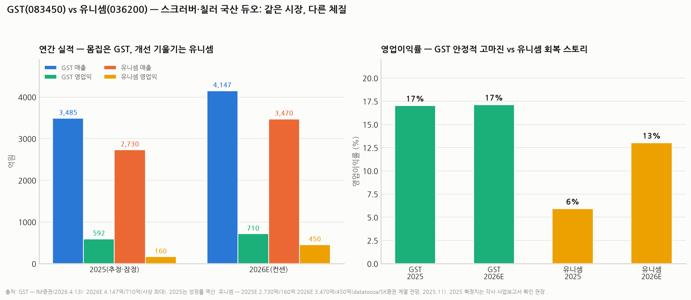

# 유니셈(036200) 심층분석 — 스크러버 1위의 '마진 회복' 스토리 (GST와 비교)

> 작성일: 2026-08-13 · 카테고리: 반도체/종목분석 · 자매편: `GST_심층분석리포트`(같은 날, 직접 경쟁사 비교)
> **검증 메모**: 점유율(국내 스크러버 45%+, 칠러 30%+)·매출 구성(스크러버 26%/칠러 38%/유지보수 등 36%)·1Q26(매출 +23.7%, 영업익 +7.2%)은 공시·기업정보로 검증. 2025E(매출 2,730억/영업익 160억)·2026E(3,470억/450억)는 2025.11 전망 보도(SK증권 계열, TP 15,000) 기준이고, 다른 분석(알파증류소, TP 17,000)은 FY25 영업익을 109억으로 더 낮게 봄 — **2025 확정치는 사업보고서(2026.3 제출) 확인 권장, 본 리포트는 범위(109~160억)로 표기**. 최근 주가·시총은 검증 가능한 보도가 없어 **미확인**.

---

## 0. 아주 쉬운 버전 (여기만 읽어도 됨)

**뭐 하는 회사?** GST와 같은 시장 — 반도체 공장의 유해가스 정화장치(**스크러버**)와 온도조절장치(**칠러**)를 만든다. 차이가 있다면 유니셈이 **원조·점유율 1위**(국내 스크러버 45%+, 칠러 30%+)이고, 매출에서 **유지보수 비중이 36%**로 높아 장비가 안 팔리는 해에도 바닥 매출이 깔린다는 것.

**그런데 왜 GST보다 이익이 훨씬 작나?** 2025년 유니셈 영업이익은 **109~160억**(추정 범위) — 매출은 GST의 80% 수준인데 이익은 1/4도 안 된다(이익률 ~6% vs GST 17%). 원자재·인건비 부담과 단가 압박에 마진이 눌린 상태다. 그래서 이 종목의 스토리는 GST와 반대로 **"매출 성장"이 아니라 "마진 회복"**이다: 2026년 전망이 매출 3,470억(+27%)에 영업이익 **450억(약 3배)** — 전방 투자 러시로 가동률·믹스가 좋아지며 이익률이 6%→13%로 뛴다는 그림.

**한 줄 평**: GST가 "이미 잘 버는 회사가 조금 더 잘 버는" 스토리라면, 유니셈은 "못 벌던 1위가 정상 마진으로 돌아오는" 스토리다. 회복 스토리는 배수(3배)가 크지만 **실행 리스크도 크다** — 1Q26에서 매출 +24%에 영업익이 +7%밖에 못 는 게(원자재·에너지 비용) 그 위험의 실물이다.

---

## 1. 사업 — 1위의 구조

| 축 | 비중 | 특징 |
|---|---|---|
| 칠러 | 38% | 국내 점유 30%+ |
| 스크러버 | 26% | 국내 점유 45%+ — 원조 국산화 업체 |
| 유지보수·기타 | **36%** | 설치 기반이 가장 큼 → **다운사이클 방어력은 국내 최고 수준** |

- GST 대비 강점: ① 점유율·레퍼런스(1위) ② 유지보수 비중(36% vs 19%) — 사이클 바닥에서 덜 깨진다
- GST 대비 약점: ① 마진(6% vs 17%) — 제품 믹스·단가·비용 구조 열위 ② GST의 SK하이닉스 침투는 곧 유니셈 파이를 뺏는 싸움이라는 뜻(발주 이원화)
- 액침냉각·친환경(온실가스 저감 스크러버) 쪽 확장도 진행 — 테마 노출은 GST와 유사

## 2. 실적 — '마진 3배' 시나리오의 구조

| | 2025E | 2026E |
|---|---|---|
| 매출 | 2,730억 | **3,470억 (+27%)** |
| 영업이익 | 109~160억 (OPM ~4~6%) | **450억 (OPM ~13%)** |

- 분기 흐름(2025): 1Q 605억/48억 → 2Q 800억/21억 → 3Q 572억/24억 — **매출이 늘어도 이익이 안 늘던 해**
- 1Q26: 매출 +23.7%·영업익 +7.2% — 회복은 시작됐지만 **원자재·에너지 비용이 마진 개선을 갉아먹는 중** (매출총이익률 소폭 하락)
- 장기 시나리오(알파증류소): FY25 109억 → FY28E 560억 (5배) — "매출 +14~17%/년 + OPM 매년 2~3%p 확장"이 전제. **이 전제가 깨지는지 여부가 이 종목의 전부**다
- 목표가: SK증권 15,000원(상향), 알파증류소 17,000원

## 3. GST vs 유니셈 — 한 표 정리

| | **GST** | **유니셈** |
|---|---|---|
| 2026E 매출/영업익 | 4,147억/710억 | 3,470억/450억 |
| OPM | **17% (안정)** | 6%→13% (회복 중) |
| 유지보수 비중 | 19% | **36%** |
| 이번 사이클 알파 | SK하이닉스 신규 침투(+200%) | 마진 정상화(이익 ~3배) |
| 테마 옵션 | 액침냉각(2026~27 공급 목표) | 액침냉각·친환경 스크러버 |
| 리스크 성격 | 사이클 베타 | 사이클 베타 + **마진 회복 실행 리스크** |
| 투자 성격 | 검증된 수익성, 낮은 밸류 | 회복 배수는 크지만 증명 전 |

**해석**: 같은 시장의 두 회사가 정확히 반대 스토리를 판다. 안정을 원하면 GST, 회복 레버리지를 원하면 유니셈이다. 단 GST의 SK 침투가 성공할수록 유니셈의 점유율 스토리는 훼손된다 — **둘을 같이 사면 서로 헤지가 아니라 같은 사이클에 두 번 베팅하는 것**임을 유의.

## 4. 리스크

1. **마진 회복 실패** — 1Q26이 보여준 원자재·에너지 비용 압박이 지속되면 "이익 3배" 시나리오 붕괴. 이 종목 최대 리스크
2. **GST의 침투** — SK향 발주 이원화로 점유율·단가 동시 압박
3. **메모리 캐펙스 사이클** — 공통 리스크 (유지보수 36%가 완충)
4. **최근 주가 미확인** — 7월 말 폭락장 영향 포함, 매매 전 확인 필수

## 5. 시나리오 (12개월, 가설)

| | 가정 | 함의 |
|---|---|---|
| Bull | 분기 OPM 10%+ 안착 확인 (2~3Q26) | "이익 3배" 신뢰 획득 — TP 상단(17,000) 재평가 |
| Base | 매출 +27% 달성, OPM 10% 미달 | 이익 300억대 — 완만한 회복주 |
| Bear | 비용 압박 지속 + GST 침투 가속 | 매출 성장에도 이익 정체 — 밸류 트랩 |

**개인 의견(가설)**: 유니셈은 "확인 후 진입"이 어울리는 종목이다. 회복 스토리는 분기 OPM이 두 자릿수에 안착하는 순간 배수가 커지는데, 그 확인 전에 사는 건 1Q26 같은 비용 쇼크에 노출된다. GST 대비 상대 매력은 **2~3Q26 실적에서 OPM 개선 기울기**가 결정한다 — 그 전까지는 같은 시장이라면 검증된 GST 쪽이 손익비 우위라고 본다.

---

## 참고 출처 (검증)

- [datatooza/SK증권 계열 — 2025E 2,730억/160억·2026E 3,470억/450억, TP 15,000 상향 (2025.11.10)](https://www.datatooza.com/article/20251110101133462352ef3538b8_80)
- [알파증류소 — FY25 109억 → FY28E 560억(5배), OPM 매년 200~300bp 확장 논리, TP 17,000](https://alphadistill.com/report/2204)
- [SK증권 — 유니셈 리포트 (2025.7)](https://www.sks.co.kr/data1/research/qna_file/20250704064543340_0_ko.pdf)
- 점유율·매출 구성·1Q26 증감률: 기업정보·공시 보도 종합
- [유니셈 사업보고서 (2025.12 결산, 2026.3 제출)](https://kind.krx.co.kr/common/disclsviewer.do?method=search&acptno=20250307001428) — 확정치 확인용

**저장소 연계**: `GST_심층분석리포트`(비교 본편) · `AI데이터센터_전력병목_3편`(액체냉각) · `메모리_바텀업_레거시디램낸드_이익모델`(전방 사이클) · `독점기업_경쟁자등장`(발주 이원화 패턴)

> 유의: 2025 확정치 미반영(추정 범위 표기), 최근 주가 미확인. 전망은 증권사·분석 플랫폼 추정. 매수 추천 아님.
