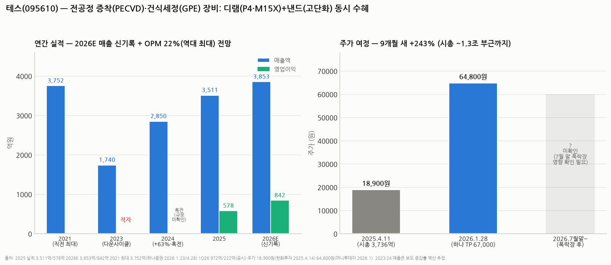

# 테스(095610) 심층분석 — 증착과 세정의 니치 강자, 디램·낸드 동시 수혜 구간

> 작성일: 2026-08-12 · 카테고리: 반도체/종목분석 · 국내 전공정 장비 시리즈: 원익IPS·주성엔지니어링·HPSP에 이은 4번째
> **검증 메모**: 2025 실적(3,511억/578억)·2026E(3,853억/842억, OPM 22% 역대 최대 전망)·2021 최대 매출 3,752억은 하나증권(2026.1.23·4.28), 1Q26(972억/222억)은 공시 보도, 주가는 2025.4.11 18,900원(한화투자)·2026.1.28 64,800원(머니투데이)으로 검증. 2023~24 매출은 보도 증감률(+63.4% 등) 역산 추정. **7월 말 폭락장 이후 현재가 미확인.**

---

## 0. 아주 쉬운 버전 (여기만 읽어도 됨)

**뭐 하는 회사?** 반도체 팹 안에서 쓰는 **전공정 장비** 두 가지를 만든다: ① **PECVD**(플라즈마 증착기) — 웨이퍼 위에 아주 얇은 막을 입히는 기계인데, 테스의 주특기는 **하드마스크(ACL)용**: 나노 회로를 새길 때 쓰는 "새김틀 보호막"을 입힌다. 회로가 미세해질수록, 낸드가 높이 쌓일수록 이 막을 더 많이·더 두껍게 입혀야 해서 장비가 더 팔린다. ② **GPE**(가스 건식 세정기) — 약품 대신 가스로 웨이퍼 표면을 깎고 닦는 기계.

**고객은 사실상 삼성전자·SK하이닉스**(매출의 75%가 국내). 그래서 이 회사 실적은 **두 회사의 팹 투자 계획표 그 자체**다: 2023년 투자 동결 → 테스 적자, 2025~26년 삼성 P4·P5, SK M15X·Y1 투자 러시 → 테스 신기록.

**숫자 요약:**
- 2023 다운사이클 적자 → 2024 매출 +63% 흑자전환 → 2025 매출 3,511억·영업익 578억 → **2026E 매출 3,853억(역대 최대 경신)·영업익 842억(+55%), 영업이익률 22%로 역대 최대 전망**
- 1분기(972억/222억, OPM 23%)로 이미 페이스 확인
- 주가: 2025.4월 18,900원 → 2026.1월 64,800원 (**9개월 +243%**, 시총 ~1.3조 부근). 7월 폭락장 이후는 미확인

**한 줄 평**: 기가비스·심텍처럼 "죽었다 살아난" 사이클 종목인데, 차이점은 **밸류에이션이 상대적으로 온건**하다는 것(1월 기준 선행 PER ~15배대 추산). 화려한 테마 대신 "고객 캐펙스 계획표"라는 가시성으로 승부하는 종목.

---

## 1. 사업 — 무엇을 팔고, 왜 필요해지나

| 제품 | 하는 일 | 왜 갈수록 더 필요한가 |
|---|---|---|
| **PECVD** (주력) | 플라즈마로 박막 증착 — 특히 **ACL(비정질 카본, 하드마스크)**·ARC(반사방지막) | ① 회로 미세화(1c나노)일수록 식각 깊이 대비 마스크가 두꺼워져야 함 ② **낸드 고단화**(200단→400단대)는 한 번에 깊이 뚫는 고종횡비 식각 = 하드마스크 수요 급증 |
| **GPE** (가스 건식 세정) | 가스로 산화막 등을 선택적 제거 | 미세 구조가 약품 세정(습식)을 못 버티는 영역 확대 |
| 기타 | LPCVD 등 | 포트폴리오 보완 |

**포지셔닝**: AMAT·램리서치가 지배하는 증착 시장에서 **하드마스크용 PECVD라는 니치를 국산화**해 삼성·SK 라인에 안착한 케이스. 원익IPS(증착 종합)·주성(ALD)과 겹치는 듯 다른 자리다 — 테스는 "식각을 돕는 증착"에 특화.

**수혜 공식**: 테스 매출 = f(삼성·SK 캐펙스). 지금 변수들이 전부 우호적이다 — 삼성 **P4 가동·P5 준공 앞당김**, SK **M15X(디램)·Y1**, 디램 **1c나노 전환 투자**, 낸드 **고단화 전환 투자**(☞ 레거시·낸드 모델 리포트: 낸드 신규 캐파는 없지만 '전환 투자'는 활발 — 전환 투자가 바로 장비 수요다).

## 2. 실적 — 사이클 그대로, 그러나 이번엔 질이 다르다

| | 2021(직전 최대) | 2023 | 2024 | 2025 | 2026E(하나) |
|---|---|---|---|---|---|
| 매출 | 3,752억 | ~1,740억(역산) | ~2,850억(역산, +63%) | 3,511억 | **3,853억 (신기록)** |
| 영업이익 | — | 적자 | 흑전 | 578억 (16.5%) | **842억 (+55%, OPM 22%)** |

- **1Q26 실적으로 검증됨**: 매출 972억(+15%)·영업익 222억(+37%), **OPM 22.8%** — "이익률 역대 최대" 전망이 이미 분기 숫자로 나오는 중 (더벨: "해외 없이도 이익률 23%")
- **OPM이 좋아지는 이유**: ① 미세화·고단화일수록 장비 사양·판가 상승 ② 반복 수주(전환 투자)는 개발비 부담이 낮음 ③ 환율
- **상저하고가 아니라 상고하저**: 신규 팹 투자(P4·M15X)가 상반기에 집중 — 하나증권도 "상반기 가시성 높고, 하반기는 전환 투자로 감소폭 제한적" 구조로 봄. 분기 피크아웃 논란이 하반기에 나올 수 있다는 뜻(미리 알고 있을 것)

## 3. 밸류에이션

- 1월 말 기준: 주가 64,800원 → 시총 **~1.3조 추산** vs 2026E 영업익 842억(순익 ~700억대 추정) → **선행 PER ~15~18배**
- 하나증권 목표가 67,000원(1/23 상향, EPS +11% 반영) — 목표가가 당시 주가와 큰 차이가 없었다는 건 **1월 시점에 이미 컨센서스 가격에 도달**했었다는 뜻
- 비교: 기가비스(PER 40~100배)·심텍(40~50배)보다 확연히 온건 — 테마 프리미엄 없이 **실적 성장분만 반영된 편**. 거꾸로 말하면 주가 상방도 "실적 추정 상향"에서만 나온다
- 7월 폭락장에서 장비주는 통상 지수보다 깊게 빠진다 — 되돌림이 컸다면 PER 10~12배대 진입 가능성 (확인 필요)

## 4. 리스크

1. **고객 집중 + 캐펙스 사이클** — 매출 75% 국내 2사. 메모리 사이클 피크아웃 → 캐펙스 삭감 → 2023년(적자) 재연이 구조적 숙명. 다만 이번엔 "부족 27~28년까지"(삼성 발언)·전환 투자 지속이 완충
2. **하반기 모멘텀 둔화(상고하저)** — 신규 팹 발주가 상반기 집중이라 3~4분기 QoQ 감소가 나올 수 있음. 실적이 좋아도 "피크아웃" 프레임에 걸리기 쉬운 계절성
3. **경쟁·내재화** — 글로벌 대형사(AMAT 등)의 니치 침투, 고객사의 벤더 다변화
4. **낸드 의존 회복의 양면성** — 낸드 고단화 수혜가 크다는 건 낸드 사이클(변동성 최대 카테고리)에 다시 노출된다는 뜻
5. **주식 수 변동** — 자사주 처분·교환사채(EB) 발행이 EPS를 희석(하나증권이 이미 추정치에 반영)

## 5. 시나리오 (12개월, 가설)

| | 가정 | 함의 |
|---|---|---|
| Bull | P5·Y1 발주 조기화 + 낸드 전환투자 확대 — 2026 OP 1,000억 돌파 | 추정 상향 사이클 — 시총 1.5조+ (PER 18배 유지) |
| Base | 컨센 부합(842억), 상고하저 | 1.0~1.3조 박스 — 하반기 피크아웃 논쟁 반복 |
| Bear | 2027 캐펙스 삭감 시그널(메모리 계약가 협상 실패 등) | 장비주 선행 하락 — 사이클 저점 밸류(PER 8배, ~6,000억)까지 |

**개인 의견(가설)**: 테스는 이번에 다룬 '부활 3인방'(기가비스·심텍·테스) 중 **밸류 부담이 가장 낮고 실적 가시성이 가장 높은** 종목이다. 대신 폭발력(테마 옵션)도 가장 작다 — 유리기판(기가비스)이나 SOCAMM(심텍) 같은 신시장 스토리가 없고, 순수하게 삼성·SK의 투자 계획표를 따라간다. 손익비 관점에선: 폭락장 되돌림으로 PER 10~12배까지 내려와 있다면 "가시성 높은 실적 + 낮아진 가격"의 조합이라 세 종목 중 가장 방어적인 선택지. 관전 포인트는 ① 2Q26 실적(8월 중순)과 하반기 수주 코멘트 ② 삼성 P5·SK Y1 발주 뉴스 ③ 2027 캐펙스 가이던스(내년 초).

---

## 참고 출처 (검증)

- [하나증권 — Earnings Preview: 2026E 3,853억/842억, OPM 22% 역대 최대 (2026.4.28)](https://www.hanaw.com/main/research/research/download.cmd?bbsSeq=1286923&attachFileSeq=1&bbsId=&dbType=&bbsCd=2224)
- [하나증권 — "순항중": TP 67,000 상향, 2026 매출 2021년(3,752억) 경신 전망 (2026.1.23)](https://www.hanaw.com/download/research/FileServer/WEB/industry/enterprise/2026/01/22/TES_260123.pdf) · [머니투데이 보도(1/28 주가 64,800원)](https://www.mt.co.kr/stock/2026/01/23/2026012308004845310)
- [Investing — 1Q26 실적: 매출 972억·영업익 222억 (공시)](https://kr.investing.com/news/global-filings/article-93CH-1942194)
- [더벨 — "해외 없이도 이익률 23%, 초미세공정이 좌우" (2026.6.11)](https://www.thebell.co.kr/front/newsview.asp?key=202606111236093280101982)
- [한화투자 — 2025.4.14: 주가 18,900원·시총 3,736억·TP 29,000](https://www.hanwhawm.com/main/common/common_file/fileView.cmd?category=2&depth3_id=anls1&key1=63850&key2=1&bldid=bbs10031)
- [SK증권 — P5·Y1 준공 앞당김, 디램·낸드 동시 수혜 (2026.4.2)](https://www.datatooza.com/article/20260402085506994752ef32cbea_80)
- 2024 매출 +63.4%·흑자전환: 공시 보도 종합 (2023·24 절대치는 역산 추정)

**저장소 연계**: `원익IPS_심층분석리포트`·`주성엔지니어링_심층분석`(전공정 장비 비교) · `HPSP_심층분석리포트` · `메모리_바텀업_레거시디램낸드_이익모델`(전방 사이클·전환투자 논리) · `기가비스`·`심텍`(부활 3인방 비교) · `테마부활의역사`(사이클 프레임)

> 유의: 7월 말 폭락장 이후 주가 미확인. 2026E는 하나증권 단일 추정 의존도가 높다. 2023~24 절대치는 역산 근사. 매수 추천이 아니며, 매매 전 현재가·2Q26 공시 확인 필수.
