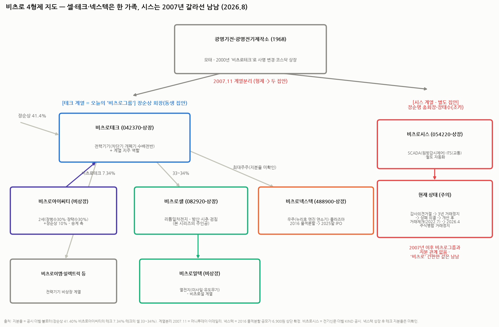

# 비츠로 4형제 — 셀·테크·넥스텍·시스, 뭐가 다르고 어떻게 얽혀 있나

> 작성일: 2026-08-20 · 카테고리: 방산/배경지식 · 비츠로셀 시리즈 부록 (①~⑤와 연계)
> **검증 메모**: 지배구조(장순상 회장 비츠로테크 41.40%·비츠로테크의 비츠로셀 33~34%·비츠로아이씨티의 비츠로테크 7.34%·2세 장범수/장택수 각 30%)는 더벨·블로터·공시 기반. 2007.11 테크/시스 계열분리(장순상 vs 형 장순명 일가)는 머니투데이·이데일리 검증. 비츠로넥스텍(2016 물적분할·누리호 엔진 연소기·공모가 6,900원 상단·코스닥 488900)·비츠로시스(감사의견거절→상폐 의결→거래재개 2022.7→2026.4 주식병합 거래정지)는 보도·KIND 공시 검증. **넥스텍 상장 후 비츠로테크 지분율, 장승국 대표와 장순상 회장의 정확한 관계는 미확인.**

---

## 0. 한 줄씩 요약

| 회사 | 코드 | 뭐 하는 회사 | 그룹과의 관계 |
|---|---|---|---|
| **비츠로셀** | 082920 | **리튬일차전지** — 방산(미사일·포탄)·시추·검침 (본 시리즈 주인공) | 비츠로테크의 자회사 (지분 33~34%) |
| **비츠로테크** | 042370 | **전력기기**(차단기·개폐기·수배전반) + 계열 지주 역할 | **그룹의 몸통이자 모회사** — 장순상 회장 41.4% |
| **비츠로넥스텍** | 488900 | **우주·플라즈마** — 누리호 액체로켓 엔진 연소기·가스발생기 | 2016년 비츠로테크에서 물적분할 → 2025년 말 코스닥 상장한 자회사 |
| **비츠로시스** | 054220 | **자동화 시스템** — SCADA(원방감시제어)·ITS(교통)·철도 | **남남.** 2007년 계열분리로 갈라선 '형님 집안' 회사 — 이름만 같다 |

> 핵심 오해 방지 두 가지: ① **비츠로시스는 비츠로그룹이 아니다** — 2007년에 갈라선 별도 집안이고, 이후 상폐 위기까지 갔던 부실 이력이 있어 "비츠로 = 방산 테마"로 묶어 사면 사고가 난다. ② **비츠로테크를 사면 비츠로셀·넥스텍을 간접 보유**하는 구조다(지주 디스카운트 문제는 후술).

---

## 1. 한 뿌리에서 갈라진 역사 — '광명'에서 '비츠로'로

- **1968년 광명기전·광명전기제작소**가 모태다. 전기 제어·배전 기기 회사로 출발해 2000년 코스닥 상장하며 사명을 **비츠로테크**로 바꿨다
- **2007년 11월, 형제간 계열분리**: 창업 일가의 **형 장순명(총회장) 쪽이 '시스 계열'(비츠로시스 중심)**, **동생 장순상(회장) 쪽이 '테크 계열'(비츠로테크 중심)**을 갖기로 하고 시간외 거래로 지분을 정리했다. 장순명 총회장은 보유하던 비츠로테크 지분을 아들 장태수(장순상의 조카)에게 넘겼다
- 그 후 20년 — 두 집안의 운명이 갈렸다: 테크 계열은 방산·우주 붐을 타고 전성기, 시스 계열은 부실의 늪(§4)

## 2. 테크 계열(오늘의 비츠로그룹) — 3층 구조

### 2.1 비츠로테크 (042370) — 몸통이자 곳간
- **본업**: 전력기기 — 진공차단기·개폐기·수배전반 등, 한전·발전소·플랜트향. 화려하진 않지만 전력 슈퍼사이클(☞ AI데이터센터_전력병목)의 조용한 수혜 업종
- **지주 역할**: 비츠로셀 33~34%, 비츠로넥스텍(최대주주, 상장 후 지분율 미확인) 보유 — **비츠로테크 주가는 "전력기기 본업 + 셀·넥스텍 지분가치"의 합성물**이다. 자회사 둘이 뜰 때 지주도 따라 오르되, 통상 NAV 대비 할인(지주 디스카운트)로 오름폭은 작다
- 최대주주: 장순상 회장 41.40%

### 2.2 비츠로셀 (082920) — 그룹의 이익 엔진
- 리튬일차전지 세계구 강자 — 상세는 시리즈 ①~⑤ 참조. 열전지 자회사 **비츠로밀텍**(미사일용)을 산하에 둔다
- 2026E 영업익 800~950억(컨센) — **그룹 전체에서 돈은 사실상 여기서 번다**

### 2.3 비츠로넥스텍 (488900) — 우주 테마의 막내
- 2016년 비츠로테크의 특수사업부(우주·플라즈마)를 물적분할해 만든 회사 → **2025년 말 코스닥 상장**(공모가 밴드 상단 6,900원 확정)
- **사업**: ① **우주발사체** — 누리호(KSLV-II) 1·2·3단 엔진의 **연소기·가스발생기·열교환 배기시스템·극저온 배관** 제작(국내 유일급 액체로켓 엔진 제작 역량, 매출의 ~60%) ② **플라즈마** — MW급 플라즈마 토치(핵융합·가속기·폐기물 처리 응용)
- 투자 성격: 누리호 민간 이관('한국판 스페이스X' 밸류체인)·차세대발사체 테마주 — **비츠로셀과 달리 아직 이익 체력보다 국책 프로젝트 의존이 큰 성장 스토리주**다. 셀과 넥스텍을 혼동하면 안 되는 이유: 하나는 이익이 검증된 방산 부품사, 하나는 스토리 단계의 우주 부품사

### 2.4 (참고) 승계의 축 — 비츠로아이씨티
- 비상장 **비츠로아이씨티**: 2세 장범수(장남, 비츠로테크 대표)·장택수(차남, 비츠로이엠 대표) 각 30% + 장순상 10% 보유 → 이 회사가 **비츠로테크 지분 7.34%**를 들고 있다. 더벨·블로터 모두 "**아이씨티를 지렛대로 한 승계 밑그림**"으로 해석 — 장순상 회장이 81세(만)라 향후 몇 년 내 승계 이벤트(지분 이동·합병 등)가 나올 개연성이 있는 구조다. 비츠로셀 주주 입장에선 승계 과정에서 셀 지분이 어떻게 움직이는지가 감시 포인트
- 비츠로셀의 장승국 대표(부회장)는 개인 지분 2.39% — 장순상 회장과의 친인척 관계 여부는 **보도로 확인되지 않음(미확인)**. 2017년 공장 화재를 딛고 재건·성장을 이끈 장수 CEO라는 점만 팩트로 적어둔다

## 3. 이름은 같은데 남남 — 비츠로시스 (054220)

- **사업**: SCADA(발전·상하수도 원방감시제어)·ITS(지능형 교통)·철도 자동화 — 전지도 우주도 아닌 시스템통합(SI) 성격
- **관계**: 2007년 계열분리로 **비츠로그룹(테크 계열)과 지분 관계가 끊긴** 형님 집안 회사. '비츠로'라는 간판만 공유
- **부실 이력(중요)**: 감사의견 거절 → **3년 거래정지** → 자본잠식률 90%대 → 거래소 **상장폐지 의결(2021.2)** → 개선기간 부여 후 **거래재개(2022.7)** → 이후에도 CB·유상증자로 연명 → **2026년 4월 주식병합(감자성)으로 재차 거래정지**. 계열이던 비츠로씨앤씨 회생절차의 지급보증 채무(119억)가 터진 이력도 있다
- **투자 함의**: 방산·우주 테마가 달아오를 때 '비츠로'로 검색해 4형제가 같이 묶여 오르내리는 일이 실제로 생기는데, **시스는 펀더멘털상 그 테마와 무관**하다. 테마 매매의 전형적 함정 (☞ `테마부활의역사`의 '간판만 같은 동반 급등' 패턴)

## 4. 투자자용 치트시트 — "비츠로 뭐 사야 하는데?"에 대한 구조적 답

| 원하는 노출 | 정답 | 이유 |
|---|---|---|
| 방산 전지(미사일·포탄·드론)·시추·LIC | **비츠로셀** | 이익이 검증된 본체 — 시리즈 ⑤의 4단 로켓 |
| 우주발사체(누리호·차세대발사체) | **비츠로넥스텍** | 순수 우주 노출 — 단 스토리주 밸류 리스크 |
| 둘 다 싸게(할인 감수) + 전력기기 | **비츠로테크** | 셀+넥스텍 간접 보유 — 지주 디스카운트와 승계 이벤트 변수 |
| — | 비츠로시스는 위 어느 것도 아님 | 부실 이력 SI 회사 — 테마 착시 주의 |

**같이 보면 좋은 관전 포인트**: ① 넥스텍 상장으로 테크의 NAV가 '보이는 숫자'가 됐다 — 지주 디스카운트가 얼마나 벌어지는지 ② 아이씨티 중심 승계 이벤트 ③ 비츠로셀 블록딜·지분 변동 공시(승계 재원 마련 경로가 될 수 있음 — 리노공업에서 본 창업자 엑시트 패턴의 예방적 감시).

---

## 참고 출처 (검증)

- [머니투데이 — '비츠로 형제' 계열 분리 마무리 (2007.12): 테크 계열(장순상) vs 시스 계열(장순명·장태수)](https://news.mt.co.kr/mtview.php?no=2007120711331594249) · [이데일리 — 3년 전 테크-시스 계열 구분](https://m.edaily.co.kr/amp/read?mediaCodeNo=257&newsId=01082406596153800)
- [더벨 — 비츠로아이씨티, 비츠로테크 승계 발판되나: 장순상 41.40%·아이씨티의 테크 7.34%·2세 각 30%](https://www.thebell.co.kr/front/newsview.asp?key=202102161754150120102164) · [블로터 — 비츠로그룹 줌인 ①②: 조직 재편과 승계 밑그림 (2026.2)](https://www.bloter.net/news/articleView.html?idxno=655013)
- [비즈니스포스트 — Who Is 장순상 비츠로그룹 회장](https://www.businesspost.co.kr/BP?command=article_view&num=351741) · [— Who Is 장승국 비츠로셀 대표 부회장](https://www.businesspost.co.kr/BP?command=article_view&num=412210)
- [에너지경제 — 우주발사체 핵심 부품사 비츠로넥스텍, 코스닥으로 쏜다 (2025.11): 2016 물적분할·누리호 엔진 연소기·우주 매출 60%](https://m.ekn.kr/view.php?key=20251105024203788) · [뉴스톱 — 공모가 상단 6,900원 확정·확약 29.8%](https://www.newstopkorea.com/news/articleView.html?idxno=40945)
- [전기신문 — 비츠로시스 상장폐지 사유 발생 공시](https://www.electimes.com/news/articleView.html?idxno=216650) · [더벨 — '상폐 불식' 비츠로시스 재기 발판 (2023.1)](https://www.thebell.co.kr/front/newsview.asp?key=202301300743521360104185) · [네이트/뉴스 — 주식병합 거래정지 (2026.4.21)](https://news.nate.com/view/20260421n32592) · [KIND — 거래정지 해제 공시 (2022.7.11)](https://kind.krx.co.kr/common/disclsviewer.do?method=searchInitInfo&acptNo=20220711000678)
- 비츠로셀 지분 구조(테크 33~34%·장승국 2.39%·장순상 1.23%): 공시·보도 종합

**저장소 연계**: `비츠로셀_심층분석리포트`(①)~`비츠로셀_용도별심화`(⑤) · `테마부활의역사`(간판 동반 급등 함정) · `거시및정책/AI데이터센터_전력병목`(비츠로테크 전력기기 배경)

> 유의: 넥스텍 상장 후 비츠로테크 지분율·장승국-장순상 친인척 여부·비츠로시스의 현 최대주주는 미확인. 승계 관련 서술은 언론 해석 기반 관측이지 확정 사실이 아님. 매수 추천 아님.
