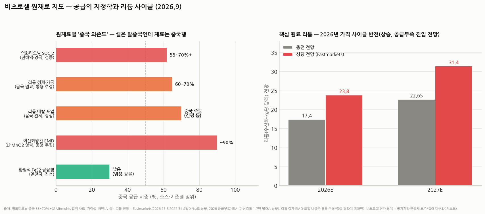

# 비츠로셀 배경지식 — 일차전지의 원재료, 그 공급의 지정학과 전망 (시리즈 ⑥)

> 작성일: 2026-09-03 · 카테고리: 방산/배경지식 · 비츠로셀 시리즈 ⑥ (①개요 ②부문·재무 ③일차vs이차 ④기존vs신규 수요 ⑤용도별·마진 + 부록 계열지도)
> **검증 메모**: 염화티오닐 중국 공급 비중 55~70%+(GMInsights 등 시장조사·업계 자료, 카이성 15만 t/y·진허 10만 t 증설, 장쑤·산둥·후베이 클러스터)·리튬 가격 전망 상향(Fastmarkets 2026E 23.8달러/kg·2027E 31.4달러/kg, **2026년 공급부족 진입** 전망 / BMI 탄산리튬 1.7만 달러/t 상향)·ESS발 리튬 수요(+71%('25)→+55%('26) 전망)·리튬 메탈 포일 시장의 중국(간펑 등) 주도와 서방 대안(리오틴토 LIOVIX·Li-Metal 등)·비츠로셀의 대응(장기계약 2~3년에 원가 인상 반영·판가 연동제 일부·**호주/칠레 공급처 다변화**)은 검색·보도·IR 검증. 전지 화학별 재료 구성은 표준 공학 지식. **EMD·리튬 정제의 중국 비중 수치와 부문별 원가 구성비는 통용 추정/미확인(표기), 회사의 구체 매입처는 사업보고서 열람 필요(프록시 차단으로 원문 미확인).**

---

## 0. 아주 쉬운 버전 (여기만 읽어도 됨)

**비츠로셀 전지의 재료는 뭘로 돼 있나?** 제품군마다 다르지만 공통의 주인공은 둘이다 — **① 리튬 금속**(음극: 전자를 내놓는 쪽. 은박지처럼 얇게 편 리튬 포일)과 **② 염화티오닐(SOCl₂)**(주력 Li-SOCl₂ 전지에서 전해액이자 양극 역할까지 겸하는 독한 액체). 여기에 제품별로 이산화망간(Li-MnO₂), 불화탄소(Li-CFx), 황철석·공융염(열전지) 같은 조연이 붙는다.

**공급의 지정학이 핵심 관전 포인트다**: 얄궂게도 — 미 국방부가 "중국산 배터리 못 쓴다"며 비츠로셀을 찾아왔는데(시리즈 ⑤), 정작 그 전지의 **핵심 원재료 두 가지가 모두 중국이 꽉 잡은 시장**이다. 염화티오닐은 세계 생산의 55~70%+가 중국이고, 리튬도 정제·금속 가공 단계는 중국(간펑 등)이 주도한다. "셀은 탈중국인데 재료는 중국행"이라는 모순 — 이게 리스크이자, 비중국 공급망을 먼저 완성하는 회사에게는 프리미엄 기회다.

**가격 전망은 역풍 방향**: 2023~25년 폭락했던 리튬이 **2026년 공급부족으로 반전** — Fastmarkets는 2026년 전망을 kg당 17.4→23.8달러로, 2027년은 31.4달러로 대폭 상향했다(ESS 수요 폭증 탓). 다행히 비츠로셀은 **장기계약에 원가 인상분을 반영**하고 **판가 연동제**를 일부 시행 중이라 전가 장치가 있다 — 마진 훼손보다는 '전가 시차' 리스크로 보는 게 정확하다.

---

## 1. 제품별 원재료 해부 — 뭐가 얼마나 들어가나

전지의 기본 구조 복습(☞ 시리즈 ③): 전자를 내놓는 **음극** + 전자를 받는 **양극** + 이온이 오가는 **전해액** + 둘을 격리하는 분리막 + 용기.

| 제품(화학) | 음극 | 양극 | 전해액 | 기타 핵심 부자재 |
|---|---|---|---|---|
| **Li-SOCl₂** (Bobbin·Wound·고온 — 매출의 ~70%대 기반) | **리튬 금속 포일** | 탄소(카본블랙) — 반응은 SOCl₂가 담당 | **염화티오닐(SOCl₂)+리튬염(LiAlCl₄)** — 전해액이 양극 활물질 겸직 | 유리섬유 분리막, 유리-금속 밀봉(GTMS) 단자, 스테인리스 캔 |
| **Li-MnO₂** (군 통신·드론 일부) | 리튬 금속 포일 | **이산화망간(EMD)** | 유기 전해액(LiClO₄ 등) | 분리막·캔 |
| **Li-CFx** (자폭드론·특수) | 리튬 금속 포일 | **불화탄소(CFx)** | 유기 전해액 | 고에너지밀도용 — 단가 최고급 |
| **열전지** (미사일 — 비츠로밀텍) | **리튬-실리콘 합금** | **황철석(FeS₂, 파이라이트)** | **공융염(LiCl-KCl)** — 평소 고체, 착화 시 용융 | 착화제(지르코늄계)·단열재·발열제 |
| **앰플전지** (포탄 신관) | 전지 화학은 제품별 상이 | — | **유리 앰플에 밀봉된 전해액** | 정밀 유리 앰플·충격 활성화 구조물 |

**포인트 3개**:
1. **리튬 금속이 전 제품의 공통 분모** — 이차전지(리튬 '이온'만 왕복)와 달리 일차전지는 **리튬 덩어리 그 자체(금속 포일)**를 쓴다. 그래서 리튬 가격·리튬 금속 가공 공급망에 전 제품이 노출
2. **염화티오닐이 주력 화학의 심장** — 에너지밀도와 10~20년 수명의 비결이 이 물질이다. 맹독성·부식성(수분과 만나면 염산 가스)이라 아무나 못 만들고 못 다루는 것 자체가 비츠로셀 같은 셀 메이커의 진입장벽이기도 하다
3. **열전지 재료는 상대적으로 안전지대** — 황철석·염류는 범용 광물이라 공급 리스크가 낮다. 방산 성장축(열전지)의 재료 조달이 편하다는 건 증설 실행에 유리한 조건

## 2. 공급처의 지정학 — "셀은 탈중국, 재료는 중국행"의 모순

### 2.1 염화티오닐(SOCl₂): 가장 집중된 급소
- **중국이 세계 생산의 55~70%+** — 장쑤·산둥·후베이의 화학 클러스터에 집중(최대 업체 카이성 연 15만 톤, 진허 10만 톤 증설 등). 염소·황 화학의 부산물 계열이라 싼 전기·통합 화학단지가 있는 중국이 원가 우위
- 서방 대안: 독일(랑세스)·인도 등 소수 — 물량 제한적. 독성물질이라 신규 인허가 장벽이 높아 **공급처 교체가 어려운 품목**
- 리스크 시나리오: 중국의 수출 통제 카드화(갈륨·흑연 전례) — 방산용 전지 원료라는 점에서 통제 리스트에 오를 개연성이 '0'이 아니다. 발생 시 전 세계 Li-SOCl₂ 업계 공통 충격(비츠로셀만의 문제는 아님 — 사프트도 같은 처지)

### 2.2 리튬: 광산은 분산, 가공은 중국
- **광산(원료)**: 호주(경암)·칠레(염호)·아르헨티나 — 채굴 단계는 비중국이 다수. 비츠로셀이 다변화 대상으로 **호주·칠레를 직접 언급**한 배경
- **정제·금속화(중간)**: 수산화·탄산리튬 정제와 **리튬 '금속' 전환·포일 압연은 중국(간펑리튬 등)이 주도** — 일차전지가 쓰는 건 바로 이 금속 포일이다. 서방 대안(미 리벤트 계열, 리오틴토 LIOVIX, 캐나다 Li-Metal 등)이 크고 있으나 아직 소규모
- **미국의 대응**: DoE 리튬 배터리 국가 블루프린트 등으로 자국 리튬 금속 가공을 전략 육성 중 — **펜타곤이 비츠로셀에 요구할 '탈중국 공급망'은 셀만이 아니라 재료 원산지까지 소급될 가능성**이 높다. 비츠로셀의 호주·칠레 다변화는 이 요구에 대한 선제 대응으로 읽힌다
- 참고: 솔리드스테이트(전고체) 배터리도 리튬 금속 음극을 쓴다 — 전고체가 상용화될수록 리튬 금속 포일 수요 경쟁이 격화되는 구조적 변수

### 2.3 기타
- **이산화망간(EMD)**: 전해 이산화망간은 중국 비중이 압도적(~90% 통용 추정) — Li-MnO₂ 제품의 급소이나 매출 비중이 작아 전사 영향 제한
- **불화탄소(CFx)**: 일본·중국 소수 업체 — 자폭드론용 확대 시 조달 전략 필요(세부 미확인)
- **황철석·공융염·캔·분리막**: 범용 — 리스크 낮음

## 3. 가격 전망 — 리튬 사이클이 반전했다

- **2023~25년**: 리튬 대폭락(공급 과잉) — 일차전지 업계엔 원가 순풍이었던 구간(비츠로셀 OPM 개선의 조용한 조력자)
- **2026년~**: **공급부족 진입** — Fastmarkets는 2026 전망을 kg당 **17.4 → 23.8달러**, 2027년을 **22.65 → 31.4달러**로 대폭 상향(BMI도 상향). 동력은 EV보다 **ESS(전력저장) 수요 폭증**(+71%('25)→+55%('26) 전망) — AI 데이터센터·재생에너지발 수요라 구조적(☞ 전력병목 리포트와 같은 뿌리)
- **염화티오닐**: 시장 자체는 완만 성장(전지·농약·의약 중간체 수요) — 중국 증설로 가격 급등 리스크는 낮으나, '가격'보다 '접근'(수출통제)이 본질 리스크
- **비츠로셀 손익에의 번역**: ① 원가에서 리튬·SOCl₂ 비중은 유의미하나 인건비·가공비가 큰 사업이라 원재료가 원가의 전부는 아니다(구성비 비공시 — 미확인) ② **전가 장치 3종**이 확인돼 있다: 2~3년 장기계약에 원가 인상분 반영 완료 + 판가 연동제 일부 시행 + 공급처 다변화(호주·칠레). 결론: 리튬 상승은 **마진 훼손 리스크라기보다 '전가 시차'(분기 단위) 리스크** — 2017년 화재 후 재건기처럼 원가 충격에 취약했던 시절과는 체력이 다르다

## 4. 종합 — 리스크와 기회의 저울

| | 내용 | 평가 |
|---|---|---|
| **리스크 ①** | 염화티오닐 중국 집중(55~70%+) — 수출통제 시나리오 | 발생 확률 낮음/파급 최대 — 업계 공통 리스크. 감시: 중국 수출통제 품목 발표 |
| **리스크 ②** | 리튬 가격 상승 사이클(2026~) | 전가 장치로 완충 — 분기 마진 노이즈 수준 예상(추정) |
| **리스크 ③** | 리튬 '금속 포일' 가공의 중국 주도 — 펜타곤 요구가 재료 원산지까지 소급될 가능성 | 중기 과제 — 서방 포일 공급망 성숙(리오틴토·Li-Metal 등)과 동행 필요 |
| **기회 ①** | **비중국 재료 공급망을 먼저 완성하면 미군 납품의 자격이 곧 해자** — 호주·칠레 다변화는 그 포석 | 시리즈 ⑤의 '펜타곤 수천억' 논의와 직결 |
| **기회 ②** | 열전지(방산 성장축)는 재료 안전지대 — 증설 실행에 원재료 병목 없음 | 로케트산 캐파 2배 계획의 숨은 우군 |

**한 줄 결론**: 비츠로셀의 원재료 이야기는 "원가"의 이야기라기보다 **"원산지"의 이야기**다 — 리튬 가격은 전가하면 그만이지만, 미군이 요구하는 탈중국 재료 조달을 누가 먼저 증명하느냐가 이 산업의 다음 진입장벽이 된다. 호주·칠레 다변화를 이미 시작한 비츠로셀은 그 시험에서 앞서 있는 편이다.

---

## 참고 출처 (검증)

- [GMInsights — 염화티오닐 시장: 중국 클러스터(장쑤·산둥·후베이)·카이성 15만 t/y·진허 증설](https://www.gminsights.com/industry-analysis/thionyl-chloride-market) · 중국 비중 55~70%+: 시장조사·업계 자료 종합(소스별 범위)
- [Mining Weekly — BMI 리튬 전망 상향(탄산리튬 1.7만 달러/t) (2026.4.24)](https://www.miningweekly.com/article/bmi-revises-lithium-price-forecast-upwards-amid-tightening-supply-2026-04-24) · [Panorama Minero — Fastmarkets: 2026 공급부족 진입, 2026E 23.8·2027E 31.4달러/kg로 상향](https://www.panorama-minero.com/en/news/fastmarkets-says-lithium-is-entering-a-new-phase-as-demand-outpaces-supply) · [MIT Tech Review — 2026 리튬의 해·ESS 수요 급증](https://www.technologyreview.com/2026/01/22/1131563/lithium-2026/)
- [GMInsights — 리튬 메탈 포일 시장: 간펑·차이나에너지리튬·리오틴토(LIOVIX)·Li-Metal 등 플레이어](https://www.gminsights.com/industry-analysis/lithium-metal-anode-foil-market) · [간펑리튬 — 리튬 금속·포일 제품군](https://www.ganfenglithium.com/product_en.html) · [국제리튬협회 — 리튬 금속 전망·DoE 블루프린트](https://lithium.org/a-bright-future-for-lithium-metal/)
- [더인베스트 — 비츠로셀: 원가 인상 반영 장기계약(2~3년)·가격 연동제 일부·호주/칠레 공급처 다변화](https://www.theinvest.co.kr/article/963)
- 전지 화학별 재료 구성(Li-SOCl₂·열전지 등): 표준 공학 지식 · 펜타곤 공급망 논의: 시리즈 ⑤ 검증분

**저장소 연계**: `비츠로셀_심층분석리포트`(①)~`비츠로셀_용도별심화`(⑤) · `비츠로셀_배경지식_일차전지vs이차전지`(③ — 전지 구조 기초) · `거시및정책/AI데이터센터_전력병목`(ESS발 리튬 수요의 뿌리) · `정유및석유화학/배경지식_폴리실리콘`(같은 '원산지의 지정학' 프레임)

> 유의: EMD·리튬 정제·포일의 중국 비중 수치는 통용 추정/정성, 부문별 원가 구성비·구체 매입처는 미확인(사업보고서 원문 열람 권장 — 프록시 차단). 수출통제 시나리오는 가설. 매수 추천 아님.
