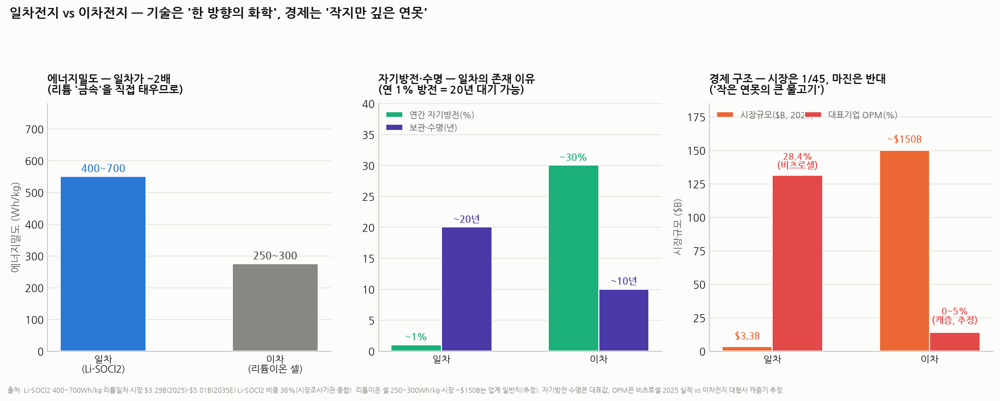

# 일차전지 vs 이차전지, 그리고 일차전지의 진입장벽·경쟁 지도 (비츠로셀 시리즈 ③ — 배경지식편)

> 작성일: 2026-08-15 · 카테고리: 방산/배경지식 · 시리즈: ①`비츠로셀_심층분석리포트`(개요) ②`비츠로셀_심화분석_부문별수요재무신사업`(부문·재무·경쟁사) ③본편(산업 원리)
> 질문: ① 일차전지와 이차전지의 기술적·경제적 차이 ② 일차전지 분야의 진입장벽, 예비 경쟁자·현재 경쟁자 세부 분석
> **검증 메모**: 시장 수치(리튬일차 $3.29B(2025)→$5.01B(2035E), Li-SOCl₂ 비중 36%·연 50억 셀+, EVE 점유 ~16%·캐파 28억 셀/년, 스마트미터 글로벌 10억대+)는 시장조사기관 종합으로 검증. 에너지밀도(Li-SOCl₂ 400~700Wh/kg)는 복수 출처 일치. 이차전지 비교치(셀 250~300Wh/kg, 시장 ~$150B)는 업계 일반치(추정 표기). 화학 원리는 표준 전기화학 지식.

---

## 0. 한 장 요약

> 일차전지와 이차전지는 같은 '배터리'가 아니라 **다른 사업**이다. 기술적으로 일차전지는 **되돌릴 수 없는 화학반응을 한 방향으로 태우는 것**이라 에너지밀도가 2배(400~700Wh/kg)에 자기방전이 연 1%지만 충전이 안 되고, 이차전지는 리튬 이온을 왕복시키는 **가역 반응**이라 충전이 되는 대신 밀도·보존성이 열등하다. 경제적으로는 정반대다 — 이차전지는 **$150B 시장의 치킨게임**(캐즘기 OPM 0~5%), 일차전지는 **$3.3B 시장의 과점 연못**(비츠로셀 OPM 28%). 진입장벽의 본질은 기술이 아니라 **"20년 실증 데이터 + 군납 인증 + 시장이 작아서 대기업이 안 들어옴"**이라는 시간·인증·유인의 3중 장벽이다.

---

## 1. 기술적 차이 — '한 방향의 화학' vs '왕복하는 화학'

### 1.1 원리부터 (배경지식 0 기준)

- **이차전지(리튬이온)** = **회전문**. 리튬 '이온'이 음극(흑연)과 양극 사이를 **왕복**한다. 전극 구조는 그대로 두고 이온만 오가므로 충전(되돌리기)이 가능하다. 대신 ① 이온을 담아둘 '선반'(흑연 등)이 무게를 차지하고 ② 회전문이 조금씩 마모된다(사이클 열화) ③ 문틈으로 조금씩 샌다(자기방전 월 수%).
- **일차전지(Li-SOCl₂ 등)** = **장작**. 리튬 '금속' 자체가 연료다. Li + 염화싸이오닐(SOCl₂)이 반응해 염화리튬(LiCl)·황·이산화황이 되는 **비가역 반응**으로 전기를 뽑는다. 한 번 타면 끝이지만 —
  - **에너지밀도 ~2배**: 선반(흑연) 없이 리튬 금속(이론용량 3,860mAh/g, 흑연의 10배)을 직접 쓰므로 **400~700Wh/kg** (리튬이온 셀 250~300Wh/kg)
  - **자기방전 연 ~1%**: 반응 초기에 리튬 표면에 생기는 **부동태 피막(LiCl)**이 저절로 '뚜껑' 역할을 해 내부 반응을 차단 → **10~20년 보관** 가능
  - **전압 3.6V 일정 + 극한온도**: -55°C~+85°C(고온형은 150°C+)에서 작동 — 이차전지는 0°C 이하 충전이 사실상 불가

### 1.2 각 화학의 대표 선수 (비츠로셀 제품과 연결)

| 화학 | 특기 | 비츠로셀 제품 |
|---|---|---|
| Li-SOCl₂ 보빈형 | 초장수명·저전류 | Bobbin (스마트미터) |
| Li-SOCl₂ 권취형 | 고출력 | Wound (군 통신) |
| Li-SOCl₂ 고온형 | 125~200°C | 고온전지 (시추) |
| 리저브형 (앰플·열전지) | **보관 중 반응 자체를 차단**(전해액 분리/고체 염) → 발사 순간 활성화. 자기방전 0 | 앰플전지·열전지 (유도무기) |
| Li-MnO₂, Li-CFx | 중출력·안전성 | 자폭드론용 (신규) |

- **약점도 화학에서 나온다**: ① 부동태 피막이 두꺼워지면 첫 방전 때 전압이 순간 처지는 **전압지연(voltage delay)** — 이걸 제어하는 게 각사의 핵심 노하우 ② 보빈형은 대전류에 약함 ③ SOCl₂는 맹독·부식성 물질이라 제조가 위험하다(뒤의 진입장벽과 직결)

### 1.3 기술 선택의 결론

> **"충전할 수 있느냐"가 아니라 "언제 쓸지 모르는 에너지를 몇 년이나 손실 없이 보관하느냐"가 기준이면 일차전지 외에 대안이 없다.** 미사일(10년 비축 후 1회 작동)·검침기(20년 무교체)·시추공(150°C)이 그 시장이다. 이차전지·에너지 하베스팅이 기술적으로 아무리 발전해도 이 '보관' 물성만큼은 화학 원리상 따라오기 어렵다.

---

## 2. 경제적 차이 — 왜 작은 시장이 더 돈이 되나

| | **이차전지 (리튬이온)** | **일차전지 (리튬)** |
|---|---|---|
| 시장 규모(2025) | ~$150B (업계 일반치) | **$3.3B** — 1/45 크기 |
| 성장률 | 높지만 사이클 극심 (EV 캐즘) | CAGR ~4.3% — 낮지만 꾸준 |
| 경쟁 구조 | 한·중·일 대기업 치킨게임 | **과점** (사프트 그룹 ~50% + 비츠로셀 + 소수) |
| 대표 마진 | 캐즘기 OPM 0~5% 추정 (적자 다수) | **비츠로셀 28.4%** |
| 자본 구조 | 기가팩토리 — 조 단위 CAPEX, 규모의 경제 게임 | 다품종 소량 — 수백억 CAPEX, **신뢰성 게임** |
| 가격 결정 | Wh당 가격 (커머디티화) | **고장 비용 대비 가격** — 검침기 전지 교체 출장비가 전지값의 10배라, 전지가 2배 비싸도 오래 가는 쪽이 싸다 (총소유비용 TCO 논리) |
| 판매 방식 | 대형 고객 수주·LTA | 인증 후 **설계 반영(design-in)** — 한 번 채택되면 제품 수명 내내 공급 |

**핵심 통찰**: 이차전지는 "얼마나 싸게 많이"의 규모 산업이고, 일차전지는 "**얼마나 확실하게**"의 신뢰 산업이다. 시장이 작다는 것(=대기업 유인 부족)이 오히려 기존 업체의 마진을 지켜주는 **구조적 보호막**으로 작동한다 — 비츠로셀 OPM 28%는 이 구조의 산물이다.

---

## 3. 진입장벽 — 왜 새 경쟁자가 안 나타나나 (5중 장벽)

1. **시간 장벽 (가장 근본)**: "20년 수명"은 마케팅이 아니라 **실증 데이터**다. 신규 진입자는 20년 가속수명시험+현장 데이터를 물리적으로 가질 수 없다 — 후발주자가 돈으로 살 수 없는 유일한 자산이 '경과 시간'.
2. **인증 장벽**: 군납(국방규격·보안 인증), 유전(API·고온 현장 인증), 유틸리티(수도·가스·전기 안전 인증)까지 용도마다 수년짜리 인증이 겹겹이다. 특히 **미국·유럽 방산 조달은 중국산 배터리를 규정으로 배제**(NDAA 계열 규제) — 중국 EVE가 물량 16%를 쥐고도 방산·고온에 못 들어오는 이유.
3. **안전·공정 장벽**: SOCl₂는 맹독·부식성 — 취급 설비, 주액·실링 공정, 사고 이력 관리가 수십 년 노하우 영역. 이차전지 공정과 설비가 달라 **이차전지 대기업이 전용(轉用)으로 들어올 수도 없다.**
4. **전환비용 장벽**: 고객 입장에서 전지 불량 1개 = 현장 교체 출장(전지값의 10배)이거나 미사일 불발이다. 검증된 벤더를 몇 푼 아끼려 바꿀 유인이 없어 **design-in이 사실상 종신 계약**처럼 작동.
5. **유인 부족 장벽**: 시장 $3.3B — 삼성SDI·LG엔솔·CATL 같은 대기업엔 "뚫는 비용 대비 너무 작은" 시장. **"돈이 되기엔 작고, 뚫기엔 깊다"**는 조합이 니치 과점을 영속시킨다.

---

## 4. 경쟁자 세부 분석 — 현재와 예비

### 4.1 현재 경쟁자 (세부)

| 회사 | 국적·소속 | 규모·점유 | 강점 영역 | 비츠로셀과의 접점 |
|---|---|---|---|---|
| **사프트(Saft)** | 프랑스·토탈에너지스 | 그룹(타디란 포함) 점유 **~50%** — 1위 | 풀라인업(일차+이차+우주·방산), 서방 방산 레퍼런스 | 전 부문에서 상위 호환 경쟁자. 단, 가격은 비츠로셀이 유리한 것으로 평가 |
| **타디란(Tadiran)** | 이스라엘·사프트 자회사(2000년 피인수) | 사프트 그룹에 포함 | Bobbin 장수명의 원조 브랜드, 유럽 미터기 | Bobbin 시장의 브랜드 경쟁 |
| **EVE에너지** | 중국 | 리튬일차 점유 **~16%**, 캐파 **28억 셀/년**(ER14250/14505 등) | **초저가 대량 원통형** — 중국 내수 미터기·IoT 장악 | **Bobbin 저가 시장의 최대 위협.** 단 인증 장벽으로 방산·고온·서방 유틸리티 프리미엄 시장 진입 불가 |
| **이글피처(EaglePicher)** | 미국 (사모펀드 계열) | 미 국방부 미사일 전지 **~85%** | 열전지·우주·방산 — 미군 표준 그 자체 | 열전지에서 '아성'. 비츠로셀 미군 진입은 이글피처의 2nd 벤더 포지션 (☞ 심화편 §5) |
| **울트라라이프(Ultralife)** | 미국 (NASDAQ) | 소형 | 군용 휴대 전지(BA-5390 등), 통신 | Wound·군 통신 영역 경쟁 |
| **일렉트로켐(Electrochem)** | 미국 (Integer 계열) | 소형 | **다운홀(시추) 고온전지** 전문 | 고온전지 직접 경쟁자 |
| **ASB그룹** | 프랑스·독일 합작 | 소형 | 유럽 미사일 열전지 | 유럽 방산 수출 시 경쟁 |

**구도 해석**: 시장은 "1강(사프트 그룹) — 1중(비츠로셀) — 다(多)니치(이글피처·일렉트로켐 등 용도별 전문사) — 1저가(EVE)"다. 비츠로셀의 독특함은 **니치 여러 개(미터기+방산+고온)를 한 회사가 다 하는 유일한 독립 중견**이라는 것 — 사프트처럼 크지 않고, 이글피처처럼 한 우물도 아니다. 이 포트폴리오 다각화가 실적 안정성(한 니치 부진을 다른 니치가 상쇄)의 원천이다.

### 4.2 예비 경쟁자 — 올 수 있는 곳과 못 오는 곳

| 후보 | 가능성 | 근거 |
|---|---|---|
| **중국 EVE 등 저가 진영의 고부가 침투** | **중간 — 최대 감시 대상** | 캐파 28억 셀은 이미 세계 최대 물량. 서방 인증을 우회할 수 없지만, 신흥국 미터기·상업용 IoT부터 잠식 가능 → Bobbin 수출 단가 추이가 조기 경보 지표 |
| 이차전지 대기업의 진출 | **낮음** | 공정·설비 비호환 + 시장 유인 부족(§3-5) — 캐즘기에 $3.3B 니치에 들어올 이유가 없음 |
| 인도·동남아 신규 제조사 | 낮음 | 시간·인증 장벽(§3-1·2)에 정면으로 막힘 — 로컬 미터기 시장부터 시작할 수는 있음 |
| 방산 대기업의 내재화 (한화·LIG 등) | 낮음~중간 | 유도무기 물량이 커지면 전지 내재화 유인이 생길 수 있으나, 현재는 전문사 조달이 관행. 장기 감시 항목 |
| **대체 기술** — 에너지 하베스팅(자가발전 IoT 센서), 전고체 소형전지, 슈퍼커패시터 하이브리드 | **장기 유일한 구조적 위협** | 전지 없이 진동·빛으로 작동하는 센서가 확산되면 Bobbin 수요 자체가 줄어드는 시나리오. 다만 10~20년 무보수 신뢰성 기준을 넘으려면 아직 멀고, 방산·시추엔 적용 불가 |

**결론**: 단기(3~5년) 신규 진입 위협은 사실상 없고, 실질 위협은 **기존 플레이어 간 영역 침범**(EVE의 상향 침투 vs 비츠로셀의 미군 시장 상향 침투)이다. 흥미롭게도 비츠로셀 자신이 이 시장에서 **가장 공격적인 '침입자'**(이글피처의 미국 안방 공략)라는 점 — 장벽이 높은 시장에서는 방어자보다 성공한 침입자의 가치 상승폭이 크다.

---

## 5. 30초 복습

1. 일차전지 = **장작**(비가역, 밀도 2배·자기방전 연 1%·20년 보관), 이차전지 = **회전문**(가역, 충전 가능·보존성 열위)
2. "언제 쓸지 모르는 에너지의 장기 보관"에는 일차전지 외 대안 없음 — 미사일·검침기·시추공
3. 경제 구조는 정반대: 이차 $150B 치킨게임 vs 일차 **$3.3B 과점 연못**(OPM 28%)
4. 진입장벽 5중: **시간(20년 실증)·인증(군납/NDAA)·안전공정(SOCl₂)·전환비용(design-in)·유인부족(시장이 작음)**
5. 현 구도: 1강(사프트 ~50%)-1중(비츠로셀)-다니치(이글피처 등)-1저가(EVE 16%)
6. 감시할 것: EVE의 상향 침투(Bobbin 단가), 에너지 하베스팅(초장기), 그리고 비츠로셀 자신의 미군 침투 성사 여부

---

## 참고 출처 (검증)

- 리튬일차전지 시장 $3.29B(2025)→$5.01B(2035E)·CAGR 4.3%·Li-SOCl₂ 비중 36%($1.18B)·연 50억 셀·EVE 점유 ~16%·캐파 28억 셀/년·스마트미터 10억대+: [Market Reports World](https://www.marketreportsworld.com/market-reports/primary-lithium-batteries-market-14726023)·[Global Growth Insights](https://www.globalgrowthinsights.com/market-reports/primary-lithium-battery-market-121346) 등 시장조사기관 종합
- Li-SOCl₂ 에너지밀도 400~700Wh/kg: 상동 (복수 출처 일치)
- 사프트-타디란 인수(2000)·그룹 점유 ~50%·비츠로셀 3위: [EBN](https://www.ebn.co.kr/news/articleView.html?idxno=1669704)
- 이글피처 미 국방부 미사일 전지 ~85%: [Military Aerospace](https://www.militaryaerospace.com/commercial-aerospace/article/14227021/time-to-replace-the-batteries-eaglepicher-to-provide-thermal-lithium-batteries-for-air-force-harm-anti-radiation-missile)
- 전기화학 원리(부동태 피막·전압지연·리저브형 구조): 표준 전기화학·전지공학 지식
- 리튬이온 셀 250~300Wh/kg·시장 ~$150B·캐즘기 마진: 업계 일반치 (추정 표기)

**저장소 연계**: `비츠로셀_심층분석리포트`(①) · `비츠로셀_심화분석_부문별수요재무신사업`(② — 경쟁사 지도 §5와 상호보완) · `2차전지/` 폴더(이차전지 캐즘 배경) · `테마부활의역사`(니치 vs 커머디티 프레임)

> 유의: 이차전지 비교치와 OPM은 추정 포함. 시장 규모는 기관별 정의(리튬일차 vs 전체 일차)에 따라 $3B~$10B+로 편차가 있다 — 본 리포트는 '리튬 일차전지' 기준. 매수 추천 아님.
