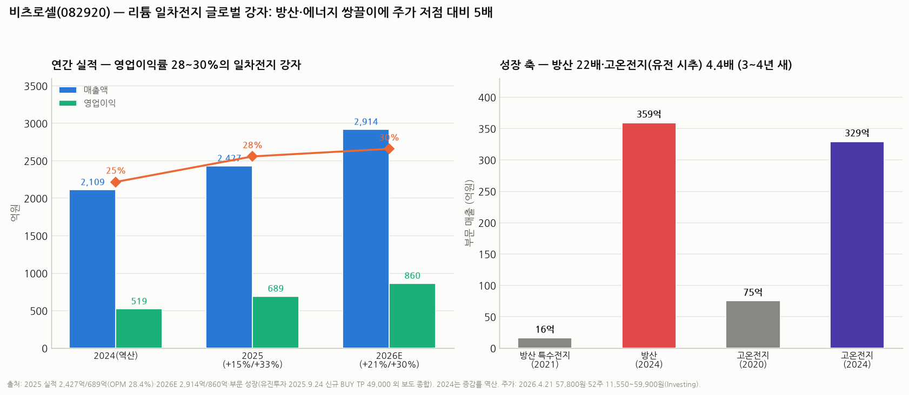

# 비츠로셀(082920) 심층분석 — 리튬 일차전지 글로벌 강자, 방산·에너지 쌍끌이와 5배 주가

> 작성일: 2026-08-13 · 카테고리: 방산/종목분석 (일차전지 — 2차전지 아님 주의)
> **검증 메모**: 2025 실적(매출 2,427억 +15.1%/영업익 689억 +32.7%, OPM 28.4%)·2026E(2,914억/860억)·부문 성장(방산 16억→359억, 고온전지 75억→329억)은 유진투자(2025.9.24 신규 BUY, TP 49,000) 및 보도로 검증. 주가는 2026.4.21 57,800원·52주 11,550~59,900원(Investing). 2024 연간(≈2,109억/519억)은 증감률 역산. **7월 말 폭락장 이후 현재가 미확인.**

---

## 0. 아주 쉬운 버전 (여기만 읽어도 됨)

**뭐 하는 회사?** '충전 안 되는 배터리'(**리튬 일차전지**)의 글로벌 강자다. 충전이 안 되는 게 단점 같지만 거꾸로 **한 번 넣으면 10~20년 가고, 영하 55도~영상 150도 극한에서도 작동**하는 게 무기다. 그래서 쓰이는 곳이 특수하다:

1. **스마트미터**(원격 검침기) — 전 세계 전기·가스 계량기 속 배터리. 기본 캐시카우
2. **방산** — 미사일·유도무기·통신장비용 전지와 **앰플전지**(발사 직전 활성화되는 미사일 전용 전지). 매출이 2021년 16억 → 2024년 **359억 (3년 새 22배)**
3. **고온전지** — 석유·가스 시추공 아래(수백 도)에서 작동하는 전지. 미국 셰일 재확장과 함께 2020년 75억 → 2024년 **329억 (4.4배)**

**숫자**: 2025년 매출 2,427억(+15%)·영업익 689억(+33%), **영업이익률 28.4%** — 배터리 회사인데 이익률이 제약회사급이다(니치 독과점 + 군납 프리미엄). 2026년 전망은 2,914억/860억(+21%/+30%).

**주가가 이미 달렸다**: 52주 저점 11,550원 → 2026년 4월 57,800원, **저점 대비 5배**. 방산 슈퍼사이클 + 미국 에너지 테마가 동시에 붙은 결과다. 4월 주가 기준 시총 ~1.2조(추산) → 2026E 순익 ~700억 가정 시 **PER ~17~18배** — 이익률·성장성 대비 아주 비싸진 않지만, 저점의 '싼 맛'은 사라졌다.

**한 줄 평**: 실적·마진·성장축 모두 진짜인 알짜지만, 5배 오른 뒤라 **지금부터는 방산 수주·미국 유전 경기라는 외생 변수를 사는 것**이다.

---

## 1. 사업 — 왜 이익률이 28%나 되나

| 부문 | 용도 | 2024 매출 | 특징 |
|---|---|---|---|
| 스마트미터·산업용 | 전기·가스 검침기, IoT | 매출의 절반± | 글로벌 과점(佛 사프트 등과 경쟁), 교체 사이클 반복 |
| **방산 특수전지** | 유도무기·통신·앰플전지 | **359억** (2021년 16억) | 군납 인증 장벽 — 폴란드·중동 등 K방산 수출 동반 성장 |
| **고온전지** | 석유·가스 시추(다운홀) | **329억** (2020년 75억) | 극한 환경 니치 — 미국 화석연료 증산 수혜 |
| 기타(이차전지형 등) | 우주·특수 | 소액 | 옵션 |

- 리튬일차전지가 전체 매출의 ~96%
- **이익률 28%의 비결**: ① 니치 시장의 과점(경쟁자 소수) ② 군납·유전용의 신뢰성 프리미엄(가격보다 성능·인증) ③ 원재료(리튬) 가격 안정화 수혜. 범용 2차전지(치킨게임 중)와 정반대 구조
- 캐파: 당진 공장 증설로 성장 대응 (스마트팩토리)

## 2. 실적·밸류에이션

| | 2024(역산) | 2025 | 2026E |
|---|---|---|---|
| 매출 | ~2,109억 | 2,427억 (+15%) | 2,914억 (+21%) |
| 영업이익 | ~519억 | **689억 (+33%)** | 860억 (+30%) |
| OPM | ~25% | **28.4%** | ~30% |

- 주가: 52주 저점 11,550 → 3/18 32,750(+30% 급등일) → 4/21 **57,800원** — 저점 대비 5배. 시총 ~1.2조(추산)
- 밸류: 2026E 순익 ~700억± 가정 시 **선행 PER ~17~18배**. 목표가는 유진 49,000(2025.9 — 이미 돌파). 방산 섹터 평균(한화에어로 등 PER 20~30배대) 대비로는 오히려 낮은 편
- **급등의 성격**: 실적(+30%)보다 주가(+400%)가 훨씬 빨랐다 — 방산 리레이팅(섹터 멀티플 상승)이 절반 이상을 설명. 즉 이 주식의 단기 방향은 실적보다 **방산 섹터 센티먼트**에 달려 있다

## 3. 투자 포인트 vs 리스크

**포인트**
1. **방산 수출 슈퍼사이클 동반**: K방산(폴란드·중동) 수출 무기에 전지가 실린다 — 완성무기 업체보다 조용하지만 이익률은 더 높은 '방산 소재' 포지션 (☞ 방산업_산업분석리포트)
2. **미국 에너지 재확장**: 고온전지가 미국 시추 리그 수와 동행 — 화석연료 우호 정책의 수혜
3. **스마트미터의 바닥**: 경기 무관 교체 수요가 실적 하단을 방어
4. **재무**: 고마진·현금창출 구조 (부채 부담 낮은 것으로 알려짐 — 확정치는 공시 확인)

**리스크**
1. **5배 오른 주가** — 방산 섹터 조정 시 베타가 크다. 7월 말 폭락장 영향 미확인
2. **방산 수주의 럼피니스** — 앰플전지 등은 프로젝트성이라 분기 변동 큼
3. **유가 하락** — 미국 시추 축소 시 고온전지 성장 둔화
4. **환율** — 수출 비중 높아 원화 강세에 민감
5. 스마트미터 시장의 중국 저가 경쟁

## 4. 시나리오 (12개월, 가설)

| | 가정 | 함의 |
|---|---|---|
| Bull | 방산 수출 대형 수주 + 미국 증산 지속 — 2026 OP 900억+ | 방산 멀티플(PER 25배) 적용 — 시총 1.7조+ |
| Base | 컨센 부합(860억) | 시총 1.1~1.4조 박스 |
| Bear | 방산 섹터 디레이팅 + 유가 급락 | 실적은 견조해도 멀티플 압축 — 시총 8,000억 이하 |

**개인 의견(가설)**: 비츠로셀은 사업의 질만 보면 이번에 다룬 종목들 중 최상급이다(과점+고마진+이중 성장축+경기방어 바닥). 문제는 진입 시점 — 5배 랠리 후라 **좋은 회사와 좋은 주식이 분리된 구간**이다. 방산 섹터가 흔들리는 날의 낙폭(개별 실적과 무관하게 나올 것)이 진입 기회가 될 가능성이 높고, 확인할 것은 ① 분기 방산 매출의 지속성(럼피니스 여부) ② 미국 리그 카운트 추이 ③ 폭락장 이후 현재가·밸류다.

---

## 참고 출처 (검증)

- [유진투자증권 — 신규 BUY, TP 49,000: 부문별 성장(방산 16→359억, 고온 75→329억)·전망 (2025.9.24)](https://www.eugenefn.com/common/files/amail//20250924_082920_JS_HEO_47.pdf)
- 2025 실적 매출 2,427억(+15.1%)·영업익 689억(+32.7%)·OPM 28.4%: 실적 보도 종합
- [Investing — 주가 57,800원(2026.4.21)·52주 11,550~59,900](https://www.investing.com/equities/vitzrocell-co-ltd)
- [한경 유레카 — 실적 분석과 성장 시나리오](https://eureka.hankyung.com/insight/detail/16947)
- 2026E 2,914억/860억: 증권가 전망 보도 종합

**저장소 연계**: `방산업_산업분석리포트`(섹터 프레임) · `거시및정책/AI데이터센터_전력병목`(에너지 사이클 배경) · `국내주식_손익비_스크리닝`(밸류 방법론)

> 유의: 2024 수치는 역산 추정, 시총·PER은 추산. 7월 말 폭락장 이후 주가 미확인 — 매매 전 현재가·최신 공시 확인 필수. 매수 추천 아님.
