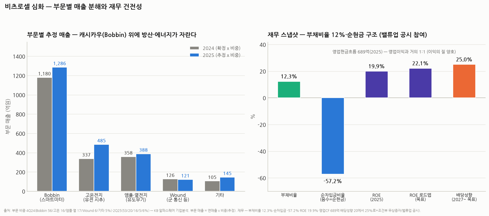

# 비츠로셀 심화분석 — 부문별 해부, 일차전지 수요의 정체, 재무 검증, 그리고 다음 캐시카우

> 작성일: 2026-08-14 · 카테고리: 방산/종목분석 · `비츠로셀_심층분석리포트`(개요편)의 심화편
> 질문 5개에 정면 대응: ① 부문별 제품·추정매출 ② 일차전지 수요 증가 이유와 지속성 ③ 재무 불안요소(숫자 검증) ④ 신사업·차기 캐시카우 ⑤ 기타 추가
> **검증 메모**: 2024 확정 실적(매출 2,107.8억 +19.6%/영업익 519.1억 +37.7%/순익 510.2억 +41.5%)·부문 비중(4Q24, 2Q25)·재무 지표(부채비율 12.3%·순차입금비율 -57.2%·ROE 19.9%·영업CF 689억)·밸류업 공시(배당성향 20→25%+조건부 무상증자)·펜타곤 공급망 논의(아시아투데이 2026.7.30)·열전지 캐파 2배(2027.7 목표)는 공시·증권사·언론으로 검증. 부문별 '금액'은 연매출×공시 비중의 **역산 추정**이다.

---

## 0. 한 장 요약

> 비츠로셀은 **"검침기 배터리로 번 돈(Bobbin, 매출의 절반)을 깔고, 방산(앰플·열전지)과 유전(고온전지)이 3~4년 새 20배·4배로 자라는"** 구조다. 수요 증가의 본질은 ① 전쟁 재비축 사이클 ② 무인화(소모성 무기의 폭증) ③ 미국 에너지 증산 ④ 스마트미터 교체기 — 넷 중 셋은 다년 추세로 볼 근거가 있다. 재무는 **부채비율 12.3%·순현금**으로 불안요소가 사실상 없고, 다음 캐시카우 후보 1순위는 **열전지(캐파 2배 증설 + 미군 공급망 진입 논의)**다.

---

## 1. 부문별 해부 — 제품이 정확히 뭐고, 얼마 버나

부문 매출 = 연매출 × 공시 비중(4Q24 / 2Q25)으로 역산한 **추정치**:

| 부문 | 제품·원리 | 쓰이는 곳 | 2024(추정) | 2025(추정) | 성격 |
|---|---|---|---|---|---|
| **Bobbin형** (Li-SOCl₂) | 실패에 실 감듯 전극을 낮은 밀도로 감은 **저전류·초장수명**(10~20년) 전지. 자기방전이 극히 낮음 | **스마트미터**(전기·가스·수도 원격검침), IoT 센서, 톨게이트 단말 | **~1,180억 (56%)** | **~1,286억 (53%)** | 캐시카우 — 교체 사이클 반복 |
| **고온전지** (Li-SOCl₂ 고온형) | 전해액·실링을 **125~200°C**에서 견디게 설계 | 석유·가스 **시추공 하부**(MWD/LWD — 시추 방향·지층 계측 장비) | ~337억 (16%) | **~485억 (20%)** | 최고 성장률 — 2020년 75억에서 6배대 |
| **앰플전지 + 열전지** | **앰플전지**: 전해액을 유리 앰플에 밀봉 → 발사 충격에 깨지며 그 순간 활성화(보관 중 수명 소모 0, 10년+ 비축 가능). **열전지**(자회사 비츠로밀텍): 착화하면 고체 전해질이 녹으며 수초 내 대전류 방출 | **유도무기(미사일)·어뢰·신관** — 'K-유도무기의 심장' | ~358억 (17%) | ~388억 (16%) | 방산 성장축 — 2021년 16억에서 20배+ |
| **Wound형** | 전극을 촘촘히 감아 **고출력** | 군 통신장비·무전기, 계측기 | ~126억 (6%) | ~121억 (5%) | 방산 보조 |
| 기타 | 특수 이차전지·소재 등 | 우주·특수 | ~105억 | ~145억 | 옵션 |

포인트 3개:
1. **역산 검증이 맞아떨어진다**: 비중 역산치(고온 337억·앰플/열 358억)가 유진증권이 별도로 제시한 부문 수치(고온 329억·방산 359억)와 ±3% 내 일치 — 추정의 신뢰도 근거.
2. **믹스가 좋아지는 중**: 성장하는 두 부문(고온+앰플/열)의 합산 비중이 2024년 33% → 2025년 36%. 이 둘은 Bobbin보다 **단가·마진이 높은 것으로 추정**되어(군납·극한환경 프리미엄), OPM이 25%→28.4%로 오른 것과 정합.
3. **Bobbin은 '지루한 보험'**: 성장률은 한 자릿수지만 경기·전쟁·유가와 무관한 교체 수요라, 다른 부문이 꺾여도 실적 바닥을 만들어 준다.

---

## 2. 일차전지 수요는 왜 늘고, 지속되나

**왜 하필 '충전 안 되는' 전지인가** — 이차전지는 충방전이 강점이지만 ① 자기방전(놔두면 닳음) ② 수명(수년) ③ 극한온도 취약이 약점이다. **"10년 넣어놨다가 단 한 번, 반드시 작동해야 하는 물건"**(미사일·검침기·시추공)에는 일차전지 외 대안이 없다. 이 비대체성이 수요의 뿌리다.

| 드라이버 | 내용 | 지속성 평가 |
|---|---|---|
| ① **전쟁 재비축 사이클** | 러-우·중동 전쟁으로 각국 **비축 유도무기 재고가 고갈**(IBK 신규매수 리포트의 핵심 프레임). 미사일은 쏘면 없어지는 소모품이고, 그 안의 전지도 함께 소모 + 비축분도 10년+ 지나면 교체 | **강함·다년** — 유럽 국방비 GDP 5% 합의·K방산 수출 백로그(☞ 방산업 리포트)가 5~10년 발주를 사실상 예약. 종전이 와도 '재비축'은 종전 후에 오히려 가속되는 수요 |
| ② **무인화 = 소모성 장비의 폭증** | 자폭 드론 한 대 = 전지 한 세트 소모. 우크라이나에서 연간 드론 수백만 대 소모 시대가 열림 — 비츠로셀은 자폭드론용 Li-CFx·MnO₂ 전지로 대응 | **강함·구조적** — 전쟁 양상 자체의 변화라 되돌리기 어려움 |
| ③ **미국 에너지 증산** | 트럼프 2.0 화석연료 확대 → 시추 리그 증가 → 고온전지 수요 (IM증권 1/12 브리핑 제목 그대로) | **중간·정책 의존** — 유가 급락 시 리그 감소로 반전 가능. 4년 시계 |
| ④ **스마트미터 교체기 + IoT** | 2000~2010년대 보급된 AMI(원격검침 인프라)의 전지 수명(15~20년)이 도래 + 신흥국 신규 보급 + IoT 센서 확산 | **중간·완만** — 폭발력은 없지만 감소할 이유도 없음 |

**종합**: ①②는 다년 추세로 볼 근거가 충분하고(방산 백로그의 가시성), ③은 유가라는 외생 변수 의존, ④는 안정적 바닥. **"추세 유지되나?"에 대한 답은 — 방산 쪽은 Yes(수주 백로그가 증명), 에너지 쪽은 유가 조건부.** 반대로 최악 조합(글로벌 긴장 완화 + 유가 급락)이 겹치면 성장 부문 둘이 동시에 식는 시나리오도 성립한다는 점은 기억할 것.

---

## 3. 재무 — 숫자로 검증한 결과: 불안요소 사실상 없음

| 지표 | 수치 (2025 기준) | 해석 |
|---|---|---|
| **부채비율** | **12.3%** | 코스닥 제조업 평균(~80~100%)의 1/8 — 사실상 무차입 경영 |
| **순차입금비율** | **-57.2%** | 음수 = **차입금보다 현금이 훨씬 많다**(자기자본의 절반 이상이 순현금) |
| **영업현금흐름** | **689억** | 영업이익(689억)과 거의 1:1 — 이익이 종이가 아니라 현금이라는 뜻(부실 매출채권·밀어내기 징후 없음) |
| **ROE** | **19.9%** (로드맵 13.1→22.1%) | 순현금 깔고도 20% — 사업 자체의 자본효율이 매우 높음 |
| 순이익 | 2024년 510억 (영업익 519억과 유사) | 영업외 손실 부담 없음 |
| 주주환원 | **배당성향 최소 20%(24~26년) → 25%+(27년~) + 조건부 단계적 무상증자** 공시 | 밸류업 프로그램 참여 — 현금을 쌓아두지 않고 돌려주겠다는 약속 |

**굳이 리스크를 찾자면:**
1. **성장 투자에 따른 CAPEX 증가** — 열전지 캐파 2배(2027.7), 당진 증설 등. 다만 연 영업CF 689억 대비 감당 범위로 보이며, 차입 없이 자체 조달 가능한 체력
2. **매출채권·재고의 방산 특성** — 정부·방산 고객은 대금 회수가 느릴 수 있음(프로젝트성). 분기보고서에서 운전자본 추이 확인 권장 (현재 영업CF≈영업이익이므로 아직 문제 징후 없음)
3. **재무가 아니라 밸류에이션이 리스크** — 재무제표에는 불안요소가 없고, 위험은 전적으로 "5배 오른 주가가 성장 지속을 전제한다"는 데 있다 (개요편 참조)

---

## 4. 신사업·차기 캐시카우 — 서열 매기기

| 순위 | 후보 | 내용 (검증) | 시계·평가 |
|---|---|---|---|
| **1** | **열전지 증설 + 미군 공급망** | 비츠로밀텍 천안공장 **생산능력 전량에 대한 독점 공급 요청**을 받았고, **2027년 7월까지 캐파 2배** 확대 중. 미 전쟁부(국방부) 차관 방한 이후 **미군향 특수전지 공급 논의** 진행, 2027년 하반기 양산 공급 본격화 전망 보도 | **1~2년 내 실적화 가능성 최고.** 캐파 2배 = 앰플·열전지 부문(~390억)이 700억+로 갈 물리적 근거. 미군 퀄 획득 시 멀티플 자체가 바뀌는 이벤트 |
| **2** | **자폭드론용 전지** (Li-CFx·MnO₂) | 무인기·자폭드론용 공급 범위 확대 거론 | 드론 소모전 시대의 볼륨 시장 — 단가는 낮지만 수량이 미사일의 수십 배 |
| **3** | **고온전지 지열·우주 확장** | 시추 기술의 인접 시장(지열 발전 시추, 우주·극한환경) | 유가 의존도를 낮추는 다변화 |
| **4** | **이차전지 소재·리튬 리사이클링** | R&D 투자 중 (더벨 보도) — 리튬 관련 소재 기술의 확장 | 초기 단계 — 아직 스토리, 숫자 없음 |

**판정**: 차기 캐시카우는 멀리 있지 않다 — **열전지가 이미 확정된 증설(2배)과 확정에 가까운 수요(독점 공급 요청)를 들고 있어**, 2027년 앰플·열전지 부문이 Bobbin에 이은 2대 축으로 올라서는 그림이 가장 개연성 높다. 미군 공급망 진입은 성사 시 "한국 방산 부품사"에서 "**나토·미군 표준 공급사**"로 지위가 바뀌는 리레이팅 이벤트인데, 아직 '논의' 단계임을 명확히 구분해야 한다(공시 아님, 보도 기준).

---

## 5. 그 외 덧붙일 것 — 세 가지

1. **경쟁 구도**: 리튬일차전지 글로벌 시장은 프랑스 **사프트(Saft, 토탈 계열)**, 이스라엘 **타디란(Tadiran)**, 중국 EVE에너지 등과의 과점이다. 비츠로셀은 글로벌 3위권으로 평가되며, 방산·고온 같은 인증 장벽 시장에선 중국계 진입이 사실상 차단된다 — 저가 경쟁 리스크는 Bobbin(스마트미터) 쪽에 국한된다는 뜻. (순위·점유율은 기관마다 달라 참고치)
2. **오너·지배구조**: 비츠로그룹(비츠로테크 등) 계열. 밸류업 공시(배당 확대+무상증자 로드맵)를 낸 것은 코스닥 방산주 중 드문 주주친화 신호 — 다만 무상증자는 '조건부·단계적'이므로 이행 여부를 공시로 추적할 것.
3. **개요편과 합친 투자 프레임**: 이 회사의 체크리스트는 결국 넷이다 — ① 분기 방산 매출의 럼피니스(앰플·열전지가 프로젝트성이라 분기 변동 큼 — 한 분기 꺾임을 추세 훼손으로 오독하지 말 것) ② 열전지 증설 진행 공시(2027.7 목표) ③ 미군 퀄 뉴스의 '논의→계약' 전환 ④ 유가·리그 카운트(고온전지 선행지표). 재무는 볼 필요가 거의 없는 회사다 — 시간을 수요 추적에 쓰는 게 맞다.

---

## 참고 출처 (검증)

- [아시아투데이 — "'K-유도무기의 심장' 비츠로셀, 美 펜타곤 공급망 뚫는다": 미 전쟁부 차관 방한·미군향 공급 논의·자폭드론용 Li-CFx·MnO₂·양산 2027 하반기 전망 (2026.7.30)](https://www.asiatoday.co.kr/kn/view.php?key=20260730010011370)
- [IBK투자증권 — 신규 매수: "전쟁이 가져온 변화 — 비축 물자 고갈"·열전지 캐파 전량 독점 공급 요청·2027.7 캐파 2배](https://m.ibks.com/iko/IKO01/download.do?seq=12331&menuCode=IKO010201&attatchCd=ATTATCH1)
- [더벨 — 최대 실적 속 신사업(이차전지 소재·리튬 리사이클링) 잰걸음 (2025.3)](https://www.thebell.co.kr/free/content/ArticleView.asp?key=202503201435283400103319)
- [유진투자증권 — 부문 성장(방산 359억·고온 329억)·2026E (2025.9.24)](https://www.eugenefn.com/common/files/amail//20250924_082920_JS_HEO_47.pdf)
- [IM증권 — "트럼프 2.0 시대 군용전지·시추 수요 확대" (2026.1.12)](https://www.imfnsec.com/upload/R_E08/2026/01/%5B12073949%5D_082920.pdf)
- 부문 비중(4Q24: 56/6/16/17/5 · 2Q25: 53/5/20/16/5)·재무(부채비율 12.3%·순차입금 -57.2%·ROE 19.9%·영업CF 689억)·밸류업 공시(배당성향 20→25%+무상증자): KB증권·알파스퀘어 기업분석·공시 종합
- 2024 확정: 매출 2,107.8억(+19.6%)·영업익 519.1억(+37.7%)·순익 510.2억(+41.5%) — 공시

**저장소 연계**: `비츠로셀_심층분석리포트`(개요·밸류에이션·시나리오) · `방산업_산업분석리포트`(재비축·수출 백로그 프레임) · `국내주식_손익비_스크리닝`(방법론)

> 유의: 부문별 금액은 비중 역산 추정(±수십억 오차 가능). 미군 공급망은 보도 기준 '논의' 단계로 확정 계약이 아니다. 최근 주가는 미확인(개요편과 동일). 매수 추천 아님.
