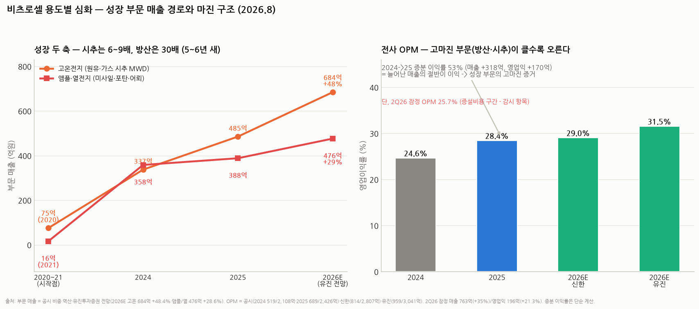

# 비츠로셀 용도별 심화 — 미사일·포탄 / 원유 시추 / 드론 / AI데이터센터: 어떤 전지가, 어떻게, 얼마나 남기며, 얼마나 커지나

> 작성일: 2026-08-20 · 카테고리: 방산/종목분석 · 비츠로셀 시리즈 ⑤ (①개요 ②심화-부문·재무·신사업 ③배경지식-일차vs이차 ④기존vs신규 수요 → **⑤용도별 전지·마진·시장전망**)
> **검증 메모**: 인도 BEL 포탄 전자신관용 앰플전지 205억 수주(역대 최대, ~2027.10 납품, 84억→75억→205억 증가 추세)·로케트산(튀르키예)의 열전지 캐파 독점 공급 요청 및 증설 2027.11→2027.7 앞당김·미 국방부 방한(2026.3, 드론·미사일용 특수전지)·드론 전용공장 2H26 착공 계획·AI데이터센터용 리튬이온커패시터(LIC) 델타전자 협의·연내 계약 목표(장승국 대표 인터뷰 2026.7.5)·2Q26 잠정(매출 763억 +35.0%/영업익 196억 +21.3%)·2026E 컨센(신한 2,807억/814억, 유진 3,041억/959억)·부문 전망(고온 684억 +48.4%, 앰플·열 476억 +28.6%)·신한 목표가 70,000원(2026.5.13)은 모두 보도·증권사 리포트 검증. **부문별 마진은 비공시 — 본문 추정은 전부 계산 근거를 표기했다.**

---

## 0. 한 장 요약

| 용도 | 쓰이는 전지 | 매출 현황 | 마진(추정) | 시장이 더 커질까? |
|---|---|---|---|---|
| **① 미사일·포탄** | 열전지(미사일·유도무기) + 앰플전지(포탄 전자신관) | 2025 ~388억 → 2026E 476억 | **최상급 (30%+ 추정)** | **Yes — 가장 확실.** 재비축 + 전자신관 전환 + 로케트산이 캐파를 통째로 달라는 상태 |
| **② 원유 시추** | 고온전지(Li-SOCl₂, 125~200°C) | 2025 ~485억 → 2026E 684억 | **상급 (전사 상회 추정)** | Yes, 단 **유가 조건부** — 트럼프 증산 4년 시계 |
| **③ 드론** | 고출력 리튬일차전지(Li-SOCl₂ Wound·Li-MnO₂ 등) — 자폭드론용 | 아직 미미 — **전용 공장 2H26 착공** | 미확인 (군납 프리미엄 기대) | **Yes — 구조적.** 소모성 무기라 '쏘면 없어지는' 반복 수요 |
| **④ AI데이터센터** | **리튬이온커패시터(LIC)** — 기존 일차전지가 아닌 신제품 | 매출 0 — 델타전자와 협의, **연내 계약 목표, 상업화 2H27** | 미확인 (공급부족 시장이라 초기 양호 추정) | 가장 크지만 **가장 불확실** — 계약 전까지는 옵션 |

> 순서대로 **"확실성은 ①>②>③>④, 시장의 크기는 거꾸로 ④>③>②>①"** — 이 역전 구조가 비츠로셀 투자의 지형도다. 지금 주가를 떠받치는 건 ①②고, 주가를 다시 뛰게 할 수 있는 건 ③④다.

---

## 1. 미사일·포탄 — 열전지와 앰플전지, '10년 자고 1초 안에 깨어나는' 전지

### 1.1 어떤 전지가 어떻게 쓰이나

무기용 전지의 요구사항은 상식과 반대다: 평소엔 **완전히 죽어 있어야** 하고(10년+ 비축, 자기방전 0), 쓸 때는 **수초~수분만** 살면 된다. 그래서 '비축형(reserve) 전지' 두 종류가 쓰인다:

- **열전지 (미사일·유도무기·어뢰)** — 자회사 비츠로밀텍 생산. 전해질이 평소엔 **고체**(= 화학반응 자체가 정지, 수명 소모 0). 발사 신호가 오면 내장 착화제가 타면서 전해질을 녹여 **수백 밀리초 만에 대전류 방출** — 유도장치·구동날개·신관에 전력 공급. 미사일 비행시간(수십 초~수분)만 버티면 임무 끝. 한 번 켜면 끌 수 없는 일회용
- **앰플전지 (포탄 전자신관)** — 전해액을 **유리 앰플에 밀봉**해 전극과 분리해 둔 구조. 포탄이 발사되는 순간의 **충격(수만 G)과 회전**으로 앰플이 깨지며 전해액이 퍼져 그제서야 전지가 됨. 포탄 신관이 기계식→**전자식·다기능 신관**(근접폭발·지연·시한 선택)으로 진화하면서 "포탄 한 발 = 앰플전지 한 개"가 표준이 되는 중

### 1.2 지금 벌어지는 일 (검증된 수주·이벤트)

- **인도 BEL(바랏일렉트로닉) 205억 수주** — 포탄 전자신관용 중형 앰플전지, **역대 최대**, 2027.10까지 납품. 같은 고객 계약이 84억(2025.5)→75억(2026.1)→205억으로 커지는 궤적 자체가 수요 증거
- **로케트산(튀르키예 최대 방산업체)이 열전지 생산 캐파의 독점 공급을 요청** — 비츠로셀은 캐파 2배 증설 완료 시점을 2027.11에서 **2027.7로 앞당김**. "만들 수 있는 만큼 다 사겠다"는 고객이 존재한다는 뜻
- **미 국방부가 2026년 3월 방한**해 드론·미사일용 차세대 특수전지 공급망 논의 — 연간 관련 제품 **수천억 원대**로 추정 보도(아시아투데이). 성사 시 체급이 바뀌는 이벤트이나 아직 논의 단계

### 1.3 마진 추정 — 왜 '최상급'이라고 보나

부문 마진은 비공시다. 대신 산수로 우회 검증할 수 있다: **2024→2025 매출 증가분 318억의 대부분이 고온+방산에서 왔는데, 영업이익은 170억 늘었다 — 증분 이익률 53%.** 늘어난 매출의 절반이 이익으로 떨어졌다는 건 성장 부문(방산·시추)의 마진이 전사 평균(24.6%)을 크게 웃돈다는 뜻이다. 방산 전지는 ① 수요처가 생명이 걸린 품질 인증(MIL 규격)을 요구해 가격 민감도가 낮고 ② 한 번 설계에 들어가면(design-in) 무기 수명 내내 교체 불가라, 업계 통념상 **OPM 30%+ 추정**이 무리가 아니다. (추정 표기)

### 1.4 시장은 더 커지나 — Yes, 네 용도 중 가장 확실

1. **재비축 사이클**: 쏜 미사일·포탄은 전지째 소멸 + 비축분도 10년 지나면 전지 교체 — 유럽 GDP 5% 국방비 합의와 K방산 백로그(☞ 방산업 리포트)가 5~10년 발주를 예약
2. **전자신관 전환이라는 침투율 스토리**: 기계식 신관엔 전지가 안 들어간다. 전자식 전환율이 오를수록 포탄 시장 성장률보다 **앰플전지 수요가 더 빨리** 는다 — BEL 계약이 3배로 커진 이유
3. 확인된 공급 부족: 로케트산의 독점 요청 = 수요가 캐파를 초과한다는 직접 증거

리스크: 종전·긴장 완화 시 신규 발주 둔화(단, 재비축은 종전 후에도 지속), 증설 실행.

## 2. 원유 시추 — 고온전지, 지하 3km 200°C에서 일하는 전지

### 2.1 어떤 전지가 어떻게 쓰이나

셰일·심해 시추는 드릴을 꽂고 끝이 아니라, 드릴 바로 뒤에 **MWD/LWD**(Measurement/Logging While Drilling — 시추하면서 방향·지층을 실시간 계측하는 장비)를 달고 판다. 이 장비는 지하 수 km, **125~200°C** 환경에서 수백 시간 작동해야 하는데 — 전선을 내릴 수 없으니 전지가 유일한 전원이고, 이차전지는 그 온도에서 못 산다. 비츠로셀의 **고온형 Li-SOCl₂ 전지**는 전해액 조성·실링을 고온용으로 재설계한 물건으로, 이 니치의 글로벌 강자다(경쟁: 프랑스 사프트, 미국 일렉트로켐 등 — 리튬일차 전체로는 사프트가 ~50% 점유, ☞ 배경지식편).

### 2.2 숫자와 마진

- 매출 궤적: **2020년 75억 → 2025년 ~485억(6.5배) → 2026E 684억(+48.4%, 유진)** — 전 부문 중 최고 성장률
- 마진: 비공시이나 §1.3의 증분 이익률 53% 논리가 동일 적용 + 시추 중단(전지 방전) 시 하루 수십만 달러 손실이 나는 고객 특성상 가격 민감도가 낮다 — **전사 평균 상회 추정**. 국책과제로 고온전지 전원 개발 완료(동해 심해 가스전 수혜 후보 보도)도 참고

### 2.3 시장은 더 커지나 — Yes, 단 유가 조건부

- **순풍**: 트럼프 2.0 화석연료 증산 정책(IM증권 리포트 제목이 "트럼프 2.0 시대 군용전지 및 시추 수요 확대") → 리그 수 증가 → MWD 가동 시간 증가 = 전지 소모 증가. 여기에 시추 심도가 깊어질수록(셰일 재굴착·심해) 온도가 올라가 **고온 스펙 요구가 강화** — 비츠로셀에 유리한 믹스
- **역풍 가능성**: 이 수요는 정확히 **리그 카운트의 함수**다. 유가가 손익분기(셰일 ~50달러대) 밑으로 급락하면 리그가 멈추고 전지 주문도 멈춘다 — 네 용도 중 유일하게 **외생 변수(유가)에 종속**. 4년 정책 시계도 유한
- 판정: 12~24개월 시계 Yes(증산 정책 + 2026E +48%), 5년 시계는 유가 시나리오 의존 — ①번(방산)보다 성장률은 높지만 지속성 확신은 낮다

## 3. 드론 — '날아다니는 소모품'의 전지

### 3.1 어떤 전지가 쓰이나

드론이라고 다 같은 전지가 아니다. **정찰·복귀형 드론은 충전해 재사용하니 이차전지**(리포·리튬이온)가 맞고, 이건 비츠로셀 영역이 아니다. 비츠로셀이 노리는 건 **자폭(일회용) 드론** — 한 번 날아가 부딪히면 끝이라 충전 기능이 낭비고, 대신 ① 발사 전 수년 비축 가능(자기방전 0) ② 극한온도 작동 ③ 높은 에너지밀도(항속거리)가 필요하다. 정확히 일차전지의 스펙이다. 비츠로셀은 **고출력 리튬일차전지(Wound형 Li-SOCl₂, Li-MnO₂ 계열)**로 자폭드론용 특수전지를 개발·공급 협의 중이다.

### 3.2 지금 상태 — 매출은 아직 없다시피, 그러나 공장부터 짓는다

- **드론 전지 전용 공장을 2026 하반기 착공** 계획(대표 인터뷰) — 미 국방부와 자폭드론용 전지 공급 논의 진행, 타깃 시장 미국·유럽·중동
- 시장 배경: 우크라이나에서 **연간 수백만 대의 드론이 소모**되는 전쟁 양상이 확립 — 드론은 포탄과 미사일 사이의 '중간 탄약'이 됐고, 각국이 대량 비축을 시작(☞ ④기존vs신규 수요편). 글로벌이코노믹 보도처럼 K배터리 전반의 진입 시도가 있으나, **군용 인증·비축 스펙에서는 일차전지 업체가 구조적으로 유리**
- 마진: 미확인. 다만 군납+신규 스펙 시장이라 Bobbin(민수)보다 높을 개연성 — 초기엔 공장 고정비로 낮을 수 있음(2Q26 OPM 25.7%로 눌린 것이 증설비용 구간의 예고편일 수 있다)

### 3.3 시장은 더 커지나 — Yes, 구조적. 단 경쟁도 몰려온다

수요의 방향은 네 용도 중 가장 명확한 축(전쟁의 무인화는 비가역)이나, ①번과 달리 **아직 수주·매출로 검증되지 않은 단계**고, 자폭드론 전지는 미사일 열전지만큼 스펙 장벽이 높지 않아 경쟁 진입이 상대적으로 쉽다. "시장은 확실히 커진다, 비츠로셀의 몫이 얼마일지가 미검증" — 이게 정확한 상태다. 감시 지표: 전용 공장 착공 공시, 미 DoD 관련 후속 보도, 첫 양산 수주.

## 4. AI데이터센터 — 일차전지가 아니라 '리튬이온커패시터(LIC)'로 들어간다

### 4.1 무엇이고 왜 필요한가 (배경지식)

AI 데이터센터의 신종 문제 = **파워 서지**: GPU 수천 개가 연산을 동시에 시작·종료하면 **1밀리초 만에 수십 MW가 출렁**인다. 전력망도 UPS도 이 속도를 못 따라가서, 랙 안에 '순간 완충장치'를 계층으로 쌓는 구조가 표준화되는 중이다:

| 계층 | 대응 시간 | 장치 |
|---|---|---|
| 정전 백업 | 수 분 | BBU(배터리 백업 유닛 — 리튬이온) |
| **순간 서지** | **~1초 내외** | **LIC·EDLC(슈퍼커패시터)** ← 비츠로셀이 노리는 층 |

**LIC = 배터리와 콘덴서의 하이브리드**. 비유하면 배터리는 '큰 물탱크(많이 저장, 천천히)', 커패시터는 '작은 양동이(조금 저장, 순식간에 붓기)' — LIC는 양동이면서 탱크 흉내를 좀 내는 물건이다(에너지밀도는 배터리보다 낮지만 출력밀도·수명·안전성 우위). GPU가 순간적으로 목마를 때 1초를 버텨주는 역할.

### 4.2 비츠로셀의 딜 상황 (검증)

- **대만 델타전자와 LIC 공급 협의** — 델타는 **데이터센터 전원공급장치(PSU) 글로벌 1위**로 엔비디아·구글에 전원·냉각을 공급하는 회사. 이 채널을 뚫으면 빅테크 데이터센터에 간접 진입하는 셈
- 미국·대만 **EMS 3사와 샘플 개발·검증 진행**(디일렉), 장승국 대표: "**연내 공급계약 체결 계획**"(한경 2026.7.5), 상업화는 **2027년 하반기** 목표
- 경쟁 구도: LIC는 현재 **일본 무사시에너지가 주도**하는데 공급이 달려 플렉스·델타 같은 EMS들이 물량 확보에 애를 먹는 상황 — **공급부족이 비츠로셀의 진입 창**이다. 국내 유사 테마주(비나텍·LS머트리얼즈)는 EDLC(슈퍼캡) 계열로 층이 조금 다름

### 4.3 냉정한 평가 — 크기는 최대, 확실성은 최소

- **크기**: AI 데이터센터 전력 인프라는 조 단위로 크는 시장이고(☞ `거시및정책/AI데이터센터_전력병목`), 서버 랙마다 들어가는 부품이라 성사 시 Bobbin을 능가할 수 있는 유일한 후보
- **불확실성**: ① 아직 **계약 0건·매출 0원** — '협의'와 '수주'는 다르다 ② LIC는 비츠로셀의 본업(일차전지)과 화학이 다른 신제품이라 양산 수율 검증 전 ③ 무사시가 증설로 공급부족을 해소하면 진입 창이 닫힐 수 있음 ④ 마진 미확인(공급부족 시장이라 초기 양호 추정이나 근거 약함)
- 판정: **주가의 '다음 단계' 옵션이지 현재 실적 스토리가 아니다.** 감시 지표는 단 하나 — **연내 델타(또는 EMS) 공급계약 공시 여부**. 이게 나오면 리레이팅, 해를 넘기면 기대 소멸 리스크

---

## 5. 종합 — 마진 구조와 밸류에이션 함의

1. **마진의 서열(추정)**: 방산(앰플·열) ≥ 고온(시추) > 전사 평균 > Bobbin(민수) — 근거는 증분 이익률 53%(2024→25)와 믹스 개선기 OPM 상승(24.6→28.4%). 2026E OPM 컨센 29.0~31.5%는 **이 믹스 개선이 계속된다는 가정**이다
2. **단기 감시점**: 2Q26 잠정 OPM 25.7%(+35% 성장에도 이익은 +21%) — 열전지·드론 증설비용이 마진을 일시적으로 누르는 구간에 들어섰을 수 있다. 리노공업 신공장에서 본 것과 같은 '착시 악재' 후보 — 3Q26 실적에서 확인 필요
3. **밸류**: 신한 목표가 70,000원(2026.5.13, "성장주 프리미엄 강화") — 목표가가 26,000(유진, 과거)→45,000→70,000으로 계단식 상향돼 온 것 자체가 ①②의 실적 증명 + ③④ 옵션 반영 과정. 현 주가는 미확인(7월 폭락장 이후) — **폭락장에서 방산주가 상대적으로 방어됐는지가 체크 포인트**
4. **한 줄 결론**: 비츠로셀은 "①미사일·포탄(확실한 현재) ②시추(유가 조건부 현재) ③드론(확실한 방향, 미검증 몫) ④LIC(최대 크기, 최소 확실성)"의 4단 로켓 — **①②만으로 2026E 영업익 800~950억이 성립**하고, ③④는 공짜 옵션에 가깝게 보는 것이 안전한 프레임이다.

---

## 참고 출처 (검증)

- [디일렉 — 비츠로셀, 미국·대만 기업과 AI 데이터센터 협력 추진(LIC, EMS 3사 샘플 검증)](https://www.thelec.kr/news/articleView.html?idxno=56787) · [— 인도서 방산 배터리 역대 최대 수주](https://www.thelec.kr/news/articleView.html?idxno=57168)
- [한국경제 — 장승국 대표 인터뷰: LIC 연내 계약 계획·델타전자 협의·드론 공장 2H26 착공 (2026.7.5)](https://www.hankyung.com/article/2026070564431) · [— 델타와 논의, 회사 체급 바뀐다 (2026.6.23)](https://www.hankyung.com/article/202606231600i)
- [아시아투데이 — 'K-유도무기의 심장' 비츠로셀, 미 펜타곤 공급망(연 수천억 추정) (2026.7.30)](https://www.asiatoday.co.kr/kn/view.php?key=20260730010011370) · [— 스마트그리드 세계 3위, AI 전력망 공급망 (2026.6.30)](https://www.asiatoday.co.kr/kn/view.php?key=20260630010010818)
- [뉴스와이어 — 인도 BEL 75억 군용 앰플전지 계약 (2026.1)](https://www.newswire.co.kr/newsRead.php?no=1026359) — 84억(2025.5)→75억→205억(역대 최대) 궤적
- [여성경제신문 — GPU 파워 서지와 BBU·LIC·EDLC 계층 구조, 무사시에너지 주도·공급부족](https://www.womaneconomy.co.kr/news/articleView.html?idxno=255971)
- [글로벌이코노믹 — 드론 전쟁이 띄운 방산 배터리, K배터리 진입 가능성 (2026.6.15)](https://www.g-enews.com/article/Industry/2026/06/202606151308362303ea14faf6f5_1)
- [IM증권 — 트럼프 2.0 시대 군용전지 및 시추 수요 확대 (2026.1.12)](https://www.imfnsec.com/upload/R_E08/2026/01/%5B12073949%5D_082920.pdf) · [뉴스핌 — 미 특수전지에 AI 데이터센터까지 성장 확대 구간 (2026.4.17)](https://www.newspim.com/news/view/20260417000128)
- [네이트/뉴스 — 신한투자증권 목표가 70,000원 '성장주 프리미엄 강화' (2026.5.13)](https://news.nate.com/view/20260513n19295) · 2026E 컨센(신한 2,807억/814억·유진 3,041억/959억, 고온 684억·앰플/열 476억)은 보도 종합
- [뉴스프라임 — 고온전지 국책과제 완료·동해 유전 수혜 주목](https://www.newsprime.co.kr/news/article/?no=641991)
- 2Q26 잠정(763억/196억)·부문 역산·재무: 시리즈 ②편 검증분 및 보도 종합

**저장소 연계**: `비츠로셀_심층분석리포트`(①) · `비츠로셀_심화분석_부문별수요재무신사업`(② — 부문 역산·재무) · `비츠로셀_배경지식_일차전지vs이차전지_진입장벽경쟁지도`(③ — 사프트 50%·경쟁 지도) · `방산업_산업분석리포트`(재비축 프레임) · `거시및정책/AI데이터센터_전력병목`(④번 용도의 수요 배경)

> 유의: 부문별 마진은 비공시로 본문 수치는 증분 이익률 기반 추정. 2026E는 증권사 전망. 드론·LIC는 계약 전 단계로 매출 기여 0에 가깝다. 7월 폭락장 이후 주가 미확인. 매수 추천 아님.
