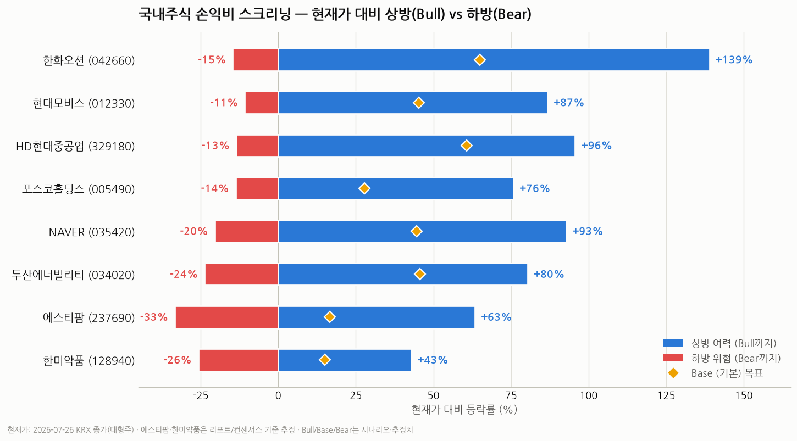

# 국내주식 손익비(Risk/Reward) 스크리닝 — 2026년 7월

> 작성일: 2026-07-27 · 카테고리: 시장브리핑(멀티섹터 스크리닝)
> 기준 시세: **2026-07-26 KRX 종가**(대형주) / 일부 종목은 리포트·컨센서스 기준 추정
> 성격: 저장소 내 종목 리포트의 Bull/Base/Bear 시나리오 + 최신 시세·밸류에이션·증권사 목표주가를 결합해 **현재가 기준으로 손익비를 재계산**한 결과.

---

## 한 문장 요약

강세장 후반(코스피 1만 포인트 도전) 국면에서 **이미 오른 종목(반도체 대형주·은행·삼성전기 등)은 상방을 소진**한 반면, **구조적 스토리는 유효한데 수급·업황으로 조정받아 "Bear 바닥" 근처로 내려온 종목**의 손익비가 가장 좋다. 현재가 기준 손익비 상위는 **한화오션·현대모비스·HD현대중공업**(모두 상방/하방 7~9배)이며, 그 뒤로 포스코홀딩스·NAVER·두산에너빌리티가 잇는다.

---

## 방법론 (어떻게 계산했나)

- **손익비 = 상방(Bull까지 상승률) ÷ 하방(Bear까지 하락률)**. 값이 1보다 크면 상방 우위(비대칭 유리).
- 모든 수치는 **오늘 시세** 기준. 시나리오(Bull/Base/Bear) 절대 레벨은 저장소 종목 리포트 + 최신 증권사 목표주가를 반영해 갱신.
- **왜 "현재가 기준"이 핵심인가**: 5월 리포트 대비 반도체·은행 등은 주가가 크게 올라 Bull 목표를 소진(삼성전기는 리포트 Bull 초과). 반대로 조선·자동차부품은 조정으로 Bear까지 내려와 비대칭이 좋아졌다. **같은 시나리오라도 진입 가격이 손익비를 결정한다.**

---

## 손익비 랭킹 (2026-07-26 기준)

| 순위 | 종목(코드) | 현재가 | Bear / Base / Bull | 하방 | 상방(Base) | 상방(Bull) | **손익비** | 밸류에이션 |
|---|---|---|---|---|---|---|---|---|
| 1 | **한화오션(042660)** | 87,900 | 7.5만 / 14.5만 / 21만 | −15% | +65% | **+139%** | **9.5** | 26F PER ~20배 |
| 2 | **현대모비스(012330)** | 482,000 | 43만 / 70만 / 90만 | −11% | +45% | **+87%** | **8.0** | **26F PER 7.7배·PBR 0.7배(역사적 저점)** |
| 3 | **HD현대중공업(329180)** | 485,500 | 42만 / 78만 / 95만 | −13% | +61% | **+96%** | **7.1** | PER ~29배(사이클 고점) |
| 4 | **포스코홀딩스(005490)** | 313,000 | 27만 / 40만 / 55만 | −14% | +28% | +76% | **5.5** | PBR ~0.38배(철강 트로프) |
| 5 | **NAVER(035420)** | 207,500 | 16.5만 / 30만 / 40만 | −20% | +45% | +93% | **4.5** | 12M PER 14.7배(저점) |
| 6 | **두산에너빌리티(034020)** | 72,100 | 5.5만 / 10.5만 / 13만 | −24% | +46% | +80% | **3.4** | ATH(14.2만) 대비 −49% |
| 7 | 에스티팜(237690) | ~150,000* | 10만 / 17.5만 / 24.5만 | −33% | +17% | +63% | 1.9 | 올리고 CDMO |
| 8 | 한미약품(128940) | ~539,000* | 40만 / 62만 / 77만 | −26% | +15% | +43% | 1.7 | 릴리 GLP-2 기술수출 |

\* 6·7행(에스티팜·한미약품)은 리포트/증권사 컨센서스 기준 추정 현재가. 나머지는 2026-07-26 KRX 종가.

---

## 티어별 해설 (최신 근거 반영)

### A티어 — "Bear 바닥에 온 우량 시클리컬" (지금 최고의 비대칭)

**1. 한화오션 (042660) · 손익비 9.5**
5월 13.2만 → 현재 8.8만(−34%). 하락 트리거는 특정 대형 수주 불발(키움, 목표주가 14.4만으로 하향)이었으나, 6월 말 기준 상선 21척·34억 달러를 확보하며 잔고는 견조. 현재가가 이미 Bear(9.7만) 아래로, 시나리오상 하방이 얇고 LNG선·미국 필리조선소 옵션이 상방을 연다.

**2. 현대모비스 (012330) · 손익비 8.0 — 개인적 최선호**
5월 64.9만 → 현재 48.2만(−26%). 그런데 펀더멘털은 오히려 개선: **2Q26 영업이익 9,752억(+12% YoY, 컨센 +7.5% 상회)**, AS부품 26%대 고마진 유지, **7월까지 5,000억 자사주 매입 후 8월 3일 전량 소각**. **26F PER 7.7배·PBR 0.7배로 역사적 저점**인데 실적·주주환원은 우상향 → "하방은 밸류에이션이 막고 상방만 남은" 전형적 비대칭. 목표주가 77만(유지)~90만.

**3. HD현대중공업 (329180) · 손익비 7.1**
5월 66.7만 → 현재 48.6만(−27%), **현재가가 Bear(48만) 바로 위**. 조정은 수주 기대 되돌림 탓이나 신규 수주 목표를 5월 말 62% 달성, 잔고 4년치 슈퍼사이클 유지. 키움 목표 88만. PER 29배로 절대 밸류는 부담이나 사이클 이익 레벨업이 관건. (참고: 삼성중공업은 3사 중 수주 진척률 최고 — 목표 57억 달러의 91% 달성.)

### B티어 — "구조적 저평가 + 촉매 대기"

**4. 포스코홀딩스 (005490) · 손익비 5.5** — 시총 24.8조, PBR ~0.38배로 철강 트로프이자 시나리오 Bear 바닥. 철강 업황 반등·리튬 사업이 촉매. 다만 철강은 구조적 저성장이라 Base(+28%)가 현실적 1차 목표.

**5. NAVER (035420) · 손익비 4.5** — 12M PER 14.7배로 인터넷 대형주 중 최저 구간. 하방이 두껍고(플랫폼 캐시플로), AI·클라우드 성과(AI팩토리 계약 등) 발표 시 탄력 반등. 목표주가 하나 40만·KB 33만·CLSA 30만.

**6. 두산에너빌리티 (034020) · 손익비 3.4** — ATH 14.2만 → 7.2만(−49%)로 낙폭 최대. 2026년부터 대형원전 주기기·SMR·가스터빈 고마진 사이클 진입, 대신증권 목표주가 13만(상향). 낙폭 큰 만큼 하방(−24%)도 상대적으로 크다.

### C티어 — "바이오 옵션성" (상방 크지만 하방도 커 손익비는 낮음)

**7. 에스티팜 (237690)** — 올리고 CDMO, KB 목표 20만. Bull 확률이 상대적으로 높으나(리포트 20/45/35) 하방 −33%.
**8. 한미약품 (128940)** — 릴리 GLP-2 기술수출로 재평가, DS 목표 68만(+26%). 다만 이미 반등해 손익비는 1.7로 축소. K-바이오 빅4 중 가장 안정적이라는 점이 매력.
(고위험 옵션: 보로노이·펩트론은 상방 +50~85%지만 하방도 −50% 수준 → 손익비 ≈ 1.0, 포지션 소액 권장.)

---

## 지금은 피하거나 신중할 것 (손익비 이미 소진)

| 종목/그룹 | 이유 |
|---|---|
| SK하이닉스(000660) | 144.7만 → 175.9만, Base(175만) 도달 — 상방 협소 |
| 삼성전기(009150) | 현재가 132.6만이 **리포트 Bull(88만) 초과** — 시나리오 재작성 필요 |
| 은행주(KB금융 등) | 밸류업 랠리로 시총이 Bull 목표 돌파 — 재평가 상당 부분 완료 |
| 방산·완성차(현대차 등) | 재무장·관세 완화 랠리로 이미 Base~Bull 구간 |

(삼성전자는 예외적으로 Bull 42만 시나리오가 살아 있어 +68%/−48% 양방향 — 손익비는 중립.)

---

## 리스크 · 유의사항 (반드시 읽을 것)

1. **이 문서는 투자 조언이 아니라 시나리오 기반 스크리닝**이다. Bull/Base/Bear 레벨·확률·목표주가는 추정치이며 틀릴 수 있다.
2. **"Bear 아래로 빠졌다 = 항상 기회"가 아니다.** 펀더멘털이 훼손됐다면 Bear 자체가 더 낮게 재설정된다. A티어(조선·모비스)일수록 **하락 원인이 단순 수급/업황인지, 실적 훼손인지** 반드시 확인해야 한다.
3. **데이터 정합성 한계**: 일부 종목은 저장소 리포트 간 기준가·시총이 상이했다(두산에너빌리티·현대모비스 개별 vs 그룹표 등). 매매 전 최신 사업보고서·실시세로 교차확인 필요.
4. 에스티팜·한미약품 현재가는 리포트/컨센서스 기준 추정이며 실시세와 차이가 있을 수 있다.
5. 손익비만 보고 집중투자하기보다 **분산·비중 조절**을 권한다.

---

## 참고 출처

- [조선 3사 목표주가·수주 현황 (한경TV 와우넷)](https://www.wownet.co.kr/wowlog/84294)
- [현대중공업·한화오션 목표주가 하향 (다음/연합)](https://v.daum.net/v/uGHRvbztCT)
- [현대모비스 2Q26 프리뷰·목표주가 (하나증권)](https://www.hanaw.com/main/research/research/download.cmd?bbsSeq=1287909)
- [현대모비스 주가전망·목표주가 (KB증권)](https://kbthink.com/securities-view.html?docId=20260723103318160K)
- [두산에너빌리티 컨센서스 (한경 유레카)](https://eureka.hankyung.com/insight/detail/16299)
- [NAVER 저평가·목표주가 (이투데이/KB증권)](https://www.etoday.co.kr/news/view/2598947)
- [에스티팜 목표주가 (KB증권)](https://kbthink.com/securities-view.html?docId=20260720135135713K)
- [한미약품 기술수출·목표주가 (헬로티)](https://www.hellot.net/news/article.html?no=112970)

> 유의: 시가총액·목표주가·밸류에이션·시나리오 확률은 증권사·언론 추정치이며 시점에 따라 달라진다. 차트의 상방/하방은 위 표의 시나리오 레벨을 현재가 기준으로 환산한 것이다. 확정 수치는 각 사 사업보고서·분기보고서 원문으로 교차확인을 권한다.
