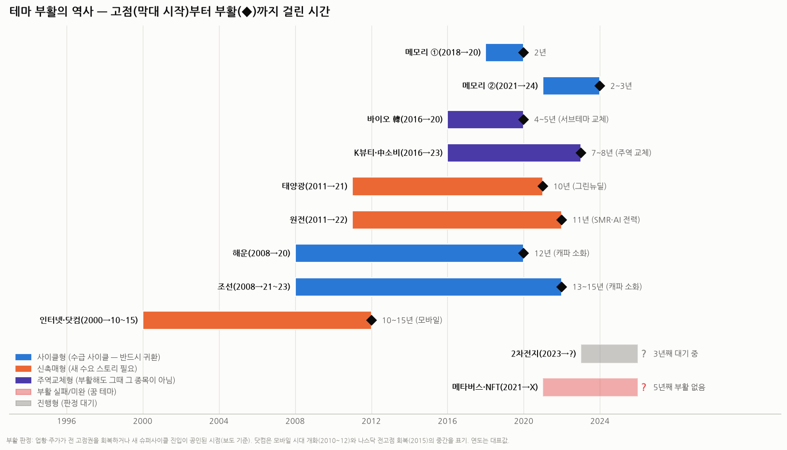

# 테마 부활의 역사 — 죽은 섹터는 얼마나, 언제 되살아나는가 (사이클 vs 촉매)

> 작성일: 2026-08-12 · 카테고리: 시장브리핑/역사연구
> 질문: "메모리처럼 섹터 테마가 핫했다가 죽은 경우, 다시 되살아난 케이스가 얼마나 되고, 시간은 얼마나 걸리나?"
> **검증 메모**: 각 케이스의 고점·붕괴·부활 연도는 보도로 검증(조선 "15년 만의 슈퍼사이클" 아시아경제 2023.11 · OCI "10년 만의 부활" 한경 2021.7 · 원전 침체와 두산 2020년 주가 1만원 미만 등). 닷컴(나스닥 -78%, 전고점 회복 2015)·메모리 사이클 연표는 널리 확립된 역사적 사실. '부활 판정'은 업황·주가가 전 고점권 회복 or 새 슈퍼사이클 공인 시점(보도 기준)으로 통일했고, 대표 연도라 ±1년 오차가 있다.

---

## 0. 한 줄 결론 (여기만 읽어도 됨)

**부활 여부를 가르는 건 "죽기 전에 실적(현금흐름)이 있었느냐"다.**

- **실적이 있던 산업은 거의 100% 되살아난다.** 다만 걸리는 시간이 산업의 '공급 소화 속도'에 비례한다 — **메모리처럼 2~3년(팹은 금방 짓고 금방 감산)**, 조선·해운처럼 **10년+**(배는 20년을 떠다니니 과잉이 오래감).
- **실적 없이 꿈만 있던 테마(메타버스·NFT류)는 부활 사례가 사실상 없다.** 죽으면 끝이거나, 다른 이름으로 환생한다.
- 그리고 중요한 함정: **산업이 부활해도 '그때 그 종목'이 부활할 확률은 절반도 안 된다** — 태양광은 OCI가 아니라 한화·중국이, 中소비는 아모레가 아니라 인디브랜드가, 닷컴은 시스코가 아니라 아마존·구글이 주인공이 됐다.

메모리에 적용하면: **메모리는 '반드시 돌아오는' 사이클형의 왕**이다. 질문은 "부활하냐"가 아니라 "**낙폭이 얼마고, 몇 년 기다리냐**"이며, 역사적 답은 "고점 대비 -50~60%, 대기 2~3년"이다.

---

## 1. 케이스 스터디 — 11개 테마의 생사부

| 테마 | 붐 고점 | 죽은 이유 | 부활 | 걸린 시간 | 부활 촉매 | 그때 그 종목이 부활했나? |
|---|---|---|---|---|---|---|
| **메모리 ①** | 2018 | 공급과잉+데이터센터 재고 | 2020 | **2년** | 코로나 비대면 수요 | ✅ 삼성·SK 그대로 |
| **메모리 ②** | 2021 | 재고 사이클 (2023 적자) | 2024 | **2~3년** | AI/HBM | ✅ 그대로 (서열은 SK로 교체) |
| **바이오(韓)** | 2015~16 | 한미 기술반환·신뢰 붕괴 | 2020 | 4~5년 | 코로나 진단·CMO → ADC·비만 | ⚠️ 서브테마가 통째로 교체 |
| **K뷰티·中소비** | 2016 | 사드 보복·중국 소비 둔화 | 2023~24 | **7~8년** | 비중국(미·일) 수출·인디브랜드 | ❌ 아모레→실리콘투 등 주역 교체 |
| **태양광** | 2011 | 중국발 폴리실리콘 과잉 | 2021 | **10년** | 그린뉴딜·탄소중립 | ⚠️ OCI 재기했으나 이후 다시 부침, 주도권은 중국 |
| **원전** | 2011(후쿠시마) | 탈원전 정책·수주 절벽 | 2022 | **11년** | 우크라 에너지 위기 → SMR·AI 전력난 | ✅ 두산(2020년 주가 1만원 미만까지 갔다가 부활) |
| **해운** | 2008 | 발주 과잉+금융위기 (한진해운 파산) | 2020 | **12년** | 코로나 물류대란 | ❌ 한진해운 소멸, HMM만 생존 부활 |
| **조선** | 2008 | 수주 절벽(2016 발주 -66%) | 2021~23 | **13~15년** | LNG·친환경 교체 사이클 | ⚠️ 빅3만 생존 (성동·한진重 등 소멸) |
| **인터넷·닷컴** | 2000 | 버블 (나스닥 -78%) | 2010~15 | **10~15년** | 스마트폰·클라우드 | ❌ 시스코·야후 지고 아마존·구글 시대 (나스닥 전고점 회복 2015년) |
| **2차전지** | 2021~23 | EV 캐즘·공급과잉 | **?** | 3년째 대기 | (후보: ESS·전고체·로봇) | 판정 대기 |
| **메타버스·NFT** | 2021 | 실체 부재 | **X** | 5년째 없음 | — | ❌ 부활 없음 (AI로 '환생'했다고 볼 수는 있음) |

**집계**: 판정 가능한 9개 중 **부활 8개(89%)** — 단, 이 표본 자체가 "한때 진짜 산업이었던 것들" 위주다. 실체 없는 잡테마(드론·3D프린터·수소차 1차 붐 등)까지 넣으면 부활률은 훨씬 낮아진다. 즉 **"산업은 부활하고, 테마는 소멸한다."**

---

## 2. 유형론 — 부활의 4가지 패턴과 소요 시간의 공식

### A. 사이클형 (수급 사이클) — 부활 확률 ~100%, 시간은 '공급 소화 속도'가 결정
수요는 그대로인데 공급 과잉으로 죽은 경우. 과잉이 소화되면 반드시 돌아온다. **걸리는 시간 ≈ 공급이 사라지는 속도**:
- **메모리: 2~3년** — 팹은 감산이 즉각 가능하고(웨이퍼 투입 축소), 수요는 매년 자란다. 역사상 다운사이클(1996~99, 2001, 2008, 2011, 2015~16, 2019, 2022~23)이 모두 1~2년 내 바닥, 고점→고점 3~5년.
- **해운·조선: 10~15년** — 배 수명이 20~25년이라 과잉 선복이 10년을 떠다닌다. 2008년 과잉이 소화된 게 2020년대.
- 공식화하면: **부활 대기시간 ∝ 자산 수명 ÷ 수요 성장률.**

### B. 신촉매형 — 부활에 '새 수요 스토리'가 필요, 10년+, 예측 불가
원래 수요 스토리가 죽어서(버블 붕괴·정책 변경) 외부에서 새 이유가 와야 하는 경우. 태양광(그린뉴딜), 원전(AI 전력난), 닷컴(스마트폰). **공통점: 부활 시점을 사전 예측한 사람이 거의 없다** — 촉매가 산업 밖(정책·기술 혁신·전쟁)에서 오기 때문. 투자 전략상 "기다리며 사두기"가 통하지 않는 유형(10년 기회비용).

### C. 주역교체형 — 산업은 부활해도 종목은 갈아탄다
부활 국면의 이익이 예전 주도주가 아니라 새 얼굴로 간다. 닷컴→FAANG, 태양광→중국·한화, 中소비→인디브랜드 수출주, 해운→HMM 단독 생존. **교훈: "죽은 테마 1등주 물타기"는 산업 부활 베팅으로도 구제 못 받을 수 있다.** 부활 확인 후 '새 주역'을 사는 게 통계적으로 유리했다.

### D. 부활 실패형 (꿈 테마) — 확률 ~0%
죽기 전 이익이 없던 테마는 돌아올 '실적 바닥'이 없다. 메타버스·NFT가 전형. 굳이 말하면 AI라는 다른 이름으로 '환생'했지만, 그 수혜는 메타버스 종목들이 아니라 엔비디아가 가져갔다 — C형의 극단.

---

## 3. 지금 메모리에 적용 — 이번 사이클이 꺾인다면

1. **메모리는 A형의 왕이다.** 7번의 죽음, 7번의 부활 — 부활률 100%, 평균 대기 2~3년. "이번에 꺾여도 돌아온다"는 역사상 가장 안전한 베팅에 속한다. 그래서 질문은 "부활하냐"가 아니라 **"낙폭(-50~60%가 역사 평균)과 대기(2~3년)를 견딜 포지션이냐"**다.
2. **이번엔 진폭이 줄어들 구조 변화가 있다** — LTA(물량 확약, ☞ LTA 리포트)·HBM 수주화·AI 구조 수요. 다운사이클이 와도 "출하 붕괴 없이 가격만 조정"이면 과거 -60%보다 얕을 수 있다. 단, 가격은 열려 있으므로 사이클 소멸론(this time is different)은 경계.
3. **주역교체 리스크는 메모리에선 낮다** — 진입장벽(3사 과점)이 워낙 높아 부활 때 얼굴이 바뀐 적이 없다. 바뀌는 건 서열뿐(2021→24 부활에서 삼성→SK로 1등 교체). 다음 사이클의 서열 변수는 HBM4 하이브리드 본딩 성패(☞ HBM 심화⑧).
4. **밸류에이션 함의**: A형 산업은 "다운사이클 = PBR 바닥 매수, 업사이클 = PER 고점 경계"라는 프레임이 유효하다(☞ PERvsPBR 리포트). 시장이 지금 2026E PER 2~3배를 주는 것도 시장 나름대로 이 역사(부활하지만 그 전에 반드시 죽는다)를 가격에 반영하는 방식이다.

## 4. 실전 체크리스트 — 죽은 테마를 주울 때 묻는 4가지

1. **죽기 전에 돈을 벌었나?** (No → D형, 사지 마라)
2. **공급이 스스로 사라지는 속도는?** (감산 가능 → 2~3년 / 자산 수명 김 → 10년 각오)
3. **부활에 새 스토리가 필요한가?** (Yes → 촉매 확인 전엔 기회비용이 크다 — 촉매 뉴스 후 진입해도 늦지 않았던 게 역사)
4. **부활 시 주역이 그대로일 구조인가?** (과점+진입장벽 → 기존 1등 / 개방 경쟁 → 새 얼굴 대비)

---

## 참고 출처 (검증)

- [아시아경제 — 조선사 15년 만에 '슈퍼사이클' (2023.11)](https://www.asiae.co.kr/article/2023110308073526414)
- [KDI 나라경제 — 조선업 사이클 구조(경기·건조기간·교체주기), 2016 발주 -66%](https://eiec.kdi.re.kr/publish/naraView.do?fcode=00002000040000100001&cidx=14378&sel_year=20)
- [한국경제 — 돌아온 태양광, OCI 10년 만의 부활 (2021.7)](https://www.hankyung.com/economy/article/2021072856791)
- [더벨 — 태양광에 상처 입은 OCI와 그린뉴딜 (2020.8)](https://www.thebell.co.kr/free/content/ArticleView.asp?key=202008131327497560103463&lcode=00)
- [핀포인트뉴스 — 원전 모멘텀 부활·두산에너빌리티 장기 성장론](https://www.pinpointnews.co.kr/news/articleView.html?idxno=473548)
- 닷컴 버블(나스닥 -78%, 2015 전고점 회복)·메모리 사이클 연표·한진해운 파산(2017)·사드(2016): 확립된 역사적 사실
- 메모리 급락·부활 상세: 저장소 `메모리반도체_급락_다각도해석` · `메모리수요_구조적인가_사이클인가_PERvsPBR`

**저장소 연계**: `메모리_장기공급계약_LTA_현황`(진폭 축소 논리) · `메모리_바텀업_레거시디램낸드_이익모델`(사이클 고점 판별) · `HBM_주요공정_원리효과_회사별세대별`(다음 사이클 서열 변수) · `독점기업_경쟁자등장` 시리즈

> 유의: '부활 연도'는 보도 기준 대표값(±1년). 표본은 주요 테마 위주라 생존 편향이 있다 — 소멸한 잡테마까지 포함하면 전체 부활률은 표기보다 낮다. 과거 패턴이 미래를 보장하지 않는다.
