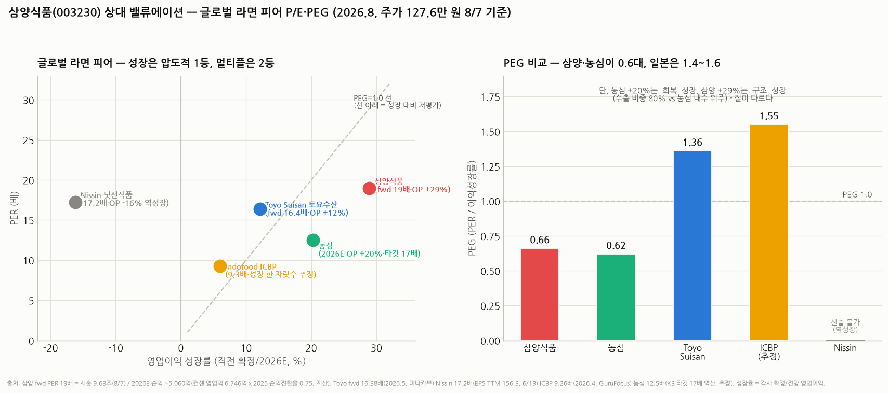
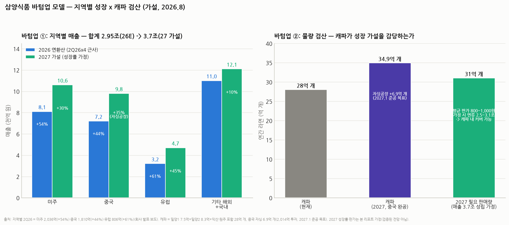

# 삼양식품(003230) 밸류에이션 딥다이브 — 바텀업 모델 × 글로벌 피어 P/E 비교

> 작성일: 2026-08-20 · 카테고리: 음식료/종목분석 (저장소 첫 음식료 리포트)
> **검증 메모**: 2025 확정(4Q25 매출 6,376억 +33.2%·영업익 1,389억 +58.5%, 연간 매출 +36.1%·영업익 +52.1%·순익 +43.2% — 절대값은 1~3Q 누적 1조 7,141억+4Q로 **연간 2조 3,517억/영업익 ~5,235억 계산**)·2026E 컨센(매출 2조 9,045억/영업익 6,746억)·2Q26(매출 7,144억 분기 최대, 영업익 1,762억, 미주 2,036억 +54%·중국 1,810억 +44%·유럽 806억 +61%)·주가 127.6만 원(2026.8.7, 시총 9조 6,272억)·캐파(밀양1 7.5억+밀양2 8.3억 포함 연 28억 개, 중국 자싱 6.9억 개·2,014억 투자·2027.1 준공 목표)·피어 멀티플(Toyo Suisan fwd 16.38배, Nissin 17.2배·영업익 -16.2%, ICBP 9.26배, 농심 KB 타깃 17배)은 공시·보도·해외 소스로 검증. **2027 바텀업 수치와 PEG의 일부 성장률은 본 리포트 가정/추정(표기).**

---

## 0. 아주 쉬운 버전 (여기만 읽어도 됨)

**질문**: 라면 회사에 PER 19배(2026E)는 비싼가?

**답의 구조**: 라면 회사들의 '원래 몸값'은 낮다 — 인도네시아 인도푸드 9배, 일본 토요수산 16배, 닛신 17배. 그 잣대로 보면 삼양 19배는 피어 최상단이다. **그런데 성장률을 옆에 놓으면 그림이 뒤집힌다**: 닛신은 이익이 **-16% 역성장**하면서 17배를 받고, 토요수산은 +12% 성장에 16배인데, 삼양은 **+29% 성장에 19배**다. 성장 1%당 가격(PEG)으로 환산하면 삼양 0.66 vs 일본 피어 1.4~1.6 — **성장을 감안하면 피어 대비 절반 값**이라는 결론이 나온다.

**바텀업으로 검산하면**: 2Q26 지역별 매출(미주 +54%, 중국 +44%, 유럽 +61%)을 이어 붙이면 2026년 ~2.95조(컨센 2.9조와 일치), 보수적 감속을 가정해도 2027년 ~3.7조·영업익 ~8,700억이 나온다. 이 경우 현재 주가는 **2027년 이익 기준 PER ~15배** — 성장이 2년만 이어져도 밸류 부담이 스스로 녹는 구조다. 물량으로도 캐파(28억 개 → 중국 공장 완공 시 34.9억 개)가 이 매출을 감당한다.

**리스크 한 줄**: 이 계산 전부가 "불닭의 해외 성장이 꺾이지 않는다"는 한 문장에 걸려 있다 — 단일 브랜드·단일 카테고리 리스크는 피어 중 최고다.

---

## 1. 현재 좌표 (검증)

| | 2024 | 2025 확정 | 2026E 컨센 |
|---|---|---|---|
| 매출 | 1조 7,280억 | **2조 3,517억 (+36.1%)** | 2조 9,045억 (+23.5%) |
| 영업이익 | 3,442억 | **~5,235억 (+52.1%)** | **6,746억 (+28.9%)** |
| OPM | 19.9% | 22.3% | 23.2% |
| 순이익 | ~2,747억 | ~3,934억 (+43.2%) | ~5,060억 (계산: OP×전환율 0.75) |

- **주가 127.6만 원(8/7) · 시총 9조 6,272억** — 7월 폭락장(코스피 -33%)을 지나고도 확인되는 가격이라는 점이 중요(내수·수출 소비재의 방어력). 5월 고점권(144만)에서 -12% 수준
- **PER: 2025 실적 기준 24.5배 / 2026E 기준 ~19.0배** (시총/순익 계산)
- 목표가: 컨센 ~188만(5월), 한화 200만 — 8월 폭락장 이후 업데이트는 미확인
- 2Q26이 방향을 재확인: 매출 7,144억(분기 최대), 해외 매출 첫 6,000억 돌파, 유럽 +61%

## 2. 상대 밸류에이션 — 글로벌 라면 피어와 P/E로 붙여보기

### 2.1 피어 테이블 (검증치)

| 회사 | PER | 최근 영업이익 성장 | 특징 |
|---|---|---|---|
| **삼양식품** | **19.0배 (2026E, 계산)** | **+28.9% (2026E 컨센)** | 수출 ~80%, 불닭 단일 브랜드의 글로벌 침투 |
| Toyo Suisan(토요수산, 일본) | **16.4배 (fwd, 2026.5)** | +12.1% (FY26/3 확정, 사상 최대) | 마루찬 — 미국 라면 1위권, 삼양의 가장 좋은 비교축 |
| Nissin(닛신식품, 일본) | 17.2배 (TTM) | **-16.2% (FY26/3 확정, 역성장)** | 원조 브랜드 — 원가·물류비에 이익 붕괴 |
| 농심 | ~12.5배 (KB 타깃 17배 역산, 추정) | +20.3% (2026E, KB) | 내수 위주 + 미국 성장 — 국내 비교축 |
| Indofood CBP(인도네시아) | 9.3배 (2026.4) | 한 자릿수 (추정) | 신흥국 내수 독점형 — 저성장·저멀티플의 바닥 잣대 |

### 2.2 읽는 법 — 세 개의 층

1. **'라면 = 저멀티플' 편견의 정체**: ICBP 9배·토요수산 16배가 보여주듯, 라면은 성숙 내수 산업일 때 10~17배를 받는다. 삼양 19배만 보면 "피어 최고가"라 비싸 보인다
2. **성장으로 정규화하면 역전**: PEG(PER÷이익성장률)로 보면 삼양 0.66, 토요수산 1.36, ICBP ~1.5, 닛신 산출 불가(역성장). **같은 산업 안에서 삼양은 성장 1% 대비 가장 싸다**. 흥미로운 건 농심(0.62)도 낮다는 것 — 단, 농심의 +20%는 2025 부진에서의 **회복 성장**이고 삼양의 +29%는 수출 침투율의 **구조 성장**이라 질이 다르다(회복은 1회성, 침투는 다년)
3. **닛신이 주는 교훈(중요)**: 역성장하는 원조 브랜드가 17배를 받는 이유는 '브랜드의 잔존 가치' 때문이다 — 뒤집으면, **삼양이 성장이 끝나는 날 받게 될 멀티플의 바닥이 15~17배**라는 뜻이기도 하다. 현재 19배는 "성장 지속"에 대한 프리미엄이 2~3배 얹힌 상태로, 프리미엄이 얇아서 성장 확인 시 업사이드가 크고, 꺾여도 낙폭이 밸류 붕괴급은 아니라는 비대칭

### 2.3 참고: 미국 성장 소비재의 잣대

몬스터·셀시어스 같은 '단일 브랜드 글로벌 침투' 소비재는 성장기 PER 30~40배를 받아 왔다(정확한 현재치 미확인이라 잣대로만). 삼양을 '라면 회사'가 아니라 '매운맛 IP의 글로벌 소비재'로 보는 쪽(한화 200만 원 등 강세론의 본질)은 이 잣대를 쓰는 것이다 — 어느 피어군을 선택하느냐가 곧 목표가 논쟁의 정체다.

## 3. 바텀업 — 지역별로 쌓고, 물량으로 검산

### 3.1 지역별 빌드업 (2Q26 실적 → 연환산 → 2027 가설)

| 지역 | 2Q26 확정 | 2026 연환산(×4 근사) | 2027 가정 | 근거 |
|---|---|---|---|---|
| 미주 | 2,036억 (+54%) | ~8,100억 | +30% → 1.06조 | 메인스트림 채널(월마트 등) 침투 지속, 고성장 자연 감속 가정 |
| 중국 | 1,810억 (+44%) | ~7,200억 | +35% → 9,800억 | **자싱공장(2027.1) 가동 시 관세·운임 절감→가격 경쟁력**, 간식 채널 확장 |
| 유럽 | 806억 (+61%) | ~3,200억 | +45% → 4,700억 | 진출국 확대 초기 국면 — 침투율 가장 낮고 성장률 가장 높음 |
| 기타 해외+국내 | — | ~1.1조 | +10% → 1.21조 | 아시아 성숙, 내수 정체(내수 비중 ~18%) |
| **합계** | 7,144억 | **~2.95조** ✓ 컨센 2.9조와 정합 | **~3.7조 (+26%)** | |

- 마진: OPM 23.5% 가정(2025 22.3% → 2026E 23.2%의 연장 — 수출 믹스 개선+공장 규모의 경제) → **2027 영업이익 ~8,700억, 순익 ~6,500억(전환율 0.75)**
- **함의**: 2027E EPS ~86,000원(753만 주) → 현재 주가 127.6만은 **2027년 기준 PER ~14.8배** — 토요수산(16.4배)보다 싸진다. 즉 "지금 사면 2년 뒤 성숙 라면회사 밸류로 성장주를 보유"하는 계산

### 3.2 물량 검산 — 캐파가 가설을 감당하나

- 현재 캐파: 밀양1(7.5억)+밀양2(8.3억, 2025.6 가동 후 **1년 만에 풀가동**)+익산·원주 = **연 28억 개**
- 중국 자싱공장 +6.9억 개(2,014억 투자, 2027.1 준공 목표) → **34.9억 개**
- 2027 매출 3.7조 중 면류를 ~2.5~3.1조로 보고 평균 판가 800~1,000원(가정)을 적용하면 필요 판매량 ~28~34억 개 — **증설 캐파 범위 안**. 거꾸로 말하면 캐파가 성장의 상한이기도 하다: 밀양2가 1년 만에 풀가동된 전례를 보면 **2027~28년 추가 증설 발표가 성장 지속의 선행 신호**(한화 리포트 제목 "Shortage, Shortage, Shortage"가 이 상황을 요약)
- 교차검증: 회사 스스로 2026년 매출 "3조 클럽" 목표 보도 — 본 모델의 2.95조와 정합

### 3.3 시나리오 밸류에이션 (12개월, 가설)

| | 가정 | 2027E EPS | 적용 PER | 함의 주가 |
|---|---|---|---|---|
| Bull | 지역 성장 유지+자싱 효과, '글로벌 소비재' 리레이팅 | ~86,000원 | 25배 | ~215만 |
| Base | 본문 바텀업 그대로, 라면 피어 상단 멀티플 | ~86,000원 | 18~20배 | **155만~172만** (컨센 188만과 유사) |
| Bear | 미주 성장 +10%대로 급감속(유행 소멸 프레임) | ~70,000원 | 15배 (닛신 바닥 잣대) | ~105만 (-18%) |

## 4. 이 밸류에이션이 틀리는 경로 (리스크)

1. **단일 브랜드 유행 리스크**: 불닭이 매출의 대부분 — '까르보불닭 챌린지'류 밈 수요의 지속성은 검증 불가능한 가정. 미주 성장률이 +54%→+20%대로 꺾이는 분기가 나오면 PEG 논리가 무너지며 19배→15배 디레이팅(주가 -20~30%)이 가능
2. **관세**: 미국의 식품 관세 부과 시 가격 전가력 시험대 — 현재까지는 프리미엄 가격에도 판매 견조(구체 관세율 영향 미확인)
3. **중국 공장의 양날**: 자싱공장은 원가 절감이지만, 중국 로컬 경쟁사(백상 등)의 카피 제품과 가격 경쟁 심화 시 '현지 생산 = 현지 가격 경쟁 편입'이 될 수도
4. **환율**: 수출 ~80% — 원화 강세 10%는 영업이익 한 자릿수 후반 % 타격 추정
5. **원가**: 팜유·소맥 급등 시 마진 가정(23.5%) 훼손 — 닛신의 -16%가 바로 이 경로였다
6. 목표가·컨센이 8월 폭락장 이후 업데이트 미확인 — 최신 리포트 확인 필요

---

## 참고 출처 (검증)

- [청년일보 — 2Q26 영업익 1,762억·해외 매출 첫 6,000억 돌파](https://www.youthdaily.co.kr/news/article.html?no=225185) · [인사이트 — 2Q26 매출 7,144억 분기 최대·유럽 +61%](https://www.insight.co.kr/news/553996) · [파이낸셜투데이 — 미주 2,036억(+54%)·중국 1,810억(+44%)·유럽 806억(+61%)](https://www.ftoday.co.kr/news/articleView.html?idxno=363675)
- [씽크풀/실적속보 — 2025 연결 매출 +36.1%·영업익 +52.1%·순익 +43.2%](https://m.thinkpool.com/stockDiscuss/003230/cont/11864101) · 4Q25 6,376억/1,389억: 증권사 리뷰(알파스퀘어 게재)
- [톱스타뉴스 — 8/7 주가 1,276,000원·시총 9조 6,272억](https://www.topstarnews.net/news/articleView.html?idxno=16157375) · [한화투자증권 — 목표가 200만 원(2026.5.15)·"Shortage" 리포트(2026.1.30)](https://www.hanwhawm.com/main/common/common_file/fileView.cmd?category=2&depth3_id=anls1&key1=65350&key2=1&bldid=bbs10031)
- [뉴시스 — 밀양2공장 가동(연 8.3억 개, '한국의 붉은 반도체')](https://www.newsis.com/view/NISX20250610_0003208092) · [블로터 — 밀양2공장 1년 만에 풀가동](https://www.bloter.net/news/articleView.html?idxno=668924) · [머니투데이 — 중국 자싱 공장 연 6.9억 개·1,400억→2,014억 투자·2027.1 준공](https://www.mt.co.kr/living/2024/12/19/2024121914045024281)
- 피어: [미나카부 — 토요수산 fwd PER 16.38배(2026.5)·FY26/3 OP +12.1% 사상 최대](https://minkabu.jp/stock/2875) · [야후재팬/인베스팅 — 닛신 EPS TTM 156.3·주가 2,686엔(6/13)·FY26/3 OP -16.2%](https://finance.yahoo.co.jp/quote/2897.T) · [GuruFocus — ICBP PE 9.26배(2026.4)](https://www.gurufocus.com/term/pe-ratio/ISX:ICBP) · [KB증권 — 농심 2026E OP 2,315억(+20.3%)·타깃 17배(2026.5.15)](https://kbthink.com/securities-view.html?docId=20260515123913530K)
- [머니투데이 — 불닭 해외 매출 1.3조·중국·미주 찍고 유럽 공략(2025.12)](https://www.mt.co.kr/living/2025/12/04/2025120217480910864) · [다음/뉴스 — 올 3조 클럽 간다(2026.1.4)](https://v.daum.net/v/20260104174722551)

**저장소 연계**: `시장브리핑/테마부활의역사`(유행 소멸 vs 구조 성장의 판별 프레임) · `반도체/배경지식/메모리수요_PERvsPBR`(성장주 멀티플 논리) — 음식료 첫 리포트라 섹터 배경지식은 추후 추가 예정

> 유의: 2027 바텀업(성장률·판가·OPM·전환율)은 전부 본 리포트의 가정이며 검증된 전망이 아니다. 농심 PER·ICBP 성장률은 추정 표기. 몬스터·셀시어스 멀티플은 현재치 미확인으로 잣대로만 언급. 8월 폭락장 이후 증권사 목표가 업데이트 미확인. 매수 추천 아님.
