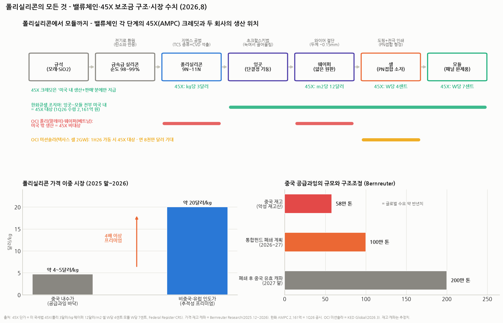

# 폴리실리콘의 모든 것 — 시장 전망 · "왜 한화만 보조금을 받나" · 제조와 작동 메커니즘

> 작성일: 2026-08-20 · 카테고리: 정유및석유화학/배경지식 (태양광 듀오 후속 Q&A편 — 자매편: `종목분석/한화솔루션_심층분석리포트`, `종목분석/OCI홀딩스_심층분석리포트`)
> **검증 메모**: 45X 크레딧 단가(폴리 3달러/kg·웨이퍼 12달러/m²·셀 W당 4센트·모듈 W당 7센트)와 "미국 내 생산+비특수관계인 판매" 요건은 미 연방관보·CRS·법률 리뷰로 검증. 폴리실리콘 시장 수치(중국 재고 57~60만 톤, 통합펀드 100만 톤 폐쇄 계획, 2027년까지 중국 내수가 5달러/kg 회복 어려움, 비중국·유럽 ~20달러/kg)는 Bernreuter Research(2025.12~2026) 기반. OCI 미션솔라 텍사스 셀 공장(2.65억 달러·2GW·1H26 상업생산·연 8천만 달러 크레딧 기대)은 KED Global 등 보도 검증. 제조 공정(§3)은 표준 교과서 지식. **시장 전망은 리서치사 추정으로, 실측이 아닌 시나리오다.**

---

두 종목 리포트를 읽고 나온 세 가지 질문에 하나씩 답한다.

---

## 질문 ③부터 (기초가 먼저): 폴리실리콘이 뭐고, 어떻게 만들어서, 어떻게 쓰이나

### 3.0 아주 쉬운 버전

- **폴리실리콘 = "반도체·태양광용 초고순도 실리콘 덩어리"**다. 원료는 사실상 모래(규석, SiO₂). 모래 속 실리콘을 꺼내서 **불순물이 10억 개 중 1개 이하**가 될 때까지 정제한 은회색 금속 조각이라고 보면 된다.
- 비유: **밀가루(폴리실리콘) → 반죽 덩어리(잉곳) → 얇게 민 피(웨이퍼) → 만두(셀) → 만두 한 판(모듈)**. 폴리실리콘은 태양광 산업 전체의 '밀가루'다 — 그래서 듀오 리포트에서 "태양광의 쌀"이라고 불렀다.
- 태양광 패널이 전기를 만드는 건 **광전효과**: 실리콘에 빛(광자)이 부딪히면 전자가 튀어나오는데, 셀 안에 미리 만들어둔 '전자용 미끄럼틀'(PN접합)이 그 전자를 한 방향으로만 흐르게 해서 전류가 된다. 불순물이 많으면 튀어나온 전자가 중간에 잡아먹혀서 효율이 떨어진다 — **그래서 순도가 생명**이다.

### 3.1 1단계: 모래에서 금속급 실리콘 (순도 98~99%)

규석(석영)을 **전기로에서 약 2,000°C로 탄소(코크스)와 함께 가열**하면 산소가 탄소에 붙어 떨어져 나가고(SiO₂ + 2C → Si + 2CO) 순도 98~99%의 **금속급 실리콘(MG-Si)**이 나온다. 이건 kg당 2~3달러짜리 범용 금속으로, 알루미늄 합금·실리콘(고무) 원료로도 쓰인다. 전기를 많이 먹는 공정이라 수력·석탄 등 싼 전기가 있는 곳(중국 신장·윈난, 노르웨이 등)에 몰려 있다.

### 3.2 2단계: 지멘스 공법 — 98%를 99.9999999%로

98~99%로는 태양광에 못 쓴다. 목표는 **9N**(nine nines, 99.9999999%) 이상 — 불순물 10억 분의 1 수준. 고체를 직접 거를 수 없으니 **기체로 바꿔서 증류**한다:

1. **염화**: 금속급 실리콘을 염화수소(HCl)와 반응시켜 **삼염화실란(TCS, SiHCl₃)** 가스로 만든다. 이때 붕소·인 같은 불순물도 각자 다른 염화물 가스가 된다
2. **증류**: 물질마다 끓는점이 다르다는 걸 이용해 **증류탑에서 TCS만 골라낸다**(소주 증류와 같은 원리). 여러 번 반복하면 초고순도 TCS만 남는다
3. **석출(CVD)**: 종 모양 반응기(벨자) 안에 가느다란 실리콘 심을 세우고 **전기로 1,100°C까지 가열**한 뒤 정제된 TCS+수소를 흘리면, 뜨거운 심 표면에서 가스가 분해되며 **실리콘이 눈사람처럼 겹겹이 달라붙는다**. 며칠 키우면 지름 15~20cm의 초고순도 실리콘 막대가 되고, 이걸 부순 덩어리가 **폴리실리콘**(다결정 = poly)이다

이 공정이 1950년대 지멘스가 개발한 **지멘스 공법**(현재도 세계 생산의 대부분). 핵심 특징 두 가지 — ① **전기 먹는 하마**: 제조원가의 30~40%가 전기료라, 폴리실리콘 공장은 싼 전기를 찾아간다(OCI가 수력 기반 말레이시아로 간 이유, 중국이 신장 석탄전력에 몰린 이유 — 그리고 신장이 강제노동 제재 대상이 되면서 이게 역으로 미국 시장의 진입장벽이 됐다). ② **대안 공법 FBR**(유동층 반응기): 전기를 덜 쓰고 연속 생산이 가능하지만 순도 관리가 어려워 아직 소수파(GCL, REC실리콘 등).

참고: 태양광용은 9N이면 되지만 **반도체용은 11N**(순도 100배 더 엄격)이라 단가·마진이 한 급 위다 — OCI홀딩스의 '안정 축'인 군산 반도체용 폴리가 이 시장이다.

### 3.3 3단계: 폴리 → 잉곳 → 웨이퍼 → 셀 → 모듈

- **잉곳**: 폴리실리콘 덩어리를 도가니에 녹인 뒤, 씨앗 결정을 담갔다가 **천천히 돌리며 끌어올리면**(초크랄스키법) 원자가 한 방향으로 정렬된 **단결정 기둥**(지름 ~30cm, 길이 수 m)이 자란다. 결정 방향이 하나면 전자가 덜 산란돼 효율이 높다 — 지금 태양광의 표준
- **웨이퍼**: 잉곳을 다이아몬드 와이어로 **0.13~0.18mm 두께로 슬라이스**한 원판. 절단 손실(커프)을 줄이는 게 원가 기술
- **셀**: 웨이퍼에 인(P)을 확산시켜 **PN접합**을 만든다. 원리 — 인을 섞은 층(N형)은 전자가 남고, 붕소를 섞은 층(P형)은 전자 자리가 빈다. 두 층이 만나는 경계에 **내장 전기장**이 생기는데, 빛이 전자를 튕겨내면 이 전기장이 전자를 N쪽으로만 밀어낸다 → 한 방향 전류. 여기에 반사방지막(파란색의 정체)과 은 전극을 인쇄하면 셀 완성. 셀 1장 ≈ 0.6V, 수 W
- **모듈**: 셀 60~144장을 직렬로 잇고 유리·봉지재(EVA)·백시트로 밀봉한 완제품(300~700W). 우리가 보는 '태양광 패널'

**밸류체인 정리**: 폴리실리콘(kg) → 잉곳/웨이퍼(m²) → 셀/모듈(W). 대략 **모듈 1GW에 폴리실리콘 2,000~2,500톤**이 든다(웨이퍼 박형화로 계속 줄어드는 추세). 이 단위 사슬(kg→m²→W)을 기억하면 아래 45X 크레딧 표가 그대로 읽힌다.

---

## 질문 ②: 왜 한화솔루션은 보조금을 받는데 OCI홀딩스는 못 받나

### 2.0 한 줄 답

**보조금(AMPC)은 '회사'가 아니라 '미국 땅 위의 생산량'에 붙기 때문이다.** 한화큐셀은 조지아에서 만들고, OCI의 주력 공장은 말레이시아에 있다 — 그게 전부다.

### 2.1 AMPC = IRA 45X 조항의 구조

미국 인플레이션감축법(IRA)의 **45X 첨단제조 생산세액공제**(Advanced Manufacturing Production Credit — 한국 언론이 'AMPC'로 부르는 것)는 조건이 명확하다:

| 요건 | 내용 |
|---|---|
| **어디서** | **미국(또는 미국령) 내에서 생산** — 본사 국적 무관. 한국 기업이든 중국계든 미국 공장이면 받는다 |
| **무엇을** | 법에 열거된 품목(태양광·풍력 부품, 배터리, 핵심광물) — 품목별 단가 고정 |
| **어떻게** | 생산 후 **비특수관계인에게 판매**해야 크레딧 확정 (자기 계열사에 쌓아두면 안 됨) |
| **언제까지** | 2023~2032년 (2030년부터 단계 축소) |

**태양광 품목별 단가** (밸류체인 순서 그대로):

| 품목 | 크레딧 | 감으로 환산하면 |
|---|---|---|
| 폴리실리콘 | **kg당 3달러** | 중국 내수가(4~5달러)의 60~70%를 정부가 얹어주는 셈 |
| 웨이퍼 | **m²당 12달러** | — |
| 셀 | **W당 4센트** | 1GW 생산 = 4,000만 달러 |
| 모듈 | **W당 7센트** | 1GW 생산 = 7,000만 달러 |

셀부터 모듈까지 미국에서 만들면 W당 11센트 — 모듈 판가가 W당 25~35센트 수준임을 감안하면 **판가의 3분의 1을 세액공제로 돌려받는, 제조업 보조금으로는 파격적인 설계**다. 잉곳·웨이퍼·폴리까지 전부 미국산으로 쌓으면(스태킹) 더 커진다.

### 2.2 두 회사를 이 표에 얹으면 (차트 상단)

- **한화큐셀**: 조지아 달튼+카터스빌에서 **잉곳→웨이퍼→셀→모듈 수직계열화**를 미국 안에 구축. 만드는 족족 45X 대상 → **1Q26에만 2,161억 원 수령**, 물량이 늘수록 자동 증가. 듀오 리포트에서 본 "AMPC 없으면 -1,235억 적자"의 원천이 바로 이 표다
- **OCI홀딩스**: 주력인 **폴리실리콘 공장이 말레이시아**(싼 수력 전기를 찾아 2017년 도쿠야마 공장 인수로 진출 — 전기료 때문에 국내 군산 태양광용은 접었다), 신규 **웨이퍼는 베트남**. 즉 45X가 열거한 품목을 만들고 있지만 **미국 밖에서 만들기 때문에 한 푼도 못 받는다**. 얄궂은 점: OCI의 말레이시아 진출(2017)은 IRA(2022) **이전**의 합리적 결정이었다 — 싼 전기 = 원가 경쟁력. 그런데 5년 뒤 보조금의 기준이 '원가'가 아니라 '국경'이 되면서, 같은 결정이 보조금 사각지대가 됐다

### 2.3 그런데 뉘앙스가 둘 있다

1. **OCI도 곧 '조금은' 받는다**: 미국 자회사 미션솔라(텍사스 샌안토니오)가 **2.65억 달러를 들여 셀 공장(2GW)을 증설, 1H26 상업생산** — 가동되면 셀 W당 4센트로 **연 8천만 달러(약 1,100억 원) 크레딧을 기대**한다고 회사가 밝혔다. 한화(연환산 8,000억+)의 1/7~1/8 규모지만, "OCI = AMPC 제로"는 2026년부터는 부정확해진다
2. **OCI의 진짜 수혜는 보조금이 아니라 '관세+추적성'**: 미국이 중국산(신장 폴리실리콘 포함 제품)을 UFLPA·관세로 막을수록, 미국행 모듈엔 "중국산 폴리가 안 섞였다는 증명"이 필요하다. OCI 말레이시아 폴리는 그 증명이 가능한 몇 안 되는 공급원 — **한화가 '보조금의 직접 수혜자'라면 OCI는 '같은 정책이 만든 프리미엄 시장의 수혜자'**다. 실제로 한화큐셀이 OCI 폴리를 사가는 관계(잠재 고객이자 파트너)라는 점이 이 구도를 압축한다

### 2.4 투자 관점의 번역

- 한화의 AMPC는 **확정 현금**(생산하면 나옴)이지만, 존속이 **미국 정치의 함수**(감세 논쟁·정권 교체) — 폐지·축소가 최대 리스크
- OCI의 비중국 프리미엄은 **시장 가격**(불확실)이지만, 정책이 아니라 **공급망 구조**(중국 90% 집중에 대한 헤지 수요)에 뿌리 — 정책이 일부 완화돼도 수요가 완전히 사라지긴 어렵다
- 요약: **한화 = 정책의 직접 수혜(고가시성·고정책리스크), OCI = 정책이 만든 시장의 간접 수혜(저가시성·구조적 지속성)** — 듀오 리포트의 "확인 매매 vs 선행 베팅" 구도의 뿌리가 여기다

---

## 질문 ①: 향후 폴리실리콘 시장 전망

### 1.0 한 줄 답

**"중국 안은 2027년까지 바닥 기고, 중국 밖은 이미 4배 프리미엄 — 그리고 2028년엔 역설적으로 쇼티지 가능성"**이 현재 리서치(Bernreuter)의 기본 시나리오다. 폴리실리콘은 이제 하나의 시장이 아니라 **두 개의 시장**으로 갈라졌다.

### 1.1 지금 상태: 사상 최악의 공급과잉 (차트 하단 우측)

- 2020~22년 태양광 붐 때 중국 업체들이 캐파를 폭증(수백만 톤) → 2023년부터 공급이 수요를 압도, 가격이 **한계원가 밑으로** 추락. 한화·OCI가 2025년 나란히 적자를 낸 배경
- **재고 57~60만 톤** — 모듈로 환산하면 300~316GW, **전 세계 수요의 약 반년치**가 창고에 쌓여 있다. 2024년 말 33개사가 감산에 합의했지만 이 '재고산'을 소화하기엔 부족
- 중국 정부 주도의 **통합펀드**(2025.12 출범): 낙후 캐파를 사들여 폐쇄하는 구조조정 기구 — 계획대로면 **2026~27년에 100만 톤 폐쇄**, 중국 유효 캐파는 2027년 말 약 200만 톤으로 축소

### 1.2 가격 전망: 이중 시장 (차트 하단 좌측)

| 시장 | 현재 | 전망 |
|---|---|---|
| **중국 내수** | 약 4~5달러/kg (한계원가 부근) | **2027년까지 5달러 상회 어려움** — 감산이 대폭 확대되거나 원료(메탈실리콘) 가격이 반등하지 않는 한. 재고 소진이 우선이라 감산발 스파이크가 와도 되돌림 반복 |
| **비중국 (유럽 인도가)** | **약 20달러/kg** (2025 말) | 미국 UFLPA·관세, EU 강제노동 규제로 **추적 가능한 비중국 폴리**에 4배 이상 프리미엄. 규제가 강화될수록 확대 방향 |

이 표가 OCI홀딩스 투자 논리의 전부라 해도 과언이 아니다: OCI의 손익은 왼쪽 칸(국제가)이 아니라 **오른쪽 칸(비중국 프리미엄)을 얼마나 실현하느냐**에 달렸다. 말레이시아산이 20달러급 시장에 팔리면 흑자가 깊어지고, 중국가에 끌려가면 적자로 돌아간다.

### 1.3 2028년 쇼티지 시나리오 — 사이클의 데자뷰

Bernreuter의 관측: 지금 국면은 **2018~20년 셰이크아웃의 재판**이다. 당시에도 과잉→가격 붕괴→한계기업 퇴출→캐파 축소가 진행됐고, 그 축소가 끝난 직후 2020~22년 수요 급증과 맞물려 **가격이 4배 뛰는 쇼티지**가 왔다(그때 OCI가 "10년 만의 부활"을 했다 — ☞ `테마부활의역사`). 이번에도 통합펀드발 100만 톤 폐쇄 + 재고 소진이 2027년까지 완료되면, **2028년 새로운 쇼티지**가 올 수 있다는 것.

다만 조건부다: ① 통합펀드가 계획대로 폐쇄를 집행하고(중국 지방정부의 고용 보호 저항이 변수) ② 태양광 설치 수요가 견조하게 유지되고(고금리·미국 정책 후퇴가 변수) ③ 폐쇄된 캐파가 가격 반등 시 재가동되지 않아야(과거 사이클마다 반복된 함정) 한다.

### 1.4 정리 — 세 갈래 시나리오 (12~36개월, 가설)

| | 가정 | 함의 |
|---|---|---|
| Bull | 통합펀드 폐쇄 집행 + 재고 소진 + 2028 쇼티지 전개 | 폴리 가격 급반등 — OCI 2021년식 부활 재연, 한화도 원가 상승보다 모듈 판가 수혜 |
| Base | 중국 내수 4~5달러 횡보 + 비중국 프리미엄 유지·확대 | OCI는 프리미엄 실현분만큼 완만 회복, 한화는 AMPC+관세로 앞서감 (현재 듀오 리포트의 기본 그림) |
| Bear | 폐쇄 지연·재가동 + 수요 둔화 + 미중 딜로 규제 완화 | 이중 시장 붕괴(프리미엄 소멸) — 둘 다 정책 프리미엄 반납 |

**감시 지표**: ① 중국 폴리 내수가(주간, PV인사이트·실리콘브랜치) ② 통합펀드 폐쇄 집행 뉴스 ③ 중국 재고 추이 ④ 미국 관세 최종판정(연내 — 한화의 어닝 이벤트이자 OCI 프리미엄의 온도계) ⑤ OCI 미션솔라 1H26 가동(OCI의 첫 AMPC).

---

## 참고 출처 (검증)

- 45X 단가·요건: [Federal Register — Section 45X Advanced Manufacturing Production Credit(최종 규정)](https://www.federalregister.gov/documents/2024/10/28/2024-24840/advanced-manufacturing-production-credit) · [CRS — The Section 45X Credit](https://www.congress.gov/crs-product/IF12809) · [율촌 — 45X 세부지침 핵심 내용(국문)](https://yulchonllc.com/legal/2024/202401/IRA/legalupdate-kor-240104/PDF/240104_YC_LU_IRA_Kor.pdf) · [주미대사관 — 45X 잠정 가이던스](https://www.mofa.go.kr/us-ko/brd/m_4492/view.do?seq=1347856) · [pvknowhow — 45X 태양광 품목 단가 정리](https://www.pvknowhow.com/countries/united-states/inflation-reduction-act-advanced-manufacturing-credits/)
- OCI 미션솔라: [KED Global — OCI, 텍사스 셀 공장 2.65억 달러·연 8천만 달러 크레딧 기대 (2025.3)](https://www.kedglobal.com/energy/newsView/ked202503200004) · [Manufacturing Dive — 미션솔라 샌안토니오 증설·1H26 상업생산·500명 고용](https://www.manufacturingdive.com/news/oci-holdings-mission-solar-energy-solar-cell-expansion-san-antonio-texas/743484/)
- 시장 수치: Bernreuter Research — 중국 내수가 2027년까지 5달러/kg 상회 어려움, 유럽 비중국 인도가 ~20달러/kg, 재고 57~60만 톤(300~316GW 상당), 통합펀드 100만 톤 폐쇄 계획(2026~27), 2028 쇼티지 가능성 (2025.12~2026 발간물, 이전 턴 검증분)
- 한화 AMPC 2,161억(1Q26)·관세 예비판정: `종목분석/한화솔루션_심층분석리포트` 출처 공유
- 제조 공정(지멘스 공법·초크랄스키·PN접합): 표준 공학 지식 (검증 불요 수준의 교과서 내용이나, 수치 중 '모듈 1GW당 폴리 2,000~2,500톤'은 업계 통용 근사치)

**저장소 연계**: `종목분석/한화솔루션_심층분석리포트`(질문 ②의 수혜 측) · `종목분석/OCI홀딩스_심층분석리포트`(사각지대 측) · `테마부활의역사`(2018~20 셰이크아웃→2021 부활 = §1.3의 원형) · `정유석유화학_산업배경지식`(중국 과잉의 구조)

> 유의: 시장 전망(§1)은 Bernreuter 단일 리서치사 의존도가 높다 — 타사(우드맥·BNEF) 전망과 다를 수 있다. 재고·캐파·프리미엄 수치는 추정치. 2028 쇼티지는 조건부 시나리오지 예측이 아니다. 매수 추천 아님.
