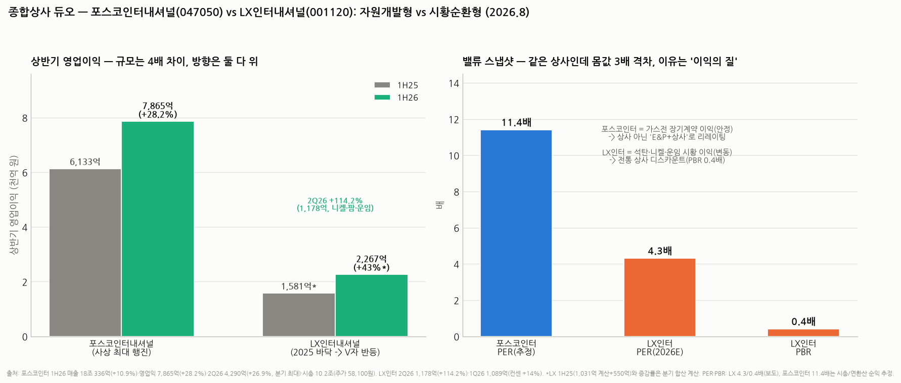

# LX인터내셔널(001120) 심층분석 — 석탄·니켈·운임의 3중 베타, 바닥에서 V자

> 작성일: 2026-08-20 · 카테고리: 종합상사/종목분석 (상사 듀오 ② — 자매편: `포스코인터내셔널_심층분석리포트`)
> **검증 메모**: 2Q26 영업이익 1,178억(+114.2%)·매출 4조 7,763억(+24.7%)·1Q26 영업이익 1,089억(컨센 +14% 상회)·2025 분기 실적(2Q25 550억 -58%, 3Q25 648억, 4Q25 555억, 3Q 누적 -40.1%)·부진 원인(석탄가 약세)·회복 동력(AKP 니켈 판가·물량, 팜오일 시황, 해상운임·물동량, IT부품·석화 트레이딩)·PER 4.3배/PBR 0.4배(2026E, 보도)는 공시·보도 검증. **2025 연간 영업이익 ~2,780억은 분기 합산 계산(1Q25 1,031억은 증감률 역산 추정)**. 최신 주가는 미확인(2~4월 47,400~51,000원).

---

## 0. 아주 쉬운 버전 (여기만 읽어도 됨)

**뭐 하는 회사?** 옛 LG상사다. LX그룹(구본준) 분리 후의 간판 회사로, 세 개의 바퀴로 굴러간다: ① **자원** — 인도네시아 석탄광산(GAM 등)·**니켈광산(AKP)**·팜 농장(직접 캐고 기른다), ② **트레이딩** — IT부품·석유화학 등 중개, ③ **물류** — 자회사 LX판토스(해상·항공 포워딩, 운임의 함수).

**뭐가 문제였나**: 2025년이 바닥이었다 — 석탄 가격 약세로 3분기 누적 영업이익 -40%, 분기 이익이 550~650억대까지 떨어졌다. 이 회사 이익은 **석탄가×니켈가×운임**의 곱이라, 셋이 같이 꺾이면 속수무책이다.

**뭐가 바뀌었나**: 2026년 들어 셋이 같이 돌아섰다 — 1Q26 1,089억(컨센 +14%), **2Q26 1,178억(+114.2%)**. 니켈 판가·생산량 확대(AKP), 팜오일 시황 상승, 해상운임 인상·물동량 증가, IT부품·석화 트레이딩 회복이 겹쳤다.

**밸류에이션**: **PER 4.3배·PBR 0.4배**(2026E) — 포스코인터(~11배)의 3분의 1 몸값. 싼 이유는 명확하다: 이익이 시황의 함수라 지속성을 인정 못 받는 것. 거꾸로 시황 상승 국면에선 이익과 멀티플이 같이 뛰는 **더블 레버리지**가 걸린다. 고배당(하나증권 "고배당+신규 자원투자 기대")이 기다림의 비용을 줄여 준다.

**한 줄 평**: 포스코인터가 '채권 같은 성장주'라면 LX인터는 **'원자재 콜옵션 + 배당'**이다 — 사이클 판단이 곧 투자 판단.

---

## 1. 사업 구조 — 세 개의 시황 바퀴

| 부문 | 내용 | 시황 변수 |
|---|---|---|
| **자원** | 인니 GAM 석탄광산(발전용 유연탄), **AKP 니켈광산**(2차전지·스테인리스 원료), 팜 농장(CPO) | 석탄가·니켈가·팜유가 |
| **트레이딩** | IT부품(반도체·디스플레이 부材), 석유화학, 헬스케어 등 | 전방 업황(반도체 회복 수혜 ☞ 메모리 시리즈) |
| **물류** | LX판토스 — 해상·항공 국제물류(포워딩), LG그룹 물량 기반 | 해상운임(SCFI)·물동량 |

- **니켈이 성장 스토리**: AKP 광산 생산 확대 + 니켈 제련·2차전지 소재로 확장 투자 — 석탄(감산 압력 받는 자산)에서 니켈(전동화 금속)로 포트폴리오를 갈아타는 중
- **물류가 숨은 절반**: 판토스는 LG전자·LG화학 물량이 기본 깔린 안정 사업이지만, 운임 급등기(코로나·홍해)엔 이익이 폭발하고 급락기엔 반납하는 구조

## 2. 실적 — 2025 바닥 확인, 2026 V자

| 분기 | 영업이익 | 코멘트 |
|---|---|---|
| 2Q25 | 550억 (-58%) | 석탄가 약세의 바닥권 |
| 3Q25 | 648억 | 3Q 누적 -40.1% |
| 4Q25 | 555억 | 부진 지속 — 연간 ~2,780억(계산) |
| **1Q26** | **1,089억** | 컨센 +14% 상회 — 반등 시작 |
| **2Q26** | **1,178억 (+114.2%)** | 니켈·팜·운임·트레이딩 4박자 |

- 1H26 누적 2,267억 — 전년 동기(~1,581억, 계산) 대비 +43%. 연환산 4,500억대로 2024년 수준 복원 사정권
- **이익의 성격 주의**: 이 회복분의 상당 부분은 '가격'(니켈·팜·운임)이다. 물량 성장(AKP 증산)이 섞여 있긴 하나, 가격이 되돌리면 이익도 되돌아간다 — 포스코인터의 증산형 증익과 구별할 것

## 3. 밸류에이션 — PBR 0.4배의 의미

- **PER 4.3배·PBR 0.4배(2026E)**: 청산가치의 40%에 거래 — 전형적인 시황주·지주 계열 디스카운트. 석탄 자산의 좌초 우려(ESG), 이익 변동성, 그룹(LX홀딩스) 구조가 할인 사유
- 뒤집으면: ① 자산(광산·판토스 지분)이 장부의 절반도 인정 못 받는 상태라 **하방이 두껍고** ② 시황 반등이 이익으로 확인되는 지금 같은 국면엔 PER 4배대가 6~7배로만 가도 +50%다 — 2021~22년(석탄 슈퍼사이클, 영업익 9,000억대)에 실제 벌어진 일
- **고배당이 바닥을 또 받친다**: 하나증권이 2Q 프리뷰에서 '고배당+신규 자원투자'를 투자포인트로 명시 — 정확한 주당 배당금은 공시 확인 필요(미확인)이나, 시황주를 배당 받으며 기다리는 구조

## 4. 리스크

1. **시황 3중 베타의 역회전**: 석탄·니켈·운임이 같이 꺾이면 2025년(분기 550억)으로 회귀 — 이 종목의 본질적 리스크. 특히 니켈은 인니 공급과잉 논쟁이 상존
2. **석탄의 구조적 역풍**: 탈탄소로 발전용 석탄 수요는 장기 감소 경로 — 캐시카우의 시한부 성격. 니켈·팜 전환의 속도가 관건
3. **목표가 하향 보도**: "전쟁 프리미엄 축소·실적 둔화 우려"로 증권가 목표가 줄하향 보도(스마트투데이) — 시점·맥락은 추가 확인 필요하나, 컨센이 흔들린 이력이 있다는 점은 유의
4. **지주 디스카운트 고착**: LX홀딩스 아래 구조 + 오너 일가 배당 수요 — 밸류업 인센티브가 약하다는 시장 불신
5. **최신 주가 미확인**: 2~4월 47,400~51,000원 이후, 7월 폭락장 반영가 미확인 — 매매 전 확인 필수

## 5. 시나리오 (12개월, 가설) + 듀오 비교

| | 가정 | 함의 |
|---|---|---|
| Bull | 니켈·운임 강세 지속 + 2026 OP 4,500억+ | PER 4배→6배 리레이팅 — 이익·멀티플 더블 |
| Base | 시황 혼조, OP 3,500~4,000억 | 배당 받으며 박스권 |
| Bear | 석탄·니켈 동반 약세 | 2025년형 회귀 — PBR 0.4배가 하방 방어 |

**듀오 최종 비교**:

| | 포스코인터내셔널 | LX인터내셔널 |
|---|---|---|
| 이익 원천 | 가스전 장기계약 (물량 성장) | 석탄·니켈·팜·운임 시황 (가격 베타) |
| 2026 상반기 | 7,865억 (+28%) — 사상 최대 행진 | 2,267억 (+43%) — 바닥 대비 V자 |
| 밸류 | PER ~11배 (E&P 리레이팅) | PER 4.3배·PBR 0.4배 (상사 디스카운트) |
| 사는 이유 | 성장의 가시성 | 사이클 + 배당 + 자산가치 |
| 최악의 적 | 미얀마 지정학 | 시황 3중 역회전 |

둘을 같이 들면 '에너지·원자재 가격'이라는 같은 거시 변수에 이중 노출된다는 점은 태양광 듀오 때와 같은 경고.

---

## 참고 출처 (검증)

- [이투데이 — 2Q26 영업익 1,178억(+114.2%)](https://www.etoday.co.kr/news/view/2610393) · [헤럴드경제 — 자원 가격 상승·운임 인상 영향](https://biz.heraldcorp.com/article/10829210) · [아주경제 — 매출 4조 7,763억(+24.7%)·AKP 니켈 판가·물량, 팜 시황, IT부품·석화 회복](https://www.ajunews.com/view/20260803142510121)
- [삼성증권 — 1Q26 영업익 1,089억, 컨센 14% 상회 (2026.4.23)](https://www.samsungpop.com/common.do?cmd=down&contentType=application%2Fpdf&inlineYn=Y&saveKey=research.pdf&fileName=2010%2F2026042309574941K_02_05.pdf)
- [블로터 — 2Q25 영업익 550억(-58%)](https://www.bloter.net/news/articleView.html?idxno=641315) · 3Q25 648억·4Q25 555억·3Q 누적 -40.1%: 보도 종합(기업모니터 등)
- [하나증권/버핏연구소 — 2분기 호실적 예상·고배당·신규 자원투자 기대](https://www.buffettlab.co.kr/news/view.php?idx=55282) · PER 4.3배·PBR 0.4배(2026E): 보도 기반
- [미래에셋 — "부진한 실적, 반등은 가능하다"](https://securities.miraeasset.com/bbs/download/2142193.pdf?attachmentId=2142193) · [스마트투데이 — 목표가 줄하향 보도](https://www.smarttoday.co.kr/ko-kr/articles/110084)

**저장소 연계**: `포스코인터내셔널_심층분석리포트`(듀오 ①) · `반도체/산업·테마분석`(IT부품 트레이딩의 전방) · `방산/비츠로셀` 시리즈(니켈·원자재와 무관하나 인니 자원 지형 참고)

> 유의: 2025 연간·1H25는 분기 합산/역산 계산. 배당금 정확 액수·최신 주가·목표가 하향 보도의 시점은 미확인. 매수 추천 아님.
