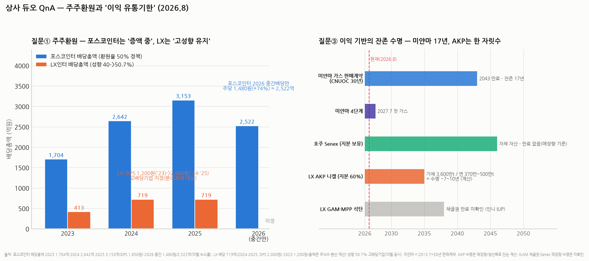

# LX인터내셔널(001120) 심층분석 — 석탄·니켈·운임의 3중 베타, 바닥에서 V자 (통합판)

> 작성일: 2026-08-20 (v2 통합판 — 주주환원·미래 먹거리·판권 잔존기간·거버넌스/중복상장 추가) · 카테고리: 종합상사/종목분석 (상사 듀오 ② — 자매편: `포스코인터내셔널_심층분석리포트`)
> **검증 메모**: 2Q26 영업이익 1,178억(+114.2%)·매출 4조 7,763억(+24.7%)·1Q26 1,089억(컨센 +14%)·2025 분기(2Q 550억 -58%·3Q 648억·4Q 555억, 3Q 누적 -40.1%)·PER 4.3배/PBR 0.4배(2026E, 보도)·배당(DPS 2021 2,300→2022 3,000→2023 1,200→2024 2,000→2025 2,000원, 총 719억, 성향 50.7%, 고배당기업 지정)·AKP 니켈(지분 60%·1,330억·가채 3,600만 톤)·LX글라스/포승그린파워 인수·**판토스 지분 51→75.9%(미래에셋PE분 1,950억 인수)·IPO 사실상 무산** 모두 공시·보도 검증. 2025 연간 영업이익 ~2,780억과 AKP 수명은 계산 표기. 최신 주가 미확인(2~4월 47,400~51,000원).

---

## 0. 아주 쉬운 버전 (여기만 읽어도 됨)

**뭐 하는 회사?** 옛 LG상사. LX그룹(구본준)의 간판으로, 세 바퀴로 굴러간다: ① 자원(인니 GAM·MPP 석탄, **AKP 니켈**, 팜 농장), ② 트레이딩(IT부품·석화), ③ 물류(자회사 LX판토스 — 지분 75.9%).

**실적**: 2025년이 바닥(석탄가 약세, 분기 550~650억) → 2026년 V자: 1Q26 1,089억(컨센 +14%), **2Q26 1,178억(+114.2%)** — 니켈 판가·물량, 팜 시황, 해상운임, 트레이딩 회복의 4박자.

**이 종목의 4대 질문에 대한 짧은 답**:
1. **주주환원?** — 이미 '배당주'다. 배당성향 2년 연속 40%를 넘겨 2025년엔 **50.7%**, 세법상 **고배당기업 지정(배당소득 분리과세 수혜 대상)**. 다만 이익이 줄면 DPS도 주는 '성향형'이라(3,000원→1,200원 전례) 포스코인터식 '증액 커밋'과는 결이 다르다
2. **미래 먹거리?** — "저무는 상사 시대"를 스스로 인정하고 **니켈·구리 등 미래 광물 + 인수한 실물 회사(LX글라스·바이오매스 발전)**로 갈아타는 중
3. **지금 이익의 유통기한?** — 가장 아픈 질문이다. 성장축인 AKP 니켈의 가채 매장량은 목표 생산 속도 기준 **수명 약 7~10년(계산)**. 석탄 채굴권 만료는 공시 확인 필요(미확인)
4. **거버넌스·중복상장?** — 판토스 IPO가 사실상 무산되며 **중복상장 리스크는 오히려 해소 방향**. 대신 그 과정에서 오너가가 PE에 판 지분을 LX인터가 더 비싸게(1,450억→1,950억) 되사준 것에 대한 비판 여론이 거버넌스의 실질 쟁점

**한 줄 평**: 포스코인터가 '채권 같은 성장주'라면 LX인터는 **'원자재 콜옵션 + 고배당'** — 단, 옵션의 만기(광산 수명)가 생각보다 짧다는 걸 아는 상태로 사야 한다.

---

## 1. 사업 구조 — 세 개의 시황 바퀴

| 부문 | 내용 | 시황 변수 |
|---|---|---|
| **자원** | 인니 GAM·MPP 석탄광산(동칼리만탄), **AKP 니켈광산**(술라웨시 모로왈리 인근, 2,000ha), 팜 농장 | 석탄가·니켈가·팜유가 |
| **트레이딩** | IT부품(반도체·디스플레이), 석유화학, 헬스케어 | 전방 업황(반도체 회복 ☞ 메모리 시리즈) |
| **물류** | LX판토스(지분 75.9%) — 해상·항공 포워딩, LG그룹 물량 기반 | 해상운임(SCFI)·물동량 |

## 2. 실적 — 2025 바닥 확인, 2026 V자

| 분기 | 영업이익 | 코멘트 |
|---|---|---|
| 2Q25 | 550억 (-58%) | 석탄가 약세 바닥권 |
| 3Q25 / 4Q25 | 648억 / 555억 | 3Q 누적 -40.1%, 연간 ~2,780억(계산) |
| **1Q26** | **1,089억** | 컨센 +14% — 반등 시작 |
| **2Q26** | **1,178억 (+114.2%)** | 니켈·팜·운임·트레이딩 4박자 |

1H26 누적 2,267억(전년 동기 대비 +43%, 계산) — 연환산 4,500억대로 2024년 수준 복원 사정권. **회복분의 상당 부분은 '가격'**(니켈·팜·운임)이라, 가격이 되돌리면 이익도 되돌아간다 — 포스코인터의 증산형 증익과 구별할 것.

## 3. 주주환원 — 이미 고배당주, 그러나 '성향형'의 한계 (질문 ①)

| 항목 | 내용 |
|---|---|
| DPS 궤적 | 2021년 2,300 → 2022년 **3,000**(석탄 슈퍼사이클) → 2023년 1,200(급감) → 2024년 2,000 → 2025년 2,000원 |
| 배당총액 | 719억(2024·2025 동일) |
| **배당성향** | 2년 연속 40% 충족 → **2025년 50.7%** — 이익이 줄어든 해에 성향을 올려 배당액을 방어했다는 뜻 |
| **고배당기업 지정** | 조특법 104조의27 '해당' — **배당소득 분리과세 수혜 대상**(배당주로서의 세제 매력) |
| 정책 명문화 | 기업가치 제고 계획 공개 + "이익 창출력에 상응하는 환원 지속, **연내 명문화된 배당정책 발표 추진**" |

**해석과 한계**: 성향 50%는 표면적으론 포스코인터(환원율 50%)와 같아 보이지만 구조가 다르다 — 포스코인터는 '이익이 늘어서' 배당이 느는 중이고, LX는 '이익이 줄어서' 성향이 올라간 것이다. 이 회사 배당의 본질은 **성향형(이익 연동)**이라 2023년처럼 시황이 꺾이면 DPS도 3,000→1,200원으로 깎인 전례가 있다. 다만 2026년 이익이 V자로 돌면(연환산 4,500억) 성향 40~50% 적용 시 **DPS 2,500~3,000원대 복원 가능(계산)** — 현 주가대(4만 원대 후반, 최신 미확인) 기준 배당수익률 5~6%대가 되는 계산이라, '시황 반등+배당 복원'이 동시에 걸린 셈. 오너 일가(LX홀딩스 배당 수요)가 고배당의 구조적 후원자라는 점은 양날(배당 지속성엔 +, 아래 §6 참조).

## 4. 미래 먹거리 — "저무는 상사 시대"의 자기 부정 (질문 ②)

윤춘성 대표(30년 상사맨)의 방향은 명시적이다 — **트레이딩 회사에서 '실물 자산 보유 회사'로**:

1. **미래 광물(핵심 베팅)**: AKP 니켈 인수(2023.11, 60%·1,330억)를 시작으로 **후속 니켈 광산·구리 등 추가 광물 투자 공식 검토** — 석탄(좌초 위험 자산)의 캐시로 전동화 금속을 사는 포트폴리오 교체. 니켈 증산 목표: 연 150만 톤 → 2029년 500만 톤
2. **인수한 실물 회사들**: **LX글라스**(옛 한국유리공업, 2023 인수 — 판유리·친환경 소재), **포승그린파워**(바이오매스 발전소 인수 — 발전 사업 진출) — 상사가 아니라 제조·발전업의 안정 이익을 사들이는 M&A
3. 헬스케어·ICT 플랫폼 등 신사업 탐색(아직 소규모)
4. 물류 강화: 판토스 지분 75.9%로 확대 — 배당 회수 극대화(§6)

**평가**: 방향(탈석탄·실물화)은 옳지만 포스코인터와 결정적 차이가 있다 — 포스코인터의 신사업(식량·LNG)은 기존 1등 역량의 연장인 반면, LX의 인수(유리·발전)는 **시너지보다 '이익 안정화'가 목적인 재무적 인수**에 가깝다. 니켈만이 진짜 성장 스토리인데, 인니 정부의 니켈 정책 변동(쿼터·로열티)이 변수로 지적된다(비즈니스포스트).

## 5. 이익 기반의 유통기한 — 가장 아픈 질문 (질문 ③)

| 자산 | 권리/계약 | 잔존 |
|---|---|---|
| **AKP 니켈 (지분 60%)** | 원광 매장량 5,140만 톤 중 **가채 3,600만 톤** | 목표 생산(연 370만~500만 톤) 기준 **수명 약 7~10년(계산)** — 2033~36년경 소진. 추가 탐사·후속 광산 인수가 사실상 '수명 연장 투자' |
| GAM·MPP 석탄 | 인니 채굴권(IUP) — **만료 시점 공시 확인 필요(미확인)** | 석탄은 만료 이전에 수요 감소(탈탄소)가 먼저 올 수 있는 자산 |
| 팜 농장 | 인니 토지사용권(HGU, 통상 수십 년) — 세부 미확인 | 상대적으로 긴 자산 |
| LX판토스 | 계약이 아닌 **LG그룹 캡티브 물량**(LG전자·화학 등) | 그룹 물량 의존 — 일감 규제·그룹 물동량이 변수 |

**핵심**: 포스코인터의 미얀마(계약 잔존 17년+연장 옵션)와 달리, LX의 성장축(AKP)은 **한 자릿수 수명**이다. 이 회사가 니켈·구리 후속 인수를 서두르는 이유가 바로 이것 — 즉 LX인터의 미래는 "지금 광산이 벌어주는 동안 다음 광산을 얼마나 잘 사느냐"라는 **자본 재배치 게임**이다. 낮은 PBR(0.4배)의 한 이유이기도 하다(자산의 유한성+좌초 위험을 시장이 미리 할인).

## 6. 거버넌스·중복상장 — IPO 무산이 남긴 것 (질문 ④)

1. **중복상장 리스크는 '해소 방향'**: LX판토스 IPO는 수년간 추진설이 돌았으나 **사실상 무산** — 성사됐다면 'LX홀딩스-LX인터-LX판토스' **3중 중복상장**이 됐을 구조다(뉴스톱·더벨). 상장 규제 강화(중복상장 심사)도 암초로 작용. LX인터 주주 입장에선 자회사 가치 유출(더블 카운팅 디스카운트)을 피한 셈 — **역설적으로 호재**
2. **대신 남은 진짜 쟁점 — 판토스 지분 인수의 경로**: 2024년 말 LX인터는 미래에셋PE가 보유한 판토스 지분을 **1,950억에 전량 인수**(지분 51→75.9%)했다. 문제는 그 지분의 출처 — **LG 오너가가 2019년 1,450억에 PE에 매각했던 물량**이라, "오너가의 출구(PE)의 출구를 상장사 현금으로 열어줬다", "무리한 고가 인수·현금성 자산 소진"이라는 비판 여론이 있었다(e프레시뉴스 등). IPO라는 회수로가 막힌 PE에게 상장사가 유동성을 공급한 모양새 — **소액주주와 그룹의 이해가 어긋날 수 있음을 보여준 사례**
3. **회사의 반론 구조**: 판토스 지배력 강화 + 판토스 배당성향 30→40% 확대로 **배당 회수**(75.9% 지분이면 판토스 순익의 30%+가 LX인터로 유입) — 인수가를 배당으로 되찾는 계산. 실제로 물류 호황기엔 판토스가 그룹 최대 현금원
4. **지배구조 일반**: LX홀딩스(구본준 일가)가 최대주주 — 홀딩스의 고배당 수요(오너 일가 수령액 연 100억 육박 보도)가 LX인터 고배당의 구조적 배경. 배당 지속성엔 긍정적이나, 대규모 투자와 배당이 충돌할 때 어느 쪽이 이길지는 오너 의사에 달림. 밸류업 인센티브 약하다는 시장 불신이 PBR 0.4배에 반영돼 있다

## 7. 밸류에이션·리스크·시나리오

- **PER 4.3배·PBR 0.4배(2026E)** — 청산가치의 40%. 할인 사유: 시황 이익의 변동성+광산 수명의 유한성+지주 계열 디스카운트. 뒤집으면 하방이 두껍고, 시황 상승기엔 이익·멀티플 더블 레버리지(2021~22년 영업익 9,000억대 전례)
- 리스크: ① 석탄·니켈·운임 3중 역회전(2025년형 회귀) ② AKP 수명·인니 니켈 정책 ③ 후속 M&A의 자본 배치 실패(판토스 논란 재연) ④ 최신 주가 미확인

| 시나리오 | 가정 | 함의 |
|---|---|---|
| Bull | 니켈·운임 강세 + DPS 3,000원 복원 | 수익률 6%+ 배당주 재평가 — PER 4→6배 |
| Base | 시황 혼조, OP 3,500~4,000억, DPS 2,000원대 | 배당 받으며 박스권 |
| Bear | 시황 역회전 + 니켈 정책 악재 | 분기 550억형 회귀 — PBR 0.4배가 방어선 |

**듀오 최종 비교**: 포스코인터 = 계약이 지키는 성장(2043년까지) + 환원 '증액형' / LX인터 = 시황이 주는 이익(수명 7~10년 자산) + 환원 '성향형'. **환원의 질, 이익의 유통기한, 거버넌스 방향(디스카운트 해소 이벤트 진행 vs 논란 이력) 모두에서 포스코인터가 우위**이고, 그 차이가 PER 11배 vs 4배의 정체다. LX를 사는 논리는 오직 하나 — 그 격차(PBR 0.4)가 과도하다는 역발상 + 배당.

---

## 참고 출처 (검증)

- [이투데이 — 2Q26 영업익 1,178억(+114.2%)](https://www.etoday.co.kr/news/view/2610393) · [아주경제 — 매출 4.78조·AKP 니켈·팜·운임·트레이딩 회복](https://www.ajunews.com/view/20260803142510121) · [삼성증권 — 1Q26 1,089억 컨센 +14%](https://www.samsungpop.com/common.do?cmd=down&contentType=application%2Fpdf&inlineYn=Y&saveKey=research.pdf&fileName=2010%2F2026042309574941K_02_05.pdf) · [블로터 — 2Q25 550억(-58%)](https://www.bloter.net/news/articleView.html?idxno=641315)
- [블로터 — 주당 2,000원 결산배당·총 719억(2026.1.30 공시)](https://www.bloter.net/news/articleView.html?idxno=653213) · [더벨 — 배당성향 50.7%·고배당기업 지정·분리과세, 명문화 배당정책 추진 (2026.2)](https://m.thebell.co.kr/m/newsview.asp?newskey=202602021637395800102942) · [뉴시스 — 2022년 주당 3,000원](https://newsis.com/view/?id=NISX20230207_0002183907)
- [뉴시스 — AKP 니켈 60%·1,330억 인수(2023.11)](https://www.newsis.com/view/NISX20231107_0002512294) · [서울경제 — 가채 3,600만 톤·니켈 증산 로드맵·구리 확장](https://www.sedaily.com/NewsView/2GOWH1627C) · [비즈니스포스트 — "저무는 상사 시대" 윤춘성 미래 광물 승부수](https://www.businesspost.co.kr/BP?command=article_view&num=417394) · [— 인니 니켈 정책 리스크](https://www.businesspost.co.kr/BP?command=article_view&num=442073)
- [전기신문 — LX글라스(한국유리)·포승그린파워 인수 등 신사업 투자](https://www.electimes.com/news/articleView.html?idxno=303516)
- [더벨 — 상장과 멀어진 LX판토스, 지분 75.9%·배당 회수 전략·판토스 성향 30→40% (2026.4)](https://www.thebell.co.kr/front/newsview.asp?key=202604021759326880104611) · [뉴스톱 — 3중 중복상장 구조·상장 지연](https://www.newstopkorea.com/news/articleView.html?idxno=43309) · [e프레시뉴스 — 1,950억 고가 인수 비판·현금 소진 우려](https://www.newsfs.com/news/articleView.html?idxno=40132) · [딜사이트 — 판토스 주식 490억 추가 취득](https://dealsite.co.kr/articles/128304)
- [CEO스코어데일리 — LX홀딩스 고배당·오너 일가 수령 100억 육박](https://m.ceoscoredaily.com/page/view/2025121616432065756) · PER 4.3배/PBR 0.4배: 보도 기반

**저장소 연계**: `포스코인터내셔널_심층분석리포트`(듀오 ①) · `방산/비츠로그룹_계열지도`(오너 지배구조 읽기) · `반도체/산업·테마분석`(IT부품 트레이딩 전방)

> 유의: 2025 연간·1H25·AKP 수명·DPS 복원 시나리오는 계산/가정. GAM 채굴권·팜 HGU 만료는 미확인 — 사업보고서 확인 권장. 최신 주가 미확인. 매수 추천 아님.
