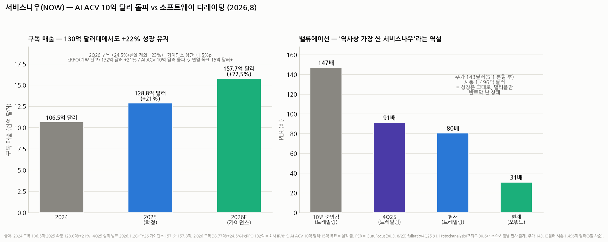

# 서비스나우(NOW) 심층분석 — "AI가 SaaS를 죽인다"는 공포의 최전선에서, AI로 돈을 벌기 시작한 회사

> 작성일: 2026-08-20 · 카테고리: 해외주식/종목분석 (저장소 첫 해외주식 리포트 · 시리즈 ① 개요편 — ② `서비스나우_심화분석_v2_사업해부_AI_ACV_재무_경쟁` ③ `서비스나우_히스토리_ITSM왕조교체사`)
> **검증 메모**: 2Q26 구독 매출 38.77억 달러(+24.5%, 환율 제외 +23%, 가이던스 상단 +1.5%p)·cRPO 132억 달러(+21%)·FY26 구독 가이던스 157.6~157.8억 달러(+22.5%)로 상향·AI ACV 10억 달러 돌파(순증 +40% QoQ, 연말 목표 15억 달러+ 유지)·에이전틱 AI 프로덕션 고객 9개월 새 9배·신규 비즈니스의 50%가 비(非)좌석형 딜·5:1 액면분할(2025.12.18 발효)·주가 143.13달러/시총 1,496억 달러·PER(트레일링 80.3배, 8/23 · 4Q25 91.1배 · 포워드 30.6배 · 10년 중앙값 146.8배)은 회사 IR·SEC 공시·복수 소스 검증. **2025 확정 실적: 구독 매출 128.8억 달러(+21%)·4Q25 구독 34.66억 달러(+21%)·4Q25 말 cRPO 128.5억 달러(+25%) — 4Q25 실적 발표(2026.1.28) 원문으로 재검증 완료(초판의 역산치 128.7억 달러를 확정치로 교체).**

---

## 0. 아주 쉬운 버전 (여기만 읽어도 됨)

**뭐 하는 회사?** 대기업의 **'사내 업무 처리 시스템'**을 만드는 소프트웨어 회사다. 시작은 IT 헬프데스크(직원 노트북이 고장 나면 티켓을 끊고→담당자 배정→처리→기록까지의 흐름)였고, 그 '티켓 워크플로' 엔진을 인사(입사 처리), 고객서비스, 재무 등 회사의 모든 반복 업무로 확장했다. 비유하면 **"회사 내부의 민원24"** — 한 번 깔리면 전사 업무가 그 위에서 돌아가서 떼어내기 매우 어렵다(구독 갱신율 ~98~99%로 유명).

**지금 이 종목의 상황은 한 문장으로**: **장사는 역대급인데 주가는 반값**이다. 매출 130억 달러 규모에서 +22~24% 성장을 유지하고 AI 매출(ACV)이 10억 달러를 돌파했는데, "AI 에이전트가 SaaS를 대체한다"는 공포로 소프트웨어 섹터 전체가 디레이팅되면서 PER이 91배(4Q25)→80배로, 10년 중앙값(147배)의 절반 수준까지 내려왔다. 포워드로는 31배 — 이 회사 역사상 가장 싼 축이다.

**투자 논쟁의 핵심**: AI는 서비스나우에게 창인가 방패인가. 강세론 — 에이전틱 AI를 파는 데 성공한 소수의 SaaS(AI ACV 10억 달러, 9개월 새 프로덕션 고객 9배)이며, 워크플로 플랫폼은 AI 에이전트가 일하기 위한 '레일'이라 오히려 수혜. 약세론 — AI 에이전트가 직원 수를 줄이면 좌석(seat)당 과금하는 SaaS의 성장 공식 자체가 무너지고, AI 컴퓨팅 비용이 마진을 누른다. **회사는 이미 답을 행동으로 내놨다: 신규 비즈니스의 50%가 비좌석형(소비량 과금) 딜** — 좌석 모델 탈출이 진행 중이다.

---

## 1. 사업 구조 — '티켓'에서 '전사 워크플로 OS'로

| 축 | 내용 | 비고 |
|---|---|---|
| **ITSM/ITOM (본진)** | IT 서비스 관리 — 헬프데스크·장애 대응·자산 관리 | 시장 점유 압도적 1위, 이 회사의 뿌리 |
| **직원 워크플로** | 인사·법무·조달 업무 자동화 | 좌석 확장의 2막 |
| **고객 워크플로(CSM)** | 콜센터·현장 서비스 | 세일즈포스와 접점 |
| **크리에이터/플랫폼** | 로우코드 앱 개발(App Engine) | 플랫폼 락인 강화 |
| **AI (Now Assist·AI Agents)** | 생성형 AI 애드온 + 에이전틱 자동화 + AI 거버넌스(AI Control Tower) | **ACV 10억 달러 돌파** — 성장의 현재진행형 |
| 보안(SecOps) | 사이버보안 워크플로 | 상위 10개 제품 중 최고 성장(2Q26) |

**해자의 정체**: CRM(세일즈포스)이나 협업(슬랙)과 달리, 서비스나우는 **회사의 '운영 기록 시스템'**이다. 업무 프로세스·승인 체계·자산 데이터가 수년치 쌓이면 교체 비용이 재앙 수준 — 그래서 갱신율이 98~99%이고, 성장은 기존 고객에 모듈을 더 파는 방식(랜드 앤 익스팬드)으로 나온다. 대형 고객(연 100만 달러+ 계약) 수가 실적의 선행 지표.

## 2. 실적 — 130억 달러 규모에서 +22%는 '법칙 위반'급

| | 2024 | 2025(확정) | 2026E(가이던스) |
|---|---|---|---|
| 구독 매출 | 106.5억 달러 | **128.8억 달러 (+21%)** | **157.6~157.8억 달러 (+22.5%)** |

- **2Q26**: 구독 38.77억 달러(+24.5%, cc +23%) — 가이던스 상단을 1.5%p 상회. cRPO(12개월 내 인식될 계약 잔고) 132억 달러(+21.5% cc, 가이던스 +2%p 상회). **연간 가이던스 상향**
- 비트의 내용: 미 연방정부 수요 강세(온프레미스 구독 일부가 3Q에서 2Q로 당겨짐 — 3Q 가이던스 +20.5%로 낮아 보이는 이유이니 오독 주의)
- 수익성: 소프트웨어치고 최상급의 FCF 마진(30%대)이 전통적 강점이나, **2Q26엔 "AI 투자로 마진 압박" 논평**(인베스팅닷컴)이 붙었다 — AI 추론 비용이 매출총이익률을 갉아먹는 건 전 SaaS 공통의 신규 변수. 감시 항목

## 3. AI 스토리 — 공포를 매출로 바꾼 증거들 (2Q26)

1. **AI ACV 10억 달러 돌파** — AI 순증 ACV가 전분기 대비 +40%. 연말 목표 15억 달러+ 유지. "AI로 실제 돈을 버는 소프트웨어"의 몇 안 되는 실증
2. **에이전틱 AI 프로덕션 고객 9개월 새 9배** — 데모가 아니라 실운영. 갱신 고객 중 에이전틱 AI 첫 구매 비중이 전분기·전년 대비 각각 2배
3. **AI 제품 5개+ 묶음 딜 5.5배, 100만 달러+ AI 딜 3배** — 단품이 아니라 플랫폼으로 팔리는 중
4. **가장 중요한 신호 — 신규 비즈니스의 50%가 비좌석형(소비·성과 과금)**: "AI가 좌석을 죽인다"는 약세론에 대한 회사의 대응이 이미 절반을 넘었다. 좌석 모델 의존도가 매 분기 줄어드는 구조 전환
5. 배경 논리: AI 에이전트가 일을 하려면 업무 규칙·승인 체계·데이터가 있는 '레일'이 필요하다 — 서비스나우는 그 레일을 이미 대기업에 깔아 둔 회사라, 에이전트 시대의 **배관 사업자** 포지션을 주장한다(마이크로소프트·세일즈포스와의 에이전트 플랫폼 경쟁 구도). 2025년 무브웍스(Moveworks) 인수 등으로 AI 프런트도어(직원용 AI 비서) 보강

## 4. 밸류에이션 — '역사상 가장 싼 서비스나우'의 역설

- 주가 143.13달러(5:1 분할 후 — 분할 전 환산 약 716달러), 시총 1,496억 달러
- **PER 디레이팅의 궤적**: 10년 중앙값 146.8배 → 4Q25 91.1배 → 현재 트레일링 80.3배, **포워드 30.6배**. 성장률(+22%)은 유지되는데 멀티플만 절반 이하로 — 시장이 'AI가 SaaS의 말기 선고'라는 내러티브를 가격에 넣은 것
- 프레임: 포워드 31배 ÷ EPS 성장(20%대 후반~30%, 비GAAP) ≈ **PEG ~1.0** — 삼양식품에서 쓴 잣대로 보면 '성장 대비 정상가' 영역. 프리미엄이 다 빠진 상태라, 이후 주가는 멀티플이 아니라 **이익 성장이 그대로 견인**하는 구간
- 반대 해석도 성립: 트레일링 80배는 여전히 비싸며, AI 마진 압박으로 EPS 성장이 꺾이면 포워드 31배도 안전하지 않다 — 결국 §3의 AI 매출 증거가 계속 나오느냐의 싸움

## 5. 리스크

1. **AI의 양날 (구조적·최대)**: 에이전트가 사무직 좌석을 실제로 줄이기 시작하면, 비좌석 전환 속도가 좌석 침식 속도를 못 따라갈 수 있다 — 이 종목이 디레이팅된 근본 이유이며, 아직 어느 쪽도 증명되지 않았다
2. **AI 컴퓨팅 비용의 마진 압박**: 2Q26에 이미 논평이 붙었다 — AI 매출이 늘수록 추론 원가도 는다. FCF 마진 30%대 방어 여부가 밸류의 하한을 결정
3. **매크로·연방 의존**: 2Q 비트의 일부가 미 연방 수요의 조기 인식 — 정부 예산·감축(DOGE류) 이슈에 노출. 대기업 IT 예산 삭감기엔 신규 딜 지연
4. **경쟁**: 마이크로소프트(코파일럿+파워플랫폼)·세일즈포스(에이전트포스)가 같은 '에이전트 오케스트레이션' 자리를 노림 — 번들링(MS)의 가격 공세가 특히 위협
5. **환율**: 달러 강세가 cRPO에 역풍(3Q26에만 3,500만 달러 추정)
6. 한국 투자자 관점: 원화 환산 변동성 + 7월 폭락장 이후 미국 소프트웨어 수급 미확인

## 6. 시나리오 (12개월, 가설)

| | 가정 | 함의 |
|---|---|---|
| Bull | AI ACV 15억 달러 조기 초과 + 비좌석 전환 가속 + 마진 방어 | "AI 수혜 SaaS" 재분류 — 포워드 40배대 복원 |
| Base | 구독 +20~22% 유지, AI 목표 달성, 마진 소폭 압박 | 멀티플 유지 + 이익 성장분만큼 주가 (연 +20%대) |
| Bear | 좌석 침식 가시화 or 연방·매크로발 cRPO 둔화 | "성장 20% 붕괴" 프레임 — 포워드 25배 이하로 재차 디레이팅 |

**개인 의견(가설)**: 이 종목은 지금 "AI가 SaaS를 죽인다"는 명제의 **공개 실험장**이다. 실험 결과가 나오기 전에 멀티플이 먼저 최악을 반영했다는 점(10년 중앙값의 절반)이 리스크 대비 보상을 만든다 — 분기마다 확인할 것은 단 세 개: ① AI 순증 ACV ② 비좌석 딜 비중 ③ FCF 마진. 셋 중 둘이 꺾이면 약세론이 이기고 있는 것이다.

## 7. 숫자 정합성 노트 — 다른 데서 본 숫자와 다르게 보이는 5가지 이유

서비스나우는 같은 분기를 놓고도 소스마다 숫자가 달라 보이는 대표적인 종목이다. 헷갈릴 때 이 표로 대조할 것:

| 헷갈리는 지점 | 왜 달라 보이나 | 이 리포트의 기준 (1차 소스 앵커) |
|---|---|---|
| **매출이 38.8억 달러? 39.9억 달러?** | **구독 매출**(38.77억 달러)과 **총매출**(39.9억 달러 = 구독+컨설팅 1.1억 달러)이 따로 보도됨 | 성장 분석은 구독 기준(회사 가이던스도 구독 기준). 2Q26 구독 38.77억 달러(+24.5%) — 8-K |
| **영업이익률이 4%? 30%?** | **GAAP**(2Q26 4.1%, 주식보상·상각 포함)과 **비GAAP**(20%대 후반~30%, 이를 제외)의 차이 — 미국 SaaS 공통의 이중 회계 | 둘 다 표기하되 괴리의 정체(SBC)를 §심화편 5에서 채점 |
| **PER이 61배? 80배? 90배? 147배?** | ① 시점(폭락장에서 주가 급변동) ② TTM(과거 4분기) vs 포워드 ③ GAAP 순익이 작아 분모가 조금만 변해도 PER이 크게 출렁 ④ 147배는 '10년 중앙값'(현재가 아님) | 트레일링 80.3배(GuruFocus 8/23)·포워드 30.6배(stockanalysis)로 통일 — 다른 사이트의 61~90배도 시점·방식 차이일 뿐 오류 아님 |
| **주가가 143달러? 700달러대?** | **2025.12.18 5:1 액면분할** — 분할 전 차트·기사(700~1,100달러대)와 분할 후(140달러대)가 혼재 | 분할 후 기준(143.13달러 = 분할 전 약 716달러) |
| **AI 매출이 10억 달러? 그보다 작게 본 기억?** | **ACV(연간 계약 가치)**는 매출이 아니라 계약의 연 환산액 — 손익계산서엔 이보다 늦게, 나눠서 반영. 과거 기사(2025년)의 AI 수치는 2.5억~7.5억 달러대였고 빠르게 커져 온 것 | AI ACV 10억 달러(2Q26 실적 콜) — 매출 아님, §심화편 2 참조 |
| (참고) 2025 연매출 | 초판에서 가이던스 역산 128.7억 달러로 썼던 것을 **확정 공시 128.8억 달러(+21%)으로 교체** — 오차 0.1% | 4Q25 실적 발표(2026.1.28) 원문 |

---

## 참고 출처 (검증)

- [ServiceNow IR — 2Q26 실적: 구독 38.77억 달러 +24.5%·cRPO 132억 달러 +21%·FY26 가이던스 상향 157.6~157.8억 달러](https://investor.servicenow.com/news/news-details/2026/ServiceNow-Reports-Second-Quarter-2026-Financial-Results/default.aspx) · [SEC 8-K 원문](https://www.sec.gov/Archives/edgar/data/0001373715/000137371526000072/erq2fy26.htm)
- [ServiceNow IR — 4Q·FY2025 실적(2026.1.28): 연간 구독 128.8억 달러(+21%)·4Q25 구독 34.66억 달러(+21%)·cRPO 128.5억 달러(+25%)·자사주 +50억 달러](https://investor.servicenow.com/news/news-details/2026/ServiceNow-Reports-Fourth-Quarter-and-Full-Year-2025-Financial-Results-Board-of-Directors-Authorizes-Additional-5B-for-Share-Repurchase-Program/default.aspx) · [CNBC — 4Q25 리뷰](https://www.cnbc.com/2026/01/28/servicenow-now-q4-2025-earnings-report.html)
- [BigGo Finance — 2Q26 콜: AI ACV 10억 달러 돌파·보안 최고 성장·가이던스 상향](https://finance.biggo.com/news/US_NOW_2026-07-22) · [Enterprise DNA — 에이전틱 프로덕션 고객 9배·AI 딜 지표](https://enterprisedna.co/resources/news/servicenow-ai-acv-1-billion-agentic-enterprise-q2-2026/) · [TechTimes — 비좌석형 딜, 신규의 50% 도달](https://www.techtimes.com/articles/325759/20260827/servicenow-ai-revenue-crosses-1b-non-seat-deals-hit-50-new-business.htm)
- [Investing.com — 2Q26: 매출 비트, AI 투자發 마진 압박](https://www.investing.com/news/company-news/servicenow-q2-2026-slides-revenue-beats-margins-face-ai-pressure-93CH-4807204)
- [Capital.com/cbonds — 5:1 액면분할, 2025.12.18 발효](https://capital.com/en-int/analysis/servicenow-stock-split) · [ts2 — 2025 조정과 분할·AI 딜 정리](https://ts2.tech/en/servicenow-now-stock-5-for-1-split-ai-deals-and-2026-forecasts-after-a-2025-pullback/)
- [GuruFocus — PER 80.3배(8/23), 10년 중앙값 146.8배 대비 -45%](https://www.gurufocus.com/term/pe-ratio/NOW) · [fullratio — 4Q25 91.1배→2Q26 61배대](https://fullratio.com/stocks/nyse-now/pe-ratio) · [stockanalysis — 포워드 30.6배·시총](https://stockanalysis.com/stocks/now/statistics/) · [Robinhood — 주가 143.13달러·시총 1,496억 달러](https://robinhood.com/us/en/stocks/NOW/)

**저장소 연계**: `음식료/삼양식품_밸류에이션딥다이브`(PEG 잣대) · `거시및정책/AI데이터센터_전력병목`(AI 인프라 수요의 반대편 — 소프트웨어 수익화) · `반도체/산업·테마분석/HBM 시리즈`(AI 캐펙스 사이클과의 연결)

> 유의: PER은 소스·시점별 편차 존재(80~90배 트레일링). 비GAAP EPS 성장률·FCF 마진 최신 수치는 10-Q 확인 권장. 원화 환산 리스크 별도. 매수 추천 아님.
