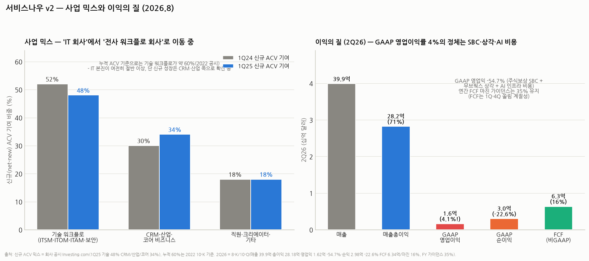

# 서비스나우(NOW) 심화분석 v2 — 사업 해부·AI ACV 해설·매출 메커니즘·재무의 질·경쟁 지형

> 작성일: 2026-08-20 · 카테고리: 해외주식/종목분석 · 시리즈 ② 심화편 (개요편: `서비스나우_심층분석리포트` — 개요·밸류·시나리오는 개요편 참조, 본편은 사업축 심화 §1·AI ACV 해설 §2·매출 메커니즘 §3·재무의 질 §5·경쟁 위치 §6 전담)
> **검증 메모**: 2Q26(구독 38.77억 달러 +24.5%·총매출 39.9억 달러·매출총이익 28.18억 달러·GAAP 영업이익 1.62억 달러 -54.7%·GAAP 순익 2.98억 달러 -22.6%·조정 EPS 0.90달러 컨센 상회·FCF 6.34억 달러/마진 16%·cRPO 132억 달러 +21%)·FY26 가이던스(구독 157.6~157.8억 달러 +22.5%, FCF 마진 35% 유지)·AI ACV 10억 달러 돌파·비좌석 딜 50%·자사주(2026.1 +50억 달러 증액, 1Q26 ASR 20억 달러 포함 2,010만 주, '희석 관리' 목적 명시)·현금 51.8억 달러(3월 말)+전략투자 17.4억 달러·부채(장기 54.35억 달러+CP 20.8억 달러, 6월 말)·신규 ACV 믹스(기술 48%·CRM/산업/코어 34%, 1Q25)·누적 ACV 기술 ~60%(2022 10-K)·가트너 ITSM 점유 1위·AI ITSM MQ 유일 리더는 SEC 공시·회사 IR·보도 검증. 5:1 분할(2025.12.18)·주가 143.13달러/시총 1,496억 달러·PER(트레일링 80.3·포워드 30.6·10년 중앙값 146.8배) 검증. 시장 점유·경쟁 평가 일부는 정성 평가(표기).

---

## 0. 아주 쉬운 버전 (여기만 읽어도 됨)

**뭐 하는 회사?** 대기업의 **'사내 업무 처리 시스템'** — IT 헬프데스크의 티켓 워크플로(접수→배정→처리→기록)에서 출발해, 그 엔진을 인사·고객서비스·보안·앱 개발까지 확장한 "회사 내부의 민원24"다. 업무 규칙·자산 데이터가 수년치 쌓여 갱신율 98~99%.

**상황 요약**: 장사는 역대급(구독 +24.5%, AI ACV 10억 달러 돌파), 주가는 "AI가 SaaS를 죽인다" 공포로 PER이 10년 중앙값(147배)의 절반(트레일링 80배, 포워드 31배)까지 디레이팅. 5:1 분할 후 143달러, 시총 1,496억 달러.

**v2에서 새로 답하는 것**: 각 사업이 정확히 뭘 팔아 어떻게 돈을 버는지(§1·§3), AI ACV가 뭔지(§2), 재무의 질은 몇 점인지(§5 — 매출 A/이익 B-/현금흐름 A-/환원 C+), 어느 사업이 업계 몇 위인지(§6).

---

## 0.3 먼저, 등장인물 소개 — 본문에 나오는 회사·용어 사전 (배경지식 0 기준)

시나리오와 경쟁 표를 읽기 전에, 등장하는 이름들부터 한 줄 비유로 소개한다. 다 미국 기업용 소프트웨어(B2B SaaS) 동네의 주민들이다.

### 서비스나우의 이웃(보완재에 가까운 회사)

| 이름 | 뭐 하는 회사인가 (비유) | 서비스나우와의 관계 |
|---|---|---|
| **Workday** | 직원 명부·급여·평가·회계를 담는 **'인사·재무 장부'** SaaS의 대표주자. 회사의 '사람 데이터 원본'이 여기 있다 | 보완재 — Workday가 장부, 서비스나우가 창구(문의·처리). 대기업은 보통 둘 다 쓴다 |
| **Datadog / Dynatrace** | 회사 서버·앱에 센서를 붙여 **심박수를 24시간 재는 '건강검진 기계'**(모니터링/옵저버빌리티). 이상하면 알람을 울린다 | 반보완·반경쟁 — 얘들이 '아프다'고 알리면, 서비스나우가 '치료 절차'를 돌린다. 경계가 점점 겹치는 중 |
| **Splunk** (시스코 인수) | 회사의 모든 시스템이 남기는 **로그(일지)를 모아 검색·분석**하는 회사. 보안 침입 탐지(SIEM)의 대표 | 탐지(Splunk) → 대응(서비스나우 SecOps)의 앞단. SOAR(대응 자동화)에선 경쟁 |
| **Palo Alto Networks** | 방화벽으로 시작한 **종합 사이버보안 1군** — 위협을 막고 탐지한다 | 탐지·차단은 팔로알토, 사후 수습 절차는 서비스나우… 인데 팔로알토도 대응 자동화(XSOAR)를 팔아 경쟁 |

### 서비스나우의 적(경쟁사)

| 이름 | 뭐 하는 회사인가 (비유) | 어디서 붙나 |
|---|---|---|
| **Microsoft** | 다 아는 그 MS — 여기서 중요한 건 ① **Power Platform**(엑셀 쓰듯 코딩 없이 사내 앱을 만드는 도구)과 ② **Copilot**(오피스·팀즈에 내장되는 AI 비서) | 로우코드·AI 에이전트에서 정면 경쟁. 무기는 '오피스에 공짜처럼 끼워팔기'(번들) |
| **Salesforce** | **CRM**(고객관계관리 — 영업사원이 "이 고객과 언제 뭘 이야기했나"를 기록하는 장부) 세계 1위. 콜센터용 Service Cloud, AI 에이전트 Agentforce까지 확장 | 고객 서비스(CSM)와 AI 에이전트에서 정면 충돌 — 고객 '기록'은 세일즈포스, 처리 '실행'은 서비스나우라는 분업이 무너지는 중 |
| **Atlassian (Jira)** | 개발자들이 **할 일(이슈)을 카드로 관리**하는 협업 도구의 최강자. 그 엔진으로 만든 저가 헬프데스크가 Jira Service Management | ITSM의 아래쪽(중소기업·개발팀)을 저가로 잠식 — 대기업 코어는 아직 못 뚫음 |
| **BMC / Ivanti** | 서비스나우 이전 세대의 ITSM 왕조(BMC Remedy 등) — 지금은 **교체당하는 쪽** | 서비스나우 신규 고객의 상당수가 이들에게서 넘어온 이탈자 |
| **Freshworks / Zendesk** | 중소기업용 저가 헬프데스크·고객센터 SaaS | 체급이 달라 직접 충돌은 적음(SMB 시장) |
| **Moveworks** | 직원 문의("비번 까먹었어요")를 AI가 대신 처리해 주는 스타트업 — **서비스나우가 인수(2025.3 발표 28.5억 달러·12월 종결, 최종 ~24억 달러)** | 적이었다가 가족이 됨 — 상세는 §1-⑦-1 |

### 용어 미니 사전

- **SaaS**: 소프트웨어를 CD로 사서 설치하는 게 아니라 **넷플릭스처럼 월정액 구독**으로 쓰는 방식. 이 리포트의 모든 회사가 SaaS
- **CRM**: 고객관계관리 — '고객과의 모든 접촉 기록 장부'. 영업의 Workday라고 생각하면 됨
- **SIEM**: 보안 이벤트 통합 관제 — 회사 전체의 로그를 모아 **침입 흔적을 찾는 CCTV 관제실**
- **SOAR**: SIEM이 찾은 위협에 대한 **대응 절차 자동화**(격리·리셋·보고) — 서비스나우 SecOps가 파는 것
- **로우코드**: 코딩 대신 **레고 조립하듯** 화면·규칙을 끌어다 놓아 앱을 만드는 방식
- **RPA**: 사람이 하던 클릭·복붙 반복 작업을 **매크로 로봇**이 대신하는 것
- **옵저버빌리티(관측)**: 모니터링의 고급 버전 — 시스템이 "아프다"뿐 아니라 "어디가 왜 아픈지"까지 들여다보는 기술


## 0.5 시나리오로 먼저 보기 — 가상 기업 '한별전자'의 어느 하루

> 직원 1만 명의 가상 대기업 '한별전자'가 서비스나우를 전사 도입했다고 치자. 아래 일곱 장면이 §1의 일곱 사업축과 1:1로 대응한다. **핵심 감각 하나만 잡으면 된다 — 직원 눈에 서비스나우는 안 보인다.** 보이는 건 사내 포털과 챗봇뿐이고, 서비스나우는 그 뒤에서 "누가, 뭘, 어떤 순서로, 언제까지 처리해야 하는지"를 굴리는 배관이다.

**장면 1 — 오전 9시, 노트북이 죽었다 (① ITSM)**
영업팀 김 대리의 노트북이 안 켜진다. 예전 회사라면 IT팀에 전화를 돌리고 "담당자 자리 비우셨는데요"를 세 번 들었을 것이다. 여기선 사내 포털에서 '노트북 고장' 클릭 → **티켓이 자동 생성돼 노트북 담당 파트 큐에 배정**되고, 김 대리 화면엔 "예상 처리 4시간"이 뜬다. IT팀 담당자 화면엔 이 노트북의 이력이 함께 뜬다 — 언제 지급됐고, 어떤 소프트웨어가 깔렸고, 최근 어떤 패치를 받았는지. 이게 **CMDB**(회사 IT 자산의 족보)다. 티켓은 껍데기고, 이 족보가 서비스나우의 진짜 자산이다.

**장면 2 — 새벽 3시, 결제 서버가 이상하다 (② ITOM)**
모니터링 시스템(예: Datadog — 회사 서버들의 심박수를 24시간 재는 '건강검진 기계' 같은 소프트웨어, ☞ §0.3 사전)이 알람을 400개 쏟아낸다. 당직자는 400개를 읽는 대신 서비스나우 **AIOps**가 압축한 한 줄을 본다: "400건의 근원은 어젯밤 배포된 패치 하나 — 영향받는 서비스: 쇼핑몰 결제, 물류 조회". 어떻게 알았나? CMDB에 "이 서버가 죽으면 뭐가 같이 죽는지"의 의존관계 지도가 있기 때문이다. 당직자는 준비된 롤백 워크플로를 실행하고 다시 잔다. — 관측(Datadog)과 대응(서비스나우)이 다른 층이라고 한 게 이 장면이다.

**장면 3 — 같은 날, 신입사원 입사 (③ 직원 워크플로)**
오늘 입사한 박 사원에게 필요한 것: 계정, 노트북, 출입증, 보안교육, 명함. 예전엔 인사팀이 IT·총무·보안팀에 각각 메일을 돌렸다. 지금은 인사 시스템(Workday — 직원 명부·급여·평가를 담는 '인사 장부' 소프트웨어의 세계 1위, ☞ §0.3 사전)에 입사가 등록되는 순간, 서비스나우 **온보딩 워크플로**가 다섯 부서에 동시에 할 일을 뿌리고 진행률을 추적한다. 한 달 뒤 박 사원이 "육아휴직 규정이 궁금해요"라고 챗봇에 물으면 그것도 이 축이다 — Workday가 장부라면, 서비스나우는 창구.

**장면 4 — 오후, 고객이 화났다 (④ 고객 워크플로)**
"인터넷이 사흘째 안 돼요!" 콜센터 상담원이 접수한다(접수 화면은 세일즈포스일 수도 있다). 문제는 그 다음이다 — 네트워크팀 확인, 장비 교체 판단, **현장 기사 배차**, 부품 재고 확인, 고객 문자 안내. 부서 다섯 개를 건너는 이 '해결의 릴레이'가 서비스나우 CSM·FSM 위에서 돈다. 기사 스마트폰 앱에 오늘 동선과 부품 목록이 뜨는 것까지가 이 축이다. 세일즈포스가 '고객과의 대화 기록'을 갖는다면, 서비스나우는 '약속이 실제로 지켜지는 과정'을 갖는다.

**장면 5 — 총무팀의 반란 (⑤ 크리에이터)**
총무팀이 주차 등록을 아직 엑셀로 받는다. 개발팀에 앱을 요청하면 "내년 로드맵에 넣을게요". 대신 총무팀 막내가 서비스나우 **App Engine**으로 코딩 없이 2주 만에 주차 신청 앱을 만든다 — 신청 폼, 승인 절차, 알림까지. 회사 입장에선 편리지만, 서비스나우 입장에선 이게 락인이다: 현업이 만든 앱 수십 개가 플랫폼 위에 쌓이는 순간, 이 회사는 서비스나우를 떼어낼 수 없다.

**장면 6 — 보안팀의 15분 (⑥ SecOps)**
보안 관제(SIEM)가 "직원 30명이 피싱 메일 링크를 클릭했다"고 탐지한다. 예전엔 감염 PC 목록을 엑셀로 만들어 IT팀에 넘기고 반나절이 갔다. 지금은 서비스나우 SecOps가 **격리→패스워드 강제 리셋→감염 PC에 티켓 발부→경영진 보고서 초안**까지의 절차를 자동으로 돌린다. 탐지는 남의 몫, 그 뒤의 '수습 절차'가 서비스나우 몫 — 장면 2와 같은 공식이다.

**장면 7 — 그리고 이 모든 장면에 AI가 스며든다 (⑦ AI)**
장면 1의 티켓: 이제 **AI 에이전트**가 "이 모델 고질병입니다. 원격 진단 돌렸고, 안 되면 교체기가 내일 갑니다"까지 사람 없이 처리한다(비밀번호 초기화류는 이미 완전 자동). 장면 2의 새벽 장애: AI가 원인 분석 보고서 초안을 써 둔다. 장면 4의 상담: AI가 통화를 요약하고 다음 조치를 제안한다. 이 기능들이 각 모듈의 **Pro Plus(상위 SKU)**로 팔리는 게 AI ACV고(§2), 한별전자 CIO가 "우리 회사에서 도는 AI가 뭘 하고 있는지"를 한 화면에서 감시하는 게 **AI Control Tower**다.

**돈 관점으로 다시 보기**: 위 장면에서 서비스나우에 요금이 붙는 사람은 김 대리·박 사원(요청자, 무료)이 아니라 **IT 담당자·인사 창구·현장 기사·보안 요원(처리자 = 풀필러 좌석)**이다. 그리고 장면 7에서 AI 에이전트가 사람 없이 처리한 건들은 좌석이 아니라 **처리량으로 과금**된다 — §3의 과금 공식과 '비좌석 50%' 전환이 바로 이 장면들의 청구서다.

## 1. 사업 축 심화 해부 — 7개의 장사를 하나의 플랫폼 위에서

### 1.0 먼저 — "하나의 플랫폼"이 마이크로소프트와 어떻게 다른가

본편 곳곳에서 "단일 플랫폼이 MS와의 근본 차이"라고 말하는데, 풀어서 설명하면 이렇다.

**서비스나우 = 한 채의 건물**. 7개 사업축(ITSM·HR·고객·보안…)은 별개 제품이 아니라 **같은 코드베이스(Now Platform), 같은 데이터베이스, 같은 워크플로 엔진 위의 '모듈'**이다. 러디가 2004년 처음부터 이렇게 설계했고(☞ 히스토리편), 이후 20년간 인수를 해도 플랫폼 안으로 녹여 넣는 원칙을 지켰다.

**마이크로소프트 = 여러 채의 건물을 구름다리로 이은 단지**. MS의 대응 제품들은 출신이 제각각이다 — Dynamics(인수), Teams(자체), Power Platform(자체), Sentinel(보안), Azure DevOps(인수)… 각자 **데이터 모델과 관리 체계가 다른 별도 제품**이고, 이들을 커넥터·API로 이어 붙인다. 개별 제품은 훌륭하지만 '이음새'가 고객 몫이다.

이 차이가 실전에서 뭘 의미하는지, §0.5 장면 6(피싱 사고)으로 비교해 보자:

| | 서비스나우로 처리하면 | MS 조합으로 처리하면 |
|---|---|---|
| 흐름 | 보안 모듈이 탐지 접수 → **같은 DB에 있는** CMDB에서 감염 PC 조회 → **같은 엔진이** IT팀 티켓 발부 → 인사 모듈로 해당 직원 보안교육 배정 — 한 레코드가 부서를 관통 | Sentinel(탐지) → Teams 알림 → Power Automate로 흐름 제작 → Intune에서 PC 조회 → 별도 티켓 시스템 — **제품 5개를 커넥터로 배선**, 각 이음새마다 데이터 형식·권한이 끊김 |
| 구축 주체 | 모듈 켜면 이어져 있음 | 고객사 IT팀(또는 컨설턴트)이 배선을 설계·유지보수 |
| 사고 시 추적 | 처음부터 끝까지 한 화면·한 감사기록 | 시스템별 로그를 짜맞춰야 함 |

**사업적 함의 3개**:
1. **원가**: 서비스나우는 새 모듈을 팔 때 개발·서빙 원가가 거의 안 든다(같은 플랫폼의 화면 하나 추가) — 매출총이익률 80%대(구독)의 구조적 배경
2. **락인**: 모듈을 늘릴수록 '한 건물' 안에 업무가 쌓여 이사 비용이 기하급수로 커진다 — 갱신율 98~99%의 구조적 배경
3. **AI에서의 승부처**: AI 에이전트가 부서를 넘나드는 일을 하려면 **끊김 없는 데이터·권한·워크플로**가 필요하다. 서비스나우의 "레일은 우리가 깔아뒀다"는 주장(§1-⑦)의 실체가 바로 이 단일 데이터 모델이다. 반대로 MS 진영에서 에이전트는 구름다리를 건널 때마다 커넥터를 통과해야 한다

**공정하게, MS의 반격 논리도 적어두면**: ① **가격** — 오피스·팀즈에 사실상 끼워팔기(번들)라 개별 구매가격 비교가 무의미해질 수 있고 ② **보편성** — 전 직원이 이미 팀즈 안에 산다(서비스나우 포털을 열 필요가 없다) ③ Copilot이 그 팀즈 안에 기본 내장된다. 즉 **"완성도의 서비스나우 vs 유통력의 MS"** 구도이며, 대기업 코어 업무(감사·규제·복잡 워크플로)는 전자, 가벼운 부서 업무는 후자가 이기는 분업이 현재 상태다 — 이 경계선이 AI 시대에 어디로 움직이느냐가 §6 경쟁 표의 진짜 관전 포인트다. (본 절은 구조 비교로, 정성 평가)

모든 축은 하나의 코드베이스(Now Platform) 위의 '모듈'이다 — 모듈 하나를 더 팔 때 원가가 거의 안 드는 이유이기도 하다.

### 1.0.5 보론 — "기존 ERP와 융합하는 능력이 진짜 강점 아닌가?" (독자 가설 검토)

**절반은 정확하다.** 서비스나우는 SAP·오라클·Workday 같은 ERP(기록 원장)를 **대체하지 않고 그 위에 얹혀 연결**된다. 장면 3(§0.5)이 그 모습이다 — Workday(장부)를 건드리지 않고 온보딩 절차만 가져간다. 이 포지셔닝의 힘은 구체적으로:

1. **도입 마찰이 없다**: ERP 교체는 수년짜리 대공사라 CIO가 목을 거는 결정이지만, 서비스나우는 "지금 쓰는 거 다 그대로 두세요, 저희는 그 사이만 잇습니다"라 도입 결재가 쉽다 — 침투 속도의 비밀
2. **중립국(스위스) 지위**: SAP를 쓰든 오라클을 쓰든 어느 진영이든 붙는다 — 특정 ERP 진영에 묶이지 않아 시장 전체가 TAM이 된다
3. **싸우지 않고 이긴다**: ERP 원장을 노렸다면 SAP·오라클과 전면전이었을 것 — '실행 층'이라는 빈 자리를 골라 무혈 입성했다(§6의 'system of action' 패턴)

**그러나 '융합 능력' 자체를 해자로 보면 틀린다.** 시스템 연결(커넥터·API)은 그 자체로는 흔한 기술이다 — MuleSoft·Boomi 같은 통합 전문(iPaaS) 회사들이 이미 하고, 그들의 마진과 밸류는 서비스나우 근처에도 못 간다. 연결은 **문(door)이지 성벽이 아니다.** 서비스나우의 진짜 해자는 그 문으로 들어간 뒤 쌓이는 것들이다: 부서 간 워크플로·승인 규칙·SLA의 축적, CMDB 데이터, 그리고 1만 명의 업무 습관 — 융합이 입구의 강점이라면, 축적이 지속의 강점이다. 가설을 다듬으면 이렇게 된다: **"강점은 융합 '기술'이 아니라, ERP와 싸우지 않는 '포지셔닝'(비침습 도입+중립성)과 그 위의 축적물"**.

**투자 관점의 이면도 있다**: '위에 얹힌 층'은 아래층이 올라오면 압착된다 — SAP(Joule·Build)·Workday도 자체 워크플로·AI 비서를 강화하며 "우리 위에 다른 층 필요 없다"를 밀기 시작했다. 또 에이전틱 AI 시대엔 "시스템을 잇는 층이야말로 AI 에이전트가 가장 먼저 대체할 자리"라는 약세론(연결·조율은 에이전트의 본업)과, "에이전트가 일하려면 그 층의 권한·데이터 레일이 더 중요해진다"는 강세론(§1.0)이 정확히 이 지점에서 충돌한다. 결국 §7의 분기 체크리스트가 이 논쟁의 심판이다. (본 절은 정성 평가)

### ① ITSM — 본진: IT 부서의 업무 OS
- **무엇**: 직원 PC 고장·계정 요청 같은 **티켓 관리** + **CMDB**(Configuration Management DB — 회사의 모든 서버·소프트웨어·기기와 그 의존관계를 담은 'IT 지도') + 변경관리(서버 업데이트 승인 절차)·장애관리
- **왜 돈이 되나**: CMDB가 핵심이다 — "결제 서버를 건드리면 어떤 서비스가 죽는지"를 아는 유일한 시스템이라, 한 번 구축하면 IT 운영 전체가 여기 종속된다. 티켓은 미끼, CMDB가 낚싯바늘
- **경쟁 위치**: **압도적 1위** — 가트너 ITSM 플랫폼 점유율 1위, 2025 'AI Applications in ITSM' 매직 쿼드런트 **유일한 리더**. 경쟁: Atlassian Jira Service Management(중소·개발팀 저가 공략 — 하방 잠식은 있으나 대기업 코어는 못 뚫음), BMC Helix·Ivanti(레거시 교체 수요의 공급원), Freshworks(SMB)

### ② ITOM·ITAM — 본진의 확장: 장애를 '예방'하고 자산을 '세는' 사업
- **무엇**: **ITOM** = 디스커버리(네트워크를 스캔해 자산을 자동으로 찾아 CMDB에 채움)+AIOps(수천 개 알람을 AI로 묶어 근본 원인 지목·장애 예측). **ITAM** = 소프트웨어 라이선스·클라우드 비용 관리(안 쓰는 라이선스 회수)
- **왜 돈이 되나**: ITSM 고객에게 "티켓이 오기 전에 막아주겠다"는 자연 업셀. ITAM은 "우리 제품 값을 아끼게 해준다"는 역설적 상품이라 CFO가 좋아함
- **경쟁 위치**: 기술 워크플로 합산으로 가트너 점유 1위권. 단, **순수 모니터링(옵저버빌리티)은 Datadog·Dynatrace가 강자** — 서비스나우는 '관측' 자체보다 관측 결과를 받아 '대응 절차를 돌리는' 층위라는 게 정확한 위치(경쟁이자 파트너)

### ③ 직원 워크플로(HRSD 등) — 인사팀의 헬프데스크
- **무엇**: 입사자 온보딩(계정·장비·교육을 한 번에), 급여·증명서 문의 창구, 시설·법무·조달 요청. **HR '원장'(급여·평가 데이터)이 아니라 HR '서비스 창구'**라는 게 핵심 구분
- **왜 돈이 되나**: IT에서 검증된 티켓 엔진을 인사팀에 다시 파는 것 — 개발비 거의 없이 TAM(시장)이 배로 늘어난 사례
- **경쟁 위치**: HRSD 카테고리 리더권. **Workday와는 경쟁이 아니라 보완**(Workday가 원장, NOW가 창구 — 실제 병행 도입이 표준). 위협은 MS(Teams 안에서 문의 처리) 번들링

### ④ 고객 워크플로(CSM·FSM) — 콜센터의 '뒷단'
- **무엇**: 고객 불만 접수(프런트)보다 **접수 후의 해결 과정**(백오피스 부서 간 협업, 현장 기사 배차 FSM, 통신·은행 등 산업 특화판)
- **왜 돈이 되나**: 세일즈포스가 장악한 '고객 대면 기록'이 아니라, 그 뒤의 '해결 워크플로'라는 빈 자리를 파고듦 — "상담원이 접수는 했는데 처리가 안 되는" 대기업의 고질병이 타깃
- **경쟁 위치**: **도전자** — CRM 전체로는 Salesforce(Service Cloud)에 명백한 열위이나, 미드·백오피스 연결에선 우위 주장. 최근 CPQ(견적·계약) 인수 등으로 세일즈포스 영역 침공을 선언한 상태라 정면 충돌이 커지는 축. 신규 ACV 기여가 30%→34%로 확대(1Q25) — 성장하는 2막

### ⑤ 크리에이터(App Engine·Integration Hub) — 로우코드 공장
- **무엇**: 코딩 거의 없이 부서용 앱을 만드는 도구 + 타 시스템(SAP·이메일 등) 연결 커넥터·RPA
- **왜 돈이 되나**: 고객이 스스로 앱을 만들수록 플랫폼 의존이 깊어진다 — 매출 자체보다 **락인 강화 장치**. 갱신 협상력의 원천
- **경쟁 위치**: 독립 로우코드 시장에선 **Microsoft Power Platform이 볼륨으로 압도**(오피스 번들). 서비스나우의 것은 '자사 플랫폼 위 확장'용이라 직접 비교는 부분적 — 플랫폼 내에서는 대체재 없음

### ⑥ 보안·리스크(SecOps·IRM) — 지금 가장 빨리 크는 축
- **무엇**: SIEM(스플렁크 등)이 위협을 '탐지'하면 그 다음의 **대응 절차(격리→패치→보고)를 자동화**(SOAR), 규제 대응·내부통제(IRM)
- **경쟁 위치**: 2Q26 **상위 10개 제품 중 최고 성장**. SOAR에서 Palo Alto(XSOAR)·Splunk와 경쟁, IRM은 리더권. 탐지가 아니라 대응·거버넌스 층이라는 포지션은 ITOM과 동일한 공식
- **왜 중요**: 보안 예산은 불황에도 안 깎이는 예산 — 매크로 방어력 있는 성장축

### ⑦ AI(Now Assist·AI Agents·AI Control Tower) — 모든 축에 얹는 '터보'
- **무엇**: 각 모듈의 **Pro Plus SKU**(생성형 AI 내장판 — 티켓 요약·해결안 생성·가상 상담), 자율 **AI 에이전트**(사람 개입 없이 처리), **AI Control Tower**(전사 AI — 자사 것 아닌 타사 AI 포함 — 의 사용·리스크 관제탑), 무브웍스(2025 인수, 직원용 AI 프런트도어)
- **왜 돈이 되나**: 기존 고객에게 같은 모듈의 상위 SKU로 갈아태우는 **업셀**(단가 인상 효과) + 에이전트 소비량 과금(신규 과금축). §2·§3에서 상술
- **경쟁 위치**: 엔터프라이즈 '에이전트 오케스트레이션' 선두권 주장 — MS Copilot(범용·번들), Salesforce Agentforce(CRM 영역)와 3파전. 서비스나우의 차별론은 "에이전트가 실제 업무를 실행하려면 워크플로·권한·데이터 레일이 필요하고, 그 레일은 우리가 깔아뒀다"는 것. 아직 시장 초기라 순위 확정은 이르다(정성 평가)

#### ⑦-1 미니 프로필 — 인수한 '무브웍스(Moveworks)'는 어떤 회사인가

- **정체**: 2016년 캘리포니아 마운틴뷰에서 창업한 AI 스타트업. 파는 것은 **'직원용 AI 헬프데스크 비서'** — 직원이 슬랙·팀즈 채팅창에 "비밀번호 잊었어요", "엑셀 라이선스 필요해요"라고 말하면, AI가 **사람 담당자 없이 끝까지 처리**(계정 리셋, 소프트웨어 발급, 규정 답변)해 주는 챗봇이다. 요청의 상당 부분을 티켓 생성 없이 그 자리에서 해소하는 게 세일즈 포인트였고, 전 세계 **500만 명 이상의 직원**이 이 비서를 쓰는 규모까지 컸다. 여기에 **엔터프라이즈 서치**(회사 안 흩어진 문서·시스템을 한 검색창으로) 제품을 더해 '직원의 AI 관문(front door)'을 자처했다
- **서비스나우와의 관계가 묘했다**: 무브웍스는 서비스나우 위에 얹혀 일했다 — 직원 요청을 받아 뒤에서 서비스나우 티켓·워크플로를 대신 조작하는 구조. 즉 **고객 접점(대화창)을 가로채는 잠재적 위협**이었다. 서비스나우 입장에선 자사 Virtual Agent보다 잘 만든 경쟁자이자, 프런트를 뺏기면 배관업자로 밀려날 수 있는 리스크 — **위협을 사서 가족으로 만든 인수**다(§0.3 사전의 "적이었다가 가족" 한 줄의 전말)
- **딜 구조 (검증)**: **2025.3.10 발표, 발표 기준 28.5억 달러** — 서비스나우 역사상 최대 인수. 이후 **규제 심사로 클로징까지 9개월**이 걸려(반독점 조사 보도) **2025.12.15 종결**됐고, 최종 정산 대가는 **약 24억 달러**(주식 14.67억 달러+현금 9.05억 달러+대여금 정산 0.31억 달러 등 — 10-K 기준, 발표가와의 차이는 조정 항목)로 확정됐다. §5.0의 '인수 상각 -125bp'가 이 딜의 회계 흔적이다
- **왜 샀나 — 세 가지**: ① **대화형 AI·검색 기술과 인재**(자체 Now Assist의 약점 보강) ② **500만 사용자 규모의 검증된 AI 접점** — 에이전트 시대에 '직원이 말을 거는 첫 창구'를 확보 ③ 무브웍스가 강했던 **미드마켓(중견기업) 침투 채널**. 에버레스트그룹 평가도 "대화형 AI·엔터프라이즈 서치·미드마켓의 갭을 메우는 딜"로 요약
- **투자자 관점의 채점**: 전략적으론 합리(프런트도어 방어+AI 인력 확보)이나, 대가도 실재한다 — §5의 부채 증가·상각비·GAAP 이익 급감이 모두 이 딜의 청구서다. 성공의 판정 기준은 하나: **무브웍스의 대화 접점이 Now Assist·AI 에이전트 판매(AI ACV)를 실제로 가속하는가** — 2Q26 AI ACV 10억 달러 돌파에 얼마나 기여했는지는 분리 공시되지 않아 미확인

## 2. AI ACV가 뭔가 — 용어 완전 해설 (배경지식 0 기준)

**ACV = Annual Contract Value, '연간 계약 가치'**. 구독 소프트웨어에서 계약 규모를 비교하기 위해 **계약 총액을 1년치로 환산**한 값이다.

- 예시: 어떤 은행이 서비스나우와 **3년간 총 3,000만 달러** 계약을 맺으면 → ACV는 **1,000만 달러**(3,000÷3). 1년 계약 1,000만 달러짜리 고객과 같은 체급으로 세는 것
- **매출과 뭐가 다른가**: 매출(revenue)은 회계상 '이번 분기에 인식한' 금액이고, ACV는 '지금 유효한 계약의 연간 환산액'이다. ACV가 먼저 움직이고 매출이 따라온다 — **ACV = 선행지표, 매출 = 후행 확정치**
- **net-new ACV(신규 순증 ACV)** = 이번 분기에 새로 늘어난 ACV(신규 계약+업셀-해지). 성장의 '순간 속도계'
- **AI ACV** = 전체 계약 중 **AI 제품(Pro Plus SKU, AI Agents, Control Tower 등)에 해당하는 부분만 떼어낸 연간 계약액**. 2Q26에 **10억 달러를 돌파**했다는 건 — "고객들이 AI 기능에 대해 연간 10억 달러어치 계약을 이미 맺고 있다"는 뜻이다. 전체 구독 연 매출(~158억 달러)의 **약 6~7%**로 아직 작지만, 순증이 분기 +40%로 붙는 중이고 연말 목표는 15억 달러+
- **왜 시장이 이 숫자에 집착하나**: "AI가 SaaS를 죽인다"는 약세론에 대해, AI가 오히려 **계약 금액을 키운다는 걸 보여주는 유일한 직접 증거**이기 때문. cRPO(향후 12개월 내 매출로 인식될 계약 잔고 132억 달러)와 함께 이 회사의 '주문 장부'를 읽는 두 개의 창이다

## 3. 매출은 정확히 어떻게 발생하나 — 과금 메커니즘과 비중



### 3.1 돈이 들어오는 공식 (전통 모델)

**매출 = (풀필러 좌석 수) × (모듈 SKU 단가) × (계약 기간, 통상 3년)**

1. **좌석(seat) 과금의 실제**: 요금을 내는 건 전 직원이 아니라 **'풀필러'(fulfiller — 티켓을 처리하는 IT·인사·상담 담당자)**다. 요청만 하는 일반 직원은 무료 — 그래서 "직원 수 감소 = 즉시 매출 감소"는 과장이지만, 풀필러(사무 처리직)야말로 AI가 대체하는 직군이라는 게 약세론의 정확한 급소다
2. **SKU 사다리 = 단가 인상 장치**: 같은 ITSM도 Standard → Pro(+자동화) → **Pro Plus(+생성형 AI)**로 올라가며 단가가 뛴다(업계 통용 인상폭 30%+, 정성). AI ACV의 상당 부분이 이 'Pro Plus 업그레이드'에서 나온다 — 신규 고객 없이도 매출이 크는 메커니즘
3. **다년 계약·선불 청구**: 통상 연 단위 선불 → 받은 돈은 이연수익(부채)으로 쌓였다가 기간에 걸쳐 매출 인식. 그래서 **현금이 매출보다 먼저 들어오는** 구조(FCF 마진이 높은 이유이자, 1Q·4Q에 갱신이 몰려 FCF가 출렁이는 이유)
4. **랜드 앤 익스팬드**: ITSM으로 진입(land)→HR·보안·CSM 모듈 추가(expand). 영업의 대부분이 기존 고객 확장이라 영업 효율이 높다

### 3.2 새 과금축 — 비좌석(소비·성과) 모델
AI 에이전트는 좌석이 없다 — 그래서 **처리량(소비) 과금**으로 넘어가는 중이며, 2Q26 **신규 비즈니스의 50%가 비좌석형 딜**. "사람 수"에서 "일의 양"으로 과금 기준을 옮기는 이 전환이 이 회사 10년 밸류의 최대 변수다.

### 3.3 매출 비중 — 공시 기준으로 아는 것과 모르는 것
- **회계 세그먼트는 둘뿐**: 구독(2Q26 38.77억 달러, **97%**) + 프로페셔널 서비스(1.1억 달러, 3% — 컨설팅, 사실상 원가 사업). **제품별 매출은 비공시**라 아래는 ACV 기준 근사다
- **누적 ACV 믹스**: 기술 워크플로(ITSM·ITOM·ITAM·보안)가 **약 60%**(2022 10-K 기준 — 이후 소폭 하락 추정). 2023년 기준 고객+직원 워크플로 ~29%, 크리에이터 ~16%
- **신규(net-new) ACV 기여(차트 좌측)**: 기술 52%(1Q24)→**48%**(1Q25)로 줄고, CRM·산업·코어 30%→**34%**로 확대 — 'IT 회사'에서 '전사 워크플로 회사'로의 이동이 신규 계약에서 진행 중
- 지역: 미주가 대부분(~63~65%, 정성) — 2Q26 연방정부 수요가 비트를 만든 배경

## 4. 실적·AI 스토리 (v1 요약 갱신)

| | 2024 | 2025(확정) | 2026E(가이던스) |
|---|---|---|---|
| 구독 매출 | 106.5억 달러 | **128.8억 달러 (+21%, 확정)** | **157.6~157.8억 달러 (+22.5%)** |


2Q26 비트(+1.5%p)·cRPO +21.5% cc(+2%p 비트)·연간 상향. AI: ACV 10억 달러 돌파, 순증 +40% QoQ, 에이전틱 프로덕션 고객 9개월 새 9배, 100만 달러+ AI 딜 3배, 연말 목표 15억 달러+. 3Q 가이던스(+20.5%)가 낮아 보이는 건 연방 물량의 2Q 조기 인식 탓(오독 주의).

## 5. 재무의 질 — 항목별 채점 (질문 ④)

### 5.0 개념 정리 — GAAP 영업이익·순이익이 뭐고, 왜 갑자기 반토막으로 보이나

**손익계산서는 계단이다** (위에서 아래로 비용을 하나씩 빼며 내려간다):

```
매출 (2Q26: 39.9억 달러)
 - 매출원가 (서버비·지원인력)        -> 매출총이익 28.2억 달러 (71%)
 - 판매·마케팅비, 연구개발비, 관리비   -> 영업이익 1.62억 달러 (4.1%)  <- "본업으로 남긴 돈"
 - 이자수익/비용, 투자손익, 세금       -> 순이익 2.98억 달러           <- "최종적으로 주주 몫"
```

- **영업이익** = 본업(소프트웨어 팔기)으로 번 돈. **순이익** = 거기에 본업 밖의 것(이자·세금 등)까지 반영한 최종 결과. 서비스나우는 보유 현금의 이자수익이 커서 순이익(2.98억 달러)이 영업이익(1.62억 달러)보다 큰, 한국 제조주에선 드문 모양이 나온다
- **GAAP** = 미국의 공식 회계기준(한국의 K-IFRS에 해당) — 규칙이 요구하는 **모든 비용을 다 넣은 공식 성적표**다. 반면 **비GAAP** = 회사가 "비현금·일회성 비용은 빼고 실력을 보자"며 따로 제시하는 보조 성적표. 한국 상장사는 공시 영업이익이 사실상 하나뿐이라, 미국 주식의 이 '이중 성적표'가 낯설고 헷갈리는 게 정상이다
- 2Q26의 두 성적표: **GAAP 영업이익률 4.1% vs 비GAAP 29.5%** — 같은 분기가 이렇게 다르다. 그 차이의 정체가 아래다

**왜 GAAP 영업이익이 -54.7%로 급감했나 — 세 겹의 비용** (매출은 +24.5% 늘었는데도):

1. **주식보상비용(SBC)이 몸통**: 2Q26 **6.55억 달러 — 매출의 16.4%**(전년 15.5%→상승). 직원에게 현금 대신 주식(RSU)을 주는 인건비인데, GAAP은 이를 비용으로 넣고 비GAAP은 뺀다. **영업이익(1.62억 달러)의 4배가 주식보상**이니, 이 한 줄이 두 성적표의 괴리 대부분이다
2. **무브웍스 인수 소화 비용**: 인수(발표가 28.5억 달러·최종 정산 ~24억 달러)로 생긴 무형자산 상각+인수 관련 비용이 **분기 영업이익률에 약 -1.25%p** — 회계상 몇 년간 계속 빠져나가는 '인수의 할부금'
3. **AI 인프라·투자 비용**: AI 기능 서빙에 드는 컴퓨팅 원가와 선행 투자 — "마진 AI 압박" 논평의 실체

여기에 **착시 하나**: GAAP 영업이익률은 원래 한 자릿수(전년 ~8%)로 얇아서, 몇 %p만 밀려도 증감률로는 -54.7%처럼 극적으로 보인다. 절대액으로는 매출의 4%p가 이동한 것이다. 순이익이 -22.6%로 '덜' 빠진 이유도 계단 구조로 설명된다 — 영업 아래 단에서 이자수익이 받쳐 줬기 때문. 그리고 **비GAAP 기준으로는 순이익 9.3억 달러로 오히려 +9%** — "장사가 무너진 게 아니라, 회계에 잡히는 비용(주식보상·인수 상각·AI 투자)이 늘어난 것"이 정확한 진단이다.

**그럼 GAAP은 무시해도 되나 — 아니다.** SBC는 현금이 안 나갈 뿐 **주식 수를 늘려 기존 주주 지분을 희석시키는 실질 비용**이고(§5.1 자사주 항목이 '희석 관리'인 이유), 인수 상각도 과거에 실제로 쓴 돈의 흔적이다. 진짜 실력은 GAAP 4%와 비GAAP 29.5% 사이 어딘가다. 회사도 이를 인정하고 **"2029년까지 SBC를 매출의 10% 미만으로 낮추겠다"고 공약**했다 — 이 비율(현재 16.4%)이 실제로 내려가는지가 '이익의 질 B-'가 A로 올라가는 조건이자, GAAP·비GAAP 괴리가 좁혀지는 경로다.

### 5.1 숫자 (2Q26·최근 공시)

| 항목 | 수치 | 비고 |
|---|---|---|
| 매출총이익률 | 71% (GAAP) | 구독만 보면 ~80%대 — 소프트웨어 최상급 |
| **GAAP 영업이익** | **1.62억 달러 (-54.7%, OPM 4.1%)** | 급감 — SBC+무브웍스 상각+AI 인프라 비용 |
| GAAP 순이익 | 2.98억 달러 (-22.6%) | 이자수익이 영업이익보다 커진 분기 |
| 조정 EPS | 0.90달러 (컨센 0.86 상회) | GAAP과의 괴리 = 대부분 주식보상(SBC) |
| **FCF** | 분기 6.34억 달러(마진 16%) / **연간 가이던스 35% 유지** | FCF는 1Q·4Q 쏠림 계절성 — 분기 16%로 놀라지 말 것 |
| 현금성 | **현금 25.0억 달러 + 단기 유가증권 21.6억 달러 + 장기 유가증권 20.4억 달러 = 67.1억 달러** (6월 말, 10-Q) + 전략투자 17.4억 달러 | |
| **부채** | 장기 54.35억 달러 + CP 20.8억 달러 = **~75.2억 달러** (6월 말) | 무브웍스 인수(현금분 ~9억 달러)+ASR 재원 — **사실상 무차입이던 회사가 레버리지 사용으로 전환, 순현금 지위 소멸(-8억 달러, 계산)** |
| 자사주 | 2026.1 **+50억 달러 증액**(잔여 14억 달러에 추가), 1Q26 2,010만 주 매입(ASR 20억 달러 포함), 6월 말 잔여 ~42억 달러 | **공시 목적: "희석 관리(managing dilution)"** |
| 배당 | 없음 | |

### 5.2 채점표

| 영역 | 평가 | 근거 |
|---|---|---|
| **매출의 질** | **A** | 구독 97%·다년 선불·cRPO 132억 달러(다음 1년 매출의 ~80% 선반영)·갱신율 98~99% — 소프트웨어에서 가장 예측 가능한 축 |
| **이익의 질** | **B-** | 조정 이익은 훌륭하나 GAAP OPM 4%가 말해주듯 **SBC(주식보상) 의존이 크다** — 조정 이익의 상당분이 주주 희석으로 지불되는 비용. 여기에 2026년부터 AI 추론 원가·인수 상각이 새 압박(2Q GAAP 영업익 반토막의 정체). '35% FCF'와 '4% GAAP OPM' 사이 어딘가가 진짜 수익성 |
| **현금흐름의 질** | **A-** | 선수금 모델 덕에 FCF 마진 35% 가이던스 — 이익보다 현금이 먼저 오는 구조. 감점은 그 현금의 사용처(아래) |
| **주주환원** | **C+** | 배당 0. 자사주 프로그램은 커 보이지만(누적 수십억 달러) **회사 스스로 '희석 관리' 목적이라고 공시** — 즉 SBC로 새로 찍는 주식을 되사는 상쇄용이라, 주식 수를 줄여주는 '순(純)환원'이 아니다. 발행주식수 추이가 거의 안 줄어드는 이유. 한국 기준 고배당주들(LX인터 등)과는 환원 철학 자체가 다름 — 성장 재투자형 |
| **레버리지** | B | 순현금 지위 소멸(현금 ~52억 달러 vs 부채 ~75억 달러) — 위험 수준은 아니나(연 FCF 50억 달러+), '현금 부자 SaaS' 서사는 이제 옛말. 금리 비용과 인수 규율을 감시 |

**종합**: "매출·현금은 최상급, 이익은 회계 기준에 따라 4%도 되고 30%도 되는 회사" — 이 괴리(SBC)는 미국 대형 SaaS 공통이지만, AI 비용이 얹히며 2026년부터 괴리가 커지는 방향이라는 게 새 리스크다.

### 5.3 자산 건전성 — 대차대조표는 얼마나 탄탄한가 (2026.6.30, 10-Q)

| 항목 | 금액 | 읽는 법 |
|---|---|---|
| 총자산 | 316.7억 달러 | |
| 현금+단기·장기 유가증권 | **67.1억 달러** (25.0+21.6+20.4) | 유동성의 몸통 |
| **굿윌(영업권)** | **98.4억 달러** | 인수 때 장부가보다 비싸게 준 웃돈 — 무브웍스로 급증 |
| **무형자산** | **37.8억 달러** | 인수한 기술·고객관계의 장부값 (매분기 상각 = §5.0의 비용) |
| 총부채 | 191.5억 달러 (계산) — 중 차입성 부채 75.2억 달러, 나머지 상당분이 이연수익 | 이연수익은 '미리 받은 구독료'라 **좋은 부채** |
| 자기자본 | 125.2억 달러 | |

**부채·자본 구조 분해 (한국식 지표로 번역하면)**:

- **표면 부채비율 153%** (총부채 191.5 ÷ 자본 125.2, 계산) — 한국 제조주 감각으론 '위험'처럼 보이지만 **과장이다**. 부채 191.5억 달러의 구성이 특수하기 때문: 차입성(장기부채+CP)은 75.2억 달러뿐이고, 최대 항목은 **이연수익(선수 구독료 — 고객이 1년치를 미리 낸 돈)**이다. 이연수익의 '상환 의무'는 현금이 아니라 **서비스 제공**이라, 갚아야 할 빚이 아니라 이미 확보한 매출의 예고편이다. 구독업에선 이연수익이 클수록 오히려 건강하다
- **진짜 부채비율(차입만)** = 75.2 ÷ 125.2 = **60%** (계산) — 여기에 연 FCF 50억 달러+를 대면 상환능력 문제는 없다. 비츠로셀(12.3%) 같은 무차입과는 다르지만, 위험권(200%+)과는 거리가 멀다
- **자본(125.2억 달러)이 작아 보이는 이유** — 이 회사는 상장 후 이익을 꽤 쌓았는데도 자본이 시총(1,496억 달러)의 8%에 불과하다. ① 자사주 매입이 자본을 계속 차감하고(ASR 20억 달러 등) ② 이익의 상당분이 SBC로 나가 이익잉여 축적이 느리며 ③ 애초에 자본이 필요 없는 사업(공장·재고 없음)이라서다. **ROE로 보면 GAAP 기준 ~12~15%(TTM 순익 ~15~19억 달러 ÷ 자본 125억 달러, 계산)** — 미국 SaaS는 자본이 워낙 작아 ROE가 왜곡되기 쉬워, 이 업종은 ROE보다 **FCF 마진(35%)과 매출 성장의 조합**으로 자본효율을 읽는 게 관례다
- **자본의 질 주의점**: 위 ③의 뒷면으로, 자본 125.2억 달러마저 굿윌·무형(136.2억 달러)에 다 잠겨 있어 **유형자본은 마이너스** — 부채의 최후 담보가 '장부'가 아니라 '현금흐름'이라는 §판정 3과 같은 결론

**판정 — 세 층으로 나눠 보면**:

1. **유동성·상환능력: 매우 탄탄 (A)** — 현금·투자 67.1억 달러에, 매년 FCF가 50억 달러+ 새로 들어온다. 차입 75.2억 달러는 **연간 FCF의 1.4배** 수준 — 마음먹으면 1년 반 만에 다 갚을 수 있는 빚이라 부도·유동성 리스크는 사실상 0이다. 이연수익이 부채의 큰 몫이라는 점도 강점(돈을 미리 받아놓은 상태)
2. **순현금 지위: 방금 소멸 (B)** — 현금·투자 67.1억 달러 vs 차입 75.2억 달러 = **약 -8억 달러의 소폭 순부채(계산)**. 몇 년 전까지 '현금 부자 SaaS'였던 회사가 무브웍스(현금 ~9억 달러+주식 14.7억 달러)와 자사주 ASR(20억 달러)로 곳간을 쓰고 CP(단기차입)까지 발행한 결과다. 위험 수준은 전혀 아니지만, "현금 방석에 앉은 회사"라는 서사는 이제 사실이 아니다 — 이자비용과 인수 규율이 새 감시 항목
3. **자산의 질: 여기가 약점 (C+)** — 총자산의 **43%(136.2억 달러)가 굿윌+무형자산**, 즉 공장도 재고도 아닌 '인수의 흔적'이다. 자기자본 125.2억 달러에서 이 둘을 빼면 **유형 순자산은 사실상 마이너스** — 청산가치로는 지킬 게 없는 회사라는 뜻이다. 단, 이건 소프트웨어 업종의 일반 특성이고(자산은 코드와 고객관계지 공장이 아니다), LX인터처럼 PBR로 하방을 재는 종목이 아니라 **현금흐름(FCF)이 유일한 실질 담보**인 종목이라는 걸 확인해 주는 숫자다. 리스크 시나리오는 하나: 무브웍스가 기대에 못 미치면 굿윌 **손상차손**(일시 대규모 손실)으로 GAAP 이익이 또 한 번 크게 출렁일 수 있다

**한 줄 결론**: "빚 걱정은 없는데, 자산은 대부분 공기(무형)다 — 이 회사의 진짜 담보는 대차대조표가 아니라 갱신율 98%짜리 현금흐름이다." 한국식 '자산주 잣대'(PBR·청산가치)로 보면 안 되는 종목의 전형.

### 5.3.1 심화 — '자산의 질'이 정확히 무슨 뜻인가 (굿윌·무형자산 완전 해설)

**① 굿윌(영업권)이 뭔가 — '인수 웃돈'의 회계 처리**

회사를 인수하면 산 값과 장부값의 차이를 어딘가에 적어야 한다. 예를 들어 무브웍스를 약 24억 달러에 샀는데 무브웍스 장부의 순자산(서버·현금 등)이 몇억 달러뿐이라면 — 나머지 20억 달러 안팎은 "기술력·인재·고객관계·시너지 기대"에 지불한 **웃돈**이고, 회계는 이걸 두 서랍에 나눠 담는다:

| 서랍 | 담기는 것 | 이후 처리 |
|---|---|---|
| **무형자산** (37.8억 달러) | 값을 매길 수 있는 것 — 개발된 기술, 고객 계약·관계, 상표 | **매 분기 정액 상각** — §5.0에서 본 'GAAP 이익을 깎는 -1.25%p'가 이것. 몇 년 뒤 0이 됨 |
| **굿윌** (98.4억 달러) | 값을 못 매기는 나머지 전부 — 시너지 기대, 인재, 프리미엄 | **상각하지 않는다.** 대신 매년 '손상검사'를 받고, 인수가 실패로 판명되면 한 번에 대손(손상차손) |

즉 굿윌 98.4억 달러의 정체는 **"서비스나우가 역대 인수들에서 장부값보다 더 얹어준 웃돈의 누적"**이다(무브웍스가 최근 최대 기여 — 건별 구성은 10-Q 주석 사항으로 세부 미확인).

**② 왜 이게 '질 낮은 자산'인가 — 세 가지 성질**

1. **팔 수 없고 담보도 안 된다**: 공장·토지는 최악의 경우 팔면 돈이 되지만, 굿윌은 떼어내 팔 수 있는 물건이 아니다 — '자산'이라는 이름표를 달았을 뿐 회사가 어려울 때 아무것도 못 해 준다
2. **가치가 '가정'에 달려 있다**: 굿윌의 가치는 "인수한 사업이 앞으로 기대만큼 벌어줄 것"이라는 가정 위에 있다. 가정이 틀리면 —
3. **손상차손이라는 시한폭탄**: 매년 감사인이 "이 웃돈, 아직 그만한 가치가 있나?"를 검사(임페어먼트 테스트)하고, 아니라고 판단되면 **그 분기에 한꺼번에 손실 처리**된다. 역사적 참사들: AOL-타임워너는 2002년 **990억 달러**, 크래프트하인즈는 2019년 **154억 달러**의 굿윌 손상을 한 방에 인식하며 주가가 무너졌다. 서비스나우로 치면 — 무브웍스發 AI 매출이 기대에 한참 못 미치는 시나리오에서 수십억 달러급 손상차손이 GAAP 손익을 강타할 수 있다(발생 확률은 현재로선 낮게 보나, §5.0의 GAAP 취약성이 여기서 한 번 더 증폭될 수 있다는 뜻)

**③ 그런데 여기 회계의 큰 역설이 있다 — '산 것만 자산이고, 만든 건 0원'**

서비스나우의 진짜 가치의 원천 — 20년 쌓은 **Now Platform 코드, CMDB 설계, 8,000개 대기업 고객관계, 갱신율 98%짜리 신뢰** — 는 장부에 **한 푼도 안 잡혀 있다**. 회계 규칙상 자가 개발한 무형자산은 (일부 예외 빼고) 비용 처리되고 자산으로 못 올리기 때문이다. 반면 남의 회사를 사면 그 웃돈은 굿윌로 자산이 된다. 그 결과:

- **장부의 아이러니**: 진짜 보물(자체 플랫폼)은 0원, 검증 안 된 웃돈(인수 굿윌)만 98.4억 달러로 계상 — 그래서 "장부 자산의 질은 낮다"와 "회사의 실제 자산은 훌륭하다"가 **동시에 참**일 수 있다
- **시총과 장부의 괴리도 설명된다**: 시총 1,496억 달러 vs 자기자본 125억 달러(PBR ~12배) — 그 차이 1,370억 달러가 대체로 '장부에 못 올린 자가 개발 무형자산+미래 성장'의 시장 평가액이다
- **PBR이 무의미한 이유의 정확한 버전**: LX인터(PBR 0.4배)는 장부에 광산·지분이라는 팔 수 있는 실물이 있어 PBR이 하방 잣대가 되지만, 서비스나우는 장부가 실체를 반영하지 못해 PBR(12배)이 고평가의 증거도, 하방의 잣대도 아니다

**④ 그래서 실전에서 뭘 감시하나**

- **무브웍스의 성과**: 굿윌 최신 최대 덩어리의 건전성 = AI ACV 성장에 기여하는가(⑦-1의 판정 기준과 동일)
- **연차 굿윌 손상검사 결과**(10-K 주석): '손상 없음'이 이어지는지
- **추가 대형 인수 여부**: 굿윌이 또 크게 늘면(=또 웃돈 지불) 자산의 질은 더 희석 — 인수 규율 감시
- 무형자산 상각 스케줄: 향후 몇 년간 GAAP 이익을 얼마나 누를지의 예고편 (10-Q 주석)

## 6. 경쟁 지형 종합 — 사업부별 성적표 (질문 ⑤)

| 사업 | 주요 경쟁자 | 서비스나우의 위치 (평가) |
|---|---|---|
| ITSM | Jira SM, BMC, Ivanti, Freshworks | **1위(지배적)** — 가트너 점유 1위·AI ITSM MQ 유일 리더. 대기업 표준 |
| ITOM·ITAM | Datadog·Dynatrace(관측), BMC, Flexera | **1위권(대응 층위)** — 단 관측 자체는 Datadog 우위. 경계 겹침 확대 중 |
| HRSD | Workday(보완), MS | **카테고리 리더** — 단 HR 원장 시장엔 부재 |
| CSM·FSM | **Salesforce**, Zendesk, MS Dynamics | **도전자** — 백오피스 강점으로 침공 중, 정면 승부는 열위 |
| 크리에이터(로우코드) | **MS Power Platform**, OutSystems | 시장 전체론 열위, 자사 플랫폼 내에선 독점적 |
| 보안(SecOps·IRM) | Palo Alto, Splunk(Cisco) | 상위권 — 자사 내 최고 성장축(2Q26) |
| **AI 에이전트 오케스트레이션** | **MS Copilot, Salesforce Agentforce** | 선두권 주장, 미확정 — 이번 사이클의 승부처 |

**패턴이 보인다**: 서비스나우는 어디서든 **'기록·실행 층(system of action)'**을 잡는다 — 관측은 Datadog에, 고객 기록은 세일즈포스에, HR 원장은 Workday에 내주고, 그 위/뒤의 '일이 실제로 처리되는 층'을 가져가는 전략. AI 에이전트 시대에 이 층이 요충지가 된다는 게 강세론의 뼈대이고, MS가 번들로 이 층까지 먹으려 한다는 게 약세론의 뼈대다.

## 7. 밸류에이션·리스크·시나리오 (v1 유지 + 갱신)

- PER: 10년 중앙값 146.8배 → 트레일링 80.3배 → **포워드 30.6배** (PEG ~1.0) — '역사상 가장 싼 서비스나우'
- 리스크: ① 좌석 침식 vs 비좌석 전환의 속도전(구조적·최대) ② AI 비용發 마진 압박(2Q GAAP -54.7%가 이미 신호) ③ SBC 희석의 만성성 ④ 연방·매크로 ⑤ MS 번들 공세 ⑥ 레버리지 전환
- 분기 체크리스트(3개): **AI 순증 ACV / 비좌석 딜 비중 / FCF 마진** — 둘 이상 꺾이면 약세론 우세 판정

| 시나리오 | 가정 | 함의 |
|---|---|---|
| Bull | AI ACV 15억 달러 조기 초과+비좌석 가속+마진 방어 | 'AI 수혜 SaaS' 재분류 — 포워드 40배대 |
| Base | 구독 +20~22%·AI 목표 달성·마진 소폭 압박 | 이익 성장분만큼 주가(연 +20%대) |
| Bear | 좌석 침식 가시화 or GAAP 적자 전환 논란 | 포워드 25배 이하 재디레이팅 |

---

## 참고 출처 (검증)

- [ServiceNow IR — 2Q26 실적·FY26 가이던스](https://investor.servicenow.com/news/news-details/2026/ServiceNow-Reports-Second-Quarter-2026-Financial-Results/default.aspx) · [SEC 10-Q(2026.6.30) — 부채·자사주·SBC](https://www.sec.gov/Archives/edgar/data/0001373715/000137371526000076/now-20260630.htm) · [SEC 8-K(2026.1.28) — 자사주 +50억 달러 증액](https://www.sec.gov/Archives/edgar/data/1373715/000137371526000005/now-20260128.htm) · [1Q26 실적 — ASR 20억 달러·2,010만 주·'희석 관리' 목적](https://investor.servicenow.com/news/news-details/2026/ServiceNow-Reports-First-Quarter-2026-Financial-Results/default.aspx)
- [마켓 집계 — 2Q26 GAAP: 총이익 28.18억 달러·영업익 1.62억 달러(-54.7%)·순익 2.98억 달러(-22.6%)·FCF 6.34억 달러/16%](https://x.com/marketsday/status/2080102027800281162) · [Investing.com — 마진 AI 압박·FY FCF 35% 유지](https://www.investing.com/news/company-news/servicenow-q2-2026-slides-revenue-beats-margins-face-ai-pressure-93CH-4807204)
- [BigGo — AI ACV 10억 달러 돌파·보안 최고 성장](https://finance.biggo.com/news/US_NOW_2026-07-22) · [TechTimes — 비좌석 딜 50%](https://www.techtimes.com/articles/325759/20260827/servicenow-ai-revenue-crosses-1b-non-seat-deals-hit-50-new-business.htm) · [Enterprise DNA — 에이전틱 9배·AI 딜 지표](https://enterprisedna.co/resources/news/servicenow-ai-acv-1-billion-agentic-enterprise-q2-2026/)
- [Investing.com — 1Q25 신규 ACV 믹스(기술 48%·CRM/산업/코어 34%)](https://www.investing.com/news/company-news/servicenow-q1-2025-slides-subscription-revenue-up-19-margins-improve-93CH-3999845) · [SEC 10-K FY2022 — 기술 워크플로 ~60%·제품 구성](https://www.sec.gov/Archives/edgar/data/1373715/000137371523000035/now-20221231.htm)
- [ServiceNow — 가트너 기술 워크플로 점유 1위](https://www.servicenow.com/blogs/2024/technology-workflow-gartner-market-share) · [frox — 2025 AI ITSM MQ 유일 리더](https://www.frox.ch/en/newsroom/blog-articles/servicenow-is-leader-in-ai-applications-in-itsm-2025/) · [financecharts — 현금 51.8억 달러(2026.3)](https://www.financecharts.com/stocks/NOW/balance-sheet/cash-and-short-term-investments)
- 밸류·분할: [GuruFocus](https://www.gurufocus.com/term/pe-ratio/NOW) · [stockanalysis](https://stockanalysis.com/stocks/now/statistics/) · [Capital.com — 5:1 분할](https://capital.com/en-int/analysis/servicenow-stock-split)

**저장소 연계**: `음식료/삼양식품_밸류에이션딥다이브`(PEG 잣대) · `거시및정책/AI데이터센터_전력병목`(AI 인프라의 반대편) · `종합상사` 듀오(§5 환원 철학 비교 — 성장 재투자형 vs 배당형)

> 유의: 제품별 매출은 비공시라 ACV 믹스로 근사(연도 혼재). 경쟁 위치 일부는 정성 평가. 현금·부채는 분기 시점 차이 존재(현금 3월 말, 부채 6월 말). 지역 비중·SKU 인상폭은 통용 근사치. 매수 추천 아님.
