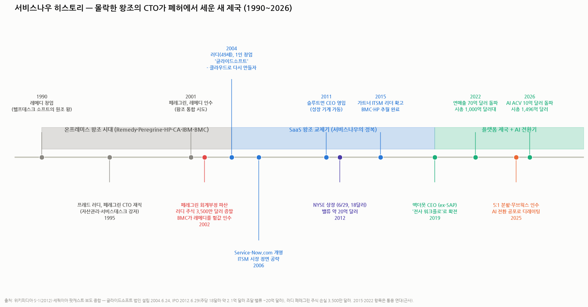

# 서비스나우 히스토리 — 몰락한 왕조의 CTO가 폐허에서 세운 새 제국 (시리즈 ③)

> 작성일: 2026-08-20 · 카테고리: 해외주식/종목분석 · 시리즈 ③ 배경지식·역사편 (① `서비스나우_심층분석리포트` ② `서비스나우_심화분석_v2`)
> **검증 메모**: 프레드 러디의 페레그린 CTO 이력·2002년 페레그린 회계부정 파산·러디 개인 주식 약 3,500만 달러 증발·글라이드소프트 법인 설립(2004.6.24, 1인 창업, 50세 생일 2주 전)·2006년 Service-Now.com 개명·2011년 슬루트먼 CEO 영입·2012.6.29 NYSE 상장(주당 18달러, 약 2.1억 달러 조달, 밸류 ~20억 달러)·현 체제(맥더못 CEO·러디 회장)는 위키피디아·S-1·세쿼이아 팟캐스트·복수 보도로 검증. 1990~2000년대 왕조사(레메디 1990 창업, 2001 페레그린의 레메디 인수, 파산 후 BMC의 레메디 인수, 2005 HP의 페레그린 인수)와 왕조 교체 연대(2013~15 가트너 리더 확립)는 업계 통용 역사 — 세부 연도 일부는 근사 표기.

---

## 0. 한 장 요약

**답부터**: 서비스나우는 고대의 강자가 아니라 **후발주자가 왕조를 뒤엎은 케이스**다. 1990~2000년대 이 시장(ITSM)의 왕은 레메디(Remedy)·페레그린·HP·CA·IBM·BMC였고, 서비스나우는 2004년에야 나타난 신참이다. 그런데 창업자가 남다르다 — **몰락한 왕조(페레그린)의 CTO였던 프레드 러디가, 회사 파산으로 전 재산(주식 3,500만 달러)을 날린 뒤 49세에 1인 창업**해, 자기가 몸담았던 옛 왕조 전부를 클라우드라는 신무기로 격파한 이야기다. 그리고 지금 — 그 정복자가 '고대의 강자' 자리에 앉아 AI라는 다음 신무기의 도전을 받는 중이라는 것까지가 이 역사의 완결 구조다.

---

## 1. 1막 (1990~2003) — 온프레미스 왕조의 시대

서비스나우 이전에도 'IT 헬프데스크 소프트웨어'는 큰 장사였다:

| 왕조 | 전성기 | 무엇으로 왕이었나 |
|---|---|---|
| **레메디(Remedy)** | 1990년대~2000년대 | 1990년 창업, AR System — **헬프데스크 소프트의 원조 왕**. 'ITSM = 레메디'가 상식이던 시절 |
| **페레그린(Peregrine)** | 1990년대 말~2002 | IT 자산관리·서비스데스크 강자 — **러디가 CTO로 일하던 곳** |
| HP(OpenView)·CA·IBM(Tivoli)·BMC | 2000년대 | 대형 IT 관리 스위트의 일부로 ITSM을 끼워 팔던 공룡들 |

이들의 공통점 = **온프레미스**(고객사 서버에 설치). 도입에 수개월~수년, 버전 업그레이드는 재구축급 공사, 커스터마이징은 컨설턴트 인건비의 늪. 고객은 불만이었지만 대안이 없었다.

**왕조의 자멸**: 2001년 페레그린이 레메디를 인수하며 왕조 통합을 시도했으나, 2002년 **페레그린이 대형 회계부정으로 파산**(경영진 유죄, 미 증시 퇴출 — 엔론 시대의 스캔들 중 하나). 레메디는 BMC에 헐값 매각됐고, 페레그린 잔해는 2005년 HP가 주웠다. 이후 2000년대의 왕좌는 **BMC(레메디)+HP+CA+IBM의 과점** — 혁신 유인이 없는, 늙은 왕조였다.

## 2. 2막 (2004~2011) — 폐허에서의 창업

- 페레그린 파산으로 CTO 러디의 **개인 주식 약 3,500만 달러가 증발**했다. 그는 낙담 대신 창업을 택한다 — **2004년 6월, 50세 생일 2주 전, 직원 1명(본인)짜리 '글라이드소프트'** 설립. 본인 회고: "50에는 창업 못 한다는 심리적 마지노선 때문에 2주를 못 기다렸다"
- 설계 사상이 핵심이다: 러디는 페레그린에서 겪은 모든 불만을 뒤집었다 — ① **클라우드 구독**(설치 없이 브라우저로, 업그레이드는 회사가 알아서) ② **하나의 플랫폼**(인수 짜깁기가 아닌 단일 코드베이스 — 오늘날 'Now Platform' 해자의 기원) ③ **CMDB를 중심에**(자산·의존관계 지도가 코어라는 설계 — 심화편 §1의 '낚싯바늘'이 여기서 나왔다)
- 초기엔 범용 워크플로 도구로 팔리지 않자, 2006년 **Service-Now.com으로 개명하고 자신이 가장 잘 아는 시장(ITSM)을 정면 공략** — "왕조의 제품을 써 본 사람이 왕조의 급소를 안다"
- 성장이 붙자 2011년 러디는 스스로 CEO에서 물러나 **프랭크 슬루트먼**(훗날 스노우플레이크 CEO로도 유명한 '상장 청부사')을 영입 — 창업자가 제품, 전문경영인이 성장을 맡는 분업

## 3. 3막 (2012~2019) — 왕조 교체의 완성

- **2012.6.29 NYSE 상장**: 주당 18달러, 약 2.1억 달러 조달, 기업가치 약 20억 달러 — 당시 "적자 SaaS에 20억 달러?"이라는 회의론이 따라붙었다(지금 시총 1,496억 달러 — 74배)
- 2010년대 중반 가트너 매직 쿼드런트에서 리더 지위를 굳히며 **BMC·HP·CA를 차례로 추월** — 늙은 왕조는 온프레미스 매출을 지키느라 클라우드 전환을 미적댔고(혁신기업의 딜레마 교과서 사례), 신규 계약이 통째로 서비스나우로 넘어갔다
- 2017~2019 도나호 CEO를 거쳐 **2019년 빌 맥더못**(SAP 전 CEO — 영업의 제왕)이 취임, "IT를 넘어 전사 워크플로"로 확전 — HR·고객서비스·보안으로 모듈을 늘려 오늘의 플랫폼 제국(연매출 130억 달러대, 갱신율 98~99%)을 완성

## 4. 4막 (2019~현재) — 정복자가 왕좌에 앉은 뒤

- 2022년 연매출 70억 달러 돌파, 시총 1,000억 달러대 안착 — '미국 소프트웨어 우량주'의 대명사가 됨
- 2025년: 5:1 액면분할, 무브웍스 인수(28.5억 달러), 그리고 **AI 전환 공포로 인한 디레이팅**(PER 10년 중앙값 147배 → 80배, ☞ 개요편)
- 2026년: AI ACV 10억 달러 돌파로 반격의 증거 제시 중 (☞ 심화편 §2)

## 5. 이 역사에서 뽑아야 할 투자 교훈 3개

1. **왕조는 기술 플랫폼 전환기에 무너진다**: 레메디·BMC는 제품이 나빠서가 아니라, **온프레미스 매출이라는 기득권이 클라우드 전환의 족쇄**가 되어 무너졌다. 지금 서비스나우가 왕좌에서 맞는 질문이 정확히 같다 — "좌석 과금 매출이라는 기득권이 AI(에이전트·소비 과금) 전환의 족쇄가 될 것인가." 서비스나우가 비좌석 딜 50%까지 왔다는 건(심화편 §3.2) 이 역사를 본인들이 가장 잘 알기 때문이다
2. **몰락한 산업의 인재가 최고의 창업자가 된다**: 러디는 왕조의 CTO였기에 왕조의 급소(설치·업그레이드·짜깁기의 고통)를 알았다 — '경험자의 정면 재설계'는 후발주자가 이기는 몇 안 되는 공식
3. **후발주자의 침투는 신규 계약에서 시작된다**: BMC의 기존 고객은 한동안 그대로였다 — 무너진 건 '신규 딜 점유율'이 먼저였고, 기존 고객 이탈은 수년 뒤 따라왔다. 오늘 서비스나우의 방어를 볼 때도 같은 지표를 봐야 한다: **기존 갱신율(아직 98~99%)이 아니라, 신규 딜에서 AI 네이티브 경쟁자에게 지는 비율**이 선행지표다

---

## 참고 출처 (검증)

- [위키피디아 — ServiceNow: 2004 글라이드소프트 설립·2006 개명·2012 IPO·CEO 연혁](https://en.wikipedia.org/wiki/ServiceNow) · [— Fred Luddy: 페레그린 CTO·파산·3,500만 달러 손실](https://en.wikipedia.org/wiki/Fred_Luddy)
- [세쿼이아캐피털 팟캐스트 'Crucible Moments' — 러디·슬루트먼이 직접 말하는 창업기](https://sequoiacap.com/podcast/crucible-moments-servicenow) · [Stacksync — "해고된 CTO와 유죄 판결받은 CEO: 서비스나우 기원"](https://www.stacksync.com/blog/the-fired-cto-and-the-convicted-ceo-the-origin-story-of-servicenow)
- [SEC — 2012 S-1(상장신고서) 원문](https://www.sec.gov/Archives/edgar/data/0001373715/000119312512143517/d301887ds1.htm) · [Taskade — 연대기 정리(법인 설립 2004.6.24·IPO 18달러·2.1억 달러 조달)](https://www.taskade.com/blog/history-of-servicenow)
- 왕조사(레메디 1990·페레그린의 레메디 인수 2001·BMC 인수·HP의 페레그린 인수 2005): 업계 통용 역사 — 세부는 각사 위키·보도 교차

**저장소 연계**: `서비스나우_심층분석리포트`(① — 현재의 좌표) · `서비스나우_심화분석_v2`(② — 사업·재무·경쟁) · `시장브리핑/테마부활의역사`(왕조 교체·촉매 프레임의 국내판) · `반도체/종목분석/독점기업_경쟁자등장`(해자 침식의 일반론)

> 유의: 2015(리더 확립)·2022(70억 달러) 연대는 통용 근사. 페레그린·레메디 세부 거래 조건은 확인 범위 밖. 매수 추천 아님.
